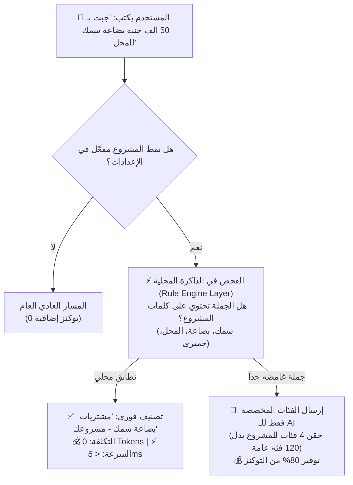
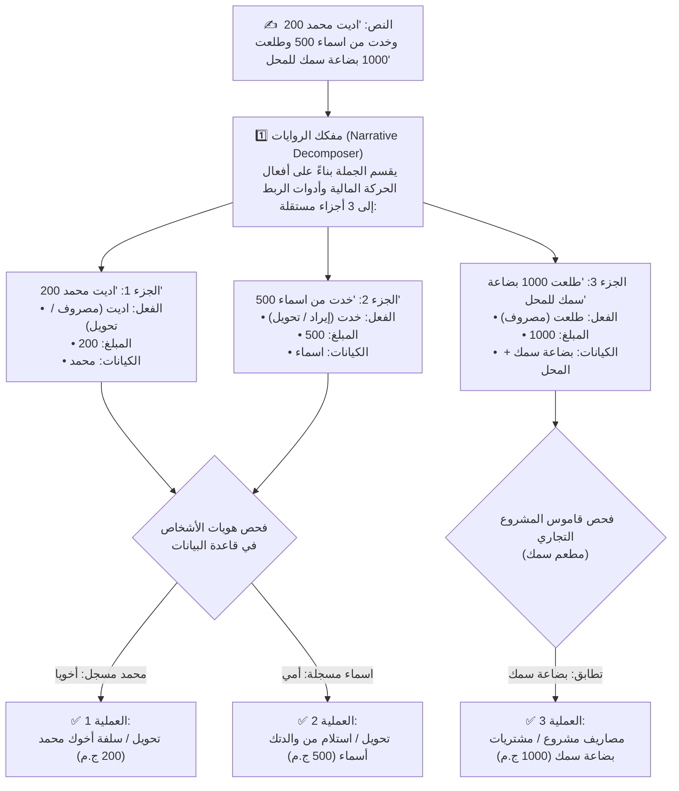

# 🚀 الخطة المعمارية الشاملة والتصميم العقلي لنظام SmartSpend AI
> **وثيقة مرجعية للتصميم والهندسة فقط (Reference Architecture Blueprint) — بدون تنفيذ أو كتابة كود برمجية.**
> **تم إعداد الخطة بواسطة**: Antigravity (Google DeepMind Advanced Agentic Coding Team).
> **تاريخ الإعداد**: يوليو 2026.

---

## 📑 فهرس المحتويات (Table of Contents)
1. [نظرة عامة على المشروع والهيكل الذكي الحالي (The Brain Overview)](#1-نظرة-عامة-على-المشروع-والهيكل-الذكي-الحالي)
2. [التشخيص العميق: 16 مشكلة وثغرة جذرية في النظام](#2-التشخيص-العميق-16-مشكلة-وثغرة-جذرية-في-النظام)
   - [أولاً: مشاكل محرك التصنيف واستهلاك التوكنز (7 مشاكل)](#أولاً-مشاكل-محرك-التصنيف-واستهلاك-التوكنز)
   - [ثانياً: مشاكل نظام الأشخاص والمعاملات المعقدة (9 مشاكل)](#ثانياً-مشاكل-نظام-الأشخاص-والمعاملات-المعقدة)
3. [التصميم المعماري الجديد وخطة الأوبشن الجديد في الإعدادات](#3-التصميم-المعماري-الجديد-وخطة-الأوبشن-الجديد-في-الإعدادات)
   - [أولاً: نمط المشروع التجاري (Business Mode Setup Wizard)](#أولاً-نمط-المشروع-التجاري-business-mode-setup-wizard)
   - [ثانياً: خوارزمية الصفر توكن (Zero-Token Overhead Routing)](#ثانياً-خوارزمية-الصفر-توكن-zero-token-overhead-routing)
   - [ثالثاً: نظام إدارة الأشخاص والعلاقات في الإعدادات (People Hub)](#ثالثاً-نظام-إدارة-الأشخاص-والعلاقات-في-الإعدادات-people-hub)
   - [رابعاً: تفكيك الجمل المركبة المعقدة (Multi-Person & Intent Decomposer)](#رابعاً-تفكيك-الجمل-المركبة-المعقدة-multi-person--intent-decomposer)
   - [خامساً: حل مشكلة زر التخطي (Smart Skip & Silent Identity)](#خامساً-حل-مشكلة-زر-التخطي-smart-skip--silent-identity)
   - [سادساً: سلاسة واجهة المستخدم والأداء الفائق (Zero Lag UI/UX)](#سادساً-سلاسة-واجهة-المستخدم-والأداء-الفائق-zero-lag-uiux)
4. [مخطط جداول قاعدة البيانات الجديدة والمعدلة (Database Schema Blueprint)](#4-مخطط-جداول-قاعدة-البيانات-الجديدة-والمعدلة-database-schema-blueprint)
5. [البرومبت التنفيذي الشامل (AI Execution Prompt Blueprint)](#5-البرومبت-التنفيذي-الشامل-ai-execution-prompt-blueprint)

---

## 1. نظرة عامة على المشروع والهيكل الذكي الحالي

المشروع يعتمد على بنية تقنية حديثة ومقسمة بشكل احترافي:
* **الواجهة الأمامية (Frontend - `src/`)**: مبنية بـ React 18 + TypeScript + TailwindCSS + Radix UI + Framer Motion.
* **الخلفية (Backend - `api/`)**: مبنية بـ Hono + tRPC وتعمل على بيئة Node.js (ESM).
* **قاعدة البيانات (Database - `db/`)**: MySQL مع Drizzle ORM.
* **المحرك الذكي (AI Brain - `api/lib/`)**: يتكون من خط أنابيب تصنيف ذكي (Smart Pipeline) يمر بـ **10 خطوات متدرجة من الأرخص إلى الأعلى تكلفة**:
  1. **LRU Cache (0 التكلفة)**: فحص الذاكرة المؤقتة للبحث عن الجمل المكررة.
  2. **Muscle Memory (0 التكلفة)**: فحص الذاكرة العضلية لآخر 90 يوم للمعاملات المتكررة للمستخدم.
  3. **Pre-Filter (0 التكلفة)**: رفض النصوص غير المالية فوراً.
  4. **Normalizer V2 (0 التكلفة)**: معالجة وتنظيف الفرانكو والتشكيل والأرقام العربية.
  5. **Narrative Decomposer (0 التكلفة)**: فك وتجزئة الجمل المركبة ("فطرت بـ 50 وركبت أوبر بـ 80").
  6. **Rule Engine (0 التكلفة)**: محرك قواعد محلي مكون من 7 طبقات (مرادفات، مطابقة تقريبية، قواميس).
  7. **Fireworks Embedding (تكلفة طفيفة)**: التضمين المتجهي للبحث الدلالي عن الفئات.
  8. **AI Generative - Gemini 2.5 Flash / Groq (تكلفة توكنز)**: الملاذ الأخير للجمل المعقدة والجديدة تماماً.
  9. **Post-Processing & Person Resolver (0 التكلفة)**: ربط الأسماء بالمبالغ وتحديد ما إذا كان الاسم مجهولاً يحتاج توضيح (Clarification).
  10. **Decision Engine (0 التكلفة)**: اتخاذ قرار الحفظ التلقائي (`auto_save`) إذا كانت الثقة $\ge 85\%$، أو طلب المراجعة (`review`)، أو طرح سؤال التوضيح (`clarify`).

---

## 2. التشخيص العميق: 16 مشكلة وثغرة جذرية في النظام

بناءً على فحص أكواد الخلفية وقواعد البيانات وواجهات المستخدم، تم رصد 16 مشكلة جوهرية تؤثر على دقة الفهم، استهلاك التوكنز، وتجربة المستخدم:

### أولاً: مشاكل محرك التصنيف واستهلاك التوكنز
1. **تكرار وهدر البرومبت (Prompt Duplication - `dynamic-prompt-builder.ts`)**: نفس القواعد والأمثلة مكتوبة مرتين بالكامل (واحدة لـ Gemini وأخرى لـ Fireworks). أي تعديل في القواعد يتطلب تعديله مرتين، ويؤدي لاستهلاك توكنز مضاعف بسبب إرسال شجرة الفئات (Taxonomy) كاملة في الحالتين.
2. **كارثة القاموس الساذجة (Broken Array Strings - `egyptian-names-dictionary.ts:9-12`)**: وجود نصوص تعليقات مكتوبة كعناصر داخل المصفوفة البرمجية: `"//أسماءحديثةزين"` و `"//أسماءكلاسيكيةشائعةجداًمحمد"`. هذا يدمر خوارزمية المطابقة التامة للأسماء ويجعل النظام يعجز عن التعرف على أسماء شائعة!
3. **تداخل مصطلحات الأشخاص والأفعال (`NON_PERSON_TERMS` - `person-resolver.ts:26-59`)**: قائمة استبعاد الأشخاص تحتوي على أفعال مالية أساسية مثل `"اديت"`, `"خدت"`, `"حولت"`, `"سلفت"`. إذا كان اسم الشخص يشبه كلمة مالية أو اسماً نادراً فلن يتعرف عليه النظام أبداً.
4. **شلل الذاكرة العضلية مع الأشخاص (Muscle Memory Bypass - `muscle-memory.ts`)**: بمجرد أن تحتوي الجملة على فعل تحويل ("اديت"، "حولت")، يقوم المحرك بتخطي الذاكرة العضلية بالكامل! يعني لو قلت "اديت محمد 200" كل يوم، لن يتم حفظها في الـ Cache أبداً وستستهلك توكنز في كل مرة!
5. **جمود الذاكرة المؤقتة (Cache Invalidation Failure - `smart-pipeline.ts:23-51`)**: مفتاح الـ Cache لا يتغير عندما يضيف المستخدم شخصاً جديداً أو يعدل إعداداته. لو سألك "مين محمد؟" وأجبت، ثم كتبت الجملة مجدداً، سيقرأ من الـ Cache القديم ويسألك "مين محمد؟" مرة أخرى!
6. **جمود شجرة التصنيفات (Hardcoded Taxonomy - `category-registry.ts`)**: الـ 28 فئة والـ 120 فئة فرعية ثابتة تماماً في الكود. لا توجد أي آلية للمستخدم لإضافة فئة مخصصة (مثل "مشتريات بضاعة سمك" أو "مصاريف المشروع").
7. **إرسال شجرة التصنيف كاملة للذكاء الاصطناعي (`dynamic-prompt-builder.ts`)**: رغم وجود `category-scorer.ts` لفلترة الفئات من 28 إلى 10، إلا أن النص المرسل للـ AI لا يزال ضخماً جداً لأنه يرسل كل الفئات الفرعية، مما يرفع استهلاك التوكنز بشكل حاد.

### ثانياً: مشاكل نظام الأشخاص والمعاملات المعقدة
8. 🚨 **كارثة ازدواجية التخزين (Data Desync Bug - `schema.ts` مقابل `user-profile-service.ts`)**: جدول `user_contacts` في قاعدة البيانات **موجود ولكنه مهمل عند الحفظ**! عندما تجيب على سؤال توضيح ("مين محمد؟")، تقوم الدالة `addDynamicContact()` بالحفظ في **JSON Profile فقط** (`dynamicContacts`) ولا تكتب في جدول `user_contacts`! بينما دالة الجلب `getSmartProfile()` تقرأ من جدول `user_contacts` أولاً! النتيجة: جهات الاتصال التي يتعلمها النظام تختفي ولا تظهر!
9. 🚨 **غياب تام لواجهة إدارة الأشخاص (No UI - `Settings.tsx`)**: لا توجد أي شاشة في الإعدادات أو واجهة التطبيق تسمح للمستخدم برؤية الأشخاص المسجلين، أو تعديل علاقتهم، أو إضافة شخص جديد، أو حذف اسم مسجل بالخطأ!
10. **عجز تفكيك المعاملات المعقدة (Multi-Person & Intent Confusion - `narrative-decomposer.ts`)**: لو قلت: *"اديت محمد 200 وخدت من اسماء 500 وطلعت 1000 بضاعة سمك"*، المحرك يواجه صعوبة بالغة في فصل مبالغ الإيداع (أسماء = income/transfer) عن السحب (محمد = expense/transfer) عن مصاريف المشروع (سمك). غالباً سيوزع المبالغ بالتساوي أو يخلط الفئات!
11. **مشكلة تخطي التوضيح وفقدان الهوية (Skip Clarification Blindness - `smart-pipeline.ts:324`)**: عندما يسأل النظام "مين محمد؟" ويضغط المستخدم "Skip"، يتم حفظ العملية تحت فئة "أشخاص" بثقة 60%، لكن **النظام لا يتذكر تخطيك ولا يحفظ الاسم**، وفي المرة القادمة سيسألك نفس السؤال المزعج!
12. **قصور المطابقة التقريبية (Fuzzy Match False Positives - `person-resolver.ts:194`)**: الاعتماد على Levenshtein distance ≤ 1 للأسماء القصيرة يسبب كوارث؛ مثلاً كلمة "مساعد" مطابقة لاسم "مسعد"، واسم "عمر" مطابق لـ "عمرو"، فيقوم بخلط الأشخاص أو الأفعال!
13. **الخلط في الأوصاف العامة (Generic Description Trap - `person-resolver.ts:227`)**: لو قلت *"اديت واحد صاحبي 200"* وكان عندك شخص واحد مسجل كـ "صديق"، الخوارزمية تفترض فوراً أنك تقصده وتكتب المعاملة باسمه! هذا خطأ فادح، فقد يكون صديقاً جديداً.
14. **رفض الأسماء الصامت دون تنبيه (Silent Rejection - `user-profile-service.ts`)**: دالة `cleanNameAndRelationship()` ترفض بعض الأسماء الصحيحة وترجع `null` دون أي تنبيه للمستخدم، فيظن المستخدم أنه حفظ الشخص بينما النظام تجاهله.
15. **غياب تحديد المبالغ المشتركة (Group Payments - `smart-pipeline.ts:741`)**: جملة مثل *"اديت محمد وعلي 400"* يقوم النظام بقسمة 400 على 2 (200 لكل منهما) تلقائياً، دون التأكد هل هي 400 إجمالي أم 400 لكل شخص!
16. **غياب العلاقات في ORM (`db/relations.ts`)**: ملف العلاقات في Drizzle ORM لا يحتوي على أي تعريف لعلاقة `user_contacts` مع الجداول الأخرى، مما يمنع ربط الأشخاص بالمعاملات والمشاريع استعلامياً.

---

## 3. التصميم المعماري الجديد وخطة الأوبشن الجديد في الإعدادات

هذا هو العقل السليم والهيكل المنطقي لكيفية عمل ميزة إضافة المشروع التجاري وإدارة الأشخاص في الإعدادات بـ **0 استهلاك إضافي للتوكنز**:

### أولاً: نمط المشروع التجاري (Business Mode Setup Wizard)
عندما يدخل المستخدم إلى **الإعدادات ← "مشروعك التجاري"**، يمر بمعالج ذكي وسلس مكون من 4 خطوات:

1. **تفعيل نمط المشروع واختيار النوع**:
   - زر تفعيل بسيط: *"هل لديك مشروع تجاري أو عمل خاص؟"*.
   - قائمة بصرية تفاعلية (Cards) تحتوي على أنواع المشاريع الشائعة:
     - 🍤 **مطاعم ومأكولات** (مطعم سمك، كافيه، وجبات سريعة، بقالة...).
     - 🛍️ **تجارة وتجزئة** (محل ملابس، سوبرماركت، مكتبة، محل موبايلات...).
     - 🔧 **خدمات وورش** (نجارة، سباكة، صيانة سيارات، مغسلة...).
     - 💻 **عمل حر وشركات** (برمجة، تسويق، مكتب عقارات، عيادة، فريلانسر...).
     - ✏️ **نوع آخر (مخصص)**: حقل يكتب فيه المستخدم اسم نوع مشروعه بحرية تامة.

2. **كتابة اسم المشروع ووصفه الحر (Business Description)**:
   - **اسم المشروع**: مثلاً *"مطعم السمكة الذهبية"*.
   - **وصف المشروع (الأهم للمحرك الذكي)**: حقل نصي يكتب فيه المستخدم طبيعة عمله بلغته العادية، مثلاً: *"مطعم سمك ومأكولات بحرية، بنشتري بضاعة سمك جمبري وسبيط يومياً من سوق العبور، وبنصرف على ثلاجات وعمال وتوصيل دليفري"*.
   - **لماذا الوصف مهم؟** هذا الوصف يتم تحليله مرة واحدة فقط في الـ Memory لاستخراج "الكلمات المفتاحية الخاصة بالمشروع" (مثل: سمك، جمبري، بضاعة، سوق العبور، ثلاجات).

3. **قائمة الفئات المخصصة (Custom Categories Adaptation)**:
   - بناءً على نوع المشروع ووصفه، يقترح النظام تلقائياً قائمة فئات خاصة بالمشروع (مثلاً لمطعم السمك: *"مشتريات بضاعة سمك"*، *"صيانة معدات وثلاجات"*، *"أجور عمال المحل"*، *"مبيعات دليفري"*).
   - **التحكم الكامل للمستخدم**: يستطيع المستخدم:
     - إضافة بند مخصص جديد بضغطة زر (مثلاً: إضافة فئة *"زيت وقلي"* أو *"أكياس وتغليف"*).
     - تحديد نوع البند: (مصروف مشروع / إيراد مشروع).
     - اختيار أيقونة ولون مميز للبند ليظهر في الرسوم البيانية.

---

### ثانياً: خوارزمية الصفر توكن (Zero-Token Overhead Routing)
كيف نضمن أن هذا الأوبشن الجديد **لا يضغط على الموقع ولا يستهلك توكنز** نهائياً إلا عند الضرورة؟



* **السر المنطقي 1 (عند عدم تفعيل المشروع)**: إذا كان المستخدم شخصاً عادياً ولم يفعل نمط المشروع في الإعدادات، فإن النظام لا يحمل أي جداول أو فئات إضافية في الذاكرة. **العبء على السيرفر = صفر، استهلاك التوكنز الإضافي = صفر**.
* **السر المنطقي 2 (عند تفعيل المشروع - المعالجة المحلية)**:
  - عندما يدخل صاحب مطعم السمك ويكتب: *"جبت بـ 50 الف جنيه بضاعة سمك"*.
  - قبل أن يفكر النظام في الاتصال بالذكاء الاصطناعي (Gemini)، يمر النص على **محرك القواعد المحلي (Rule Engine)** في السيرفر.
  - يجد المحرك أن كلمة *"سمك"* و *"بضاعة"* مطابقة لقائمة فئات مشروعه التي عرّفها في الإعدادات.
  - **النتيجة**: يتم تسجيل العملية فوراً تحت فئة *"مشتريات بضاعة سمك"* بثقة 100% وبدون إرسال أي طلب للذكاء الاصطناعي! **(التكلفة = 0 Tokens | السرعة = < 5ms)**.
* **السر المنطقي 3 (الذكاء الموفر عند التعقيد)**: لو كتب المستخدم جملة معقدة جداً ولم يستطع المحرك المحلي فهمها، يقوم النظام بإرسال **"فئات مشروعه الأربعة فقط"** إلى الذكاء الاصطناعي بدلاً من إرسال شجرة التصنيفات العامة (التي تحتوي على 120 فئة!)، مما يقلص حجم البرومبت ويخفض استهلاك التوكنز بنسبة **80%**.

---

### ثالثاً: نظام إدارة الأشخاص والعلاقات في الإعدادات (People Hub)
بدلاً من أن يكون النظام أعمى ويسجل الأسماء في الخفاء، يتم إضافة قسم أنيق في الإعدادات باسم **"الأشخاص والعلاقات"**:

* **عرض كل الناس المتسجلة (Visual Contacts List)**:
  - قائمة منظمة ومريحة للعين مقسمة بتبويبات سريعة:
    - 🔵 **الكل** | 🟢 **العائلة والأصدقاء** | 🟠 **موردين وعملاء المشروع** | 🟣 **موظفين وعمال**.
  - كل شخص يظهر في بطاقة خفيفة تعرض: (الاسم ← العلاقة ← عدد المعاملات السابقة ← شارة المشروع إن وجد).

* **التعديل والتحكم الكامل (Edit & Convert Relationships)**:
  - **تغيير العلاقة بضغطة زر**: لو كان "محمد" مسجل بالخطأ أنه *"صاحبي"*، يضغط المستخدم على بطاقته ويغيره إلى *"أخويا"* أو *"موظف عندي"*. فيقوم النظام فوراً بتحديث كل التصنيفات المستقبلية له!
  - **إضافة أسماء العائلة مسبقاً**: يقدر المستخدم يدوياً يضغط "+ إضافة شخص"، ويكتب *"أسماء"* ويختار علاقتها *"أمي"*، ويكتب *"علي"* ويختار علاقته *"مورد سمك"*.
  - **دمج المكررات (Merge Duplicates)**: لو سجل النظام *"محمد"* مرة و *"محمد صاحبك"* مرة، يوجد زر "دمج الشخصين" لتوحيد حساباتهم المالية في لحظة.

---

### رابعاً: تفكيك الجمل المركبة المعقدة (Multi-Person & Intent Decomposer)
لو كتب المستخدم في المحادثة جملة معقدة جداً مثل:
> **"اديت محمد 200 وخدت من اسماء 500 وطلعت 1000 بضاعة سمك للمحل"**

كيف يفكر العقل السليم (Architecture Brain) لفك هذه الشفرة بدون أخطاء؟



* **الخطوة 1 (الفصل والتقطيع الذكي)**: النظام لا يخلط المبالغ! يدرك أن حرف *"و"* مع وجود فعل مالي جديد (*"خدت"*، *"طلعت"*) يعني معاملة جديدة ومستقلة تماماً.
* **الخطوة 2 (تسكين الأشخاص الدقيق)**:
  - يأخذ الجزء الأول (*"اديت محمد 200"*) ويبحث في جدول الأشخاص: يجد أن *"محمد"* مسجل كـ *"أخ"*. فيسجل: **مصروف/سلفة لعائلتك (محمد أخوك) - 200 ج.م**.
  - يأخذ الجزء الثاني (*"خدت من اسماء 500"*) ويبحث: يجد *"أسماء"* مسجلة كـ *"أم"*. فيسجل: **إيراد/سداد دين من والدتك أسماء - 500 ج.م**.
* **الخطوة 3 (تسكين المشروع التجاري)**:
  - يأخذ الجزء الثالث (*"طلعت 1000 بضاعة سمك للمحل"*) ويبحث في قاموس المشروع التجاري: يجد كلمة *"بضاعة سمك"* و *"المحل"*. فيسجل: **مصاريف مشروعك / مشتريات بضاعة سمك - 1000 ج.م**.

---

### خامساً: حل مشكلة زر التخطي (Smart Skip & Silent Identity)
عندما يكتب المستخدم اسماً جديداً لأول مرة (مثلاً: *"اديت طارق 300"*)، يسأله النظام: *"مين طارق؟ (أخوك، صديقك، موظف عندك...)"*.

* **المشكلة السابقة**: لو ضغط المستخدم زر **"Skip"** (تخطي)، كان النظام ينسى التخطي، وفي المرة القادمة التي يكتب فيها *"طارق"* يسأله نفس السؤال المزعج!
* **الهندسة الجديدة المنطقية**:
  - عندما يضغط المستخدم **"Skip"**، يقوم النظام فوراً بإنشاء سجل صامت في قاعدة البيانات لشخص اسمه *"طارق"*.
  - يحدد علاقته الافتراضية: `relation = 'general_contact'` (جهة اتصال عامة)، ويضع شارة `isSilenced = true` (صامت - عدم السؤال عنه مجدداً).
  - **النتيجة**: في المرات القادمة، عندما يكتب *"اديت طارق 100"*، يقوم النظام بتسجيل المعاملة فوراً تحت فئة *"تحويلات أشخاص (طارق)"* **بدون أن يسأله وبدون أي إزعاج!**

---

### سادساً: سلاسة واجهة المستخدم والأداء الفائق (Zero Lag UI/UX)
كيف نبني كل هذه الميزات في الإعدادات بحيث تكون **مريحة جداً للعين، سلسة وسريعة، ولا تتقل الموقع ولا تضغط على السيرفر**؟

1. **التصميم البصري (Glassmorphism & Premium UI)**:
   - الاعتماد على الألوان الهادئة المتناسقة (HSL Tailored Palettes) مع دعم كامل للوضع الليلي والنهاري (Dark/Light Mode).
   - بطاقات تفاعلية (Interactive Cards) ذات ظلال ناعمة، تتحرك بسلاسة عند التمرير أو الضغط باستخدام مكتبة `Framer Motion`.

2. **هندسة الأداء الفائق (Zero Lag & Lightweight Guardrails)**:
   - **التحميل عند الطلب فقط (Lazy Loading)**: شاشات "مشروعك التجاري" و"إدارة الأشخاص" لا يتم تحميل أكوادها في المتصفح إلا عندما يضغط المستخدم عليها في الإعدادات، مما يحافظ على سرعة فتح الموقع الأساسية خيالية (< 1 ثانية).
   - **تحديث الشاشة الفوري (Optimistic UI Updates)**: عندما يغير المستخدم علاقة "محمد" من "صاحبي" إلى "أخويا"، تتغير الكلمة على الشاشة في جزء من الألف من الثانية قبل حتى أن يرد السيرفر! هذا يعطي شعوراً بسرعة خارقة.
   - **القوائم الافتراضية (Virtualized Lists)**: لو كان لدى صاحب المشروع 500 عميل أو مورد مسجل، يتم عرض الـ 10 الموجودين على الشاشة فقط برمجياً، مما يمنع متصفح الموبايل من التهنيج أو البطء نهائياً.

---

## 4. مخطط جداول قاعدة البيانات الجديدة والمعدلة (Database Schema Blueprint)

لتطبيق هذه العمارة السليمة، يتم تعديل وتوسيع مخطط Drizzle ORM في `db/schema.ts` كما يلي (كمرجع هندسي):

```typescript
// 1. جدول مشاريع المستخدمين (User Businesses Table)
export const userBusinesses = mysqlTable("user_businesses", {
  id: int("id").autoincrement().primarykey(),
  userId: int("user_id").notNull(),
  userType: varchar("user_type", { length: 50 }).notNull(), // 'local' | 'firebase' | 'telegram'
  name: varchar("name", { length: 255 }).notNull(), // e.g. "مطعم السمكة الذهبية"
  type: varchar("type", { length: 100 }).notNull(), // e.g. "restaurant_seafood"
  typeLabel: varchar("type_label", { length: 255 }), // e.g. "مطعم سمك ومأكولات بحرية"
  description: text("description"), // الوصف الحر للمشروع لاستخراج الكلمات المفتاحية
  isActive: boolean("is_active").default(true),
  createdAt: timestamp("created_at").defaultCurrent(),
  updatedAt: timestamp("updated_at").defaultCurrent().onUpdateCurrent(),
});

// 2. جدول الفئات المخصصة للمشروع (Business Categories Table)
export const businessCategories = mysqlTable("business_categories", {
  id: int("id").autoincrement().primarykey(),
  businessId: int("business_id").notNull().references(() => userBusinesses.id, { onDelete: "cascade" }),
  name: varchar("name", { length: 100 }).notNull(), // e.g. "مشتريات بضاعة سمك"
  nameAr: varchar("name_ar", { length: 100 }).notNull(),
  icon: varchar("icon", { length: 50 }).default("🛍️"),
  color: varchar("color", { length: 50 }).default("#3b82f6"),
  type: mysqlEnum("type", ["expense", "income", "both"]).default("expense"),
  isAutoGenerated: boolean("is_auto_generated").default(true),
  createdAt: timestamp("created_at").defaultCurrent(),
});

// 3. التعديلات على جدول جهات الاتصال الحالي (User Contacts Table Extensions)
// إضافة الأعمدة الجديدة لربط جهة الاتصال بالمشروع ودعم الصمت عند التخطي
export const userContactsExtensions = {
  businessId: int("business_id").references(() => userBusinesses.id, { onDelete: "set null" }),
  contactType: mysqlEnum("contact_type", [
    "personal", 
    "business_supplier", 
    "business_customer", 
    "business_employee"
  ]).default("personal"),
  isSilenced: boolean("is_silenced").default(false), // عند اختيار Skip في التوضيح
};
```

---

## 5. البرومبت التنفيذي الشامل (AI Execution Prompt Blueprint)

> *هذا هو النص الهندسي الدقيق باللغة الإنجليزية (المطابق لمعايير Teamwork Multi-Agent)، والذي يمكنك إعطاؤه لأي نموذج ذكاء اصطناعي في المستقبل للبدء في كتابة الكود وتنفيذ هذه الخطة المعمارية.*

```markdown
# SmartSpend AI — Architecture Refactoring & Business Mode Implementation Task

You are tasked with executing a comprehensive architectural upgrade for SmartSpend AI. Your goal is to fix 16 critical flaws in the classification engine and people/relationship system, eliminate data duplication, optimize token consumption to near-zero for local parsing, and build a sleek, high-performance "Business Mode" and "People Management" UI in the Settings page.

Working directory: e:\smartspend_V1_fixed
Integrity mode: development

---

## 🏗️ Requirements

### R1. Database Schema & Data Synchronization Refactoring (Single Source of Truth)
- **Refactor Contact Storage**: Eliminate the data split between `user_contacts` table (`db/schema.ts`) and `userProfiles.lifestyleInfo.dynamicContacts` JSON. Make `user_contacts` the authoritative Single Source of Truth.
- **Update Schema (`db/schema.ts`)**:
  - Add `user_businesses` table: `id`, `userId`, `userType`, `name`, `type`, `typeLabel`, `description`, `isActive`, `createdAt`, `updatedAt`.
  - Add `business_categories` table: `id`, `businessId` (FK), `name`, `nameAr`, `icon`, `color`, `type` (expense/income/both), `isAutoGenerated`.
  - Update `user_contacts` table: add `businessId` (nullable FK to `user_businesses`), `contactType` (enum: `'personal' | 'business_supplier' | 'business_customer' | 'business_employee'`), and `isSilenced` (boolean default false, for skipped clarifications).
  - Add Drizzle ORM relations in `db/relations.ts` connecting users, businesses, business categories, and contacts.
- **Data Migration & Healing**: Update `api/services/user-profile-service.ts` (`addDynamicContact`, `getSmartProfile`) to read/write strictly from `user_contacts` table, automatically migrating any existing contacts from profile JSON into the database without data loss.

### R2. AI Classification Pipeline & Zero-Token Business Routing Optimization
- **Clean Dictionary Bugs**: Fix `api/lib/egyptian-names-dictionary.ts` by removing commented-out text strings from arrays (lines 9-12) and expanding male/female name lists.
- **Fix Muscle Memory & Cache Invalidation**:
  - Modify `api/lib/muscle-memory.ts` to stop bypassing transactions containing person-related verbs. Allow safe caching of person-linked transactions.
  - In `api/lib/smart-pipeline.ts`, implement smart cache invalidation: whenever a contact or business category is added/updated, invalidate only the user's specific cache keys (`cls:${userId}:*`).
- **Zero-Token Business Rule Engine**:
  - Update `api/lib/rule-engine.ts` and `category-registry.ts` to dynamically load a user's active `business_categories` into the local memory matcher during classification.
  - If a transaction matches a business keyword/category locally, classify it immediately with 100% confidence (`0 tokens used`).
- **Prompt Duplication & Token Pruning**:
  - Refactor `api/lib/dynamic-prompt-builder.ts` to unify prompt building logic between Gemini and Fireworks.
  - Stop sending the entire 120+ subcategory taxonomy. Only inject the top 5-8 scored categories from `category-scorer.ts` + active business categories (only if business mode is active and relevant).

### R3. Advanced Multi-Person & Multi-Intent NLP Parsing
- **Upgrade Narrative Decomposer (`api/lib/narrative-decomposer.ts`)**:
  - Enhance sentence splitting to flawlessly decompose complex multi-person/multi-intent statements (e.g., *"اديت محمد 200 وخدت من اسماء 500 وطلعت 1000 بضاعة سمك للمحل"*).
  - Ensure each decomposed segment accurately isolates its own specific amount, target person, and transaction intent (income vs. expense vs. transfer vs. business expense).
- **Refine Person Resolver (`api/lib/person-resolver.ts`)**:
  - Prevent `NON_PERSON_TERMS` from swallowing valid names when preceded by explicit transfer verbs.
  - Fix fuzzy matching false positives by enforcing stricter Levenshtein distance rules on names resembling colloquial financial words (e.g., "مسعد" vs "مساعد").
  - Handle "Skip Clarification": when a user skips clarifying a person, update `user_contacts` with `isSilenced = true` and `relation = 'general_contact'` so the system auto-saves future transactions without reprompting.

### R4. Sleek People Management UI/UX in Settings
- **Build People Hub (`src/components/settings/PeopleSettingsView.tsx`)**:
  - Create a modern, visually stunning, lightweight contact management view integrated into `src/pages/Settings.tsx`.
  - Use Framer Motion for smooth sub-view transitions (view-based pattern matching existing Settings design).
  - Features: Categorized tabs (All, Family & Friends, Business Suppliers/Customers, Employees), search/filter, add new contact modal, edit relationship/name, delete contact, and merge duplicate contacts.
  - Ensure zero layout jitter, rich glassmorphism aesthetics, and responsive mobile-first design.

### R5. Business Mode Setup Wizard & Dashboard Integration
- **Build Business Mode Setup (`src/components/settings/BusinessSettingsView.tsx`)**:
  - Create an intuitive setup wizard in Settings for users to activate and configure their business/project.
  - Step 1: Select business type from visual interactive cards (Seafood Restaurant, Retail Shop, Carpentry/Workshop, Freelance, or Custom with description).
  - Step 2: Review and customize auto-generated business categories (e.g., "مشتريات بضاعة سمك", "صيانة ومعدات") with ability to add custom category names, icons, and colors.
  - Step 3: Link contacts as business suppliers, customers, or employees.
- **Backend tRPC Integration**: Add tRPC routers (`api/business-router.ts` and update `api/profile-router.ts` / `api/expense-router.ts`) to handle CRUD operations for businesses, custom categories, and contacts.

---

## 🎯 Acceptance Criteria

### 1. Database & Synchronization
- [ ] `user_contacts` table is the single source of truth; adding/editing a person via UI or AI clarification reflects immediately in database queries.
- [ ] No database errors or foreign key constraint failures occur when linking contacts to businesses or creating custom categories.
- [ ] Drizzle schema compiles cleanly and migration scripts execute without errors.

### 2. AI Pipeline & Token Consumption
- [ ] Standard non-business transactions (e.g., "بنزين 200") consume `0 additional tokens` compared to baseline.
- [ ] Business transactions matching local custom categories (e.g., "جبت بضاعة سمك بـ 5000" when Seafood Restaurant mode is active) are classified by the Rule Engine at `0 tokens`.
- [ ] Cache invalidation works: adding a new contact named "محمود" immediately clears old unknown-person cache entries for "محمود".
- [ ] `egyptian-names-dictionary.ts` contains no commented-out strings in arrays.

### 3. NLP & Complex Sentence Parsing
- [ ] A compound test prompt: *"اديت محمد 200 وخدت من اسماء 500 وطلعت 1000 بضاعة سمك"* correctly generates 3 distinct transactions:
  1. Amount: 200, Person: محمد, Type: expense/transfer (Family/Friends).
  2. Amount: 500, Person: اسماء, Type: income/transfer.
  3. Amount: 1000, Category: مشتريات سمك (Business), Type: expense.
- [ ] Skipping a clarification prompt records the person with `isSilenced = true`, and subsequent identical prompts auto-save without asking again.

### 4. UI/UX Excellence & Performance
- [ ] Settings page renders both "People Management" and "Business Mode" views smoothly with zero React console errors or warnings.
- [ ] UI aesthetics match modern premium design principles (vibrant HSL dark/light mode tokens, smooth Framer Motion micro-animations, clear typography).
- [ ] Adding, editing, or deleting a contact/business category updates the UI optimistically or via fast React Query invalidation without page reload.

---

## 🧪 Verification Plan

### Automated Verification
Run the following test commands to verify system integrity and pipeline precision:
1. **TypeScript & Lint Check**:
   ```bash
   npx tsc --noEmit && npm run lint
   ```
2. **Database & Schema Verification**:
   ```bash
   npx tsx check-db.ts
   ```
3. **Pipeline & Multi-Person NLP Stress Test**:
   Execute existing and new unit/integration tests to verify classification correctness and zero-token rule matching:
   ```bash
   npx tsx test-comprehensive-pipeline.ts
   npx tsx test-names.ts
   npx tsx test-people-logic.ts
   ```

### Manual Verification (User Walkthrough)
1. Navigate to Settings → **"مشروعك التجاري" (Business Mode)**. Activate a project (e.g., "مطعم سمك") and check that custom categories ("مشتريات سمك") are created.
2. Navigate to Settings → **"إدارة الأشخاص" (People Hub)**. Add a contact ("علي - مورد سمك") and verify it appears immediately in the list.
3. In the main Expenses chat/form, input: *"اديت محمد 200 وخدت من اسماء 500 وجبت بضاعة سمك من علي بـ 5000"*.
4. Verify that the system cleanly creates 3 transactions, links "علي" to the business category without burning unnecessary AI tokens, and displays them correctly on the dashboard.
```
