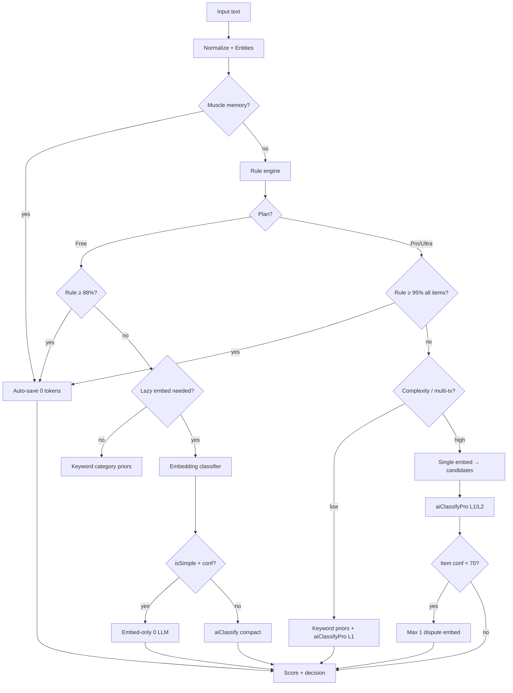

# Classification Upgrade — Master Plan

**Date:** 2026-05-21  
**Workspace:** `c:\Users\hp\.cursor\worktrees\smartspend_V1_fixed\4jwb`  
**Goal:** Smarter, less chaotic classification with **lower tokens**, never trading IQ for cost.

| Tier | Intelligence | Tokens (parse channel) |
|------|--------------|-------------------------|
| **Free** | +intelligence vs today | **−30% to −40%** |
| **Pro / Ultra** | **+30%** accuracy / context use | **−10%** |

**Principle:** Every token must change a decision. Every skipped LLM call must have a measured fallback accuracy floor.

---

## 1. Audited modules (current responsibilities)

| Module | Role |
|--------|------|
| `classification-pipeline.ts` | Orchestrator: normalize → entities → muscle memory → rule → **embedding (always)** → route → execute → dispute (Pro) → score |
| `ai-routing.ts` | Plan-aware route: `rule_engine` \| `embedding` \| `ai` \| `hybrid`; floors 88% Free / 95% Pro trivial |
| `ai-classifier.ts` | Free/compact Gemini: micro-prompt, pruned categories, `compactRuleHints`, max ~384 out |
| `ai-classifier-pro.ts` | Pro/Ultra: full taxonomy prompt, rich profile slices (400+350 chars), max 2048–3072 out |
| `rule-engine.ts` | 0-token: dictionary, fuzzy, intent, amounts, `needsAI` flag |
| `embedding-engine.ts` | `text-embedding-004`: category descriptors (~200+ embeds cold), complexity score, `isSimple` gate |
| `ai-router.ts` | `parseExpense`: budgets, profile assembly, `runPipeline`, classification logs |
| `ai-usage-policy.ts` | Monthly limits, hard caps (Free parse 1500, Pro 6000), burst guard |
| `confidence-scorer.ts` | auto_save / review / clarify thresholds (admin-configurable) |
| `muscle-memory.ts` | 0-token recurring pattern hit |

---

## 2. Current end-to-end flow

```
User text (voice STT or typed)
        │
        ▼
┌───────────────────┐
│ normalizeText     │
│ extractEntities   │
└─────────┬─────────┘
          ▼
┌───────────────────┐     hit ──► return (0 tokens)
│ muscleMemoryLookup│
└─────────┬─────────┘
          ▼
┌───────────────────┐
│ runRuleEngine     │  userDict + profile hints
└─────────┬─────────┘
          ▼
┌───────────────────┐  ◄── ALWAYS runs today (cost + latency)
│ runEmbedding      │  ensureCategoryEmbeddings + per-segment embed
└─────────┬─────────┘
          ▼
┌───────────────────┐
│ decideRoute       │  ai-routing.ts
└─────────┬─────────┘
          │
    ┌─────┴─────┬─────────────┬──────────────┐
    ▼           ▼             ▼              ▼
 rule      embedding-only   hybrid         ai-only
 (0)       (embed API)      (embed+LLM)    (LLM)
    │           │             │              │
    └───────────┴─────────────┴──────────────┘
                      ▼
         Pro: dispute embedding per weak item
         All: post-AI embed remap if category=متنوعات
                      ▼
              scoreAndDecide → auto_save | review | clarify
```

---

## 3. Tier behavior today (as implemented)

### Free

1. Rule floor **88%** — strong rules bypass LLM.
2. Embedding **`isSimple`** + confidence ≥75 → **embedding-only** (no LLM).
3. Else **hybrid/ai** with `aiClassify()` — pruned categories from embedding top-4, compact hints, max **384** output tokens (routing), rich context **off**.

### Pro / Ultra

1. Rule only if **every** item ≥ **95%** and not `متنوعات` (`pro_trivial_rule_95`).
2. **Embedding shortcut disabled** — always `pro_ai_primary` or `hybrid` → **`aiClassifyPro()`**.
3. **Dispute resolution:** extra `runEmbeddingClassifier` per AI item with confidence &lt;75.
4. Max AI output **2048** (Pro) / **3072** (Ultra) via routing — often above `ai-usage-policy` default 1024 unless clamped in router.

---

## 4. Waste points & chaos sources (audit)

| # | Issue | Impact | Tier |
|---|--------|--------|------|
| W1 | **Embedding runs before routing** even when rule will accept at 88%/95% | 1–N embed API calls + cold descriptor warmup amortized | All |
| W2 | Pro **AI-primary** still pays full embed + **full taxonomy** in system prompt (~2–4k chars) | High input tokens every Pro parse | Pro |
| W3 | **`candidateCategories` from embed ignored** on Pro route (`useEmbedding: false`) but embed still executed | Cost without shortcut benefit | Pro |
| W4 | **Dispute loop**: up to M embed calls after LLM (M = items &lt;75 conf) | Token-like embed cost + latency | Pro |
| W5 | **Post-AI embed remap** for `متنوعات` on **all plans** (Part 1 doc said Free-only skip — code runs always) | +1 embed/item | All |
| W6 | **`knownNameMentioned`** → forces AI even when rule strong | Unnecessary LLM | Free/Pro |
| W7 | Pro user prompt stacks profile 400 + personal 350 + month totals every call | Input bloat | Pro |
| W8 | **Hybrid path** can populate items from embed then still call LLM (`items.length === 0` check) | Double work in edge cases | Free |
| W9 | **Clarify** returns after full LLM spend; no partial rule fallback | Wasted tokens on abandon | All |
| W10 | **maxAiOutputTokens** routing (2048) vs budget clamp — output cap drift | Spike risk | Pro |
| W11 | Category descriptor **cold start**: hundreds of `embedContent` on first request | Startup storm | All |
| W12 | **Chaos UX**: same phrase routes differently by plan (embed-only Free vs LLM Pro) | User confusion | Product |

---

## 5. Target tier pipelines (to-be)

### Free — “Smart triage, LLM last”

```
muscle → rule (90% target coverage) ──accept──► done [0]
              │
              ├─ embed LAZY (only if rule weak / multi-tx / ambiguity)
              │     ├─ isSimple + margin → done [embed only]
              │     └─ else candidateCategories + compactRuleHints
              │
              └─ aiClassify (pruned cats, 1-shot example, no profile bloat)
                    └─ optional single embed remap ONLY if متنوعات [Free]
```

**Intelligence levers (no extra tokens):** expand rule colloquial map; muscle memory promotion; tighten `needsAI` sync with routing; entity-linked category priors.

**Token levers:** lazy embed (W1); skip dispute (already); cap output 320–384; keyword-based category prune without embed on simple single-amount text.

### Pro — “Accurate LLM, cheap everything else”

```
muscle → rule ──95% trivial──► done [0]
              │
              ├─ keyword/rule candidateCategories (no embed) for 70% cases
              ├─ embed ONLY if: multi-segment, low rule margin, or dispute prep
              │
              └─ aiClassifyPro (tiered prompt):
                    L1: pruned taxonomy + rule hints + behavior one-liner
                    L2: + profile slice IF text mentions family/goal/smoke OR amount>threshold
                    dispute: max 1 embed call on flagged item only (not all <75)
```

**Intelligence (+30%):** better sub-category rules in prompt; structured rule hints (top 3); month top-3 categories injected once; optional flash→pro escalation only when confidence &lt;70 after first pass.

**Token levers (−10%):** lazy embed; tiered Pro prompt; dispute cap 1; output cap 1536 effective; reuse embed candidates from single pass.

---

## 6. Decision tree (routing — target state)



---

## 7. Token budget table

Estimates per **parse** request (input + output + embed API equivalent). “Today” from code paths; “Target” after roadmap.

| Scenario | Path today | Tokens today | Target path | Target tokens | Δ |
|----------|------------|--------------|-------------|---------------|---|
| Coffee 20 EGP voice | Rule | **0** | Rule + colloquial | **0** | — |
| Simple market 150 | Rule / embed | 0–80 embed | Rule | **0** | −80 |
| Free ambiguous 2 cats | Embed + AI | 80 + 900–1400 | Embed lazy + AI compact | 60 + 700–1000 | **−35%** |
| Free multi-tx | AI hybrid | 1200–1800 | Embed + AI pruned | 900–1200 | **−30%** |
| Pro trivial coffee | AI primary | 2500–4500 | Rule 95% | **0** | **−100%** |
| Pro normal expense | AI Pro full | 3500–5500 | AI L1 pruned | 2800–4000 | **−10%** |
| Pro complex multi | AI + dispute×N | 5000–8000 | AI L2 + 1 dispute | 4500–6500 | **−10%** |
| Pro clarify loop | AI clarify | 3000+ wasted | Rule partial + 1 question | 1500 | **−40%** on clarify |

**Monthly guardrails (unchanged infrastructure):** `ai-usage-policy` hard caps; log `routing.reason` + `tokensUsed` + `parsedBy` for regression dashboards.

**Output caps (recommended alignment):**

| Plan | Current routing max | Target max out | Target system+user in |
|------|---------------------|----------------|------------------------|
| Free | 384 | 320–384 | ≤550 |
| Pro | 2048 | 1280–1536 | ≤1200 L1 / ≤1800 L2 |
| Ultra | 3072 | 1792–2048 | ≤1500 L2 |

---

## 8. Phased roadmap

### Phase 0 — Metrics baseline (1–2 days)

- Dashboard from `classification_logs`: % by `parsedBy`, `routing.reason`, avg `tokensUsed`, clarify rate, review rate.
- Golden set: 120 Arabic utterances (voice + typed), label expected category/sub/amount.
- SLIs: **auto_save precision**, **LLM invocation rate**, **p50/p95 tokens**, **0-token hit rate**.

### Phase 1 — Quick wins (implemented / immediate)

| Item | Action | Saves |
|------|--------|-------|
| P1.1 | **Lazy embedding** — skip `runEmbeddingClassifier` when rule already meets plan floor | 30–50% embed calls |
| P1.2 | Align docs/code: post-AI embed remap **Free-only** | 1 embed/parse Pro |
| P1.3 | Pro trivial path telemetry — alert if `pro_ai_primary` on &lt;12 word single-amount | Chaos detection |

### Phase 2 — Free intelligence + −35% tokens (1 week)

- P2.1 Rule expansion pack (top 50 merchants/voice patterns) + regression tests.
- P2.2 **Keyword → category prior** map before embed (single-amount, &lt;12 words).
- P2.3 Raise embed `isSimple` margin for Free only when rule conf 60–87% (bridge zone).
- P2.4 `aiClassify` nano-prompt v2: drop redundant clarification policy on skip; 1 dynamic example only.
- P2.5 Muscle memory: promote after 3 identical user corrections.

### Phase 3 — Pro +30% IQ, −10% tokens (1–2 weeks)

- P3.1 **Tiered Pro prompt** L1/L2 gating on `ProPromptContext` struct.
- P3.2 Inject **top-3 month categories** from DB (no full profile paragraph).
- P3.3 **Single embed** per request max; feed `candidateCategories` only.
- P3.4 Dispute: **one** embed call on lowest-confidence item only.
- P3.5 Optional **two-pass**: Flash L1 → Pro model only if confidence &lt;72 (watch latency).
- P3.6 Cap `maxAiOutputTokens` routing to match `resolvePlanMaxPerRequest`.

### Phase 4 — Chaos control & product (ongoing)

- P4.1 Per-user **classification profile version** in logs for A/B.
- P4.2 Admin knob: Free embed aggressiveness / Pro dispute on-off.
- P4.3 User-visible “لماذا هذا التصنيف؟” from `routing.reason` (trust).
- P4.4 Warmup: precompute descriptor embeddings at deploy (not first user hit).

---

## 9. Success metrics

| Metric | Baseline (measure) | Free target | Pro target |
|--------|-------------------|-------------|------------|
| LLM invocation rate | TBD % | −25 pp | −5 pp (more 95% rules) |
| Mean tokens / parse | TBD | −35% | −10% |
| 0-token resolution rate | TBD | +15 pp | +8 pp trivial |
| auto_save precision (golden set) | TBD | ≥ baseline +2% | ≥ baseline +8% |
| Clarify rate | TBD | −20% | −10% |
| p95 latency | TBD | −15% | −10% |
| User correction rate (7d) | TBD | −15% | −25% |

**Anti-regression:** No release if Free golden-set accuracy drops &gt;1% while hitting token goal.

---

## 10. Anti-patterns (do not do)

| Anti-pattern | Why |
|--------------|-----|
| Blanket **lower temperature** everywhere | Hurts multi-item splits; tune per tier |
| **Remove clarify** entirely on Pro | Increases wrong auto_save |
| **Cache LLM responses** by text hash | Stale for dates/multi-user |
| **One global category list** in every prompt | Defeats pruning; burns tokens |
| **Pro = always biggest model** | Use escalation ladder |
| **Trade IQ for tokens** (user mandate) | e.g. forcing `متنوعات` to skip LLM |
| Second parallel pipeline / duplicate routing | Keep `ai-routing.ts` single source |
| **skipWaiting** style forced SW on classification | N/A — don’t auto-apply low-conf AI saves |

---

## 11. Phase 1 code change (this session)

**File:** `api/lib/classification-pipeline.ts`  
**Change:** Skip embedding when rule engine already satisfies plan confidence floor (and no `knownNameMentioned`). Logs `embeddingResult.attempted = false`.

---

## 12. Files reference

| File | Phase touch |
|------|-------------|
| `api/lib/classification-pipeline.ts` | P1 lazy embed, P2 remap scope, P3 dispute cap |
| `api/lib/ai-routing.ts` | P2 bridge routing, P3 L1/L2 flags |
| `api/lib/ai-classifier.ts` | P2 nano-prompt |
| `api/lib/ai-classifier-pro.ts` | P3 tiered prompt |
| `api/lib/embedding-engine.ts` | P2 keyword priors, P4 warmup |
| `api/lib/rule-engine.ts` | P2 colloquial pack |
| `api/ai-router.ts` | Metrics, month top-cats |
| `api/lib/ai-usage-policy.ts` | Cap alignment |

---

## 13. Testing checklist

```bash
npx vitest run api/lib/ai-routing.test.ts api/lib/classification-v21.test.ts
# Golden-set harness (to add): tests/fixtures/classification-golden.json
```

Manual:

1. Free: `قهوة بعشرين` → rule, 0 tokens, no embed attempted in log.
2. Pro: same → rule 95% if confidence tuned, else L1 with &lt;1200 input tokens.
3. Pro multi: `بيتزا 100 واوبر 50` → one embed, one LLM, ≤1 dispute embed.
4. Verify `classification_logs.routing.reason` distribution after deploy.

---

*Owner: backend classification. Review after Phase 1 metrics week.*
