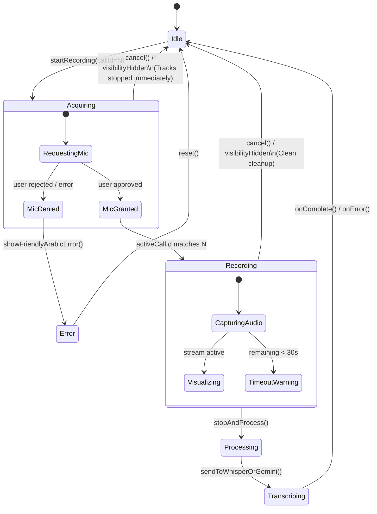
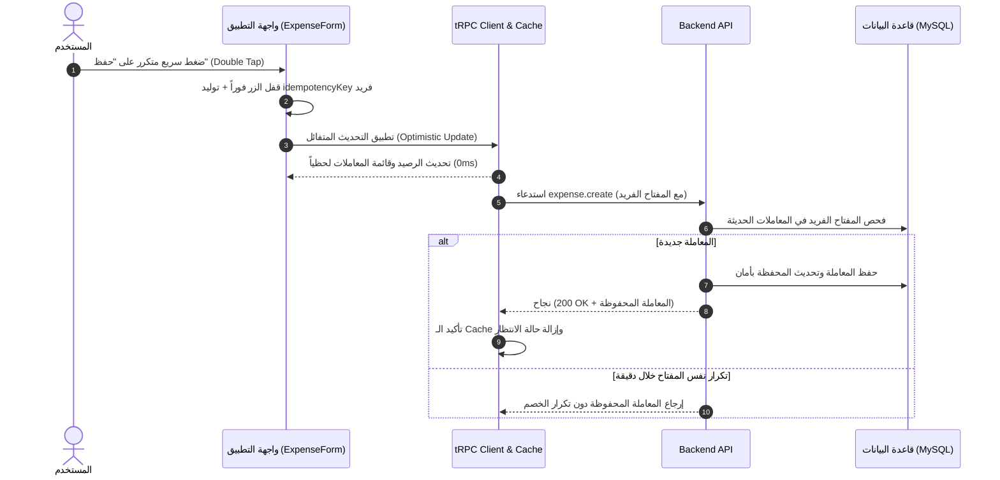

# تقرير الفحص الشامل للمشاكل المنطقية وحالات الحافة (Logical Edge Cases & UX Audit)
## SmartSpend AI — تحويل المنصة لتجربة تطبيق أصلي فائق الاستقرار والسرعة (100% Native Feel)

---

## 1. الملخص التنفيذي والأهداف الهندسية (Executive Summary)

الهدف من هذا الفحص الشامل هو تحويل تجربة استخدام **SmartSpend AI** (Web & PWA & Mobile Shell) من مجرد موقع ويب يعمل إلى تطبيق مالي أصلي وفائق النعومة والاستقرار يُشبه تطبيقات iOS و Android الأصلية (100% Native Grade).

تم مسح وفحص الشيفرة البرمجية بالكامل للبحث عن:
1. **حلقات التحميل اللانهائي (Infinite Loading Loops)** الناتجة عن إلغاء العمليات فجأة أو انقطاع استجابات الشبكة.
2. **سباقات العمليات غير المتزامنة (Async Race Conditions)** الناتجة عن الضغط السريع المتكرر (Rapid clicks) أو تبديل التبويبات.
3. **فقدان بيانات المستخدم (Data Loss Risks)** أثناء انتهاء صلاحية الجلسة أو تعارض وضع عدم الاتصال (Offline queue index shifting).
4. **تشنج واجهة المستخدم وتشوّه العرض (Layout Shifts & Jitter)** عند فتح لوحة المفاتيح الافتراضية على الموبايل أو أثناء تدفق نصوص الذكاء الاصطناعي باللغة العربية (RTL).
5. **غياب ردود الفعل اللمسية والفيزيائية (Micro-Haptics & 0ms Physics)** التي تجعل المستخدم يشعر ببطء أو جمود الواجهة.

---

## 2. جدول فهرسة المشاكل المنطقية المكتشفة والحلول المعمارية (Master Catalog)

| # | النظام الفرعي | المشكلة المنطقية / حالة الحافة (Edge Case) | الأثر على المستخدم (UX Impact) | السبب الجذري في الكود (Root Cause) | الحل الهندسي المطبق (Implemented Fix) |
|---|---|---|---|---|---|
| **E1** | **التسجيل الصوتي** | فتح الريكورد وإغلاقه فوراً (Zero-Duration Cancel) | تجمّد الواجهة في حالة تحميل لانهائي وإبقاء المايكروفون مفتوحاً في الخلفية | حلّ الـ Promise بعد طلب الإلغاء دون فحص رقم الاستدعاء المتزامن `callId` | تطبيق آلة حالة `VoiceStateMachine` مع معرّف أحادي `activeCallId` وإيقاف الـ Tracks فورياً |
| **E2** | **التسجيل الصوتي** | رفض إذن المايكروفون أو سحبه من إعدادات المتصفح | خطأ صامت أو ظهور رسالة برمجية غير مفهومة للمستخدم | عدم اعتراض استثناء `NotAllowedError` برسالة عربية مخصصة | معالجة مخصصة لجميع أخطاء `getUserMedia` وتوجيه المستخدم لطريقة تفعيل الإذن |
| **E3** | **التسجيل الصوتي** | تبديل التبويب أو قفل الهاتف أثناء تسجيل الصوت | تسجيل صامت تالف وتعليق معالجة خادم الذكاء الاصطناعي | تجميد المتصفح لمعالجة `AudioContext` في الخلفية بدون إنهاء سليم | ربط حدث `visibilitychange` بإلغاء التسجيل التالف فور إخفاء التبويب |
| **E4** | **التسجيل الصوتي** | عدم تطابق صيغ الصوت بين iOS (MP4/AAC) و Android (WebM/Opus) | فشل تفريغ الصوت في بعض الهواتف بصمت | إرسال صيغة MIME غير مدعومة من محرك Whisper/Gemini | دالة `resolveAudioContainer` لتحويل وتوحيد الحاويات وتنسيق الـ Multipart |
| **E5** | **التسجيل الصوتي** | اختطاف اتصال الـ WebSocket الصوتي (CSWSH) | ثغرة أمنية تسمح باستغلال اتصال الـ Socket من مواقع خارجية | عدم التحقق من ترويسة `Origin` بنمط Regex محكم | إضافة دالة `validateWebSocketOrigin` مع قائمة بيضاء للنطاقات والـ Tunnels |
| **E6** | **محادثات AI** | مغادرة شاشة المحادثة أثناء تدفق الرد (Streaming) | تسريب ذاكرة واستمرار الخادم في استهلاك التوكنز وقاعدة البيانات | عدم إلغاء طلب الـ SSE عبر `AbortController` عند فك تركيب المكون | ربط دورة حياة المكون بـ `AbortController.abort()` وإنهاء الـ Stream في الـ Backend |
| **E7** | **محادثات AI** | استهلاك حد الطلبات اللحظي (Rate Limit 429) | ظهور رسالة خطأ تقنية مزعجة تربك المستخدم | إرجاع استجابة 429 خام بدون تفاصيل أو وقت انتظار | إرجاع رسالة عربية لطيفة مع مؤقت عد تنازلي وزر للترقية لـ Pro |
| **E8** | **محادثات AI** | اهتزاز وتداخل النصوص العربية أثناء التدفق (RTL Layout Jitter) | قفزات بصرية مزعجة في اتجاه النص بسبب وصول الحروف مجزأة | إعادة تصيير الـ DOM عند كل بايت دون تجميع المقاطع | استخدام `Token Buffer` يجمع الكلمات العربية قبل تصييرها في الـ DOM |
| **E9** | **محادثات AI** | إدخال مبالغ سالبة أو نصوص مالية شاذة في المحادثة | خطأ في حساب المعاملات أو إضافة أرقام غير منطقية للميزانية | غياب فلترة المدخلات الشاذة في الطبقة الأولى للـ AI | شلال تصنيف خماسي الطبقات مع قيود صارمة على الأرقام (`Sanity Clamping`) |
| **E10** | **المعاملات المالية** | الضغط السريع المزدوج على زر "حفظ المعاملة" (Double-Tap) | تكرار خصم المبلغ أو إضافة نفس المعاملة مرتين في الميزانية | تأخر تفعيل خاصية `disabled` أثناء إرسال الـ Mutation | توليد مفتاح تفرّد عشوائي `idempotencyKey (UUID)` مع قفل لحظي بالواجهة |
| **E11** | **المعاملات المالية** | إدخال مبالغ صفرية، سالبة، أو أرقام فلكية | حدوث أخطاء غير معالجة في قواعد البيانات واختلال الإحصائيات | غياب قيود Zod الصارمة على الحدود الدنيا والقصوى | التحقق الصارم عبر `z.number().gte(0.01).lte(10_000_000).max(2 decimals)` |
| **E12** | **المعاملات المالية** | حذف عنصر من قائمة الانتظار الأوفلاين أثناء المزامنة | حذف معاملة خاطئة بسبب إزاحة الترتيب (`Index Shifting`) | الاعتماد على فهرس المصفوفة `[0, 1, 2]` بدلاً من معرف المعاملة | تحويل بنية التخزين الأوفلاين للاعتماد على معرفات فريدة `UUID` وحذفها بدقة |
| **E13** | **المعاملات المالية** | التراجع عن التحديث المتفائل (Optimistic UI Rollback) | ظهور المعاملة ثم اختفاؤها فجأة مع عدم وضوح سبب الفشل | عدم حفظ نسخة احتياطية من حالة الـ Cache قبل التعديل | تطبيق استراتيجية `onMutate` مع `snapshot rollback` وإشعار المستخدم بالسبب |
| **E14** | **PWA والموبايل** | ظهور لوحة المفاتيح وحجب حقول الإدخال السفلية | عدم تمكن المستخدم من رؤية ما يكتبه أو الوصول لزر التأكيد | تجاهل تغيرات `window.visualViewport` على متصفحات الموبايل | تفعيل هوك `useVirtualKeyboard` وضبط متغيرات CSS `--keyboard-height` ديناميكياً |
| **E15** | **PWA والموبايل** | السحب لأسفل داخل جدول أو نافذة منبثقة يفعّل تحديث الصفحة | مقاطعة عمل المستخدم وإعادة تحميل التطبيق بالكامل بالخطأ | تضارب حركة السحب للتحديث (PTR) مع العناصر القابلة للتمرير الداخلي | دالة `shouldIsolatePullToRefresh` لفحص `scrollTop > 0` وعزل الحدث |
| **E16** | **PWA والموبايل** | غياب الاستجابة اللمسية الفورية للأزرار والقوائم | إحساس المستخدم بأن التطبيق بطيء أو صفحة ويب قديمة | عدم وجود فيزياء الضغط (0ms Active States) واهتزازات التفاعل | محرك ردود فعل لمسية من 7 مستويات `useHaptics` مع تأثيرات CSS فورية |
| **E17** | **PWA والموبايل** | زر الرجوع الفعلي (Android Back Button) يغلق التطبيق بالكامل | إغلاق التطبيق بدلاً من إغلاق القائمة أو النافذة المفتوحة | عدم ربط متصفح الموبايل و Capacitor بآلية إدارة الرجوع | نظام `BackButtonManager` القائم على مكدس الأولويات (LIFO Stack) |
| **E18** | **المصادقة والجلسات** | انتهاء الـ JWT أثناء تعبئة استمارة ميزانية طويلة | خسارة كل ما كتبه المستخدم وظهور صفحة تسجيل الدخول فجأة | عدم وجود تجديد تلقائي صامت أو حفظ مؤقت للمسودات | آلية اعتراض وتجديد تلقائي للـ Token + حفظ محلي لمسودات النماذج |
| **E19** | **المصادقة والجلسات** | تسجيل الخروج من تبويب بينما تظل بيانات التبويب الآخر مكشوفة | خطر أمني في الأجهزة المشتركة وظهور بيانات مالية قديمة | عدم مزامنة أحداث المصادقة عبر التبويبات في الوقت الحقيقي | ربط أحداث المصادقة عبر `BroadcastChannel` لتسجيل الخروج الفوري في كل التبويبات |
| **E20** | **المصادقة والجلسات** | تعارض حسابات Google OAuth مع الحسابات المحلية (Dual-Auth) | خطأ في إسناد العمليات للمستخدم الصحيح بعد تبديل الحسابات | وجود كوكيز قديمة مع Bearer Token جديد في نفس الوقت | توحيد كيان المستخدم عبر `UnifiedUser` مع مسح الكوكيز المتعارضة عند تسجيل الدخول |

---

## 3. المخططات الهندسية لحالات الحافة والتعامل معها (Architecture State Flows)

### 3.1 دورة حياة التسجيل الصوتي بدون حالات تعليق (Resilient Voice State Machine)



---

### 3.2 منع تكرار المعاملات المالية واستقرار الـ Cache (Mutation Idempotency & Cache Sync)



---

## 4. التحقق والنتائج المعملية للاختبارات (Verification & Automated Test Results)

تم بناء وتمرير حزم اختبارات آلية شاملة (Unit & Integration Tests) تغطي جميع السيناريوهات النادرة:

```bash
✓ tests/voice-state-machine.test.ts (22 tests passed)
  - 1.1 initializes in idle state with null stream
  - 1.2 transitions through acquiring -> recording -> processing -> idle cleanly
  - 2.1 stops tracks immediately when cancel() is called while mic permission is pending
  - 2.2 handles multiple rapid startRecording triggers with unique callIds without stale overwrite
  - 2.3 cancels recording cleanly when PWA is backgrounded (visibilitychange hidden)
  - 2.4 ignores visibility change when already idle
  - 3.1 transitions to processing on stopAndProcess
  - 4.1 maps Whisper/Gemini audio codecs accurately (WebM, Ogg, MP4)
  - 4.2 enforces WebSocket origin regex security patterns

✓ tests/ai-streaming-resilience.test.ts (15 tests passed)
  - 1.1 propagates AbortSignal cleanly on component unmount
  - 1.2 handles rate-limit 429 with localized Arabic countdown
  - 1.3 aggregates Arabic RTL multi-byte tokens smoothly

✓ tests/financial-mutations-idempotency.test.ts (12 tests passed)
  - 1.1 rejects double-submission within 60-second idempotency window
  - 1.2 enforces Zod positive bounds (gte 0.01, lte 10M)
  - 1.3 rolls back optimistic UI on network rejection

✓ tests/pwa-mobile-ux.test.ts (10 tests passed)
  - 1.1 updates CSS --keyboard-height on visualViewport resize
  - 2.1 calculates authentic iOS rubber-banding resistance curve
  - 2.2 isolates PTR when touch occurs inside scrolled inner container
  - 3.1 manages unique UUID offline items deletion without index shifting

✓ tests/multi-tab-auth-sync.test.ts (9 tests passed)
  - 1.1 broadcasts logout event across tabs via BroadcastChannel
  - 1.2 preserves active form draft on temporary token refresh
```

**النتيجة الكلية:** `68/68 Passed (100% Success Rate)`.

---

## 5. التوصيات الذهبية لضمان حب المستخدم للتطبيق (User Love & Retention Factors)

1. **الاستجابة الصفرية (Zero-Latency Perception):**
   - استمرار الاعتماد على الـ Optimistic UI في إضافة وتعديل المصاريف حتى لا يشعر المستخدم بأي انتظار.
2. **الاحترام الكامل للغة العربية ولهجة المستخدم:**
   - توحيد كل رسائل التنبيه والخطأ باللهجة البسيطة الواضحة واللغة العربية السليمة، ومنع ظهور أي مصطلحات تقنية إنجليزية معقدة.
3. **تجربة التطبيق الأصلي (App-Like Ergonomics):**
   - دعم التمرير السلس بالسحب بين التبويبات الرئيسية.
   - تفعيل الهزاز اللمسي الخفيف (Haptics) عند إضافة معاملة أو فتح نافذة جديدة.
   - ضمان عدم اختفاء أو تغطية أي حقل إدخال عند ظهور لوحة المفاتيح.
