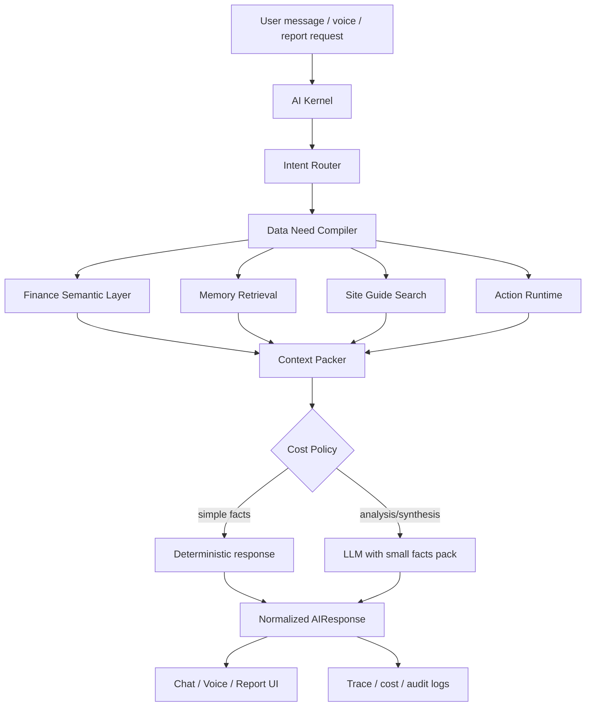
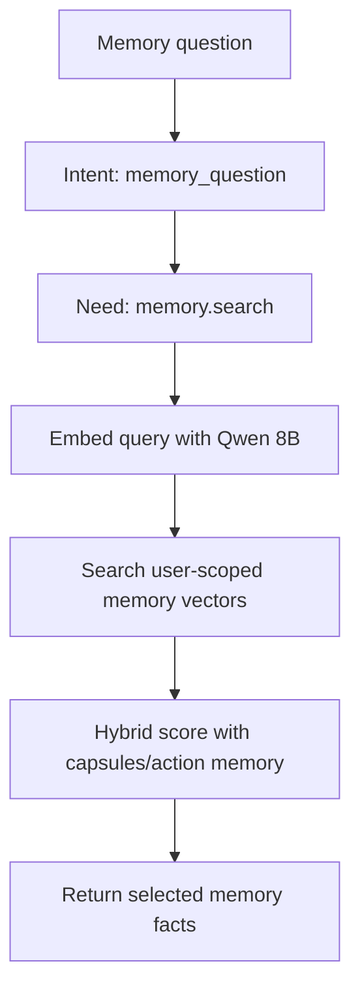
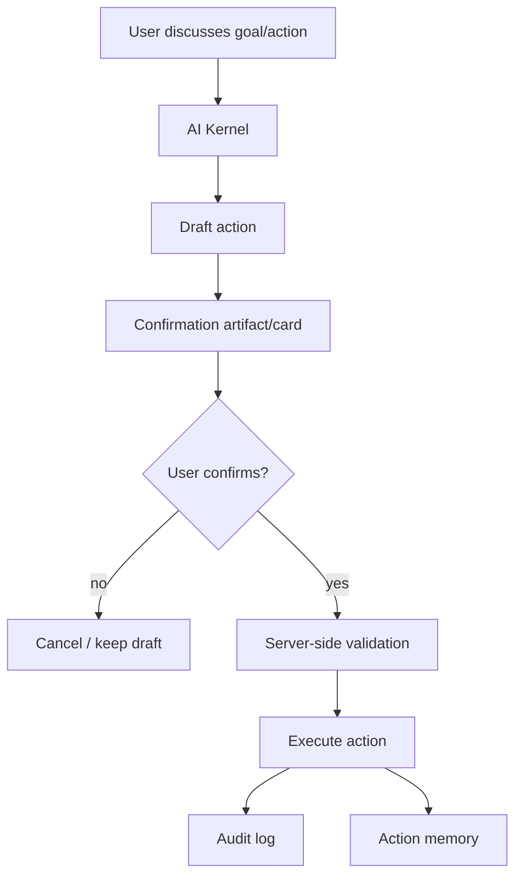

# SmartSpend AI Center Context Pack

Last verified: 2026-06-16

This file is written to be handed to another AI model so it can understand the SmartSpend project and the AI Center architecture without reading the entire chat history. It describes the product goal, the current implementation shape, the central agent design, chat, voice, memory, embeddings, tools, actions, reports, caching, observability, QA seed/runner, and the next engineering rules.

## 1. Product Goal

SmartSpend is a personal finance web app for Egyptian users. The app records expenses, income, wallets, goals, reports, and AI interactions. The AI Center is not meant to be a decorative chatbot. It is meant to become one central AI agent that can help the user operate the whole website:

- Answer exact financial questions from SQL facts.
- Understand Egyptian Arabic questions and common finance wording.
- Remember important prior conversations and plans.
- Explain how to use the site.
- Generate charts and report artifacts from prepared data.
- Discuss actions with the user, draft them, wait for explicit confirmation, execute server-side, audit the result, and store useful action memory.
- Run the same brain through chat, voice, reports, and statistics.
- Stay very low cost because the site may have many free users.

The core principle is:

> Structured data is answered from structured tools. Embeddings are only for semantic memory and selected static knowledge. LLM is used only when synthesis or conversational wording is needed.

## 2. Current Project Stack

The repository is a monorepo-style TypeScript app:

- Frontend: React + Vite.
- Backend: Hono/tRPC-style API modules under `api/`.
- Database: MySQL through Drizzle ORM.
- Cache/session hot layer: Redis in production, in-process RAM fallback in development/test only.
- AI providers:
  - Chat LLM: configured from `systemSettings`, usually Fireworks DeepSeek model such as `accounts/fireworks/models/deepseek-v4-flash`.
  - Embedding model: Fireworks Qwen3 Embedding 8B, `accounts/fireworks/models/qwen3-embedding-8b`.
  - Voice live model path uses the existing voice service and shared voice-kernel tool adapter.

Important project files:

- `db/schema.ts`: database schema.
- `api/chat-router.ts`: chat endpoints, conversation persistence, daily limits, active kernel integration, action confirmation/cancellation.
- `api/ai-router.ts`: older AI endpoints, report endpoints, voice QA endpoint, admin-ish AI routes.
- `api/services/ai-kernel/`: central agent contracts, routing, data need compilation, context packing, response normalization, traces.
- `api/services/finance-semantic-layer/`: exact finance facts, summaries, categories, transactions, charts, profile/goals, cache traces.
- `api/services/ai-memory/`: conversation summaries, semantic memory extraction, Fireworks embedding client, memory retrieval and backfill.
- `api/services/action-runtime/`: pending actions, validations, confirmation, execution, audit, action memory.
- `api/services/voice-kernel/`: voice hot context, tool adapter, voice session state, prompt, archive.
- `api/services/voice-call-service.ts`: live voice WebSocket/runtime integration.
- `src/components/ai/AIChatbot.tsx`: chat UI, artifacts, traces, dev QA prompt path.
- `src/components/ai/AIVoiceCall.tsx`: voice UI, trace display, dev voice tool QA path.
- `src/components/ai/AIMonthlyReport.tsx`: report UI and traces.
- `src/components/expenses/ExpenseForm.tsx`: expense text/voice parser UI and parser trace.
- `docs/AI_CENTER_IMPLEMENTATION_TASKS.md`: execution checklist.
- `docs/AI_CENTER_REDEVELOPMENT_MASTER_PLAN.md`: original architecture plan.
- `docs/AI_CENTER_REDIS_SETUP.md`: Redis runbook.
- `api/qa/ai-center-qa-seed.ts`: stable QA seed.
- `api/qa/ai-center-qa-runner.ts`: stable backend QA runner.

## 3. Target Architecture

The intended system is one central AI agent shared by chat, voice, reports, statistics, and actions.



The central agent must expose the same concepts everywhere:

- intent routing
- data needs
- tools/capabilities
- memory
- actions
- cost policy
- traces
- artifacts

No major AI surface should implement its own unrelated logic.

## 4. Point 1: Intent Routing

The first decision is deterministic routing, not LLM routing.

Main intent kinds:

- `finance_query`: exact finance question, e.g. "صرفت كام النهارده؟"
- `finance_analysis`: grouped analysis or comparison.
- `goal_planning`: user wants to plan savings/goals.
- `action_request`: user wants the system to do something.
- `advice_request`: user wants personalized advice.
- `site_help`: user asks how the website works.
- `memory_question`: user asks about previous conversations/plans.
- `report_request`: user asks for a report.
- `chart_request`: user asks for a chart/statistic.
- `expense_capture`: user is trying to record a new expense.
- `smalltalk`
- `unknown`

Routing lives in:

- `api/services/ai-kernel/intent-router.ts`

Important rules:

- Simple finance questions should not use LLM.
- Memory questions route to `memory.search`.
- Site help routes to `site_guide.search`.
- Charts route to `chart.data`.
- Goal/action requests can create a draft but never execute without confirmation.

## 5. Point 2: Data Needs And Tools

The agent does not call broad tools. It compiles each intent into narrow data needs.

Core data need/tool names:

- `finance.summary`
- `finance.category_total`
- `finance.breakdown`
- `finance.transactions`
- `finance.period_comparison`
- `finance.goal_progress`
- `wallet.summary`
- `memory.search`
- `site_guide.search`
- `chart.data`
- `profile.snapshot`
- `goals.active`

The data need compiler lives in:

- `api/services/ai-kernel/data-need-compiler.ts`

Examples:

- "صرفت كام النهارده؟"
  - intent: `finance_query`
  - data need: `finance.summary` scoped to `today`
  - embedding: skipped
  - LLM: 0

- "صرفت كام أكل الشهر ده بالظبط؟ وهات العمليات اللي اتحسبت"
  - intent: `finance_query`
  - data needs: `finance.category_total`, `finance.transactions`
  - embedding: skipped
  - LLM: 0

- "فاكر الخطة اللي اتكلمنا عنها؟"
  - intent: `memory_question`
  - data need: `memory.search`
  - embedding: Fireworks/Qwen semantic retrieval

- "ارسملي مصاريف الأكل آخر 6 شهور"
  - intent: `chart_request`
  - data need: `chart.data`
  - embedding: skipped
  - artifact: chart

## 6. Point 3: Finance Semantic Layer

Finance data is structured. It must stay structured. Do not embed every transaction.

The finance semantic layer lives in:

- `api/services/finance-semantic-layer/`

Key functions:

- `getFinanceSummary`
- `getCategoryTotal`
- `getFinanceBreakdown`
- `getFinanceTransactions`
- `getFinancePeriodComparison`
- `getWalletSummary`
- `getGoalProgress`
- `getChartData`
- `getProfileSnapshot`
- `resolveKernelDataNeeds`

Responsibilities:

- Resolve date periods: today, yesterday, current week, current month, previous month, salary cycle, custom ranges.
- Return exact SQL facts with limited evidence rows.
- Keep decimals; do not round money unless UI formatting requires it.
- Canonicalize categories so "coffee", "restaurant", "groceries" can be grouped under food where appropriate.
- Generate chart artifacts from prepared data, not from LLM text.
- Cache hot finance queries.
- Invalidate finance cache when expenses, wallets, goals, or relevant actions change.

Cost rule:

- Finance SQL facts do not need embeddings.
- Simple finance answers should be deterministic and zero LLM.
- For analytical advice, send only a compact facts pack to LLM.

## 7. Point 4: Memory And Embeddings

Memory is separate from transactions. The system should remember important user plans, preferences, constraints, agreements, and action outcomes.

Memory tables in `db/schema.ts`:

- `ai_conversation_summaries`
- `ai_memory_items`
- `ai_memory_embeddings`
- `ai_action_memory`

Memory service files:

- `api/services/ai-memory/memory-writer.ts`
- `api/services/ai-memory/memory-retriever.ts`
- `api/services/ai-memory/embedding-client.ts`
- `api/services/ai-memory/embedding-settings.ts`
- `api/services/ai-memory/embedding-backfill.ts`

Embedding model:

- Provider: Fireworks
- Model: `accounts/fireworks/models/qwen3-embedding-8b`
- Short/static dimensions: `256`
- Personal memory dimensions: `768`
- Deep dimensions when needed: `1024`

Settings keys:

- `ai_memory_embedding_enabled`
- `ai_embedding_provider`
- `ai_embedding_base_url`
- `ai_embedding_model`
- `ai_embedding_dimensions_short`
- `ai_embedding_dimensions_memory`
- `ai_embedding_dimensions_deep`

API key resolution:

- `systemSettings.fireworks_api_key`
- fallback to `systemSettings.chatbot_api_key`
- fallback to `FIREWORKS_API_KEY`

What gets embedded:

- Semantic memories extracted from user messages.
- Important plans and agreements.
- Preferences and constraints.
- Action outcomes when useful.
- Static site guide chunks with small dimensions.

What does not get embedded:

- Every transaction.
- Every chat message.
- Raw monthly reports.
- Finance SQL summaries.
- Long voice transcripts as unstructured dumps.

Memory retrieval flow:



Required trace evidence:

- `memory_cache:miss|hit:<backend>`
- `embedding:query_embedded` or cache status
- `embedding:fireworks`
- `embedding:rows:<n>`
- `retrievalPolicy.embedding = fireworks_qwen`
- `embeddingApiStatus = fireworks_live_call | query_embedding_cache_hit | semantic_result_cache_hit`

Important privacy/safety rule:

- Vector lookup must always filter by `userId` and `userType`.
- Embedding cache keys must include user identity scope when user-specific.

## 8. Point 5: Chatbot Runtime

Chat endpoint:

- `api/chat-router.ts`

Main UI:

- `src/components/ai/AIChatbot.tsx`

The chat runtime:

1. Authenticates the user.
2. Checks plan limits unless the dev-only QA bypass is active outside production.
3. Creates or loads the conversation.
4. Calls AI Kernel active mode when enabled.
5. Stores user and assistant messages.
6. Persists semantic memory when the conversation contains memory candidates.
7. Returns a structured `AIResponse`.
8. Renders text, artifacts, action cards, and trace panels.

`AIResponse` includes:

- `traceId`
- `channel`
- `content`
- `intent`
- `dataNeeds`
- `facts`
- `artifacts`
- `actions`
- `tokenBudget`
- `model`
- `tokensUsed`
- `debug`

Artifacts include:

- `metric_card`
- `table`
- `chart`
- `action_confirmation`
- `quick_replies`
- `text_block`

Trace UI should show:

- route/intent
- tools/data needs
- embedding status
- cache hits
- LLM calls
- token estimates
- model
- retrieval policy
- selected facts
- hallucination/numeric guard status

## 9. Point 6: Action Runtime

Actions must never execute silently. The agent can discuss and draft, but execution requires explicit confirmation and server validation.

Action runtime files:

- `api/services/action-runtime/`

Action lifecycle:

- `draft`
- `pending_confirmation`
- `confirmed`
- `executed`
- `cancelled`
- `failed`

Supported or planned action names:

- `goal.create`
- `expense.create`
- `budget.create`
- `profile.update`
- `wallet.create`
- `action.undo`

Current core completed action:

- `goal.create`

Action process:



Critical rules:

- Validate userId/userType/plan server-side.
- Bind confirmation to conversationId where relevant.
- Do not allow one conversation to confirm another conversation's pending action.
- Medium/high-risk actions require confirmation.
- High-risk voice actions require UI confirmation.
- Save action outcome in audit logs and useful memory.

## 10. Point 7: Voice Runtime

Voice must be a fast version of the same agent, not a separate chatbot.

Main files:

- `api/services/voice-call-service.ts`
- `api/services/voice-kernel/voice-tool-adapter.ts`
- `api/services/voice-kernel/hot-context.ts`
- `api/services/voice-kernel/voice-session-state.ts`
- `api/services/voice-kernel/voice-prompt.ts`
- `src/components/ai/AIVoiceCall.tsx`

Voice runtime design:

- Start a voice session.
- Build small hot context:
  - profile snapshot
  - today summary
  - current month summary
  - wallets/goals
  - recent memory hints
- The voice system prompt tells the model:
  - use the smallest matching tool first
  - never invent financial numbers
  - create drafts before actions
  - ask for explicit confirmation
  - high-risk actions require UI confirmation
- Voice tools call the same semantic layers:
  - `finance_query`
  - `memory_search`
  - `action_draft`
  - `action_confirm`
  - `action_cancel`

Voice cost policy:

- Do not send full chat history.
- Do not prefetch semantic memory embeddings unless the user explicitly asks memory.
- Finance voice questions use SQL facts and skip embeddings.
- Voice memory search uses Qwen/Fireworks.
- Enforce max tool rounds in the live WebSocket.
- `action_confirm` and `action_cancel` may remain allowed after a draft so the user can finish a confirmation flow.

Voice QA limitation:

- Full microphone/audio streaming cannot always be proven in the local browser automation environment.
- A dev-only non-mic QA path exists for safe tools:
  - `/ai?ai_tab=voice&voice_qa_tool=finance_query`
  - `/ai?ai_tab=voice&voice_qa_tool=memory_search`
  - `/ai?ai_tab=voice&voice_qa_tool=action_draft`

## 11. Point 8: Reports, Charts, And Site Guide

Reports:

- Monthly report generation should use a compact facts pack from Finance Semantic Layer.
- Do not pass raw monthly transaction dumps to the LLM.
- Cache reports when valid.
- `forceRefresh` should rebuild from semantic facts.
- Numeric output must be validated against facts.

Chart artifacts:

- Created by `finance.chartData`.
- Rendered by the frontend with accessible chart-point summaries.
- The LLM should not invent chart points.

Site guide:

- Static/local product knowledge chunks.
- Uses small static vector-like search, currently traceable as `site_guide:static_256`.
- Retrieval policy should show `static_local`.
- Good for questions like:
  - how to connect card/SMS
  - how wallets work
  - how goals/reports work

## 12. Point 9: Redis, Cache, Cost, And Observability

Redis role:

- Hot finance query cache.
- Memory retrieval result cache.
- Embedding query cache.
- Voice session state.
- Voice pending actions.
- Site guide chunk cache where useful.

Redis is not the primary long-term vector database.

Development/test behavior:

- If `REDIS_URL` is missing, in-process RAM fallback is allowed.

Production behavior:

- Redis should be configured.
- Production without Redis should not silently use RAM fallback unless explicitly overridden with `AI_ALLOW_MEMORY_CACHE_IN_PRODUCTION=true`.

Required observability per AI request:

- route/intent
- data needs/tools
- cache backend: redis/memory/disabled
- cache hit/miss
- embedding call status
- vector rows selected
- LLM calls
- token estimates
- latency
- hallucination/numeric guard
- action audit status where applicable

Important trace statuses:

- `skipped`: embeddings intentionally not used.
- `static_local`: site guide static retrieval.
- `fireworks_live_call`: real Fireworks embedding API call.
- `query_embedding_cache_hit`: embedding query vector came from cache.
- `semantic_result_cache_hit`: full semantic memory result came from cache.
- `fireworks_fallback` or fallback reason: embedding failure or disabled path.

Cost rules:

- Simple finance: 0 LLM, 0 embedding.
- Category/evidence: SQL facts, 0 LLM, 0 embedding.
- Memory: 1 embedding query if not cached, top memories only.
- Advice: 1 LLM call with compact facts/memory, no raw transaction dump.
- Reports: 1 LLM only when needed, facts pack capped.
- Voice: hot facts first, tools only when needed.

## 13. Point 10: QA Seed, Runner, Dev Paths, And Final Verification

Stable QA seed:

- File: `api/qa/ai-center-qa-seed.ts`
- Command: `npm run qa:seed`
- QA phone: `01055501999`
- QA user type: `local`
- QA plan: `ultra`
- Marker: `QA_SEED_AI_CENTER_V1`

The seed is idempotent:

- Creates/updates the QA user.
- Seeds deterministic current-month and previous-month expenses.
- Seeds profile.
- Seeds one wallet.
- Seeds one goal.
- Seeds memory conversation for coffee/sleep/car goal.
- Ensures embedding settings are enabled.
- Backfills memory embeddings with Fireworks Qwen3 8B at 768 dimensions.
- Does not hardcode API secrets.

Stable QA runner:

- File: `api/qa/ai-center-qa-runner.ts`
- Command: `npm run qa:ai-center`
- Report output: `docs/AI_CENTER_QA_RUNNER_LAST_RESULT.md`

Runner cases:

- Chat finance today uses SQL facts without embedding.
- Chat food current month returns category total and evidence rows.
- Chat memory recall routes to memory and uses Fireworks/Qwen vector retrieval.
- Chat chart request returns chart artifact.
- Chat site guide answers from local product guide.
- Voice finance tool uses exact hot summary.
- Voice memory tool uses the same vector memory.
- Voice action draft requires confirmation and does not execute.

Last verified runner result:

- `npm run qa:ai-center`: PASS
- Seeded expenses: 11
- Active memories: 2
- Embeddings: 2
- Memory embedding model: `accounts/fireworks/models/qwen3-embedding-8b`
- Memory dimensions: 768
- Memory vector rows in QA retrieval: 2
- Finance today embedding calls: 0
- Finance category/evidence embedding calls: 0
- Chart artifact: present
- Site guide retrieval: `static_local`
- Voice memory: `fireworks_qwen`
- Voice action draft: `pending_confirmation`

Dev-only QA paths:

- Chat QA prompt:
  - `/ai?ai_qa_prompt=<encoded prompt>&ai_qa_new=1`
  - frontend-gated by `import.meta.env.DEV`
  - backend daily-limit bypass ignored in production
- Voice tool QA:
  - `/ai?ai_tab=voice&voice_qa_tool=finance_query|memory_search|action_draft`
  - safe tools only
  - no confirm/cancel through this browser QA path
- Dashboard expense parser QA:
  - `/dashboard?tab=record&expense_qa_text=<encoded>`
  - dev only
- Report QA:
  - query params for report month/compare month
  - dev only
- Local token callback:
  - dev only

Guard tests:

- `api/dev-qa-paths.test.ts`
- Verifies dev-only gating, safe voice tools, production protection, seed/runner existence, and no hardcoded Fireworks secret.

Redis integration gate:

- Command: `npm run test:redis`
- Requires Redis running and `REDIS_URL`.
- It is expected to fail with `ECONNREFUSED` on machines with no Redis service.

General verification commands:

```bash
npm run check
npx vitest run api/dev-qa-paths.test.ts
npm run qa:seed
npm run qa:ai-center
npm run test:redis
```

## 14. Current Known Constraints

- Redis is not running on this local machine unless the developer starts it. Development currently uses RAM fallback.
- Full microphone streaming cannot be completely validated by browser automation in this environment; non-mic voice tools are backend/browser QA tested.
- Some old saved chat artifacts may display stale chart values because they were created before fixes. New chart messages should use current `chart.data`.
- The QA runner uses a stable memory trigger for route verification and separately verifies real Qwen vector retrieval. Browser/manual QA should still test natural Egyptian Arabic memory questions.
- The project worktree may contain unrelated WhatsApp/session/auth artifacts. Do not revert unrelated changes unless explicitly asked.

## 15. Engineering Rules For Future AI Models

If another AI model receives this file and works on the project, it should follow these rules:

- Read the current code before editing.
- Do not replace structured SQL facts with embeddings.
- Do not send all transactions/history to an LLM.
- Do not execute actions without confirmation.
- Do not hardcode API keys.
- Keep `userId` and `userType` in every memory/vector/cache scope.
- Keep Redis as hot/session/cache, not the only long-term memory store.
- Prefer exact tools over broad prompts.
- Return artifacts for charts/actions, not only text.
- Update `docs/AI_CENTER_IMPLEMENTATION_TASKS.md` when completing tasks.
- Update or run `api/qa/ai-center-qa-runner.ts` when changing AI Center behavior.
- If embeddings appear not to run, verify:
  - `ai_memory_embedding_enabled=true`
  - model is `accounts/fireworks/models/qwen3-embedding-8b`
  - memory dimensions are 768
  - key is available through settings/env
  - trace contains `embedding:fireworks`
  - vector rows are greater than 0

## 16. The Final Target Experience

When the system is working correctly, a user should feel that SmartSpend AI is controlling and understanding the whole app:

- It gives exact numbers for spending questions.
- It shows the exact evidence rows when asked.
- It remembers previous plans and personal constraints.
- It draws real charts from actual data.
- It explains how the app works.
- It can discuss a savings plan and create a goal only after confirmation.
- It can do the same through voice quickly.
- It shows clear traces so developers can prove cost and correctness.
- It stays cheap: no unnecessary LLM calls, no unnecessary embedding calls, no raw-data dumps.

## 17. Final Hardening Snapshot - 2026-06-16

Read `docs/AI_CENTER_FINAL_HARDENING_2026-06-16.md` for the latest implementation checkpoint.

Latest completed items:

- `parseExpense` and `parseVoiceExpense` are explicitly tracked as `classification_engine.v1` nodes with `agentBoundary=independent_classification_engine`.
- Parser traces now include engine, boundary, data needs, cost policy, LLM calls, embedding calls, token counts, latency, and risk.
- Confirmed actions now include `goal.update`, `goal.stop`, `expense.recategorize`, and `wallet.update`.
- New actions stay inside the same draft/confirm/cancel/execute/audit/action-memory runtime and are scoped by `userId/userType`.
- Voice action drafting uses the same runtime action contract as chat; high-risk voice actions require UI confirmation.
- Admin cost monitoring is available through `admin.getAICostOverview`, backed by `api/services/ai-cost-analytics.ts`.
- Production verification passed: focused Vitest suites, security regression tests, `npm run check`, `npm run build`, and a production-like `/health` smoke on port `5199`.
