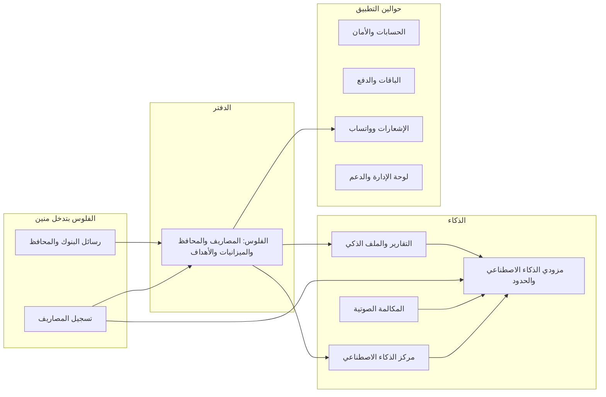

# أنظمة SmartSpend

التطبيق مقسوم لأجزاء، كل جزء بنسميه «نظام» وليه شغلانة واضحة: تسجيل المصاريف، رسائل البنوك، مركز الذكاء
الاصطناعي، وهكذا. كل ملف في الكود تابع لنظام واحد بس، فلما حد يسأل «الحتة دي بتاعة إيه؟» الإجابة موجودة.

كل نظام ليه تلات صفحات:
- **صفحة بالعربي** (الفولدر ده): بتحكي النظام بيعمل إيه ومشاكله من غير كود، لأي حد مش مبرمج.
- **صفحة إنجليزي** في `docs/systems/`: الشرح الهندسي بالتفصيل للمبرمجين والـagents.
- **صفحة حقائق** في `docs/atlas/systems/`: كل ملف وجدول وخدمة في النظام، ومعاها رسومات. البرنامج بيولّدها من
  الكود نفسه، فهي عمرها ما تكون قديمة.

## الصورة الكبيرة

الأسهم هنا للفهم بس. الرسمة الدقيقة اللي بتتولّد من الكود (مين بيستخدم مين فعلاً) في
[صفحة الحقائق الرئيسية](../../atlas/systems/README.md). وتحت الكل في نظامين أساس: منصة السيرفر والبيانات، وهيكل
التطبيق.

## الأنظمة
| النظام | بيعمل إيه |
| --- | --- |
| [تسجيل المصاريف](expense-capture.md) | بيفهم الجملة المكتوبة أو الصوت أو صورة الإيصال ويحوّلها لعمليات متصنفة ويسجلها |
| [رسائل البنوك والمحافظ](bank-messages.md) | بيستقبل رسايل البنك والمحفظة من موبايلك ويحوّلها لعمليات |
| [المكالمة الصوتية](voice-calls.md) | مكالمة صوتية مباشرة مع المساعد |
| [مركز الذكاء الاصطناعي](ai-center.md) | المساعد اللي بتسأله عن فلوسك وبيقترح إجراءات ماتتنفذش غير بموافقتك |
| [التقارير والتحليلات والملف الذكي](insights.md) | تحليلات الشهر والسنة وتقرير Pro، والملف اللي بيعرّف التطبيق بيك |
| [الفلوس](money.md) | الدفتر بعد التسجيل: القوايم والإحصائيات والمحافظ والميزانيات والأهداف ووضع البيزنس والناس |
| [الحسابات وتسجيل الدخول والأمان](accounts.md) | الدخول والجلسات وحماية الحساب ومسحه |
| [الباقات والدفع](billing.md) | Free وPro وUltra والدفع عن طريق Paymob والإحالات |
| [الإشعارات وواتساب](notifications.md) | الإشعارات والرسايل المجدولة وخدمة واتساب |
| [لوحة الإدارة والدعم وأدوات النمو](admin.md) | لوحة الأدمن والإعدادات وتذاكر الدعم والإعلانات وصفحات SEO |
| [مزودي الذكاء الاصطناعي وحدود الاستخدام](ai-platform.md) | التعامل مع شركات الموديلات وحدود كل باقة وحساب التكلفة |
| [منصة السيرفر والبيانات](platform.md) | الأساس: السيرفر وقاعدة البيانات والكاش والمهام المجدولة |
| [هيكل تطبيق الويب والموبايل](web-app.md) | الإطار حوالين كل شاشة: التنقل والتثبيت على الموبايل والشغل من غير نت |

## إزاي الصفحات دي بتفضل صح
- كل صفحة إنجليزي متسجل إنها اتراجعت على الكود بتاعها، ببصمة لكل ملف، ومعاها **تاريخ آخر مراجعة** ورقم الـcommit.
  التواريخ دي كلها في جدول واحد في [صفحة الحقائق الرئيسية](../../atlas/systems/README.md)، فتقدر تعرف في ثانية
  أي شرح قديم وأي شرح اتراجع النهاردة.
- أول ما حد يغيّر الكود ده، البرنامج بيطلب من نفس الـagent اللي غيّره إنه يقرا الصفحة تاني ويصلحها، وماينفعش يرفع
  شغله قبل ما يعمل ده.
- لو الصفحة الإنجليزي اتغيرت، الصفحة العربي لازم تتراجع وراها.
- يعني الشرح مايقدرش يفضل قديم في السر: أي كود اتغير من غير ما شرحه يتراجع بيوقّف الرفع.

## حالة المشروع في صفحة واحدة
[**صفحة الحالة**](../../atlas/systems/state.ar.md) بتتولّد لوحدها من كل الصفحات دي، وبتقولك: كل نظام اتراجع
شرحه إمتى، وعنده كام اختبار، وكل المشاكل المعروفة في المشروع مجمّعة في قايمة واحدة. لو عايز تعرف «فاضل إيه؟»
أو تدّي لـagent شغلانة، ابدأ من هناك.

## تسأل الـagent إزاي
- «اقرا صفحة نظام تسجيل المصاريف وقولي ليه الجملة دي اتسجلت غلط.»
- «أنهي نظام مسؤول عن رسايل البنك، وإيه المشاكل المعروفة فيه؟»
- «عايز أغيّر كذا في الإشعارات؛ اقرا الصفحة بتاعتها الأول وقولي الخطة.»
