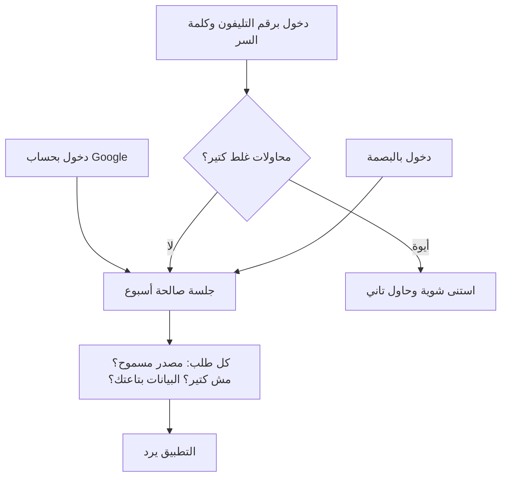

# الحسابات وتسجيل الدخول والأمان

> الصفحة دي بتشرح من غير كود إزاي بتدخل التطبيق، وإزاي بيفضل فاكرك، وإزاي بيحمي حسابك وبياناتك. الشرح الهندسي
> بالتفصيل في [الصفحة الإنجليزي](../../systems/accounts.md)، والرسومات المتولّدة من الكود في
> [صفحة الحقائق](../../atlas/systems/accounts.md).

## النظام ده بيعمل إيه
- **طرق الدخول**: بحساب Google، أو برقم التليفون وكلمة سر، أو بالبصمة (passkey) بعد ما تسجلها.
- **بيفضل فاكرك**: بعد الدخول بتفضل داخل لمدة أسبوع، أو لحد ما تسجل خروج.
- **قفل التطبيق**: تقدر تقفل التطبيق على موبايلك ببصمة أو رقم سري من 4 أرقام.
- **الحماية**: كل طلب بيوصل للسيرفر بيعدي على فحوصات قبل ما يتنفذ.
- **مسح الحساب**: لما حساب يتمسح، كل بياناته بتتمسح معاه، ومنها سجل مكالماته الصوتية ودقايقها.

## في صورة واحدة

## ليه كده؟
- **كلمة السر مابتتحفظش زي ما هي**: بتتحفظ بصمة مشفرة منها، ومحدش يقدر يرجعها.
- **الجلسة ممكن تتلغي في أي وقت**: السيرفر بيحفظ كل جلسة، فلما تسجل خروج بتتلغي فوراً.
- **المحاولات الغلط ليها حد**: لو حد جرّب كلمات سر كتير على رقم معين أو من نفس الشبكة، بيستنى وقت بيزيد مع كل مرة.
- **بياناتك بتاعتك بس**: لو طلب حاول يوصل لمحفظة أو شخص أو هدف مش بتوعك، بيترفض.

## طرق الدخول
- **Google**: بتدوس «المتابعة باستخدام Google»، وبعد ما Google يوافق بترجع للتطبيق وإنت داخل. أول مرة بيتعمل لك حساب
  لوحده.
- **رقم التليفون**: رقم مصري بيبدأ بـ010 أو 011 أو 012 أو 015، وكلمة سر 6 حروف على الأقل، وكود دعوة لو معاك.
- **البصمة (passkey)**: بتسجلها من الإعدادات وإنت داخل، وبعد كده تدخل بيها من شاشة الدخول من غير كلمة سر.
- حساب Google وحساب رقم التليفون بتوع نفس الشخص بيتعاملوا كحسابين منفصلين.

## توثيق الرقم بالواتساب
الفكرة إن التطبيق يديك كود، وإنت تبعته من نفس رقمك للبوت على الواتساب، فالتطبيق يتأكد إن الرقم بتاعك فعلاً ويكمل
التسجيل. الأدمن بيقرر التوثيق ده شغال ولا لا.
- الكود بيظهر لك على الشاشة ومعاه زرار يفتح الواتساب والرسالة جاهزة. الإثبات هو إن الرسالة جاية من رقمك، مش الكود نفسه.
- لو الرسالة جت من رقم تاني، التوثيق بيترفض والشاشة بتقولك كده من غير ما تعرض أي رقم. ولو رقم بعت أكواد مش بتاعته 3
  مرات، البوت بيتجاهله ربع ساعة.
- الصفحة اللي طلبت الكود بس هي اللي تقدر تكمّل التسجيل، ومرة واحدة. فلو حد تاني عرف رقمك أو الكود، مايقدرش يعمل حساب
  برقمك ولا يدخل على حسابك.
- التوثيق شغال حتى لو التطبيق شغال على أكتر من سيرفر، لأنه متسجل في قاعدة البيانات مش في ذاكرة سيرفر واحد.
- قبل ما الكود يطلع، في اختبار «أنا مش روبوت» من Cloudflare. على السيرفر الحقيقي لازم المفتاحين بتوعه يكونوا متظبطين.

## قفل التطبيق
من الإعدادات تقدر تشغّل قفل على الجهاز: التطبيق يطلب البصمة أو رقم سري من 4 أرقام لما تفتحه. ده بيخبي التطبيق عن
حد ماسك موبايلك، لكنه مش بيسجل خروجك من السيرفر.

## الحماية في الخلفية
- الطلبات اللي جاية من مواقع غريبة بتترفض.
- لكل شبكة ولكل مستخدم عدد طلبات في الدقيقة.
- صور الإيصالات لازم تكون صور حقيقية (JPEG أو PNG أو WebP).
- أرقام الكروت والتليفونات والأسامي بتتشال من رسايل البنك قبل ما تتحفظ أو تروح لموديل ذكاء اصطناعي.
- لما الأدمن يعرض المستخدمين، كلمات السر والجلسات مابتظهرش أبداً.
- أكواد التوثيق والتوكنز مابتتكتبش في سجل السيرفر، ورقم التليفون بيظهر فيه آخر 4 أرقام بس.

## حاجات مهم تعرفها
دي مشاكل موجودة فعلاً في الكود النهارده (الشرح الدقيق لكل واحدة في الصفحة الإنجليزي):
1. **ناقص.** **لما توثيق الواتساب مقفول**، أي حد يقدر يسجل بأي رقم من غير ما يثبت إنه بتاعه، ولوحة الأدمن بتعرضه مقفول دايماً.
2. **ناقص.** **على السيرفر الحقيقي التوثيق محتاج مفتاحين من Cloudflare**، واحد على السيرفر وواحد في نسخة التطبيق. لو التوثيق
   شغال وواحد منهم ناقص، محدش هيقدر يسجل برقم تليفون.
3. **عطل.** **كود تغيير رقم التليفون** لسه متحفظ في ذاكرة سيرفر واحد، فلو عندك أكتر من سيرفر ممكن التأكيد يفشل.
4. **عطل.** **تغيير الاسم أو الصورة من الإعدادات مابيتحفظش**، ومن غير رسالة خطأ، وتغيير رقم التليفون مالوش شاشة.
5. **ناقص.** **مفيش طريقة تمسح بصمة سجلتها**، ولا تشوف الأجهزة الداخلة على حسابك وتخرجها، ولا تمسح حسابك بنفسك (الأدمن بس).
6. **أمن.** **رقم قفل التطبيق** محفوظ على الموبايل بحماية بسيطة؛ هو قفل للراحة مش حماية قوية.

## لو عايز تطلب تعديل
قول للـagent يقرا `docs/systems/accounts.md` الأول. أمثلة لطلبات واضحة:
- «عايز التوثيق بالواتساب يشتغل على السيرفر الحقيقي»: محتاج مفتاحين Turnstile من Cloudflare، وبعدها تفعّل التوثيق من الإعدادات.
- «عايز شاشة أشوف فيها الأجهزة الداخلة على حسابي وأخرجها»: السيرفر جاهز بجزء منها، ناقص الشاشة.
- «عايز المستخدم يقدر يمسح حسابه بنفسه»: المسح الكامل موجود، ناقص زرار ليه وتأكيد.
- «صلّح حفظ الاسم في الإعدادات»: ده إصلاح المشكلة الرابعة.

## كلمات بتتكرر
| الكلمة | معناها |
| --- | --- |
| جلسة (session) | إذن الدخول اللي بيخليك داخل من غير ما تكتب كلمة السر كل مرة |
| البصمة (passkey) | طريقة دخول بتستخدم بصمة أو وش أو قفل الموبايل بدل كلمة السر |
| توثيق الرقم | إثبات إن رقم التليفون بتاعك عن طريق الواتساب |
| Turnstile | اختبار «أنا مش روبوت» من Cloudflare |
| قفل التطبيق | شاشة بتطلب البصمة أو رقم سري لما تفتح التطبيق على جهازك |
| مسح الحساب | حذف الحساب وكل بياناته نهائياً |
