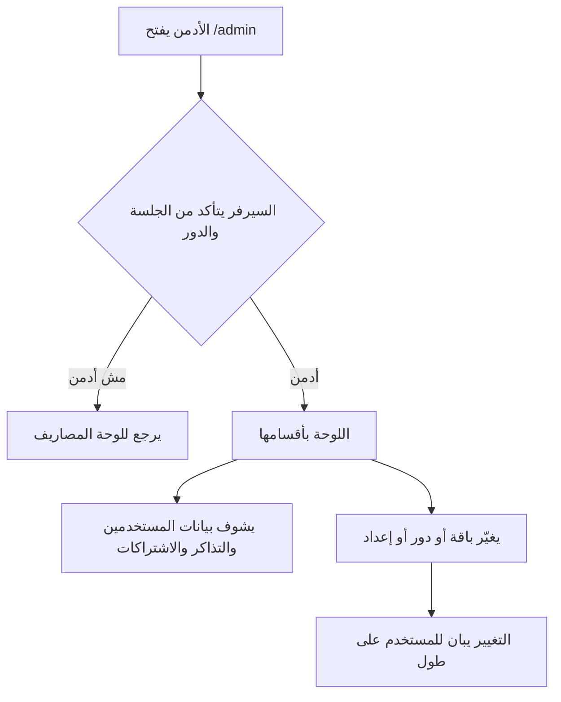

# لوحة التحكم والدعم وأدوات النمو

> الصفحة دي بتشرح من غير كود لوحة التحكم اللي بيستخدمها الأدمن، وصفحة الدعم اللي بيستخدمها المستخدم،
> والإعلانات، وبيانات محركات البحث. الشرح الهندسي بالتفصيل في [الصفحة الإنجليزي](../../systems/admin.md)،
> والرسومات المتولّدة من الكود في [صفحة الحقائق](../../atlas/systems/admin.md).

## النظام ده بيعمل إيه
- **لوحة التحكم**: صفحة للأدمن بس، فيها كل حاجة عن التطبيق: المستخدمين، والدعم، والاشتراكات، والذكاء الاصطناعي،
  والواتساب، والإعلانات، والإشعارات، والإعدادات.
- **الدعم**: المستخدم يفتح تذكرة من صفحة الدعم، والأدمن يرد عليها من اللوحة.
- **الإعلانات**: الأدمن يعمل حملة، والتطبيق يعرضها للمستخدمين حسب باقتهم.
- **محركات البحث**: عنوان ووصف لكل صفحة عامة.

## في صورة واحدة

## مين يقدر يدخل
- اللوحة للي دوره «أدمن» بس. الزائر اللي مش مسجل بيروح لصفحة الدخول، وأي مستخدم عادي بيرجع للوحة المصاريف.
- مش بس الصفحة: السيرفر نفسه بيرفض أي طلب إداري جاي من غير أدمن، حتى لو حد عدّل التطبيق على جهازه.
- في اختبارات بتتأكد من ده: مستخدم بباقة غالية بيترفض، وأدمن اتشال دوره بيترفض في نفس اللحظة، والردود
  مابيطلعش فيها كلمات سر ولا مفاتيح دخول.
- دور «مشرف» (moderator) موجود بالاسم بس، ومالوش أي صلاحية؛ المشرف بيوصل لتذاكره هو بس.

## أقسام اللوحة
| القسم | فيه إيه |
| --- | --- |
| نظرة عامة | عدد المستخدمين والمشتركين والجلسات والتذاكر المفتوحة، وحجم الفلوس وتدفقات اليوم، والمستخدمين النشطين يومياً وأسبوعياً |
| المستخدمون | بحث وفلترة، تغيير الدور أو الباقة، عرض الملف الذكي والجلسات وإلغاء جلسة، مسح حساب، تصدير الكل، وإرسال رسالة لمستخدم |
| الدعم | التذاكر والرد عليها وقفلها |
| الذكاء الاصطناعي | أخطاء المفاتيح، وجودة التصنيف في آخر 7 أو 30 أو 90 يوم جنب الفترة اللي قبلها (كام اتحفظ لوحده، و«الغلط الساكت» يعني كام من اللي اتحفظ لوحده المستخدم رجع غيّره، والمراجعة والأسئلة والـ AI والوقت)، وتكلفة الاستهلاك في الشهر الحالي، والمزودين وموديلاتهم وأسعارهم، واستهلاك مستخدم معين مقارنةً بالحد الحقيقي بتاعه، ومعمل تجربة التصنيف |
| الاشتراكات | آخر الاشتراكات وحالتها |
| التوضيحات المعلقة | الجمل اللي التصنيف ماعرفش يحسمها |
| واتساب | ربط الرقم والرسايل |
| الحملات الإعلانية | الحملات والاستهداف والنتايج |
| القاموس والقواعد | الكلمات اللي المستخدمين علموها للتصنيف |
| سجل SMS | رسايل البنوك زي ما وصلت |
| سجل الرقابة | آخر الجلسات، ومنه تقدر تلغي جلسة |
| الإشعارات | القوالب وسجل الإرسال وتشغيل الفحص اليومي فوراً |
| الحدود والإعدادات | تبويب لكل باقة (المجانية وPro وUltra) فيه كل حدودها ومفاتيح تشغيل مميزاتها (منها عدد رسايل البنك اللي بتتسجل لوحدها في الشهر، واللي بعدها بتستنى المستخدم يأكدها)، وحدود الشات والمكالمة لكل باقة، وقسم المكالمة الجديدة (مين ياخدها ونسبة الطرح وزرار إيقافها، وموديلاتها، وسقف تكلفتها، ولوحة بأرقام المكالمات من غير أي كلام اتقال)، ومفاتيح الخدمات مع اختبارها، وأكواد الخصم |

## ليه كده؟
- **المفاتيح السرية مابتظهرش**: بتتعرض بآخر 4 حروف بس، ولو حفظت أي إعداد تاني المفتاح مابيتمسحش.
- **تغيير الدور أو الباقة أو إلغاء الجلسة بيبان فوراً**: كل العمليات دي بتعدي من مكان واحد في الكود بيمسح
  النسخة المحفوظة من الجلسة في نفس اللحظة، فمفيش «ربع ساعة» حد يفضل فيها داخل بعد ما تطرده.
- **ردود اللوحة مافيهاش كلمات سر ولا مفاتيح دخول**: السيرفر بيختار البيانات اللي تطلع بالظبط.
- **اختبار المفتاح بيبقى بأرخص طريقة**: السيرفر بيسأل المزود عن قايمة موديلاته، فيتأكد إن المفتاح شغال ويجيب
  الموديلات المتاحة في نفس الوقت.
- **كارت كل مزود بيقول حالة مفتاحه**: متشفّر بأنهي سر، وبالأحمر لو مش بيتفك خالص. وزرار «تغيير المفتاح» بيحفظ مفتاح
  جديد من غير ما تمسح المزود وموديلاته. والنقطة جنب الاسم بتبقى رمادي لحد ما المزود يتجرب، وحمرا لو المفتاح مش
  بيتفك أو المزود واقع.
- **الموديلات**: لما تفحص مزود بتظهر كل موديلاته وتقدر تدوّر فيها، وبيتحفظ بس اللي تعلّم عليه. ولكل موديل زرار «تعديل»
  تحدد منه بيستخدم في إيه (التصنيف، الشات، التقارير، البحث بالمعنى)، ولأنهي باقات، وهل هو الافتراضي، وشغال ولا لأ،
  وسعره لكل مليون توكن، وفيه زرار يحط سعر المزود المنشور لو معروف. السعر ده هو اللي سجل التكلفة بيحسب بيه.

## حاجات مهم تعرفها
دي مشاكل موجودة فعلاً في الكود النهارده (الشرح الدقيق لكل واحدة في الصفحة الإنجليزي):
1. **ناقص.** **مفيش سجل بأفعال الأدمن**: مين غيّر دور أو باقة أو إعداد أو مسح حساب مش متسجل في أي مكان، و«سجل الرقابة»
   مجرد قايمة جلسات.
2. **دين تقني.** **تغيير الإعدادات** ممكن ياخد لحد 5 دقايق عشان يوصل لكل السيرفرات.
3. **دين تقني.** **قسم الذكاء الاصطناعي بيطلب بيانات ومابيعرضهاش**: سجل التصنيف والصوت والتكلفة التفصيلية بتتحمّل وماحدش
   بيشوفها. (جودة التصنيف نفسها بقت ظاهرة في كارت «جودة التصنيف».)
4. **ناقص.** **زرار «النسخة الاحتياطية»** بينزل الإعدادات وشوية بيانات بس، مش نسخة من قاعدة البيانات.
5. **ناقص.** **لما الأدمن يرد على تذكرة** المستخدم مابيوصلوش إشعار، مع إن صفحة الدعم بتوعد برد خلال يوم.
6. **ناقص.** **بيانات محركات البحث**: خريطة الموقع مش متاحة لأي محرك بحث أصلاً، ومفيش شاشة لتعديل عناوين الصفحات.
7. **عطل.** **عداد مشاهدات الإعلانات مافيش حاجة بتزوّده**، فنسبة النقر في القسم بتفضل صفر.
8. **ناقص.** **في عمليات موجودة في السيرفر من غير شاشة**، زي إرسال إشعار يدوي، أو تحديد حد استهلاك لمستخدم معين، أو
   تعيين تذكرة لمشرف.
9. **عطل.** **أكواد الخصم بتتعمل من اللوحة** بس مابتتطبقش في الدفع، وقسم الواتساب دايماً بيقول إن التوثيق مقفول.
10. **عطل.** **أرقام المستخدمين النشطين** محسوبة بتوقيت السيرفر مش القاهرة، و«ترقيات Pro» مابتحسبش الترقية لـUltra.

## لو عايز تطلب تعديل
قول للـagent يقرا `docs/systems/admin.md` الأول. أمثلة لطلبات واضحة:
- «عايز سجل بكل حاجة الأدمن بيعملها»: ده جدول جديد وتسجيل مع كل عملية مهمة.
- «خلّي إلغاء الجلسة يقفلها فوراً»: ده إصلاح المشكلة الأولى.
- «ابعت إشعار للمستخدم لما الدعم يرد عليه»: ده ربط بين الدعم والإشعارات.
- «وصّل شاشة أرقام التصنيف في قسم الذكاء الاصطناعي»: ده إصلاح المشكلة الخامسة.

## كلمات بتتكرر
| الكلمة | معناها |
| --- | --- |
| الأدمن | صاحب صلاحية لوحة التحكم |
| الدور والباقة | الدور صلاحية (مستخدم/مشرف/أدمن)، والباقة اشتراك (مجاني/Pro/Ultra) |
| التذكرة | طلب دعم من مستخدم |
| الجلسة | دخول شغال لمستخدم على جهاز |
| المزود | شركة ذكاء اصطناعي بيستخدمها التطبيق، ومعاها مفتاح سري |
| القاعدة المتعلمة | كلمة المستخدم علّمها للتصنيف |
| SEO | البيانات اللي بتساعد محركات البحث تفهم صفحات الموقع |
