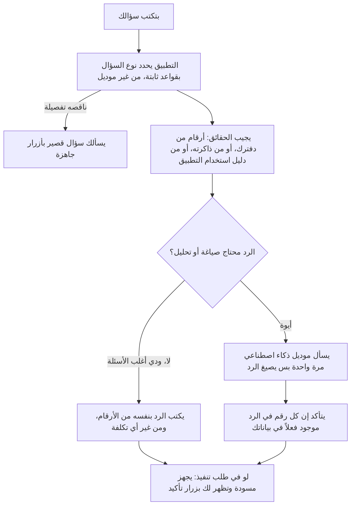

# مركز الذكاء الاصطناعي

> الصفحة دي بتشرح من غير كود إزاي المساعد اللي بتكلمه في مركز الذكاء الاصطناعي بيفهمك ويرد عليك. الشرح الهندسي
> بالتفصيل في [الصفحة الإنجليزي](../../systems/ai-center.md)، والرسومات المتولّدة من الكود في
> [صفحة الحقائق](../../atlas/systems/ai-center.md).

## النظام ده بيعمل إيه
مركز الذكاء الاصطناعي فيه تلات تبويبات: **الشات**، و**المكالمة الصوتية** (ليها صفحة لوحدها؛ من تبويبها بتختار
الصوت وتبدأ)، و**التحليل الشهري** (ليه صفحة لوحده). و«ذاكرة سمارت» بتعرض كمان ملخصات المكالمات والخطط والاتفاقات، وبتتفتح من آخر المكالمة كمان. الصفحة دي عن الشات. بتسأله «صرفت كام على الأكل الشهر ده؟» أو «ليه مصاريفي زادت؟» أو «اعملي هدف
أحوش 20 ألف في 6 شهور»، وهو يرد من بيانات دفترك الحقيقية، ويفتكر اللي قلته قبل كده، ويجهز لك إجراءات تنفذها بضغطة
تأكيد.

## الرحلة في صورة واحدة

## ليه كده؟
- **أغلب الأسئلة مالهاش تكلفة**: «صرفت كام النهارده؟» التطبيق بيحسبها من دفترك ويكتب الرد بنفسه.
- **الشات مابيقفش لو مزود وقع**: الموديل بييجي من اللي الأدمن حدده للشات في لوحة المزودين، وبعده الإعدادات القديمة،
  وبعدهم جيميناي من جوجل. لو واحد فشل (حساب موقوف أو حصة خلصت) بيجرب اللي بعده.
- **الموديل ممنوع يخترع أرقام**: لو استُخدم، أي رقم في رده مش موجود في بياناتك بيتشال الرد كله، ويتحط مكانه رد
  آمن فيه الأرقام المؤكدة بس.
- **مفيش حاجة بتتنفذ من غير موافقتك**: الهدف أو المصروف أو الميزانية بتظهر كمسودة، ومابتتسجلش غير لما تدوس «تأكيد» أو
  تكتب «موافق».
- **العمليات اللي مابترجعش محتاجة تكتبها بإيدك**: إيقاف هدف أو التراجع عن عملية مابيكفيهمش «تأكيد» ولا «تمام»؛ لازم تكتب
  «أوقف الهدف» أو «تراجع عن العملية»، والسيرفر نفسه بيتأكد منها قبل ما ينفذ.

## بيقدر يعمل إيه
| نوع الطلب | مثال |
| --- | --- |
| أرقام | «صرفت كام النهارده؟»، «فاضل كام في محافظي؟»، «صرفت كام على أحمد الشهر ده؟» |
| تحليل | «قارن الشهر ده بالشهر اللي فات وقولي ليه زاد»، «إيه أعلى الفئات؟» |
| أهداف | «وصلت فين في أهدافي؟»، «اعملي هدف أحوش 10 آلاف» |
| تنفيذ بعد تأكيد | تسجيل مصروف، تعديل تصنيف عملية، ميزانية، محفظة، تعديل أو إيقاف هدف، تراجع عن آخر إجراء |
| ذاكرة | «فاكر اتفقنا على إيه في موضوع العربية؟» |
| استخدام التطبيق | «أربط رسايل البنك إزاي؟»، «أعمل هدف ادخار إزاي؟» |
| رسومات | «اعمللي رسم لمصاريفي» |

## الذاكرة
- بعد كل رسالة المساعد بيحفظ ملخص قصير للمحادثة، ويلقط من كلامك الحاجات المهمة: اللي بتحبه ومابتحبوش، والشروط اللي
  حطيتها (زي «متنفذش حاجة غير لما أأكد» أو حد للميزانية)، واهتمامك بربط الكارت أو رسايل البنك، والخطة اللي وافقت
  عليها.
- لما تسأله عن حاجة قديمة، بيدور في الملخصات والحاجات المحفوظة والإجراءات اللي اتنفذت، بالكلمات وكمان بالمعنى: كل حاجة
  بتتحفظ بيتعملها «بصمة معنى» بموديل جوجل (أو المزود اللي الأدمن يحدده)، فسؤال زي «بحوّش عشان إيه؟» يلاقي «هدفي
  أشتري عربية» حتى لو الكلمات مختلفة. والذكريات القديمة بتاخد بصمتها على دفعات صغيرة كل تلت ساعة.
- تقدر تشوف كل اللي فاكره عنك، وتمسح حاجة معينة أو تمسح كله، من شاشة الذاكرة جوه الشات. والمسح بيمسحها فعلاً من
  قاعدة البيانات، مش بيخبيها بس.
- لما تمسح محادثة، الحاجات اللي المساعد افتكرها منها بتفضل موجودة لحد ما تمسحها من شاشة الذاكرة.
- لو حفظ الذاكرة أو تجهيز إجراء فشل، سجل السيرفر بيكتب الخطأ من غير كلامك.

## الحدود
- لكل باقة عدد رسايل في اليوم بتوقيت القاهرة، والأدمن بيحدده. الشات كمان ممكن يتقفل لباقة معينة.
- لو الأدمن قفل المساعد من الإعدادات، كل رسالة بيتردّ عليها برسالة إنه متوقف.
- المسودة بتفضل مستنياك فترة محدودة، وبعدها بتنتهي.
- «النهارده» و«امبارح» و«الشهر ده» بتوقيت القاهرة دايماً، حتى لو السيرفر شغال بتوقيت تاني. يعني الساعة واحدة بالليل
  «النهارده» هو اليوم الجديد.
- **التصنيف بيتفهم بكلامك**: «الأكل» أو «المطاعم» أو «الدليفري» كلهم بيجيبوا مصاريف الأكل، و«الدخل» بيجيب كل أنواع الدخل (مرتب وعمل حر وغيرهم). والكلمة اللي التطبيق
  مايعرفهاش مابتتحسبش على المصاريف غير المصنفة.
- **إجمالي أي فترة مظبوط مهما كان عدد عملياتك**: قاعدة البيانات بتجمعه بنفسها في طلب واحد. والأرقام بتطابق اللي في
  الرئيسية، لأنها بتحسب مصاريفك الشخصية بس زيها؛ مصاريف أي بيزنس ليك بتفضل في حساب البيزنس.
- **الأرقام اللي اتحسبت قريب بتتجاب من ذاكرة سريعة (Redis)**، ولما تسجل أو تعدل حاجة بتتمسح فوراً فمابتشوفش رقم قديم.

## الصرف في الشات زي الصفحة الرئيسية
الشات بيحسب «الصرف» زي الصفحة الرئيسية بالظبط: المصروف بس، من غير التحويلات (الجمعية والسلف والسحب من الـATM)
ولا الاستثمار. وكل عملية بتتحسب في الفئة اللي اتحفظت بيها، مش في فئة يخمّنها من وصفها.

## حاجات مهم تعرفها
دي مشاكل موجودة فعلاً في الكود النهارده (الشرح الدقيق لكل واحدة في الصفحة الإنجليزي):
1. **عطل.** **لما المساعد يسألك سؤال توضيحي وترد**، ردك بيتفهم كأنه سؤال جديد، مش كإجابة على سؤاله.
2. **ناقص.** **الشات مابيتأكدش من ميزانية الذكاء الاصطناعي** قبل ما يستخدم الموديل؛ الحد الوحيد هو عدد الرسايل في اليوم.
3. **ناقص.** **تكلفة بصمات المعنى** مش بتتسجل في سجل التكلفة، لأن المزودين مابيقولوش عدد التوكنز (وهي مجانية في باقة
   جوجل المجانية).
4. **عطل.** **«تراجع» مابيلغيش مصروف أو ميزانية المساعد سجلها**؛ بيلغي بس الأهداف والمحافظ وتعديل التصنيف وتعديل الملف الشخصي.
5. **عطل.** **لو حصل عطل في المساعد**، الرسالة اللي بتظهر بتقول إنه متوقف من الإعدادات، حتى لو محدش قفله.
6. **ناقص.** **التوزيع والبحث في فترة فيها أكتر من 10,000 عملية** بيقروا أحدث 10,000 بس؛ المكالمة والشات بيقولوا كده في التوزيع وإجمالي التصنيف؛ الإجمالي بس اللي
   بيفضل مظبوط مهما كان العدد.

## لو عايز تطلب تعديل
قول للـagent يقرا `docs/systems/ai-center.md` الأول. أمثلة لطلبات واضحة:
- «المساعد مش بيفهم سؤال زي كذا»: ده تعديل في قواعد تحديد نوع السؤال.
- «عايز المساعد يجاوب على نوع سؤال جديد من البيانات»: ده بيحتاج حقيقة جديدة من الدفتر ورد مكتوب ليها.
- «خلّي رد المساعد على السؤال التوضيحي يكمّل الطلب الأصلي»: ده إصلاح المشكلة الأولى.
- «خلّي تراجع يلغي المصروف اللي المساعد سجله»: ده إصلاح المشكلة الخامسة.
- «زود عدد رسايل الشات للباقة المجانية»: ده من إعدادات الأدمن من غير كود.

## كلمات بتتكرر
| الكلمة | معناها |
| --- | --- |
| kernel (العقل المخطط) | الجزء اللي بيقرر نوع السؤال ومحتاج إيه وهل يستخدم موديل ولا لا |
| حقيقة (fact) | رقم أو معلومة جاية من بياناتك أو من الذاكرة أو من دليل التطبيق |
| مسودة إجراء | طلب تنفيذ متجهز ومستني موافقتك |
| الذاكرة | ملخصات محادثاتك والحاجات المهمة اللي قلتها |
| الموديل | خدمة ذكاء اصطناعي خارجية بتدفع عليها، والشات بيستخدمها مرة واحدة بالكتير في الرسالة |
| artifact | بطاقة بتظهر تحت الرد: جدول أو رسم أو زرار تأكيد أو اختيارات سريعة |
