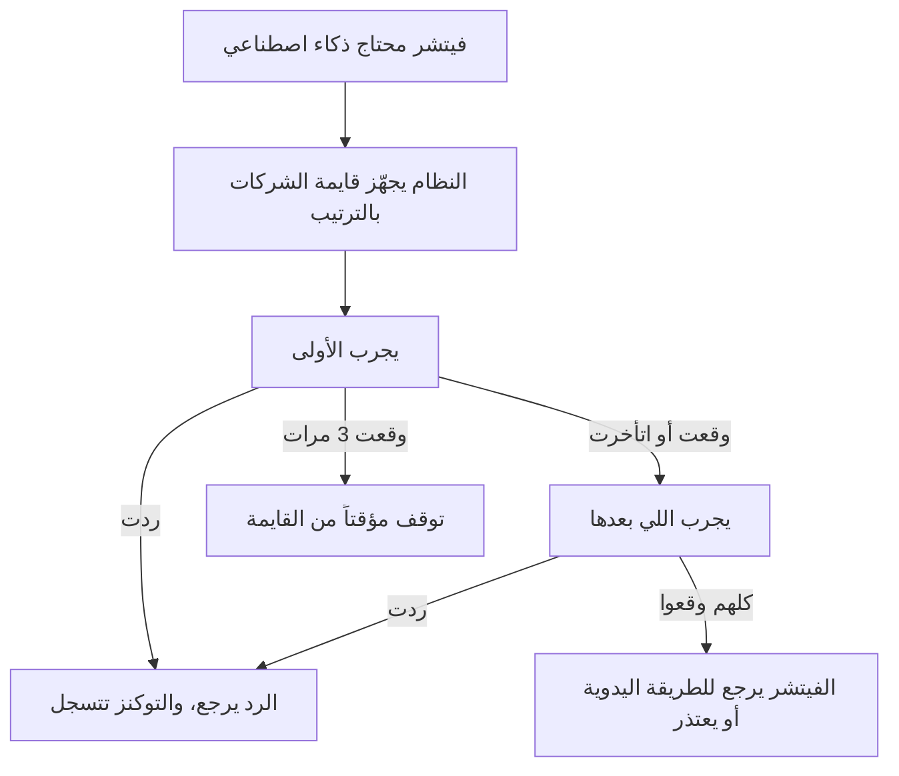

# مزودي الذكاء الاصطناعي وحدود الاستهلاك

> الصفحة دي بتشرح من غير كود إزاي التطبيق بيختار شركة الذكاء الاصطناعي اللي هترد على كل طلب، وإيه اللي بيحصل
> لما واحدة تقع، وإزاي بيتحسب استهلاكك. الشرح الهندسي بالتفصيل في [الصفحة الإنجليزي](../../systems/ai-platform.md)،
> والرسومات المتولّدة من الكود في [صفحة الحقائق](../../atlas/systems/ai-platform.md).

## النظام ده بيعمل إيه
التطبيق مابيعتمدش على شركة ذكاء اصطناعي واحدة. في قايمة شركات (Google Gemini وGroq وFireworks وNVIDIA
وDeepSeek وOpenRouter)، ولكل واحدة مفتاح وموديلات. النظام ده مسؤول عن:
- **يختار** مين يرد على الطلب ده حسب نوع الشغل (تصنيف، شات، تقرير، صوت) وباقة المستخدم.
- **يجرب غيرها** لو الأولى وقعت أو رفضت أو اتأخرت.
- **يوقف السؤال** لشركة واقعة مؤقتاً، بدل ما كل طلب يستنى عليها.
- **يحسب** كام توكن اتصرف، ويمنع الطلب لو حد الباقة خلص.

## في صورة واحدة

## ليه كده؟
- **مفيش نقطة انهيار واحدة**: زمان لو Gemini رفض الطلب، اللي كتب جملة طويلة كان بيخسرها، رغم إن في مفاتيح
  لشركات تانية موجودة في نفس الطلب.
- **الشركة الواقعة بتتشال بسرعة**: لو مفتاح غلط، النظام بيبطل يسأل الشركة دي 10 دقايق بدل ما يضيع وقت كل طلب.
- **إضافة شركة جديدة من غير مبرمج**: الأدمن بيضيف صف ومفتاح من اللوحة، لأن كل الشركات بتتكلم نفس اللغة تقريباً.
- **الحد الشهري بيتحسب قبل الطلب**: عشان مايحصلش إن حد يستهلك أضعاف باقته.

## مفاتيح الشركات
- المفاتيح اللي الأدمن بيحطها في اللوحة بتتحفظ متشفّرة بسر مخصوص على السيرفر اسمه `AI_GATEWAY_SECRET`. لو السر ده مش
  متحط، بتتشفّر بسر الجلسات `JWT_SECRET`، ويبقى تغييره خطر عليها.
- أول ما تحط `AI_GATEWAY_SECRET` وتشغّل السيرفر، كل المفاتيح القديمة بتتنقل له لوحدها، من غير ما حد يدخلها تاني. بعدها
  تقدر تغيّر `JWT_SECRET` بأمان.
- ولو عايز تغيّر `AI_GATEWAY_SECRET` نفسه بعدين: السر القديم يتحط في `AI_GATEWAY_SECRET_PREVIOUS` والجديد مكانه،
  والمفاتيح بتتنقل لوحدها، وبعدها تشيل القديم.
- كارت كل شركة في اللوحة بيقولك مفتاحها متشفّر بأنهي سر. ولو مفتاح مش بيتفك بأي سر، الكارت بيقول كده بالأحمر،
  والشركة بتطلع من الترتيب، وتقدر تدخل المفتاح تاني من زرار «تغيير المفتاح» من غير ما تمسح الشركة وموديلاتها.

## الحدود
- **حد شهري لكل باقة** (مثلاً المجاني 50 ألف توكن، والـPro 500 ألف، والألترا 2 مليون)، والأدمن يقدر يغيرها،
  ويقدر يحط حد مخصوص لشخص معين.
- **حد لكل طلب**: أطول رد مسموح بيه، وفوقه سقف ثابت في الكود مايتعداش.
- **حد السرعة**: لو حد بعت طلبات كتير في دقيقة واحدة، بيتقاله استنى شوية.
- **التوكن** ببساطة هو وحدة قياس الكلام؛ الكلام العربي بياخد توكنز أكتر من الإنجليزي في نفس عدد الحروف.

## حاجات مهم تعرفها
دي مشاكل موجودة فعلاً في الكود النهارده (الشرح الدقيق لكل واحدة في الصفحة الإنجليزي):
1. **عطل.** **التكلفة المعروضة في اللوحة تقديرية**: بتتحسب بسعر ثابت مكتوب في الكود، مش بسعر الموديل الحقيقي ولا بسعر
   الدولار اللي في الإعدادات.
2. **عطل.** **مش كل الاستهلاك بيوصل لنفس المكان**: شات الذكاء الاصطناعي والمكالمات الصوتية بتتسجل في مكان تاني غير
   الجدول اللي اللوحة بتعرض منه، فالأرقام اللي قدام الأدمن أقل من الحقيقة.
3. **دين تقني.** **في قايمة موديلات مكتوبة بإيد** جوه الكود ومحدش بيقراها، وأسماء الموديلات الافتراضية مكررة في أكتر من مكان.
4. **عطل.** **الطريقة القديمة لسه شغالة**: أغلب الطلبات بتختار الشركة من الإعدادات القديمة مش من الشركات اللي الأدمن
   ضايفها في اللوحة، ومستخدم الألترا بيتعامل بإعدادات الـPro.
5. **دين تقني.** **كل سيرفر بيتعلم لوحده**: لو عندك أكتر من سيرفر، كل واحد بيكتشف الشركة الواقعة لوحده، وتغيير الإعدادات
   بيوصلهم في أوقات مختلفة.
6. **عطل.** **بداية الشهر في حساب الحدود** بتوقيت السيرفر مش القاهرة.

## لو عايز تطلب تعديل
قول للـagent يقرا `docs/systems/ai-platform.md` الأول. أمثلة لطلبات واضحة:
- «عايز أضيف شركة ذكاء اصطناعي جديدة»: غالباً صف ومفتاح من اللوحة من غير كود.
- «خلّي التكلفة المعروضة حقيقية»: ده ربط السعر المكتوب لكل موديل بحساب التكلفة.
- «عايز الألترا يبقى ليه مسار خاص»: ده تعديل في اختيار المسار حسب الباقة.

## كلمات بتتكرر
| الكلمة | معناها |
| --- | --- |
| المزود | شركة الذكاء الاصطناعي اللي بتستقبل الطلب وترد |
| الموديل | نسخة معينة من الذكاء الاصطناعي عند المزود، وليها سعر وسرعة |
| التوكن | وحدة قياس الكلام اللي بيتحسب بيها الاستهلاك |
| المسار (route) | مزود + موديل + مفتاح، مع بعض |
| السلسلة (chain) | ترتيب المسارات اللي هيتجربوا واحد ورا التاني |
| قاطع الدائرة | إيقاف مؤقت لمزود بيفشل، عشان مايضيعش وقت كل طلب |
| الحد الشهري | أقصى توكنز مسموحة للمستخدم في الشهر حسب باقته |
| `AI_GATEWAY_SECRET` | السر اللي بيتشفّر بيه مفاتيح الشركات على السيرفر |
