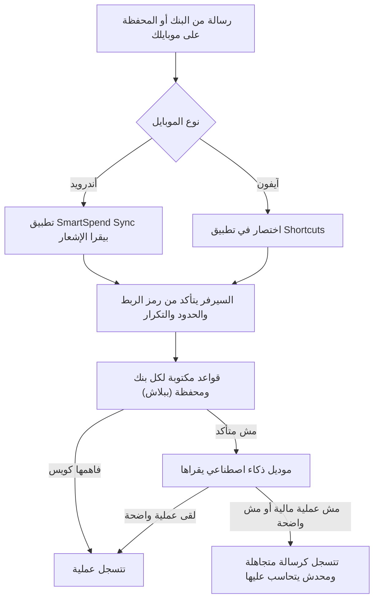

# رسائل البنوك والمحافظ

> الصفحة دي بتشرح من غير كود إزاي رسالة البنك أو المحفظة اللي بتوصلك على الموبايل بتتسجل عملية في التطبيق لوحدها.
> الشرح الهندسي بالتفصيل في [الصفحة الإنجليزي](../../systems/bank-messages.md)، والرسومات المتولّدة من الكود في
> [صفحة الحقائق](../../atlas/systems/bank-messages.md).

## النظام ده بيعمل إيه
بدل ما تكتب كل مرة دفعت فيها بالكارت أو حوّلت على InstaPay أو فودافون كاش، الرسالة اللي البنك أو المحفظة بيبعتهالك
بتوصل للتطبيق، والتطبيق يفهم منها المبلغ واتجاهه (داخل ولا خارج) ونوعه، ويسجلها.

## الرحلة في صورة واحدة

## الأندرويد
- بتنزّل تطبيق صغير اسمه SmartSpend Sync، وتدوس «ربط» في الموقع، فالتطبيق ياخد رمز الربط بتاعك لوحده من غير نسخ ولصق.
- التطبيق بيقرا **الإشعارات** بس، مش صندوق الرسايل.
- بيتجاهل واتساب وتليجرام والشات، وبيتجاهل الرسايل اللي من أرقام موبايل عادية، وأكواد التحقق (OTP)، والإعلانات اللي
  مافيهاش أرقام.
- بيبعت بس الإشعارات اللي شكلها عملية مالية: من تطبيق بنك أو محفظة، أو رسالة من بنك فيها كلمة زي «خصم» أو «تحويل».
- لو النت فاصل، الإشعار بيستنى في التطبيق ويتبعت بعدين.

## الآيفون
- الآيفون مابيسمحش لتطبيق يقرا الإشعارات، فبنستخدم تطبيق Shortcuts بتاع أبل.
- الموقع بينسخلك عنوان فيه رمز الربط، وبيفتح اختصار جاهز تلزق فيه العنوان.
- بتعمل «أتمتة» في Shortcuts: أي رسالة فيها كلمة معينة (زي EGP) تشغّل الاختصار، فالرسالة تتبعت للتطبيق.
- في نفس الشاشة بتشوف آخر الرسايل اللي وصلت واتسجلت أو اتجاهلت.

## السيرفر بيعمل إيه لما الرسالة توصل
1. **يتأكد من رمز الربط**: الرمز ده زي مفتاح خاص بحسابك. لو اتسرق حد يقدر يبعت رسايل باسمك، فخليه سر. لو عملت رمز
   جديد، القديم بيبطل، ولازم تربط الموبايل تاني.
2. **التكرار**: نفس الرسالة بالظبط لو وصلت تاني خلال 24 ساعة بتترفض، عشان ماتتسجلش مرتين.
3. **الحدود**: مش أكتر من 30 رسالة في الساعة لنفس الرمز، وكل باقة ليها عدد رسايل بتتسجل لوحدها في الشهر (الأدمن
   بيحدده، والمجانية 5 في الأول). **الرسالة اللي بعد الحد مابتضيعش**: بتتحفظ «اقتراح» وتظهرلك في الصفحة الرئيسية
   تحت «رسايل بنك مستنية تأكيدك»، فيها المبلغ والفئة المقترحة، وتقدر تغيّر الفئة وتدوس «احفظ» أو «تجاهل». الاقتراح
   بيتقري بالقواعد بس من غير موديل ذكاء اصطناعي، ولو دوست «احفظ» مرتين بيتسجل مرة واحدة.
4. **الفهم**: القواعد الأول، ولو مش متأكدة يتسأل موديل ذكاء اصطناعي.
5. **التسجيل**: العملية بتتسجل في دفترك، والرسالة الأصلية بتتحفظ ومعاها حالتها. سجل السيرفر بيكتب إن رسالة وصلت
   ولمين بس، من غير نصها ولا مبلغها.

## بتتصنف إزاي
| الرسالة بتقول | بتتسجل كـ |
| --- | --- |
| مرتب نزل | مرتب (دخل) |
| فلوس جاتلك: إيداع أو InstaPay أو محفظة | دخل آخر (دخل)، لأن الرسالة مابتقولش جاية منين |
| حوّلت فلوس لحد | تحويل (مصروف)، وطريقة التحويل (انستاباي، فودافون كاش، بنك) كتفصيلة |
| دفعت بالكارت في محل | فئة المحل لو التطبيق عارفه (UBER مواصلات، Talabat أكل وشرب)، وإلا تسوق، واسم المحل في الوصف |
| دفعت فاتورة | فواتير |
| سحبت من ATM | تحويل/سحب ATM: الفلوس لسه فلوسك، فمابتتحسبش صرف |

## حاجات مهم تعرفها
دي مشاكل موجودة فعلاً في الكود النهارده (الشرح الدقيق لكل واحدة في الصفحة الإنجليزي):
1. **عطل.** **ربط الأندرويد مابيشتغلش** للي عامل حساب برقم الموبايل والباسورد. بيشتغل بس للي داخل بحساب جوجل.
2. **عطل.** **رابط تحميل تطبيق الأندرويد مش شغال** دلوقتي، لأن ملف التطبيق مش موجود على السيرفر.
3. **ناقص.** **قراءة الموديل للرسايل مابتتحسبش في حدود الذكاء الاصطناعي** ولا تكاليفه، ومابتستخدمش المزودين اللي الأدمن
   اختارهم.
4. **ناقص.** **التصنيف لسه بخريطة ثابتة** إلا لمحل التطبيق عارفه كويس: الدفع بالكارت في محل مش معروف بيبقى «تسوق»، والتحويل
   لحد بيتسجل مصروف تحت «تحويل».
5. **دين تقني.** **الرسايل الأصلية بتفضل محفوظة** بنصها لحد ما الحساب يتمسح، مع إن المفروض يتشال القديم منها بجدول ثابت.

## لو عايز تطلب تعديل
قول للـagent يقرا `docs/systems/bank-messages.md` الأول. أمثلة لطلبات واضحة:
- «رسايل بنك كذا مابتتسجلش، دي عينة منها»: ده تعديل في القواعد بتاعة البنوك.
- «عايز الباقة المجانية تسجّل رسايل أكتر لوحدها في الشهر»: ده من إعدادات الأدمن من غير كود.
- «صلّح ربط الأندرويد لحسابات الموبايل»: ده إصلاح في شاشة الربط وفي طريقة التحقق من الجلسة.
- «خلّي قراءة الرسايل بالموديل تتحسب في الحدود والتكلفة»: ده توصيل بنظام مزودي الذكاء الاصطناعي.

## كلمات بتتكرر
| الكلمة | معناها |
| --- | --- |
| رمز الربط (webhook token) | مفتاح سري خاص بحسابك، الموبايل بيبعته مع كل رسالة عشان السيرفر يعرف هي تبع مين |
| notification listener | إذن في الأندرويد بيخلي تطبيق يقرا الإشعارات اللي بتظهر |
| Shortcuts | تطبيق أبل اللي بيعمل خطوات تلقائية على الآيفون |
| القواعد | قوالب مكتوبة لشكل رسايل كل بنك ومحفظة، بتقرا الرسالة ببلاش |
| الموديل | خدمة ذكاء اصطناعي خارجية بتقرا الرسايل اللي القواعد مش متأكدة منها |
| رسالة متجاهلة | رسالة وصلت بس اتقرر إنها مش عملية مالية أو مش واضحة، فماتسجلتش |
