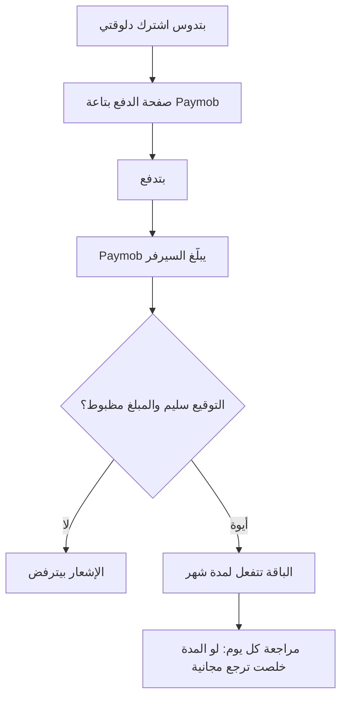

# الباقات والدفع

> الصفحة دي بتشرح من غير كود الباقات (المجانية وPro وUltra)، وإزاي بتدفع وتتفعل الباقة، وإزاي بتنتهي، وأكواد الدعوة.
> الشرح الهندسي بالتفصيل في [الصفحة الإنجليزي](../../systems/billing.md)، والرسومات المتولّدة من الكود في
> [صفحة الحقائق](../../atlas/systems/billing.md).

## النظام ده بيعمل إيه
- **الباقات**: المجانية، وPro بـ99 جنيه في الشهر، وUltra بـ250 جنيه في الشهر (زي ما مكتوب في صفحة الخطط).
- **الدفع**: بتدوس «اشترك دلوقتي» فيوديك لصفحة الدفع بتاعة Paymob، وبعد ما تدفع الباقة بتتفعل لوحدها.
- **المدة**: الاشتراك الشهري بيكمل شهر، ولو جددت قبل ما يخلص المدة بتتزود على اللي فاضل ومبتضيعش.
- **النهاية**: كل يوم الصبح التطبيق بيراجع الاشتراكات اللي خلصت ويرجّع أصحابها للباقة المجانية.
- **أكواد الدعوة**: كل مستخدم ليه كود يشاركه مع أصحابه، والصاحب يقدر يكتبه مرة واحدة.

## في صورة واحدة

## ليه كده؟
- **السيرفر مابيصدقش الموبايل**: الباقة مابتتفعلش إلا لما Paymob نفسه يبلّغ بإشعار موقّع بسر مايعرفوش غير السيرفر.
- **المبلغ لازم يكون مظبوط**: لو المبلغ المدفوع مختلف عن سعر الباقة، الإشعار بيترفض.
- **الدفعة الواحدة ماتتحسبش مرتين**: لو نفس الإشعار وصل تاني، مابيزودش مدة.
- **الباقة بتبان على طول**: بعد التفعيل، الجلسة بتتحدث فتشوف مميزات الباقة من غير ما تسجل خروج.

## أكواد الدعوة
- كودك بيتعمل أول ما تفتح صفحة الخطط، وتقدر تنسخه أو تشاركه.
- اللي عنده كود صاحبه يكتبه مرة واحدة بس، ومايقدرش يكتب كوده هو.
- مستخدمين رقم التليفون يقدروا يكتبوا الكود وهم بيسجلوا.

## حاجات مهم تعرفها
دي مشاكل موجودة فعلاً في الكود النهارده (الشرح الدقيق لكل واحدة في الصفحة الإنجليزي):
1. **ناقص.** **مفيش طريقة تشتري Ultra**: زرار الترقية بيوديك لصفحة فيها «هنضيف مميزات قريباً»، وأي حد داخل يقدر يفتحها. والاشتراك
   السنوي مالوش زرار.
2. **ناقص.** **خصم كود الدعوة بيتكتب بس**: الدفع دايماً بالسعر الكامل، واللي دعاك مابياخدش حاجة، وأكواد الخصم اللي الأدمن بيعملها
   مابتتطبقش.
3. **ناقص.** **مفيش تجديد تلقائي**، و«إلغاء البرو» بيغير الحالة المكتوبة بس، ومفيش استرجاع فلوس من التطبيق.
4. **عطل.** **قايمة المميزات في صفحة الخطط مش مطابقة للتطبيق**: مثلاً مكتوب 10 طلبات في اليوم للمجاني والشات بيسمح بـ20، وتصدير
   Excel مالوش زرار.
5. **أمن.** **سجلات السيرفر بتحفظ بيانات الدفع** اللي بتيجي من Paymob.
6. **دين تقني.** **مفيش اختبارات** بتتأكد إن التحقق من إشعار الدفع وتفعيل الباقة شغالين صح.

## لو عايز تطلب تعديل
قول للـagent يقرا `docs/systems/billing.md` الأول. أمثلة لطلبات واضحة:
- «عايز الناس تقدر تشتري Ultra»: محتاج زرار دفع لـUltra، وحماية صفحة Ultra، ومميزات حقيقية ليها.
- «خلّي كود الدعوة يدي خصم فعلاً»: ده بيغير مبلغ الدفع وطريقة التحقق منه.
- «غيّر سعر Pro»: السعر في مكان واحد، وصفحة الخطط لازم تتعدل معاه.

## كلمات بتتكرر
| الكلمة | معناها |
| --- | --- |
| Paymob | شركة الدفع الإلكتروني اللي بتستقبل فلوس الاشتراك |
| الإشعار (webhook) | رسالة Paymob بتبعتها للسيرفر بعد الدفع |
| التوقيع (HMAC) | ختم رقمي بيثبت إن الإشعار جاي من Paymob فعلاً |
| الاشتراك | فترة الباقة المدفوعة من تاريخ البداية لتاريخ النهاية |
| كود الدعوة | كود بتشاركه مع أصحابك عشان يسجلوا عن طريقك |
