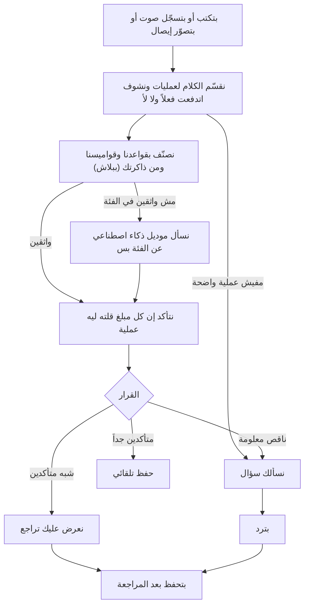

# تسجيل المصاريف

> الصفحة دي بتشرح من غير كود إزاي التطبيق بيفهم المصروف اللي بتكتبه أو بتقوله أو بتصوّره، وإزاي بيسجّله.
> الشرح الهندسي بالتفصيل للمبرمجين والـagents في [الصفحة الإنجليزي](../../systems/expense-capture.md)، والرسومات
> المتولّدة من الكود نفسه في [صفحة الحقائق](../../atlas/systems/expense-capture.md).

## النظام ده بيعمل إيه
ده قلب التطبيق. بتكتب جملة زي «دفعت 200 بنزين و50 قهوة»، أو تدوس على الميكروفون وتقولها، أو تصوّر إيصال،
والتطبيق يطلعلك عمليات جاهزة: 200 في المواصلات (بنزين) و50 في الأكل والشرب (قهوة). مش لازم تختار فئة ولا تكتب
أرقام في خانات.

## الرحلة في صورة واحدة

## مثال خطوة بخطوة
الجملة: «دفعت 200 بنزين وماشتريتش الجزمة اللي بـ500 وإديت أحمد 100»
1. **التقسيم:** التطبيق يلاقي تلات حتت: «دفعت 200 بنزين»، «ماشتريتش الجزمة اللي بـ500»، «إديت أحمد 100».
2. **اتدفعت فعلاً ولا لأ؟** «ماشتريتش» نفي، يعني الـ500 ماتصرفتش، فمش هتتسجل. الجمل اللي فيها «هدفع بكرة» أو
   اللي بتسأل «أنا صرفت كام؟» كمان مابتتسجلش كمصروف. أما «جبت غدا ب 150» فبتتسجل: «غدا» هنا أكلة الغدا مش «بكرة».
3. **التصنيف من غير تكلفة:** «بنزين» التطبيق عارفها من قواميسه: مواصلات. لو إنت نفسك علّمته كلمة معينة، كلمتك
   بتكسب. التطبيق بيدوّر على الكلمة كاملة، مش على حتة منها: «واخيرا» مش هتتقري «اخي». و«عيدية» أو «هدية» أو «نقطة»
   لوحدها مصروف، ومابتبقاش دخل غير مع فعل استلام زي «خدت» أو «جالي».
4. **الأشخاص:** «أحمد» اسم. الفئة بتقول الفلوس راحت في إيه، والشخص بيتحفظ جنبها: «دفعت مصاريف مدرسة ابني» تتسجل
   **تعليم**، وابنك يتحفظ كشخص معاها. العملية تروح لفئة الشخص (العائلة، أصدقاء، موظفين) بس لما الجملة مافيهاش غرض،
   زي «إديت أحمد 100». ساعتها لو أحمد مش معروف، التطبيق يسألك «مين أحمد؟» ويديك اختيارات سريعة زي «أخويا»
   و«صاحبي». التطبيق بيسأل بس عن اسم معروف إنه اسم، أو كلمة قرابة، أو حد في قايمتك؛ فجملة زي «رجعت الجزمة واخدت
   فلوسي» مابقتش تسأل «مين لوسي؟».
5. **الموديل:** بيتسأل بس لو في جملة التطبيق مش عارف فئتها. وحتى ساعتها بيتسأل عن الفئة وبس؛ المبلغ والاتجاه
   والأشخاص التطبيق هو اللي بيحددهم، عشان الموديلات بتغلط في الأرقام أكتر. الموديل ليه 8 ثواني، والمشوار كله 15
   ثانية بالكتير؛ لو مردش، العملية بتتعرض عليك تراجعها بتخمين التطبيق. والتطبيق بيفهم الأرقام بالكلام المصري:
   «خمستاشر»، «خمسميت جنيه»، «خمس مية» (500)، «ألفين ونص»، و«واحد وخمسين» (51، مش 50). و«واحد صاحبي» بيفضل شخص
   مش رقم، و«ازازة مية 10» مية شرب بـ10 مش 110، و«دفعت تمن الأكل 50» يعني سعر الأكل، و«بنزين 92 ب 400» يعني 400.
6. **المراجعة الحسابية:** كل مبلغ قلته لازم يكون ليه مكان. لو مبلغ ضاع، التطبيق مايحفظش الباقي ويسكت؛ بيسألك
   عليه.

**طريقة الدفع مش فئة:** «دفعت بالفيزا 300 في المطعم» أكل وشرب، و«دفعت 200 بفودافون كاش للسباك» سكن. الفيزا
وفودافون كاش وانستاباي بتبقى الفئة بس لو الجملة مافيهاش غرض، زي «حولت 1000 بانستاباي».

**الفلوس اللي بتتنقل مش صرف:** قسط الجمعية وقبضها، والسلف (سلّفت، اتسلفت، رجعلي، «رجعت لمحمد الفلوس اللي عليا»)،
والسحب من الـATM بيتسجلوا **تحويل** ومعاهم اتجاههم (داخل ولا خارج)، فمابيتحسبوش صرف ولا دخل. أما قسط قرض البنك
وفوايده فمصروف تحت «أقساط وفوايد». **والدخل بيتسمّى بمصدره:** «مرتب» بس لما تقول
مرتب أو قبضت أو «من الشغل». العيدية اللي خدتها «هدايا وعيديات»، والفلوس اللي رجعتلك من حاجة رجّعتها بترجع لفئة الحاجة دي نفسها وبتقلل صرفها («مرتجع»)، وتمن
حاجة بعتها «بيع حاجة»، وأي دخل تاني «دخل آخر» ويتعرض عليك تراجعه.
7. **القرار:** هنا في سؤال عن أحمد، فالقرار «سؤال». بعد ما ترد، العمليتين يتسجلوا.

## التلات قرارات
| القرار | يعني إيه | إمتى |
| --- | --- | --- |
| حفظ تلقائي | بيتسجل على طول من غير ما تعمل حاجة | لما كل عملية واثقين فيها بدرجة عالية جداً ومفيش أي علامة تحذير |
| مراجعة | بيعرض عليك البطاقات تعدّل أو تمسح أو توافق | لما الثقة كويسة بس مش كفاية، أو في حاجة تستاهل تبصلها |
| سؤال | بيسألك سؤال قبل ما يسجل | لما معلومة ناقصة: مبلغ مش واضح، شخص مش معروف، أو ثقة ضعيفة |

ليه الحذر ده كله؟ عشان التسجيل الغلط اللي بيحصل في السر بيبوّظ المحفظة والرسومات والتقارير مرة واحدة، وإنت مش
هتاخد بالك. ضغطة تأكيد زيادة أرخص بكتير من رقم غلط في دفترك.

الأرقام اللي بتفصل بين القرارات دي بيتحكم فيها الأدمن من إعدادات النظام.

في بطاقات المراجعة، قايمة الفئات بتعرض فئات نوع العملية بس (الدخل فئات دخل، والمصروف فئات مصروف)، ولما تختار فئة
جديدة الفرعية بتبدأ «عام».

## بيتعلم منك إزاي
- **الذاكرة:** لو كتبت نفس الشكل من الجمل أكتر من مرة في آخر 90 يوم، وكل مرة اتسجلت تلقائي بنفس الفئة، التطبيق
  بيفتكرها ويجاوب على طول من غير ما يعيد الشغل كله.
- **اللي علّمته بيتحفظ لوحده:** كلمة صحّحتها أو علّمتها، أو جملة سجلتها كذا مرة من غير تعديل، أو محل معروف
  اسمه مايتلخبطش مع كلمة تانية (زي ستاربكس أو نتفلكس)، بقت تتحفظ على طول من غير مراجعة. أما الأسامي الملتبسة
  زي «كريم» فبتفضل تتعرض عليك.
- **الأشخاص:** لما ترد على «مين أحمد؟»، أحمد بيتحفظ في قايمة الناس بتوعك، والمرة الجاية مايسألكش.
- **التعديل:** لما تعدّل فئة عملية متسجلة، التطبيق بيفتكر اختيارك للجمل اللي شبهها. ونفس الكلام لو غيّرت الفئة في بطاقة المراجعة قبل
  الحفظ، طالما الجملة كانت عملية واحدة.
- **رسالة الحفظ** بتقولك اتحفظ إيه وبكام، وفيها زرار «تراجع» يمسح اللي اتحفظ حالاً.

## الصوت
بتدوس على الميكروفون وتتكلم. التطبيق يحوّل صوتك لكلام مكتوب، وبعدين يمشي نفس الرحلة اللي فوق بالظبط.
- كل باقة ليها عدد ثواني في الشهر، وحد أقصى للتسجيل الواحد. الأدمن بيغيّرهم من الإعدادات.
- الفحص ده بيحصل قبل ما السيرفر يصرف أي حاجة على تحويل الصوت.

## صور الإيصالات (للباقات اللي الأدمن مفعّل لها الميزة، Pro وUltra في الأول)
بتصوّر إيصال أو سكرين شوت من البنك. الصورة بتتصغّر على موبايلك الأول، وبعدين السيرفر يتأكد إنها صورة حقيقية،
ويقراها بموديل بيشوف الصور، وبعدين تظهرلك العملية في كارت المراجعة زي الجملة المكتوبة: تعدّل المبلغ أو الفئة لو محتاج
وتحفظ.

## لما يسأل سؤال
- لو بيسأل عن شخص: اختار العلاقة من الأزرار أو اكتبها. «تخطي» معناها ماتسألنيش عن الشخص ده تاني.
- لو بيسأل عن مبلغ: قول المبلغ.
- بعد ما ترد، التطبيق يعيد فهم الجملة ومعاها ردك، ويسجّل بتاريخ الجملة (لو قلت «امبارح» تتسجل امبارح، ولو مقلتش
  تاريخ تتسجل يوم ما سألك)، وبيقولك سجّل إيه وبكام، ومعاها زرار «تراجع». ولو رديت مرتين، بتتسجل مرة واحدة بس.
- لو قفلت من غير ما ترد، السؤال بيفضل مستنيك في الصفحة الرئيسية تحت «محتاج ردك»: ترد عليه من هناك، أو تشيله.

## من غير نت
لو كتبت وإنت أوفلاين، الجملة بتتحفظ على موبايلك، وأول ما النت يرجع بتتبعت. اللي يستاهل حفظ تلقائي بيتسجل، واللي
محتاج مراجعة بيفضل مستنيك، والباقي بيكمّل يتبعت عادي من غير ما يقف عنده، وفي الآخر بيفتحلك أول واحد محتاج مراجعة. عدد الجمل اللي تتحفظ أوفلاين حسب باقتك.

## حاجات مهم تعرفها
دي مشاكل موجودة فعلاً في الكود النهارده (الشرح الدقيق لكل واحدة في الصفحة الإنجليزي):
1. **ناقص.** العملية بتتسجل أول ما ترد على السؤال، وبعدها بتشوف اتسجل إيه ومعاها «تراجع»، مش قبل الحفظ.
2. **عطل.** المبلغ اللي بيظهر في مراجعة الإيصال ممكن يبقى أول رقم في الإيصال مش الإجمالي، فراجعه قبل ما تحفظ.
3. **عطل.** خدمتين الصوت بيعدّوا الشهر بطريقتين مختلفتين، والتسجيل الصوتي بيضيف الأشخاص لقايمتك حتى لو ماحفظتش.

## لو عايز تطلب تعديل
قول للـagent يقرا `docs/systems/expense-capture.md` الأول. أمثلة لطلبات واضحة:
- «كلمة كذا بتتصنف غلط، عايزها تبقى فئة كذا»: ده تعديل في القواميس والقواعد، ولازم يعدّي اختبار الدقة.
- «عايز الحفظ التلقائي يحصل أكتر أو أقل»: ده من إعدادات الأدمن من غير كود.
- «الصوت بيخلص بسرعة على الباقة المجانية»: ده من إعدادات حدود الصوت.
- «صلّح مشكلة التسجيل المزدوج بعد السؤال»: ده إصلاح في كود الرد على الأسئلة.

## كلمات بتتكرر
| الكلمة | معناها |
| --- | --- |
| الـpipeline أو خط التصنيف | سلسلة الخطوات اللي الجملة بتعدّي عليها من ساعة ما تبعتها لحد القرار |
| rule engine | القواعد والقواميس اللي بتصنّف من غير موديل ومن غير تكلفة |
| الموديل | خدمة ذكاء اصطناعي خارجية بتدفع عليها، زي Gemini |
| calibration | تحويل «إحنا واثقين قد إيه» لنسبة مقاسة فعلاً على أمثلة حقيقية |
| muscle memory أو الذاكرة | الأنماط اللي التطبيق اتعلمها من جملك المتكررة |
| clarification | السؤال اللي التطبيق بيسأله قبل ما يسجل |
| benchmark | اختبار دقة على مجموعة جمل مصرية معروفة إجاباتها، لازم يعدّي قبل أي تغيير في التصنيف |
