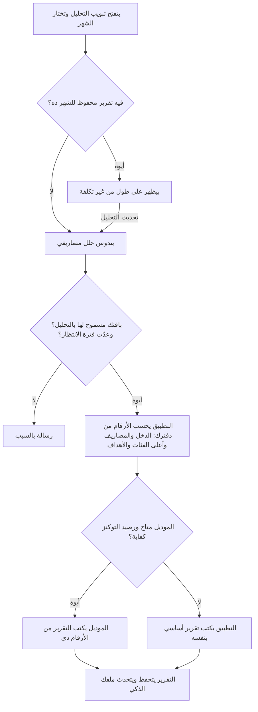

# التقارير والتحليلات والملف الذكي

> الصفحة دي بتشرح من غير كود إزاي التطبيق بيعملك تحليل شهري لمصاريفك، وإزاي بيتعرف عليك من أسئلة التعريف ومن
> طريقة صرفك. الشرح الهندسي بالتفصيل في [الصفحة الإنجليزي](../../systems/insights.md)، والرسومات المتولّدة من الكود
> في [صفحة الحقائق](../../atlas/systems/insights.md).

## النظام ده بيعمل إيه
- **التحليل الشهري**: تبويب «التحليل» في مركز الذكاء الاصطناعي. بتختار الشهر وتدوس «حلل مصاريفي»، فيطلع لك تقرير
  مكتوب فيه وضعك وتنبيهات ونصايح.
- **مقارنة شهرين**: بتختار شهر تاني ويطلع لك الفرق في المصاريف والدخل والصافي.
- **تقرير Pro للطباعة**: الباقات اللي الأدمن مفعّل لها الميزة دي (Pro وUltra في الأول) تقدر تنزّل التحليل كملف يتطبع.
- **تقرير شهري على واتساب**: أول كل شهر بيتبعت ملخص قصير على الواتساب للباقات اللي الأدمن مفعّل لها التقرير ده (Pro بس في الأول).
- **الملف الذكي**: كل اللي التطبيق يعرفه عنك: دخلك ويوم مرتبك وهدفك وعيلتك وعربيتك واشتراكاتك والناس اللي بتتعامل
  معاهم. بيتملي من أسئلة التعريف ومن سلوك صرفك، والتصنيف والتقارير بيستخدموه.

## التحليل الشهري في صورة واحدة

## ليه كده؟
- **الأرقام من دفترك مش من الموديل**: التطبيق بيحسب الأرقام الأول، والموديل بيكتب الكلام حواليها.
- **«الرفاهيات» قايمة واحدة**: الصرف اللي تقدر تقلله (ترفيه، تسوق، أكل وشرب، عناية شخصية، اشتراكات) ليه قايمة واحدة
  بيقرا منها التحليل الشهري ولقطة السلوك والإحصائيات، بعد ما كانت كل شاشة ليها قايمة وفيها أسامي فئات مش موجودة.
- **التقرير المحفوظ مالوش تكلفة**: لما تفتح شهر عنده تقرير، بيظهر من غير ما يتعمل تاني.
- **فيه دايماً تقرير**: لو الموديل مش متاح أو رده باظ، التطبيق بيكتب تقرير أساسي بالأرقام والتنبيهات.

## أسئلة التعريف والملف الذكي
- في الصفحة الرئيسية بيظهر لك كارت فيه سؤال واحد كل مرة: دخلك، مصادره، يوم المرتب، هدفك من التطبيق، ولادك، سكنك،
  بتصرف على مين، ديونك، شغلك، عربيتك، حيواناتك الأليفة، التدخين، اشتراكاتك، والناس اللي بتحولهم فلوس.
- الأسئلة بتتغير على حسب إجاباتك: مثلاً اسم شريك الحياة بيتسأل بس لو متجوز أو ساكن مع العيلة، ويوم المرتب بيتسأل
  بس لو دخلك من مرتب.
- تقدر تتخطى أي سؤال، ولو قفلت الكارت مابيرجعش يفتح لوحده قبل يومين.
- تقدر تشوف ملفك وتعدله من الإعدادات.
- **فايدته**: لما تكتب «بعتت لمحمد 500»، التصنيف يعرف إن محمد ابنك مثلاً ويصنفها صح. والتقارير بتعرف يوم مرتبك
  فتحسب شهرك من المرتب للمرتب.
- أول كل شهر التطبيق بيحلل صرف الشهر اللي فات لكل مستخدم: هل صرفك منتظم ولا فيه طفرات، وهل مصاريفك قريبة من دخلك،
  وبيحفظ النتيجة في ملفك.

## التقرير الشهري على واتساب
- بيتعمل الساعة 2 الصبح يوم 1 في الشهر، لمشتركين باقة Pro اللي عندهم رقم موبايل.
- لو التقرير اتعمل قبل كده للشهر ده، بيتبعت نفس التقرير.
- سجل السيرفر بيكتب إن التقرير اتبعت ولمين، ورقم الموبايل بيظهر فيه آخر 4 أرقام بس. وأسامي الناس اللي في ملفك
  مابتتكتبش في السجل خالص.

## الحدود
- الأدمن يقدر يقفل التحليل لباقة معينة.
- بين كل تقرير والتاني فترة انتظار على حسب الباقة، والأدمن بيحددها.
- لو استهلكت التوكنز المسموحة لباقتك، بيطلع لك التقرير الأساسي بدل تقرير الموديل.
- تصدير تقرير Pro متاح لمشتركين Pro وUltra بس.

## حاجات مهم تعرفها
دي مشاكل موجودة فعلاً في الكود النهارده (الشرح الدقيق لكل واحدة في الصفحة الإنجليزي):
1. **عطل.** **تقرير الواتساب اللي بيوصل أول الشهر** بيتكلم عن الشهر اللي لسه بادئ، مش الشهر اللي خلص.
2. **ناقص.** **أسامي الناس اللي بتكتبها في أسئلة التعريف** (ولادك، شريك حياتك، إخواتك...) مابتوصلش لقايمة الأشخاص اللي
   التصنيف والتقارير بيستخدموها، إلا لو كانت متسجلة قبل كده.
3. **عطل.** **«تحديث التحليل» لشهر عنده تقرير** مابيستناش فترة الانتظار، فممكن يتعمل كذا مرة بتكلفة كل مرة.
4. **عطل.** **مشتركين Ultra مابيوصلهمش تقرير الواتساب** لحد ما الأدمن يفعّله لباقتهم، ومفتاح «إرسال التقرير عبر الواتساب» في
   الإعدادات مابيوقفوش.
5. **عطل.** **لو الموديل كتب رقم مش موجود في بياناتك**، التقرير بيظهر برضه؛ الرقم بيتقاس بس ومابيتمنعش زي الشات.
6. **عطل.** **تحت التحليل بيظهر مربع «Trace» فني** لكل المستخدمين، مع إنه معمول للمطورين.
7. **عطل.** **التقرير الأساسي ممكن يقول إن التوكنز خلصت** حتى لو السبب الحقيقي إن مفتاح الموديل مش متظبط.
8. **عطل.** **وصف «سلوك الصرف» في ملفك** بيكبر مع كل إجابة أو تعديل لحد تحديث أول الشهر، وبيتبعت للتصنيف كده.

## لو عايز تطلب تعديل
قول للـagent يقرا `docs/systems/insights.md` الأول. أمثلة لطلبات واضحة:
- «خلّي تقرير الواتساب يتكلم عن الشهر اللي خلص»: ده إصلاح المشكلة الأولى.
- «خلّي الأسامي اللي في أسئلة التعريف تتضاف لجهات الاتصال»: ده إصلاح المشكلة التانية.
- «عايز أضيف سؤال تعريف جديد»: ده تعديل في قايمة الأسئلة وترتيبها، وفي الكارت اللي بيعرضها.
- «غيّر فترة الانتظار بين التقارير للباقة المجانية»: ده من إعدادات الأدمن من غير كود.

## كلمات بتتكرر
| الكلمة | معناها |
| --- | --- |
| الملف الذكي | كل المعلومات اللي التطبيق يعرفها عنك، من إجاباتك ومن صرفك |
| أسئلة التعريف | الأسئلة اللي بتظهر في الكارت على الصفحة الرئيسية |
| الحقائق (facts) | الأرقام اللي التطبيق بيحسبها من دفترك قبل ما الموديل يكتب |
| التقرير الأساسي | تقرير بيكتبه التطبيق بنفسه من غير موديل |
| فترة الانتظار | عدد الأيام اللازم يعدي بين تقرير والتاني |
| لقطة السلوك | ملخص صرف شهر: أعلى الفئات، الطفرات، ونسبة المصاريف من الدخل |
| جهات الاتصال | الناس اللي التطبيق يعرفهم عنك وعلاقتهم بيك |
