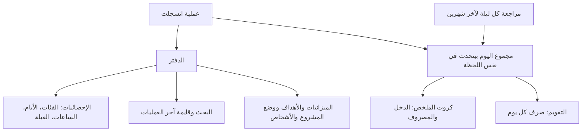

# الفلوس: المصاريف والمحافظ والميزانيات والأهداف والمشاريع

> الصفحة دي بتشرح من غير كود اللي بيحصل لفلوسك بعد ما العملية تتسجل: الأرقام اللي بتشوفها في الصفحة الرئيسية،
> والإحصائيات، والتقويم، والمحافظ، والأهداف، ووضع المشروع، والناس اللي بتتعامل معاهم. الشرح الهندسي بالتفصيل في
> [الصفحة الإنجليزي](../../systems/money.md)، والرسومات المتولّدة من الكود في
> [صفحة الحقائق](../../atlas/systems/money.md).

## النظام ده بيعمل إيه
تسجيل العملية نفسها (بالكتابة أو الصوت أو رسايل البنك) ليه صفحة لوحده. النظام ده بيبدأ بعد ما العملية تتحفظ:
- **الدفتر**: كل عملية بتتحفظ بنوعها (دخل، مصروف، تحويل، استثمار) ومبلغها وفئتها وتاريخها.
- **مجاميع كل يوم**: مع كل عملية بتتسجل أو تتمسح، مجموع اليوم بيتحدث في نفس اللحظة، وكل ليلة التطبيق بيراجع آخر
  شهرين ويصلح أي فرق.
- **الفلوس اللي بتتنقل**: قسط الجمعية وقبضها، والسلف، والسحب من الـATM بيتحفظوا «تحويل» ومعاهم اتجاههم (داخل ولا
  خارج)، فمابيتحسبوش صرف ولا دخل.
- **ترحيل الفئات القديمة**: كل نص ساعة، التطبيق بينقل العمليات اللي لسه متسجلة بأسامي فئات قديمة (زي «خدمات سيارات»)
  لمكانها في الفئات الجديدة، 500 عملية كل مرة. كل عملية بتحتفظ بفئتها القديمة جواها، فالترحيل يتعكس لو احتجنا.
  ولو العملية اتحولت لتحويل (زي قسط جمعية كان متسجل مصروف)، مجموع اليوم بيتظبط معاها.
- **الصفحة الرئيسية**: فيها تلات تبويبات: تسجيل، وإحصائيات، وتقويم، وزرار «كلّم سمارت» للي المكالمة الجديدة مفتوحة ليهم.
- **المحافظ والميزانيات والأهداف ووضع المشروع والأشخاص**.

## في صورة واحدة

## ليه كده؟
- **مجاميع جاهزة لكل يوم**: عشان الصفحة الرئيسية تفتح بسرعة من غير ما تجمع كل عملياتك من الأول كل مرة.
- **مراجعة كل ليلة**: لو حصل أي خطأ في المجاميع، بيتصلح بالليل من العمليات الأصلية.
- **الأرقام بتتحفظ مؤقتاً**: الإحصائيات بتتحسب مرة وتتحفظ، وأول ما تسجل أو تمسح عملية بتتحسب من جديد.
- **كل حاجة بتاعتك بس**: كل طلب بيجيب بياناتك إنت وبس، والتطبيق بيتأكد إن المحفظة أو المشروع أو الشخص اللي بتختاره
  بتوعك.

## الصفحة الرئيسية
- **فوق**: اختيار الشهر، ونسبة صرفك من دخلك، وعدد الأيام المتتالية اللي سجلت فيها (الـstreak)، وزرار وضع المشروع
  لو عندك مشروع.
- **زرار «كلّم سمارت»**: بيبدأ [المكالمة الصوتية](voice-calls.md) وعليه الدقايق الفاضلة، وبيظهر بس للي المكالمة الجديدة
  مفتوحة ليهم.
- **كروت الملخص**: دخل الشهر ومصروفه.
- **تبويب التسجيل**: خانة التسجيل، والعمليات اللي مستنية ردك على سؤال («محتاج ردك»)، ورسايل البنك المستنية تأكيدك لو فيه (اللي وصلت بعد حد الباقة)، وآخر عملياتك في
  الشهر: من «التفاصيل» تقدر تعدّل العملية (المبلغ والنوع والفئة والتاريخ) أو تمسحها، ولو غيّرت الفئة التطبيق بيفتكر اختيارك (لون كل فئة ثابت من قايمة الفئات)، وكارت
  إنشاء هدف.
- **تبويب الإحصائيات**: المتوسط اليومي، والمقارنة بالأسبوع المماثل أو الشهر اللي فات، وأعلى فئة، و«شخصيتك
  المالية»، ورسومات للفئات والعيلة والمدفوعات الإلكترونية والميزانية وخريطة التوقيت، وبحث في عملياتك، ومجموع
  العمليات اللي جت من رسايل البنك، وأعلى 5 فئات.
- **تبويب التقويم**: صرف كل يوم في الشهر، ولما تدوس على يوم تشوف عملياته.
- **الشهر المالي**: لو فعّلت «مرتب ثابت» ويوم المرتب من الإعدادات، الملخص والإحصائيات بيتحسبوا من المرتب للمرتب.
  التقويم دايماً بالشهر العادي.

## المحافظ والميزانيات والأهداف
- **المحافظ**: تقدر تضيف محفظة أو حساب (الاسم، والبنك أو الخدمة، وآخر 4 أرقام، والرصيد) وتشوف عملياتها وتمسحها.
  لما تمسح محفظة، عملياتها بتفضل موجودة من غير محفظة.
- **الميزانيات**: الميزانية ليها حد شهري، وفئة لو حبيت، ويوم بداية، ونسبة تنبيه. مفيش شاشة ليها في التطبيق؛ بتتعمل
  من المساعد في مركز الذكاء الاصطناعي بعد ما توافق.
- **الأهداف**: هدف باسم ومبلغ وتاريخ. عدد الأهداف النشطة حسب الباقة، والأدمن بيحدده (المجانية 3 في الأول). الباقات اللي
  الأدمن مفعّل لها «تحليل الأهداف» (Pro وUltra في الأول) تقدر تطلب تحليل يعمل خطة ادخار. تقدر تخلي الهدف نشط أو متوقف أو مكتمل، أو تمسحه.

## وضع المشروع والأشخاص
- **وضع المشروع** (للباقات اللي الأدمن مفعّل لها الميزة، Pro وUltra في الأول): مشروع واحد نشط ليه فئاته. الذكاء الاصطناعي يقدر يقترح الفئات من وصف مشروعك،
  والتصنيف بيدور في فئات المشروع الأول. لما تمسح المشروع، عملياته بترجع عمليات شخصية ومبتتمسحش.
- **الأشخاص**: الناس اللي بتحولهم أو بتصرف عليهم. تقدر تضيف وتعدل وتمسح وتدمج شخصين في شخص واحد، وتكتم شخص عشان
  التطبيق مايسألكش عنه تاني. التصنيف بيستخدم الأسامي دي عشان يفهم «بعتت لمحمد».

## حاجات مهم تعرفها
دي مشاكل موجودة فعلاً في الكود النهارده (الشرح الدقيق لكل واحدة في الصفحة الإنجليزي):
1. **ناقص.** **تنبيه «تخطيت الميزانية»** مالوش علاقة بالميزانيات اللي بتعملها؛ بيقارن صرف الشهر بالدخل المكتوب في ملفك.
2. **عطل.** **يوم المرتب اللي بتقوله في أسئلة التعريف** مابيغيرش حساب الصفحة الرئيسية؛ لازم تفعّل «مرتب ثابت» من الإعدادات.
   مركز الذكاء الاصطناعي والتقارير بيستخدموا يوم المرتب في الحالتين.
3. **عطل.** **المتوسط اليومي بيطلع أقل من الحقيقي في أول الشهر** لو حسابك قديم، لأنه بيقسم على 30 يوم.
4. **عطل.** **تبويب الميزانية والمدفوعات الإلكترونية وخريطة التوقيت** بيحسبوا من آخر 200 عملية بس في الشهر، ولو مفيش دخل
   بيفترض ميزانية 10,000 جنيه.
5. **عطل.** **«الشخصية المالية»** في الإحصائيات ممكن تختلف عن اللي في التقرير الشهري، وبعض الحالات بتظهر «متوازن» غلط.
6. **عطل.** **في وضع المشروع** كروت الملخص اللي فوق بتفضل تعرض أرقامك الشخصية.
7. **ناقص.** **نتيجة «تحليل Pro» للهدف** بتتحفظ بس مابتظهرش في أي مكان، والهدف اللي من غير مبلغ بيتحفظ بمبلغ 50,000 جنيه.
8. **عطل.** **قايمة عمليات اليوم في التقويم** ممكن تزوّد أو تنقص عمليات قريبة من نص الليل بسبب فرق التوقيت.
9. **ناقص.** **المرتجع بيتسجل دخل** («دخل آخر/مرتجعات»)، ومابيقللش مصروف الفئة اللي الحاجة اتشرت منها. ده مستني تعريف
    واحد لـ«المصروف» تقرا منه كل الشاشات.

## لو عايز تطلب تعديل
قول للـagent يقرا `docs/systems/money.md` الأول. أمثلة لطلبات واضحة:
- «عايز شاشة للميزانيات وتنبيه لما أقرب من حد الميزانية»: ده بيحل المشكلة الأولى.
- «خلّي يوم المرتب من أسئلة التعريف يغير حساب الصفحة الرئيسية»: ده إصلاح المشكلة التانية.
- «عايز أعدل مبلغ أو فئة عملية اتسجلت»: ده زرار تعديل يستخدم التعديل الموجود في السيرفر.
- «اعرض نتيجة تحليل Pro للهدف»: ده إصلاح المشكلة السابعة.

## كلمات بتتكرر
| الكلمة | معناها |
| --- | --- |
| الدفتر (ledger) | كل عملياتك المتسجلة |
| مجموع اليوم (rollup) | دخل ومصروف كل يوم محسوبين وجاهزين |
| الشهر المالي | الفترة من يوم المرتب لليوم اللي قبل المرتب اللي بعده |
| وضع المشروع | عرض عمليات مشروعك لوحدها بعيد عن مصاريفك الشخصية |
| عملية آلية | عملية اتسجلت لوحدها من رسالة بنك أو محفظة |
| الكتم | إن التطبيق مايسألكش تاني عن شخص معين |
