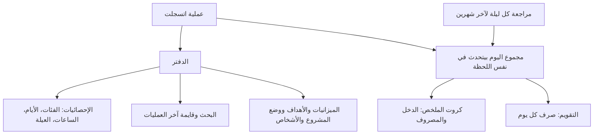

# الفلوس: المصاريف والمحافظ والميزانيات والأهداف والمشاريع

> الصفحة دي بتشرح من غير كود اللي بيحصل لفلوسك بعد ما العملية تتسجل: الأرقام اللي بتشوفها في الصفحة الرئيسية،
> والإحصائيات، والتقويم، والمحافظ، والأهداف، ووضع المشروع، والناس اللي بتتعامل معاهم. الشرح الهندسي بالتفصيل في
> [الصفحة الإنجليزي](../../systems/money.md)، والرسومات المتولّدة من الكود في
> [صفحة الحقائق](../../atlas/systems/money.md).

## النظام ده بيعمل إيه
تسجيل العملية نفسها (بالكتابة أو الصوت أو رسايل البنك) ليه صفحة لوحده. النظام ده بيبدأ بعد ما العملية تتحفظ:
- **الدفتر**: كل عملية بتتحفظ بنوعها (دخل، مصروف، تحويل، استثمار) ومبلغها وفئتها وتاريخها.
- **مجاميع كل يوم**: مع كل عملية بتتسجل أو تتمسح، مجموع اليوم بيتحدث في نفس اللحظة، وكل ليلة التطبيق بيراجع آخر
  شهرين ويصلح أي فرق.
- **الفلوس اللي بتتنقل**: قسط الجمعية وقبضها، والسلف، والسحب من الـATM بيتحفظوا «تحويل» ومعاهم اتجاههم (داخل ولا
  خارج)، فمابيتحسبوش صرف ولا دخل.
- **المرتجع**: لما تقول «رجعت الجزمة واخدت فلوسي 300»، الـ300 بترجع لفئة «تسوق» نفسها وبتقلل صرفها، مش بتتحسب
  دخل. في القايمة بتظهر «مرتجع» بعلامة +، وتقدر تخلي أي عملية «مرتجع» من شاشة التعديل.
- **ترحيل الفئات القديمة**: كل نص ساعة، التطبيق بينقل العمليات اللي لسه متسجلة بأسامي فئات قديمة (زي «خدمات سيارات»)
  لمكانها في الفئات الجديدة، 500 عملية كل مرة. كل عملية بتحتفظ بفئتها القديمة جواها، فالترحيل يتعكس لو احتجنا.
  ولو العملية اتحولت لتحويل (زي قسط جمعية كان متسجل مصروف)، مجموع اليوم بيتظبط معاها.
- **الصفحة الرئيسية**: فيها تلات تبويبات: تسجيل، وإحصائيات، وتقويم، وزرار «كلّم سمارت» للي المكالمة الجديدة مفتوحة ليهم.
- **المحافظ والميزانيات والأهداف ووضع المشروع والأشخاص**.

## في صورة واحدة

```mermaid
flowchart TD
  A["عملية اتسجلت"] --> B["الدفتر"]
  A --> C["مجموع اليوم بيتحدث في نفس اللحظة"]
  N["مراجعة كل ليلة لآخر شهرين"] --> C
  B --> D["الإحصائيات: الفئات، الأيام، الساعات، العيلة"]
  C --> E["كروت الملخص: الدخل والمصروف"]
  C --> F["التقويم: صرف كل يوم"]
  B --> G["البحث وقايمة آخر العمليات"]
  B --> H["الميزانيات والأهداف ووضع المشروع والأشخاص"]
```

## ليه كده؟
- **مجاميع جاهزة لكل يوم**: عشان الصفحة الرئيسية تفتح بسرعة من غير ما تجمع كل عملياتك من الأول كل مرة.
- **مراجعة كل ليلة**: لو حصل أي خطأ في المجاميع، بيتصلح بالليل من العمليات الأصلية.
- **الأرقام بتتحفظ مؤقتاً**: الإحصائيات بتتحسب مرة وتتحفظ، وأول ما تسجل أو تمسح عملية بتتحسب من جديد.
- **كل حاجة بتاعتك بس**: كل طلب بيجيب بياناتك إنت وبس، والتطبيق بيتأكد إن المحفظة أو المشروع أو الشخص اللي بتختاره
  بتوعك.

## الصفحة الرئيسية
- **فوق**: اختيار الشهر، ونسبة صرفك من دخلك، وعدد الأيام المتتالية اللي سجلت فيها (الـstreak)، وزرار وضع المشروع
  لو عندك مشروع.
- **زرار «كلّم سمارت»**: بيبدأ [المكالمة الصوتية](voice-calls.md) وعليه الدقايق الفاضلة، وبيظهر بس للي المكالمة الجديدة
  مفتوحة ليهم.
- **كروت الملخص**: دخل الشهر ومصروفه.
- **تبويب التسجيل**: خانة التسجيل، والعمليات اللي مستنية ردك على سؤال («محتاج ردك»)، ورسايل البنك المستنية تأكيدك لو فيه (اللي وصلت بعد حد الباقة)، وآخر عملياتك في
  الشهر: من «التفاصيل» تقدر تعدّل العملية (المبلغ والنوع والفئة والتاريخ) أو تمسحها، ولو غيّرت الفئة التطبيق بيفتكر اختيارك (لون كل فئة ثابت من قايمة الفئات)، وكارت
  إنشاء هدف.
- **تبويب الإحصائيات**: المتوسط اليومي، والمقارنة بالأسبوع المماثل أو الشهر اللي فات، وأعلى فئة، و«شخصيتك
  المالية»، ورسومات للفئات والعيلة والمدفوعات الإلكترونية والميزانية وخريطة التوقيت، وبحث في عملياتك، ومجموع
  العمليات اللي جت من رسايل البنك، وأعلى 5 فئات.
- **تبويب التقويم**: صرف كل يوم في الشهر، ولما تدوس على يوم تشوف عملياته، واليوم محسوب بتوقيت القاهرة من نص الليل لنص الليل.
- **الشهر المالي**: لو فعّلت «مرتب ثابت» ويوم المرتب من الإعدادات، الملخص والإحصائيات بيتحسبوا من المرتب للمرتب.
  التقويم دايماً بالشهر العادي.

## المحافظ والميزانيات والأهداف
- **المحافظ**: تقدر تضيف محفظة أو حساب (الاسم، والبنك أو الخدمة، وآخر 4 أرقام، والرصيد) وتشوف عملياتها وتمسحها.
  الرصيد لازم يكون رقم، وبيتقري بالأرقام العربي أو الإنجليزي ومع الفواصل («١٥٠٠» أو «1,500.50»). الرصيد هو اللي انت
  كتبته، مش بيتحرك لوحده مع المصاريف؛ وكل مرة بتكتبه بيتحفظ معاه يوم ما كتبته ومين كتبه (انت ولا المساعد)، والأرصدة
  القديمة اللي اتكتبت قبل كده بيتقال عليها «مش معروف امتى» بدل ما تتاخد على إنها النهارده.
- **نزّل مصاريفك**: من صفحة «المزيد» تقدر تنزّل كل عملياتك في ملف Excel أو CSV: التاريخ بتوقيت القاهرة، والنوع
  (دخل، مصروف، تحويل، استثمار، مرتجع)، والمبلغ، والفئة والفرعية، والوصف، والمصدر (مكتوب، صوت، إيصال، رسالة بنك، يدوي).
  لما تمسح محفظة، عملياتها بتفضل موجودة من غير محفظة.
- **الميزانيات**: من تبويب الإحصائيات تقدر تعمل ميزانية شهرية لفئة (زي الأكل) أو لكل مصاريفك، وتشوف قد إيه صرفت منها
  بشريط. التطبيق بينبهك مرة لما توصل 80% ومرة لما تعدّي الحد، في كل دورة. المساعد في مركز الذكاء كمان يقدر يعملها.
- **ليك وعليك**: من السلف اللي بتسجلها («سلفت احمد 500»، «احمد رجعلي 200»، «استلفت من خالي 1000») التطبيق بيحسب لكل
  شخص: ليك عنده كام أو عليك له كام، وبيعرضهم في تبويب الإحصائيات تحت الميزانيات، ومعاهم الإجمالي. وجنبهم الجمعية:
  دفعت كام قسط وبكام، وقبضت كام، وفاضلك فيها كام.
- **الأقساط**: بتضيف القسط مرة واحدة (اسمه، الكلمة اللي بتكتبها لما تدفعه زي «فاليو»، القسط كام، كام قسط، ودفعت كام
  قبل كده). بعد كده كل ما تسجل «دفعت قسط فاليو 800» التطبيق بيعدّه، ويقولك فاضل كام قسط وكام جنيه. ولو ضفت مواعيد
  القسط في «خطتك والتزاماتك» وربطت الدفعات بيها، بيتحسب منها بالظبط: الدفعة الجزئية بمبلغها، والدفعة اللي فيها كلمة
  قسطين مابتتعدش مرتين.
- **المواسم**: «رمضان كلفني كام». رمضان والعيدين بيتحسبوا بالتاريخ الهجري، والمدارس (من أول سبتمبر لنص أكتوبر) والصيف
  بتواريخ ثابتة. التطبيق بيجمع اللي صرفته في الفترة دي حسب الفئة، ويقارنه بنفس الموسم السنة اللي فاتت. الموسم مش فئة:
  ياميش رمضان يفضل «أكل وشرب» ويتحسب في رمضان برضه.
- **الأهداف**: هدف باسم ومبلغ وتاريخ. عدد الأهداف النشطة حسب الباقة، والأدمن بيحدده (المجانية 3 في الأول). الباقات اللي
  الأدمن مفعّل لها «تحليل الأهداف» (Pro وUltra في الأول) تقدر تطلب تحليل يعمل خطة ادخار. تقدر تخلي الهدف نشط أو متوقف أو مكتمل، أو تمسحه.

## خطتك والتزاماتك
صفحة «خطتك والتزاماتك» (من «المزيد»، ومن التذكير لما يوصل):
- **الالتزامات والدخل الجاي**: الإيجار والفواتير والاشتراكات والمدارس والأقساط والسلف والجمعية، والمرتب أو الشغل الحر.
  لكل واحد: اسمه، ومبلغه (أو «مش عارف»)، وبيتكرر إزاي (مرة، كل أسبوع، كل شهر، كل سنة)، وأول ميعاد (أو «مش عارف»)،
  والدخل ممكن يتعلم «مش مضمون». ده وعد للمستقبل، مش عملية في الدفتر، والقسط ليه ميعاد واحد بس فمابيتحسبش مرتين.
- **المواعيد**: لو الميعاد 31 والشهر أقصر، بيبقى آخر يوم في الشهر ويرجع 31 الشهر اللي بعده.
- **اتدفع ولا لأ**: بتربط الميعاد بعملية متسجلة (التطبيق بيقترح عمليات قريبة بنفس المبلغ أو فيها كلمة من الاسم، وانت
  اللي بتختار)، أو تقول «دفعته من غير ما أسجله». الدفع الجزئي بيسيب الباقي عليك، ومفيش عملية بتدفع أكتر من مبلغها ولا
  ميعاد بيتدفع أكتر من المطلوب، والمرتجع أو الدخل مابيدفعوش إيجار. لو مسحت العملية أو قللت مبلغها، الميعاد بيرجع مش
  مدفوع. آخر ميعاد قبل ما تضيف الالتزام بيتسأل عنه «اتدفع ولا لأ؟» بدل ما يتحسب عليك دين.
- **الفاضل لحد القبض**: اللي في محافظك زي ما كتبته، ناقص اللي عليك ولسه مادفعتوش قبل القبض، والدخل المؤكد لوحده،
  والدخل المتوقع لوحده «لو وصل». والحاجات اللي مبلغها أو ميعادها مش معروف بتتكتب، ومابتتطرحش كأنها صفر.
- **الخطة**: الخطة اللي اتفقت عليها مع سمارت (اسمها، والهدف بكلامك، والأرقام اللي اتفقتوا عليها، ولحد 8 خطوات زي
  «الأكل برّه ميتين في اليوم»). خطة واحدة شغالة؛ الجديدة بتاخد مكان القديمة. الخطوة بتتعلم «اتعملت» بكلامك انت.
- **التذكير**: موافقة لوحدها غير موافقة الخطة. بتختار اليوم والساعة بتوقيت القاهرة، والتذكير بيوصل في إشعارات التطبيق مرة
  واحدة بس، حتى لو السيرفر وقف ورجع أو فيه أكتر من سيرفر، ولو غيرت ميعاده أو لغيته القديم مابيوصلش. والإشعار بيقول
  إن عندك خطوة، من غير أي مبلغ.
- المكالمة الصوتية (المدرب) بتقرا نفس الأرقام دي، وبتحفظ الخطة والخطوات والتذكير والالتزامات بموافقتك بس.

## الأرقام بتتحدث إمتى
- أي حفظ أو تعديل أو مسح أو «تراجع» بيحدّث كل الشاشات اللي بتقرا من مصاريفك مع بعض: الملخص، والإحصائيات، والأقساط،
  والمواسم، و«ليك وعليك». زمان المسح من القايمة كان بيحدّث القايمة بس.
- أرقام الشهر الحالي بتتحفظ جاهزة 5 دقايق بالكتير، وأرقام الشهور اللي خلصت يوم، وأي تغيير في مصاريفك بيلغيها على طول.
  ومسح محفظة أو مسح شخص أو دمج شخصين بقوا بيحدّثوا الأرقام كمان.

## وضع المشروع والأشخاص
- **وضع المشروع** (للباقات اللي الأدمن مفعّل لها الميزة، Pro وUltra في الأول): مشروع واحد نشط ليه فئاته. لو باقتك مافيهاش الميزة، بتعرف من أول شاشة، مش بعد ما تملا خطوات الإعداد. والتسجيل بالصوت بيتحسب على المشروع لو وضع المشروع شغال، زي الكتابة بالظبط. الذكاء الاصطناعي يقدر يقترح الفئات من وصف مشروعك،
  والتصنيف بيدور في فئات المشروع الأول. لما تمسح المشروع، عملياته بترجع عمليات شخصية ومبتتمسحش.
- **الأشخاص**: الناس اللي بتحولهم أو بتصرف عليهم. تقدر تضيف وتعدل وتمسح وتدمج شخصين في شخص واحد، وتكتم شخص عشان
  التطبيق مايسألكش عنه تاني. التصنيف بيستخدم الأسامي دي عشان يفهم «بعتت لمحمد».

## حاجات مهم تعرفها
دي مشاكل موجودة فعلاً في الكود النهارده (الشرح الدقيق لكل واحدة في الصفحة الإنجليزي):
1. **عطل.** **يوم المرتب اللي بتقوله في أسئلة التعريف** مابيغيرش حساب الصفحة الرئيسية؛ لازم تفعّل «مرتب ثابت» من الإعدادات.
   مركز الذكاء الاصطناعي والتقارير بيستخدموا يوم المرتب في الحالتين.
2. **عطل.** **المتوسط اليومي بيطلع أقل من الحقيقي في أول الشهر** لو حسابك قديم، لأنه بيقسم على 30 يوم.
3. **ناقص.** **تبويب «الميزانية» جوه الرسم** بيقارن صرفك بميزانيتك لكل المصاريف؛ لو مفيش، بيقارن بدخلك، ولو مفيش دخل بيطلب منك تعمل ميزانية. لو عندك ميزانيات فئات بس، بيقارن بالدخل.
4. **عطل.** **«الشخصية المالية»** في الإحصائيات ممكن تختلف عن اللي في التقرير الشهري، وبعض الحالات بتظهر «متوازن» غلط.
5. **ناقص.** **نتيجة «تحليل Pro» للهدف** بتتحفظ بس مابتظهرش في أي مكان، والهدف اللي من غير مبلغ بيتحفظ بمبلغ 50,000 جنيه.
6. **ناقص.** **المرتجع اللي بيجي من رسالة بنك** بيرجع لفئته بس لو التاجر معروف (زي أوبر وطلبات)؛ غير كده بيتسجل دخل («دخل آخر»)، والمرتجعات اللي اتسجلت قبل التعديل ده فضلت دخل.
    وممكن فئة يبان صرفها بالسالب في شهر لو الحاجة اتشرت في الشهر اللي قبله.
7. **ناقص.** **الالتزامات والخطط للحساب الشخصي بس**؛ لسه مفيش التزامات أو خطة لمشروع.
8. **ناقص.** **التذكير بيوصل جوه التطبيق بس**، مش إشعار على الموبايل.

## لو عايز تطلب تعديل
قول للـagent يقرا `docs/systems/money.md` الأول. أمثلة لطلبات واضحة:
- «عايز شاشة للميزانيات وتنبيه لما أقرب من حد الميزانية»: ده بيحل المشكلة الأولى.
- «خلّي يوم المرتب من أسئلة التعريف يغير حساب الصفحة الرئيسية»: ده إصلاح المشكلة التانية.
- «عايز أعدل مبلغ أو فئة عملية اتسجلت»: ده زرار تعديل يستخدم التعديل الموجود في السيرفر.
- «اعرض نتيجة تحليل Pro للهدف»: ده إصلاح المشكلة السابعة.

## كلمات بتتكرر
| الكلمة | معناها |
| --- | --- |
| الدفتر (ledger) | كل عملياتك المتسجلة |
| مجموع اليوم (rollup) | دخل ومصروف كل يوم محسوبين وجاهزين |
| الشهر المالي | الفترة من يوم المرتب لليوم اللي قبل المرتب اللي بعده |
| وضع المشروع | عرض عمليات مشروعك لوحدها بعيد عن مصاريفك الشخصية |
| عملية آلية | عملية اتسجلت لوحدها من رسالة بنك أو محفظة |
| الكتم | إن التطبيق مايسألكش تاني عن شخص معين |
