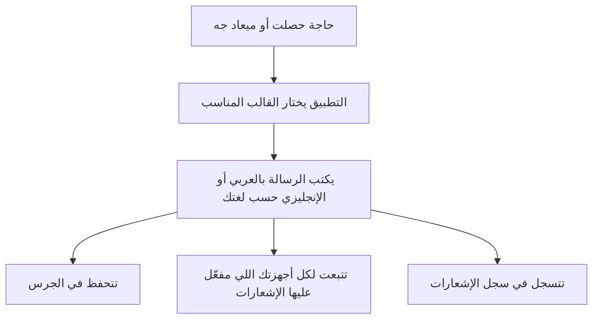

# الإشعارات والواتساب

> الصفحة دي بتشرح من غير كود إزاي التطبيق بيوصلك وإنت مش فاتحه: إشعارات الموبايل والمتصفح، والجرس جوه التطبيق،
> والرسايل اللي بتتبعت في مواعيد أو لما يحصل حاجة، وخدمة الواتساب. الشرح الهندسي بالتفصيل في
> [الصفحة الإنجليزي](../../systems/notifications.md)، والرسومات المتولّدة من الكود في
> [صفحة الحقائق](../../atlas/systems/notifications.md).

## النظام ده بيعمل إيه
- **إشعارات الموبايل والمتصفح**: بعد ما توافق على الإشعارات، التطبيق يقدر يبعت لك تنبيه حتى لو مش فاتحه.
- **الجرس**: كل إشعار بيتحفظ كمان في الجرس اللي جوه التطبيق، وتقدر تفتحه وتروح للمكان اللي بيشاور عليه.
- **إشعارات تلقائية**: لما مصاريف الشهر تعدي دخلك، أو لما تكون مسجل كام يوم ورا بعض وبعدين وقفت، أو لما تغيب أسبوع.
- **حملات من الأدمن**: الأدمن يقدر يجهز إشعار ويحدد يتبعت إمتى ولمين.
- **الواتساب**: رقم واتساب مربوط بالسيرفر، بيستقبل أكواد توثيق الأرقام، وبيبعت التقرير الشهري ورسايل الأدمن.

## في صورة واحدة

## ليه كده؟
- **قوالب جاهزة**: الأدمن يقدر يغير نص أي إشعار من غير مبرمج.
- **مابيتكررش**: كل نوع إشعار ليه حد، زي تنبيه الميزانية مرة واحدة في الشهر.
- **الإرسال بهدوء**: لما الإشعار رايح لناس كتير بيتبعت على دفعات عشان مايتقلش على السيرفر.

## الإشعارات التلقائية
| الإشعار | إمتى | لمين |
| --- | --- | --- |
| ميزانيتك قربت تخلص / عدّت الحد | بعد ما تسجل مصروف (بإيدك أو من رسالة بنك) | لكل ميزانية عاملها: مرة لما توصل 80% ومرة لما تعدّي الحد، في كل دورة |
| اشتراكك بيخلص | كل يوم الساعة 6 الصبح | لو اشتراكك (Pro أو Ultra) هيخلص بعد 3 أيام، وتاني آخر يوم، إلا لو جددت |
| تجاوز الميزانية | بعد ما تسجل مصروف | لو مالكش ميزانيات ومصاريف الشهر عدت الدخل المكتوب في ملفك، مرة في الشهر |
| «أين اختفيت؟» | كل يوم الساعة 8 بالليل | اللي كان مسجل كام يوم ورا بعض وماسجلش النهارده |
| دعوة لـPro | نفس الميعاد | المستخدمين المجانيين المنتظمين، مرة في الأسبوع |
| «افتقدناك» | نفس الميعاد | اللي غاب أسبوع، مرة في الأسبوع |
| تفعيل البصمة | لما التطبيق يقترحها | مرة واحدة، في الجرس بس |

## الواتساب
- الرقم بيتربط مرة واحدة: الأدمن بيصوّر كود QR من لوحة التحكم، وبعدها السيرفر بيفضل مربوط.
- لما حد يبعت كود توثيق للرقم، السيرفر بيتأكد إن الكود جاي من نفس الرقم اللي بيتسجل، ولو جه من رقم تاني بيرفضه من غير
  ما يعرض أي رقم للي بيسجل. والتوثيق متسجل في قاعدة البيانات، فبيشتغل مهما كان عدد السيرفرات.
- الأدمن يقدر يبعت رسالة لرقم معين أو لكل المستخدمين؛ الرسايل الجماعية بتتبعت واحدة واحدة بفواصل عشوائية.
- سجل السيرفر مابيكتبش كود توثيق ولا نص رسالة، والرقم بيظهر فيه آخر 4 أرقام بس. ولو إشعار فشل يوصل لموبايل، بيتكتب
  رقم الاشتراك مش مفتاح الموبايل.

## حاجات مهم تعرفها
دي مشاكل موجودة فعلاً في الكود النهارده (الشرح الدقيق لكل واحدة في الصفحة الإنجليزي):
1. **دين تقني.** **مفيش اختبارات** بتتأكد إن الإشعارات أو ربط الواتساب والإرسال منه شغالين صح؛ استقبال أكواد التوثيق بس هو اللي
   ليه اختبار.
2. **عطل.** **لوحة الأدمن دايماً بتقول إن توثيق الواتساب مقفول**، حتى لو الإعداد الحقيقي مفتوح.
3. **عطل.** **رسالة طلب الإذن بتوعد بحاجات مش موجودة**: متابعة أسبوعية، وتذكير يومي بالصوت، وتنبيه للصرف الغريب.
4. **عطل.** **إشعار دعوة Pro بيوعد بخصم 30%** والدفع مافيهوش أي خصم.
5. **عطل.** **لو إعداد مفتاح الإشعارات ناقص** في نسخة التطبيق، الإشعارات ممكن ماتوصلش خالص من غير ما حد يعرف.
6. **أمن.** **الرسايل الجماعية على الواتساب** بتتبعت من خدمة غير رسمية وممكن تعرّض الرقم للحظر، ومش بتسأل الناس إذا موافقين.
7. **دين تقني.** **ربط الواتساب محفوظ على سيرفر واحد**، ولو السيرفر اتغير الربط بيضيع.
8. **ناقص.** **مفيش طريقة تقفل الإشعارات من التطبيق**، ولا تمسح الجرس أو تعلّم الكل كمقروء.
9. **عطل.** **الإشعارات التلقائية بتتبعت الساعة 8 بتوقيت السيرفر** مش القاهرة.

## لو عايز تطلب تعديل
قول للـagent يقرا `docs/systems/notifications.md` الأول. أمثلة لطلبات واضحة:
- «عايز زرار أقفل بيه الإشعارات»: محتاج شاشة وطريقة يمسح بيها اشتراك الجهاز.
- «ابعت تذكير يومي لكل الناس الساعة 9 بتوقيت القاهرة»: ده تعديل في الفحص اليومي وميعاده.
- «صلّح عرض حالة توثيق الواتساب في لوحة الأدمن»: ده إصلاح المشكلة التانية.

## كلمات بتتكرر
| الكلمة | معناها |
| --- | --- |
| إشعار push | تنبيه بيظهر على الموبايل أو المتصفح حتى لو التطبيق مقفول |
| الجرس | قايمة الإشعارات جوه التطبيق |
| القالب | نص الإشعار الجاهز اللي بيتملي بالتفاصيل |
| الحملة | إشعار الأدمن بيجهزه لمجموعة ناس في ميعاد |
| Firebase | خدمة Google اللي بتوصّل الإشعارات للموبايلات |
| QR | الكود اللي بيتصوّر عشان يربط رقم الواتساب بالسيرفر |
