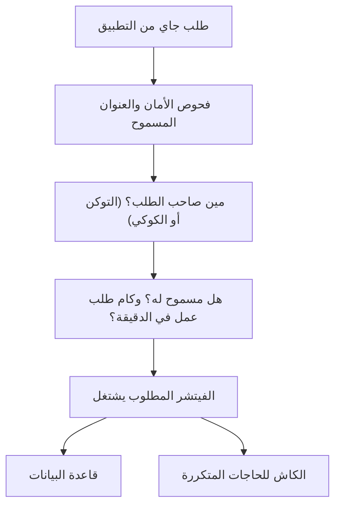

# السيرفر وقاعدة البيانات

> الصفحة دي بتشرح من غير كود «الأرضية» اللي كل حاجة في التطبيق واقفة عليها: السيرفر اللي بيستقبل الطلبات،
> وقاعدة البيانات، والكاش، والمهام اللي بتشتغل لوحدها كل يوم. الشرح الهندسي بالتفصيل في
> [الصفحة الإنجليزي](../../systems/platform.md)، والرسومات المتولّدة من الكود في
> [صفحة الحقائق](../../atlas/systems/platform.md).

## النظام ده بيعمل إيه
- **بيستقبل كل طلب** جاي من التطبيق أو الموبايل، ويتأكد إنه جاي من مكان مسموح بيه، وإن صاحبه مسجل دخول.
- **بيحدد إيه المسموح لكل واحد**: مستخدم عادي، مشترك، أدمن، وكام طلب في الدقيقة.
- **بيخزن البيانات** في قاعدة بيانات MySQL.
- **بيسرّع الحاجات المتكررة** في ذاكرة مؤقتة (Redis).
- **بيشغّل مهام يومية**: تنضيف الجلسات القديمة، التقارير الشهرية، مراجعة الاشتراكات، ومسح البيانات القديمة.

## في صورة واحدة

## ليه كده؟
- **الإعدادات بتتفحص وقت التشغيل**: لو ناقص إعداد أساسي (زي رابط قاعدة البيانات أو مفتاح التشفير)، السيرفر
  مابيشتغلش أصلاً بدل ما يقع بعدين قدام المستخدم.
- **حد أقصى للطلبات**: عشان محدش يقدر يجرب كلمات سر بالجملة أو يستهلك الذكاء الاصطناعي بلا حساب.
- **اليوم والشهر بتوقيت القاهرة**: عشان «مصاريف النهارده» تبقى نفس اليوم اللي عايشه المستخدم، مش يوم السيرفر.
- **المهمة الواحدة بتشتغل على سيرفر واحد**: حتى لو عندك أكتر من نسخة شغالة، التقرير الشهري مابيتبعتش مرتين.
- **البيانات القديمة بتتنضف**: السجلات التفصيلية بتتلخّص وبعدين بتتمسح، عشان القاعدة ماتكبرش بلا فايدة.
- **سجل السيرفر مابيكتبش بياناتك**: بيكتب «إيه اللي حصل ولمين» بس، من غير نص رسالة ولا كود توثيق ولا توكن، ورقم
  التليفون بيظهر آخر 4 أرقام منه بس. ولو عملية في قاعدة البيانات فشلت، الخطأ بيتكتب من غير البيانات اللي كانت
  بتتحفظ. ونفس القاعدة على Sentry، خدمة تقارير الأعطال الخارجية لو اتفعّلت. وأي كتابة جديدة في السجل بالطريقة
  القديمة بيرفضها فحص الكود.

## البيانات القديمة بتقعد قد إيه
| النوع | المدة |
| --- | --- |
| أحداث الاستخدام العامة | 30 يوم |
| سجلات التصنيف واستهلاك الذكاء الاصطناعي والإشعارات والصوت، ومشاكل المكالمات الصوتية | 90 يوم |
| سجل العمليات المالية اللي الذكاء الاصطناعي نفّذها، وسجل المكالمات الصوتية (المدة والتكلفة، من غير كلام) | سنة |
| رسايل الشات | 90 يوم بعد ما يتعمل لها ملخص |
| المصاريف نفسها | مابتتمسحش أبداً |

## حاجات مهم تعرفها
دي مشاكل موجودة فعلاً في الكود النهارده (الشرح الدقيق لكل واحدة في الصفحة الإنجليزي):
1. **دين تقني.** **في إعدادات بتتقري من البيئة مباشرة** من غير ما تعدي على الفحص، زي إعدادات التخزين ومفتاح Fireworks
   اللي السيرفر بيجهّز بيه البحث بالمعنى وهو بيشتغل.
2. **عطل.** **الأرقام القديمة بتضيع**: عدّاد الترقيات وتكلفة الذكاء الاصطناعي بتتمسح بعد شهر أو تلاتة، والملخص اللي
   بيتحفظ قبل المسح محدش بيقراه.
3. **دين تقني.** **صفحة غير موجودة** في وضع الإنتاج بتخلي السيرفر يقرا ملف من على الهارد مع كل طلب.
4. **دين تقني.** **مراقبة الأخطاء (Sentry)** بتتسجل بأقصى تفصيل لكل طلب، وده مكلف في الإنتاج.
5. **دين تقني.** **سكربت «تعبئة بيانات أولية» فاضي** ومابيعملش حاجة.
6. **دين تقني.** **السيرفر المنفصل بيكرر إعداد السيرفر الموحّد.** المكالمات الصوتية (القديمة والجديدة) بقت بتعدي في
   الاتنين على نفس الجزء، فاللي لازم يتظبط بإيد في المكانين بقى صغير: الإعدادات اللي بتتبعتله، والمسارات اللي بتتحوّل ليه.
7. **عطل.** **ملفات إنشاء قاعدة البيانات ناقصة حاجات**: القاعدة اللي بتتعمل منها مافيهاش القيد اللي بيمنع تسجيل نفس عملية
   دفع Paymob مرتين، ولا تعديلات جدول الجلسات. والفرق ده هيظهر لأول حد يعمل migration جديد.
8. **دين تقني.** **أماكن قديمة في الكود لسه بتكتب في السجل بالطريقة القديمة**: نص حر من غير اسم للحدث. مفيش منها حاجة
   بتكتب بيانات مستخدم النهارده، والإضافة الجديدة بالطريقة دي ممنوعة، والقديم بيقل كل ما ملف يتنقل للطريقة الجديدة.

## لو عايز تطلب تعديل
قول للـagent يقرا `docs/systems/platform.md` الأول. أمثلة لطلبات واضحة:
- «عايز أعرف كل حاجة الأدمن عملها»: ده جدول جديد، وده قرار في طبقة البيانات.
- «خلّي البيانات القديمة تفضل سنة»: ده تعديل في سياسات المسح.
- «عايز أضيف إعداد جديد للسيرفر»: بيتضاف في مكان واحد وبيتفحص وقت التشغيل.

## كلمات بتتكرر
| الكلمة | معناها |
| --- | --- |
| السيرفر | البرنامج اللي بيستقبل طلبات التطبيق ويرد عليها |
| قاعدة البيانات | المكان اللي البيانات متخزنة فيه (MySQL) |
| الكاش (Redis) | ذاكرة سريعة مؤقتة بتقلل الرجوع لقاعدة البيانات |
| الجلسة | دخول شغال لمستخدم على جهاز |
| حد الطلبات | أقصى عدد طلبات مسموح بيه في فترة قصيرة |
| المهمة المجدولة (cron) | شغل بيتنفذ في ميعاد ثابت من غير ما حد يطلبه |
| القفل (lock) | طريقة تمنع أكتر من سيرفر ينفذوا نفس المهمة في نفس الوقت |
| سجل السيرفر (log) | اللي السيرفر بيكتبه عن اللي بيحصل، عشان المبرمج يلاقي أي مشكلة لما تحصل |
