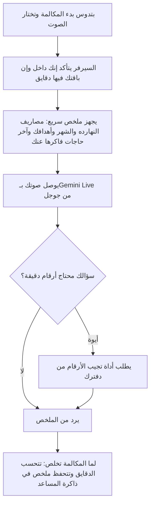

# المكالمة الصوتية

> الصفحة دي بتشرح من غير كود إزاي المكالمة الصوتية مع المستشار المالي بتشتغل جوه مركز الذكاء الاصطناعي. الشرح الهندسي
> بالتفصيل في [الصفحة الإنجليزي](../../systems/voice-calls.md)، والرسومات المتولّدة من الكود في
> [صفحة الحقائق](../../atlas/systems/voice-calls.md).

## النظام ده بيعمل إيه
بتكلم المساعد بصوتك كأنك بتكلم حد في التليفون، وهو بيرد عليك بصوت. تقدر تسأله «صرفت كام النهارده؟» أو «قارنلي الشهر
ده بالشهر اللي فات»، أو تقوله «اعملي هدف ادخار 10 آلاف»، وهو يجهز الطلب ويستنى موافقتك.

الفرق بينها وبين تسجيل مصروف بالصوت: التسجيل بالصوت بتقول جملة واحدة والتطبيق يحولها لعملية. المكالمة حوار مباشر.

## الرحلة في صورة واحدة

## بيحصل إيه بالترتيب
1. **بتختار الصوت** من تلات أصوات (Olivia وSarah وJames) وتدوس بدء.
2. **الموبايل أو المتصفح** بيطلب إذن الميكروفون، ويبعت صوتك للسيرفر بشكل مستمر طول ما المكالمة شغالة ومش كاتم الصوت.
3. **السيرفر بيتأكد** إنك مسجل دخول، وإن المكالمات مسموحة في باقتك، وإن لسه فاضلك دقايق الشهر ده. مدة المكالمة
   الواحدة ليها حد أقصى، والشهر كله ليه حد، والأدمن بيحدد الاتنين.
4. **قبل ما تتكلم** السيرفر بيجهز ملخص صغير عنك: مصاريفك ودخلك النهارده والشهر ده، وأهدافك، وشوية حاجات من ذاكرة
   المساعد. المساعد بيرد من الملخص ده على الأسئلة السريعة.
5. **المساعد بيبدأ بالتحية**، وبعدين الحوار ماشي. لو قاطعته وإنت بتتكلم، بيسكت ويسمعك.
6. **قبل النهاية بعشر ثواني** بيوصلك تنبيه، ولما الوقت يخلص المكالمة بتقفل.
7. **بعد المكالمة** الدقايق بتتحسب عليك، وملخص المكالمة بيتحفظ في ذاكرة المساعد عشان يفتكره بعدين.

## الأدوات: إزاي بيجيب أرقام حقيقية
المساعد ممنوع يخترع أرقام. لما تسأل عن رقم دقيق بيستخدم «أداة» تجيبه من دفترك:
- **استعلام مالي**: ملخص، أو أرصدة المحافظ، أو مقارنة بين فترتين، أو إجمالي فئة، أو تفصيل، أو آخر العمليات، أو تقدم الأهداف.
- **البحث في الذاكرة**: لو سألته عن حاجة اتكلمتوا فيها قبل كده.
- **تجهيز إجراء**: زي هدف أو مصروف أو ميزانية أو محفظة. بيجهزه بس، وبيسألك «أنفذ؟».
- **التنفيذ أو الإلغاء**: لما توافق بصوتك بينفذ، ولما ترفض بيلغي. الإجراءات الخطيرة (زي إيقاف هدف) مش المفروض تتنفذ بالصوت.

## حاجات مهم تعرفها
دي مشاكل موجودة فعلاً في الكود النهارده (الشرح الدقيق لكل واحدة في الصفحة الإنجليزي):
1. **عطل.** **أداة واحدة بس في المكالمة كلها**: أول سؤال محتاج أرقام دقيقة بيتجاوب، والتاني ماينفعش يجيب أرقام حقيقية.
2. **أمن.** **الإجراءات الخطيرة مالهاش زرار تأكيد** في شاشة المكالمة، فماتقدرش تكملها من المكالمة أصلاً.
3. **أمن.** **السيرفر بيكتب كلامك وكلام المساعد في سجلاته**، وده مخالف لقاعدة الخصوصية بتاعة المشروع.
4. **عطل.** **الإعدادات الافتراضية** اللي الكود بيستخدمها لما الأدمن مايحددش (زي عدد الدقايق المجانية) مختلفة عن اللي مكتوبة في
   قايمة الإعدادات.
5. **عطل.** **الدقايق الشهرية بتتحسب** مع ثواني تسجيل المصاريف بالصوت كأنهم رصيد واحد، وبتوقيت السيرفر مش القاهرة.
6. **عطل.** **لو السيرفر وقع في نص مكالمة**، مدتها مابتتحسبش.

## لو عايز تطلب تعديل
قول للـagent يقرا `docs/systems/voice-calls.md` الأول. أمثلة لطلبات واضحة:
- «عايز الباقة المجانية تاخد 10 دقايق في الشهر»: ده من إعدادات الأدمن من غير كود.
- «خلّي المساعد يقدر يجيب أرقام أكتر من مرة في المكالمة»: ده تعديل في سياسة التكلفة، وليه أثر على الفلوس اللي بتدفعها لجوجل.
- «ضيف زرار تأكيد للإجراءات الخطيرة في شاشة المكالمة»: ده تعديل في الشاشة والسيرفر.
- «امنع كتابة كلام المستخدم في سجلات السيرفر»: ده إصلاح خصوصية سريع.

## كلمات بتتكرر
| الكلمة | معناها |
| --- | --- |
| Gemini Live | خدمة من جوجل بتسمع الصوت وترد بصوت في نفس اللحظة |
| WebSocket | خط اتصال مفتوح طول المكالمة بين موبايلك والسيرفر |
| الملخص السريع (hot context) | معلومات قليلة عنك بتتجهز قبل المكالمة عشان المساعد يرد بسرعة |
| أداة (tool) | طلب بيعمله المساعد للسيرفر عشان يجيب أرقام حقيقية أو يجهز إجراء |
| إجراء معلق | طلب اتجهز ومستني موافقتك، وبيتلغي لوحده بعد نص ساعة |
| Redis | مخزن سريع السيرفر بيحفظ فيه حالة المكالمة وهي شغالة |
