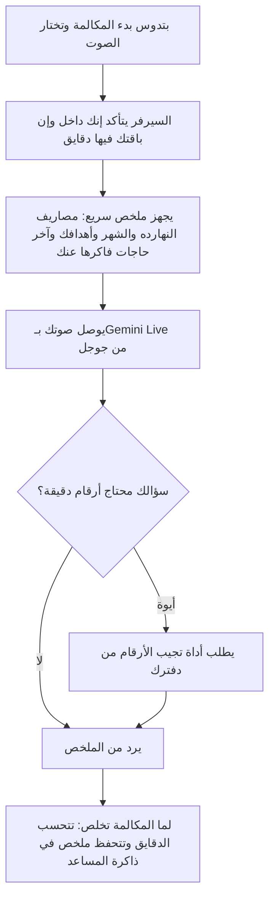

# المكالمة الصوتية

> الصفحة دي بتشرح من غير كود إزاي المكالمة الصوتية مع المستشار المالي بتشتغل جوه مركز الذكاء الاصطناعي. الشرح الهندسي
> بالتفصيل في [الصفحة الإنجليزي](../../systems/voice-calls.md)، والرسومات المتولّدة من الكود في
> [صفحة الحقائق](../../atlas/systems/voice-calls.md).

## النظام ده بيعمل إيه
بتكلم المساعد بصوتك كأنك بتكلم حد في التليفون، وهو بيرد عليك بصوت. تقدر تسأله «صرفت كام النهارده؟» أو «قارنلي الشهر
ده بالشهر اللي فات»، أو تقوله «اعملي هدف ادخار 10 آلاف»، وهو يجهز الطلب ويستنى موافقتك.

الفرق بينها وبين تسجيل مصروف بالصوت: التسجيل بالصوت بتقول جملة واحدة والتطبيق يحولها لعملية. المكالمة حوار مباشر.

## الرحلة في صورة واحدة

## بيحصل إيه بالترتيب
1. **بتختار الصوت** من تلات أصوات (Olivia وSarah وJames) وتدوس بدء.
2. **الموبايل أو المتصفح** بيطلب إذن الميكروفون، ويبعت صوتك للسيرفر بشكل مستمر طول ما المكالمة شغالة ومش كاتم الصوت.
3. **السيرفر بيتأكد** إنك مسجل دخول، وإن المكالمات مسموحة في باقتك، وإن لسه فاضلك دقايق الشهر ده. مدة المكالمة
   الواحدة ليها حد أقصى، والشهر كله ليه حد، والأدمن بيحدد الاتنين.
4. **قبل ما تتكلم** السيرفر بيجهز ملخص صغير عنك: مصاريفك ودخلك النهارده والشهر ده، وأهدافك، وشوية حاجات من ذاكرة
   المساعد. المساعد بيرد من الملخص ده على الأسئلة السريعة.
5. **المساعد بيبدأ بالتحية**، وبعدين الحوار ماشي. لو قاطعته وإنت بتتكلم، بيسكت ويسمعك.
6. **قبل النهاية بعشر ثواني** بيوصلك تنبيه، ولما الوقت يخلص المكالمة بتقفل.
7. **بعد المكالمة** الدقايق بتتحسب عليك، وملخص المكالمة بيتحفظ في ذاكرة المساعد عشان يفتكره بعدين.

كلامك وكلام المساعد مابيتكتبوش في سجل السيرفر: السجل بيكتب إن مكالمة بدأت لمين وعلى أنهي باقة، وطول الكلام، وأسماء
الأدوات اللي اتطلبت بس.

## الأدوات: إزاي بيجيب أرقام حقيقية
المساعد ممنوع يخترع أرقام. لما تسأل عن رقم دقيق بيستخدم «أداة» تجيبه من دفترك:
- **استعلام مالي**: ملخص، أو أرصدة المحافظ، أو مقارنة بين فترتين، أو إجمالي فئة، أو تفصيل، أو آخر العمليات، أو تقدم الأهداف.
- **البحث في الذاكرة**: لو سألته عن حاجة اتكلمتوا فيها قبل كده.
- **تجهيز إجراء**: زي هدف أو مصروف أو ميزانية أو محفظة. بيجهزه بس، وبيسألك «أنفذ؟».
- **التنفيذ أو الإلغاء**: لما توافق بصوتك بينفذ، ولما ترفض بيلغي. الإجراءات اللي مابترجعش (زي إيقاف هدف) مش بتتنفذ
  بالصوت: المساعد بيقولك كده، والشاشة بتكتبلك تكملها من الشات، وهناك بتكتب جملة التأكيد.

## المكالمة الجديدة
المكالمة اتبنت من الأول جنب القديمة، وهتحل محلها. الأدمن والمسموح لهم بيوصلوها دلوقتي، والباقي بالتدريج بنسبة بيحددها
الأدمن؛ وأي حد لسه برا النسبة بيفتح المكالمة القديمة.
- **منين تبدأها**: زرار «كلّم سمارت» في الصفحة الرئيسية وعليه الدقايق الفاضلة، وتبويب المكالمة في مركز الذكاء
  الاصطناعي وفيه تختار صوت من أربعة. أول مرة بتشوف أربع سطور بتشرح المكالمة وإيه اللي بيتحفظ.
- **مكالمة واحدة للتطبيق كله**: تقدر تصغّرها (أو تدوس رجوع في الموبايل) فتبقى شريط صغير فوق وانت بتتنقل في التطبيق،
  وتفضل شغالة. ولو كارت شرح فيه زرار يفتح شاشة، بيفتحها ويصغّر المكالمة. والشاشة مابتطفيش طول المكالمة.
- **مين يكلم وقد إيه وعلى أنهي موديل**: مكان واحد بيقرر. بيقرا إعدادات الباقة (مسموح ولا لأ، دقايق الشهر، ومدة المكالمة
  الواحدة)، والموديل لكل باقة، وسقف تكلفة يومي بالدولار. والدقايق بتتحسب بشهر القاهرة من المكالمات بس، من غير ثواني
  تسجيل المصاريف بالمايك. والأدمن والمسموح لهم بيجربوها الأول، والباقي بنسبة بيحددها الأدمن، وفيه زرار يوقفها للكل.
- **بداية المكالمة**: التطبيق بياخد «تذكرة» تنفع مرة واحدة خلال دقيقة، وبيفتح بيها المكالمة. مفيش توكن بيتبعت في
  الرابط. وفيه حد لعدد المكالمات اللي تبدأها في وقت قصير.
- **قبل أول كلمة**: المساعد بيعرف اسمك ولقبك من وظيفتك، وصرفت كام النهارده ومن أول الشهر، وفاضل كام يوم على المرتب،
  وكام حاجة فاكرها عنك. وبيبدأ بتحية من غير أرقام. ولو فيه حاجة التطبيق لسه مايعرفهاش عنك (زي يوم المرتب أو عليك
  أقساط ولا لأ)، ممكن يسألك عنها مرة واحدة، بعد ما يخلص اللي كلمته عشانه.
- **الكلام**: التطبيق بيبعت صوتك وانت بتتكلم بس، وبيقول للسيرفر «خلص» أول ما تسكت، فالرد بييجي أسرع والسكوت مابيتحاسبش.
  بيستنى نص ثانية تقريباً بعد رد قصير زي «آه»، وأكتر شوية بعد جملة طويلة عشان لو وقفت تفتكر رقم. وبينضّف الصوت قبل ما
  يبعته عشان حروف زي «س» و«ش» تتسمع صح. الكلام المكتوب على الشاشة بيتعرض بس، ومابيتحفظش.
- **لو قاطعت المساعد**: صوته بيوطى على طول ويسكت لو فعلاً بتتكلم. وصوته هو من السماعة مابيتحسبش مقاطعة.
- **النت لو قطع**: المكالمة مابتقفلش. التطبيق بيحاول يرجّعها لوحده على طول وأول ما النت يرجع، ولو رجعت خلال 45 ثانية
  بتكمل من مكانها، حتى لو على سيرفر تاني. ولو الخط فضل ساكت من غير ما يقطع، التطبيق والسيرفر بيعرفوا إنه مات.
- **الأدوات**: أي رقم من حساباتك (إجمالي، فين راحت الفلوس، مقارنة بنفس الأيام من الفترة اللي فاتت وإيه اللي غيّرها،
  آخر العمليات، ليه عملية معينة اتصنفت كده، التصنيف بيشمل إيه، تقرير شهر اتكتب قبل كده، تقدر تشتري حاجة بمبلغ معين
  ولا لأ، المحافظ، الميزانيات، الأهداف، والعمليات اللي ماتسجلتش لسه عشان مستنية ردك)؛ تسجيل مصروف أو دخل (ومنه تكملة
  عملية كانت مستنية رد: بياخد كلامك الأولاني من التطبيق ويضيف عليه ردك، وبتتقفل بس لما توافق على التسجيل)؛ تجهيز هدف أو ميزانية أو محفظة
  أو تعديل؛ التأكيد والإلغاء؛ الذاكرة (يدوّر، يفتكر اللي تطلبه، ينسى، يقولك عارف عنك إيه لما تسأله، ويحفظ ردك على سؤال
  التطبيق)؛ شرح التطبيق؛ تفكير أعمق للأسئلة الصعبة؛ سعر الدهب والعملات بالمصدر والوقت. والتسجيل بيعدي على نفس الطريق
  بتاع الكتابة، فالمصروف بيتصنّف ويتحفظ زي أي مصروف مكتوب. ولما تدوّر على عملية من غير ما تحدد فترة، بيدوّر في آخر
  90 يوم، وبيلاقيها بكلمة منها («أوبر») أو بتصنيفها أو بمبلغها.
- **اللي اتكتب قبل كده بيتقري، مش بيتحسب من الأول**: تقرير الشهر بيتاخد من التحليل اللي التطبيق كتبه للشهر ده، أو من
  تقرير آخر الشهر، مع أرقام الشهر نفسه، ولو مفيش تقرير بيقولك كده. والأرقام بتيجي من ذاكرة سريعة (Redis) لو اتحسبت
  قريب، ومن قاعدة البيانات لو لأ. وكل إجابة بتتختصر لكام رقم، لأن جوجل بيحاسب على كل كلمة اتقالت للمساعد تاني في كل دور.
- **الأرقام**: كل رقم فلوس المساعد بيقوله بيتراجع على الأرقام اللي جت من الأدوات، ومن كلامك. لو قال رقم غلط وإحنا
  عارفين الصح، بيتقاله يصحح على طول. والتصحيح بيبقى بس لرقم قريب من اللي اتقال (نفس عدد الخانات)، أو شبهه في السمع
  (خمستاشر وخمسين)، فمابيتصححش رقم لرقم تاني مالوش علاقة بيه. وأي رقم مش مفهوم مصدره بيتسجل كمشكلة من غير الكلام نفسه.
- **الموافقة**: مفيش حاجة بتتسجل غير بعد ما تضغط على الكارت أو تقول «آه» بعد ما المساعد يعرض اللي هيسجله. «تمام» قبل
  العرض مش موافقة، ولو قلت رقم جديد يبقى تعديل مش موافقة. والتسجيل مابيتكررش حتى لو النت قطع وقت الحفظ. ولو المساعد قال
  «سجلت» أو «اتعمل» والحاجة لسه مستنية موافقتك، بيتقاله على طول يصحح ويسألك.
- **النهاية**: لما تقفل، أو الوقت يخلص (بتنبيه قبلها بدقيقة، و30 ثانية زيادة لو فيه حاجة مستنية موافقتك)، أو سقف التكلفة،
  أو دقيقتين ونص سكوت، أو النت. وفي الآخر بيظهرلك اللي اتعمل واللي ماتعملش. الكلام بيفضل ساعة بس في الذاكرة المؤقتة
  عشان ملخص المكالمة، ومابيتكتبش في قاعدة البيانات.
- **بعد المكالمة**: موديل نصي بيقرا الكلام مرة واحدة ويكتب ملخص من سطرين ولحد خمس حاجات تستاهل تتفتكر (خطط، اتفاقات،
  تفضيلات، حقايق ثابتة)، من غير ما يكرر اللي فاكره قبل كده. مابيحفظش أبداً السن ولا النوع ولا الصحة ولا الدين ولا أحكام
  على شخصيتك. بعدها الكلام بيتمسح. الملخص والحاجات دي بتظهر في «ذاكرة سمارت» (الملخص مكتوب عليه «ملخص مكالمة»)
  وتقدر تمسحها، والمكالمة الجاية بتفتكرها. ولو الموديل مشغول بيجرب موديل تاني، ولو فشل بيتحاول تاني لحد ساعة.
- **الشاشة**: بتقولك المكالمة بتعمل إيه (سامعك، بيفكر وبيقول مستني إيه زي «بيراجع حساباتك…» أو «بيجيب السعر…»،
  بيتكلم، مستني موافقتك، بيرجّع الخط)، والكلام مكتوب لو عايزه،
  والكروت: رقم وفترته واللي ناقص منه، ومسودة بزرار تأكيد وإلغاء، وخطوات من دليل التطبيق، وسعر بمصدره ووقته. تقدر تكتب
  بدل ما تتكلم، أو تقفل الميكروفون. ولو الميكروفون مش متاح المكالمة بتكمل بالكتابة. وفي الآخر بتشوف اللي اتعمل واللي
  ماتعملش ومدة المكالمة. الأدمن بس بيشوف لوحة تتبع تقنية.
- **سجل المكالمات**: صف لكل مكالمة فيه مدتها وتكلفتها الحقيقية وسرعة أول رد، من غير أي كلام اتقال. بيتمسح مع الحساب،
  ومايقعدش أكتر من سنة.
- **نطق الأرقام بالمصري**: «تمن آلاف وربعمية» مش «ثمانية آلاف وأربعمائة»، و«حوالي خمستاشر ألف» لما الرقم يتقرّب، و«ألفين
  ونص». وكل صيغة بتتقري تاني لنفس الرقم، عشان نقدر نراجع أي رقم الموديل يقوله.

## حاجات مهم تعرفها
دي مشاكل موجودة فعلاً في الكود النهارده (الشرح الدقيق لكل واحدة في الصفحة الإنجليزي):
1. **عطل.** **أداة واحدة بس في المكالمة كلها**: أول سؤال محتاج أرقام دقيقة بيتجاوب، والتاني ماينفعش يجيب أرقام حقيقية.
2. **عطل.** **الإعدادات الافتراضية** اللي الكود بيستخدمها لما الأدمن مايحددش (زي عدد الدقايق المجانية) مختلفة عن اللي مكتوبة في
   قايمة الإعدادات.
3. **عطل.** **الدقايق الشهرية بتتحسب** مع ثواني تسجيل المصاريف بالصوت كأنهم رصيد واحد، وبتوقيت السيرفر مش القاهرة.
4. **عطل.** **لو السيرفر وقع في نص مكالمة**، مدتها مابتتحسبش.
5. **عطل.** **المكالمة القديمة مابتسمعش الميكروفون في الموقع وتطبيق الويب** اللي السيرفر بيقدّمهم: طريقة تشغيل الصوت فيها
   ممنوعة بإعدادات الأمان بتاعة الصفحة. المكالمة الجديدة مش فيها المشكلة دي.
6. **دين تقني.** **المكالمة القديمة بتعرض لوحة تتبع تقنية لكل الناس**؛ الجديدة بتعرضها للأدمن بس.
7. **ناقص.** **سؤال التطبيق اللي تعدّيه من غير رد** بيتسأل تاني في المكالمة الجاية؛ بيتشال من القايمة بس لما ترد أو تقول
   مش عايز تقول.

## لو عايز تطلب تعديل
قول للـagent يقرا `docs/systems/voice-calls.md` الأول. أمثلة لطلبات واضحة:
- «عايز الباقة المجانية تاخد 10 دقايق في الشهر»: ده من إعدادات الأدمن من غير كود.
- «خلّي المساعد يقدر يجيب أرقام أكتر من مرة في المكالمة»: ده تعديل في سياسة التكلفة، وليه أثر على الفلوس اللي بتدفعها لجوجل.

## كلمات بتتكرر
| الكلمة | معناها |
| --- | --- |
| Gemini Live | خدمة من جوجل بتسمع الصوت وترد بصوت في نفس اللحظة |
| WebSocket | خط اتصال مفتوح طول المكالمة بين موبايلك والسيرفر |
| الملخص السريع (hot context) | معلومات قليلة عنك بتتجهز قبل المكالمة عشان المساعد يرد بسرعة |
| أداة (tool) | طلب بيعمله المساعد للسيرفر عشان يجيب أرقام حقيقية أو يجهز إجراء |
| إجراء معلق | طلب اتجهز ومستني موافقتك، وبيتلغي لوحده بعد نص ساعة |
| Redis | مخزن سريع السيرفر بيحفظ فيه حالة المكالمة وهي شغالة |
