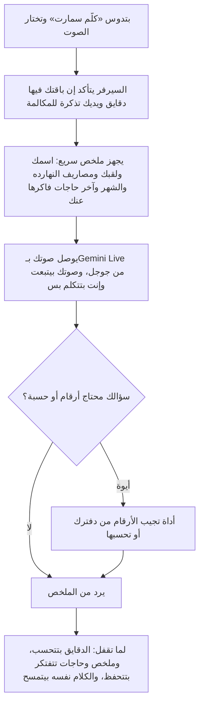

# المكالمة الصوتية

> الصفحة دي بتشرح من غير كود إزاي المكالمة الصوتية مع سمارت بتشتغل، من الصفحة الرئيسية أو من مركز الذكاء الاصطناعي. الشرح الهندسي
> بالتفصيل في [الصفحة الإنجليزي](../../systems/voice-calls.md)، والرسومات المتولّدة من الكود في
> [صفحة الحقائق](../../atlas/systems/voice-calls.md).

## النظام ده بيعمل إيه
المكالمة شغالة كمان في نسخة التطوير المحلية مع `npm run dev`: اتصال الصوت مربوط بنفس السيرفر اللي فاتح الصفحة،
وبنفس مخزن تذاكر المكالمات. الاتصال بيقبل العناوين المسموح بيها بس، ولو تحميل خدمة الصوت فشل بيرجع خطأ واضح بدل
ما يفضل معلّق. اختبار تلقائي بيشغّل سيرفر التطوير ويتأكد إن الصوت وتحديث الصفحة شغالين مع بعض.

بتكلم المساعد بصوتك كأنك بتكلم حد في التليفون، وهو بيرد عليك بصوت. تقدر تسأله «صرفت كام النهارده؟» أو «قارنلي الشهر
ده بالشهر اللي فات»، أو تقوله «اعملي هدف ادخار 10 آلاف»، وهو يجهز الطلب ويستنى موافقتك.

الفرق بينها وبين تسجيل مصروف بالصوت: التسجيل بالصوت بتقول جملة واحدة والتطبيق يحولها لعملية. المكالمة حوار مباشر.

## الرحلة في صورة واحدة

```mermaid
flowchart TD
  A["بتدوس «كلّم سمارت» وتختار الصوت"] --> B["السيرفر يتأكد إن باقتك فيها دقايق ويديك تذكرة للمكالمة"]
  B --> C["يجهز ملخص سريع: اسمك ولقبك ومصاريف النهارده والشهر وآخر حاجات فاكرها عنك"]
  C --> D["يوصل صوتك بـGemini Live من جوجل، وصوتك بيتبعت وإنت بتتكلم بس"]
  D --> E{"سؤالك محتاج أرقام أو حسبة؟"}
  E -->|"لا"| F["يرد من الملخص"]
  E -->|"أيوة"| G["أداة تجيب الأرقام من دفترك أو تحسبها"]
  G --> F
  F --> H["لما تقفل: الدقايق بتتحسب، وملخص وحاجات تتفتكر بتتحفظ، والكلام نفسه بيتمسح"]
```

## المكالمة خطوة بخطوة
كل اللي باقته فيها مكالمات بيوصلها. المكالمة الأولانية القديمة اتشالت يوم 25/9/2026.
- **منين تبدأها**: زرار «كلّم سمارت» في الصفحة الرئيسية وعليه الدقايق الفاضلة، وتبويب المكالمة في مركز الذكاء
  الاصطناعي وفيه تختار صوت من أربعة. أول مرة بتشوف أربع سطور بتشرح المكالمة وإيه اللي بيتحفظ.
- **مكالمة واحدة للتطبيق كله**: تقدر تصغّرها (أو تدوس رجوع في الموبايل) فتبقى شريط صغير فوق وانت بتتنقل في التطبيق،
  وتفضل شغالة. ولو كارت شرح فيه زرار يفتح شاشة، بيفتحها ويصغّر المكالمة. والشاشة مابتطفيش طول المكالمة.
- **مين يكلم وقد إيه وعلى أنهي موديل**: مكان واحد بيقرر. بيقرا إعدادات الباقة (مسموح ولا لأ، دقايق الشهر، ومدة المكالمة
  الواحدة)، والموديل لكل باقة، وسقف تكلفة يومي بالدولار. والدقايق بتتحسب بشهر القاهرة من المكالمات بس، من غير ثواني
  تسجيل المصاريف بالمايك. وفيه زرار عند الأدمن يوقفها للكل.
- **سمارت المدرب**: نسخة من المكالمة بتعليمات وأدوات مختلفة، بتروح بس للحسابات اللي الأدمن كتبها (زي local:12) ولنسبة
  من الباقيين بيحددها، ونفس الشخص بيفضل جوه لما النسبة تزيد. من غير كده محدش بياخدها. بتشتغل على موديل الباقة العادي
  زي أي مكالمة.
- **«تفكير أعمق»**: زرار في شاشة المكالمة لمستخدمين المدرب في الباقات اللي الأدمن فعّلها (مقفول في الأول). بيحوّل
  المكالمة للموديل اللي بيفكر أعمق (Extended Thinking) بمستوى low، وده المستوى اللي بيتأهل دلوقتي: بيقرا كل حاجة ليها
  علاقة بسؤالك الأول، ويحسب احتمالين أو تلاتة بالحاسبة، وبعدين يقولك التوصية باختصار ويعرض التفاصيل. أبطأ شوية،
  والزرار بيقول كده. التحويل بيستنى لحد ما مفيش أداة شغالة، وبيحجز مكان عند الموديل الجديد، وبيفتح جلسة جديدة ومعاها
  آخر كلامكم عشان يكمل من غير ما يعيد؛ والمسودات والموافقات والعداد عند السيرفر فمابيضيعوش. ولو الموديل الجديد
  ماشتغلش، المكالمة بترجع للي كانت عليه وبتقولك كده، عمر الموديل ما بيتغير من غير ما تعرف. واختيارك بيتفتكر على
  الجهاز للمكالمة الجاية. والوضع ده بتاع التطبيق، مالوش علاقة بباقة جوجل ولا بصلاحية الأدمن.
  المدرب بيفهم الكلام العادي («المرتب بيطير»، «نفسي أجيب موبايل») ويجيب اللي محتاجه بنفسه، وبيسأل سؤال واحد بس لو
  هيغير النصيحة، وبيمشي معاك من الهدف لخطوة صغيرة انت اللي تختارها. وأي حسبة (الفاضل، في اليوم، كام شهر للهدف) بتتعمل
  في «الحاسبة» مش في دماغ الموديل: بتاخد الأرقام من نتايج الأدوات بعلامتها (زي f12) أو من كلامك إنت بس، وبتحسب بدقة
  بالقروش والوحدات (فلوس في أيام، فلوس على أيام)، ومابتقبلش «فلوس في فلوس» ولا مبلغ محدش قاله.
- **المدرب بيتابع معاك**: بيقرا اللي عليك والفاضل لحد القبض (والدخل المتوقع لوحده)، والخطة اللي اتفقتوا عليها وماشية
  إزاي من يوم الاتفاق (والأيام اللي مفيهاش أي تسجيل بيقول إنها ممكن تكون ماتسجلتش، مش إنك التزمت). وبموافقتك بس بيحفظ
  الخطة، ويعلّم خطوة إنها اتعملت، ويظبط أو يلغي تذكير جوه التطبيق بتوقيت القاهرة، ويضيف التزام (من غير ما يخترع ميعاد)
  أو يسجل إنه اتدفع. وأي مبلغ في الحاجات دي لازم يكون من أرقامك أو من الحاسبة أو من كلامك. المكالمة العادية مابتعملش ده.
- **بداية المكالمة**: التطبيق بياخد «تذكرة» تنفع مرة واحدة خلال دقيقة، وبيفتح بيها المكالمة. مفيش توكن بيتبعت في
  الرابط. وفيه حد لعدد المكالمات اللي تبدأها في وقت قصير.
- **الأماكن المتاحة**: حدود جوجل على المشروع كله ولكل موديل، فكل مكالمة بتحجز «مكان» من عدد مشترك بين كل السيرفرات
  لكل موديل (الأدمن بيحدده من حدود المشروع الحقيقية)، ومكالمة واحدة شغالة لكل مستخدم. المكان بيتجدد طول المكالمة
  ويرجع أول ما تخلص، ولو سيرفر وقع المكان بيرجع لوحده خلال دقيقة. ولو جوجل رفض صراحة عشان الحصة خلصت، المكالمات
  الجديدة على الموديل ده بتستنى دقيقة (وأكتر لو اتكرر في نفس الساعة، لحد نص ساعة)، واللي شغالة بتكمل. ولكل حالة رسالة
  واضحة: الخطوط مشغولة، عندك مكالمة على جهاز تاني، أو الاستخدام وصل للحد. والمفتاح التاني عمره ما بيتجرب عشان يتحايل
  على حصة خلصت.
- **قبل أول كلمة**: المساعد بيعرف اسمك ولقبك من وظيفتك، وصرفت كام النهارده ومن أول الشهر، وفاضل كام يوم على المرتب،
  وكام حاجة فاكرها عنك. وبيبدأ بتحية من غير أرقام. ولو فيه حاجة التطبيق لسه مايعرفهاش عنك (زي يوم المرتب أو عليك
  أقساط ولا لأ)، ممكن يسألك عنها مرة واحدة، بعد ما يخلص اللي كلمته عشانه. ومش هيسأل تاني، هو ولا كارت الرئيسية، قبل يوم، حتى لو ماسألش فعلاً.
- **الكلام**: التطبيق بيبعت صوتك وانت بتتكلم بس، وبيقول للسيرفر «خلص» أول ما تسكت، فالرد بييجي أسرع والسكوت مابيتحاسبش.
  بيستنى نص ثانية تقريباً بعد رد قصير زي «آه»، وأكتر شوية بعد جملة طويلة عشان لو وقفت تفتكر رقم. وبينضّف الصوت قبل ما
  يبعته عشان حروف زي «س» و«ش» تتسمع صح. الكلام المكتوب على الشاشة بيتعرض بس، ومابيتحفظش.
- **لو قاطعت المساعد**: صوته بيوطى على طول ويسكت لو فعلاً بتتكلم. وصوته هو من السماعة مابيتحسبش مقاطعة.
- **النت لو قطع**: المكالمة مابتقفلش. التطبيق بيحاول يرجّعها لوحده على طول وأول ما النت يرجع، ولو رجعت خلال 45 ثانية
  بتكمل من مكانها، حتى لو على سيرفر تاني. ولو الخط فضل ساكت من غير ما يقطع، التطبيق والسيرفر بيعرفوا إنه مات.
- **الأدوات**: أي رقم من حساباتك (إجمالي، فين راحت الفلوس، مقارنة بنفس الأيام من الفترة اللي فاتت وإيه اللي غيّرها،
  آخر العمليات، ليه عملية معينة اتصنفت كده، التصنيف بيشمل إيه، تقرير شهر اتكتب قبل كده، تقدر تشتري حاجة بمبلغ معين
  ولا لأ، المحافظ، الميزانيات، الأهداف، والعمليات اللي ماتسجلتش لسه عشان مستنية ردك)؛ تسجيل مصروف أو دخل (ومنه تكملة
  عملية كانت مستنية رد: بياخد كلامك الأولاني من التطبيق ويضيف عليه ردك، وبتتقفل بس لما توافق على التسجيل)؛ تجهيز هدف أو ميزانية أو محفظة
  أو تعديل؛ التأكيد والإلغاء؛ الذاكرة (يدوّر، يفتكر اللي تطلبه، ينسى وده بيمسح الحاجة فعلاً ومابترجعش في ملخص المكالمة، يقولك عارف عنك إيه لما تسأله، ويحفظ ردك على سؤال
  التطبيق)؛ شرح التطبيق؛ تفكير أعمق للأسئلة الصعبة؛ سعر الدهب والعملات بالمصدر والوقت. والتسجيل بيعدي على نفس الطريق
  بتاع الكتابة، فالمصروف بيتصنّف ويتحفظ زي أي مصروف مكتوب. ولما تدوّر على عملية من غير ما تحدد فترة، بيدوّر في آخر
  90 يوم، وبيلاقيها بكلمة منها («أوبر») أو بتصنيفها أو بمبلغها، والبحث ده بيتعمل على الفترة كلها مش على آخر كام عملية.
  ورصيد كل محفظة بيتقال معاه يوم ما اتكتب، أو «مش معروف امتى».
  وبيقرا كمان «ليك وعليك» والجمعية والأقساط وصرف المواسم (رمضان والأعياد والمدارس والصيف) من نفس المكان اللي بتقرا
  منه شاشاتها، ومعاهم ملاحظة بيتبنوا على إيه (السلف المتسجلة كتحويل بس، ومفيش مواعيد استحقاق متسجلة).
  واسم التصنيف بيتفهم زي ما بتقوله («الأكل»، «المطاعم»). مقارنة تصنيف («الأكل الشهر ده والشهر اللي فات») بتقارن التصنيف
  ده بس. «جالي كام من أحمد» بيجيب الدخل اللي جالك منه، مش اللي دفعته له. و«صرفت كام على طلبات» بيجمع كل صرفك هناك في
  الفترة. ولو المصروف عدّى الدخل، بيتقالك إن فيه عجز، مش إن الفاضل صفر.
- **المرتجع والشخص**: لما تقول «رجعت القميص وخدت تلتمية»، المسودة مكتوب عليها «مرتجع»، وبتتحفظ كفلوس رجعتلك بتتخصم من
  مصروف التسوق، زي ما بتتحفظ بالكتابة بالظبط، مش كمصروف جديد. والشخص اللي بتذكره جنب الغرض («مصاريف مدرسة ابني»)
  بيتحفظ معاها. ومسودة فيها مصروف ومرتجع مع بعض مالهاش إجمالي واحد.
- **السعر لازم يكون من صفحة حقيقية**: سعر الدهب أو العملة بيتقال بس لو بحث جوجل لقاه في صفحة، والمصدر هو الصفحة دي
  (ولينكها على الكارت) مش اسم الموديل كتبه، والوقت هو وقت ما اتجاب بتوقيت القاهرة؛ من غير كده بيقول مفيش سعر.
- **رسايل البنك المستنية موافقتك** بتتقرا لوحدها غير العمليات اللي ناقصها رد، ومابتتسجلش تاني بالكلام عشان ماتتسجلش
  مرتين؛ المدرب يقدر يأكدها أو يشيلها زي ما هي بموافقتك.
- **التفكير والأسعار سريعين عشان إنت مستني على الخط**: بيستخدموا موديل سريع (3.5 Flash Lite)، ولو اتأخر 5 ثواني السؤال
  بيروح للموديل اللي بعده، والإجابة كلها لازم تخلص في 9 ثواني. ووقت السعر بيتقال بتوقيت القاهرة. وتكلفة الموديلات دي بتتحسب ضمن تكلفة المكالمة وسقفها اليومي.
- **اللي اتكتب قبل كده بيتقري، مش بيتحسب من الأول**: تقرير الشهر بيتاخد من التحليل اللي التطبيق كتبه للشهر ده، أو من
  تقرير آخر الشهر، مع أرقام الشهر نفسه، ولو مفيش تقرير بيقولك كده. والأرقام بتيجي من ذاكرة سريعة (Redis) لو اتحسبت
  قريب، ومن قاعدة البيانات لو لأ. وكل إجابة بتتختصر لكام رقم، لأن جوجل بيحاسب على كل كلمة اتقالت للمساعد تاني في كل دور.
- **لو السجل اتغير وانت بتتكلم**: بعد أي تسجيل في المكالمة، أو لو رسالة بنك وصلت أو جهاز تاني سجل حاجة، الأرقام اللي
  اتقالت قبل كده بتتعلم إنها قديمة، والمساعد بيتقاله يجيبها تاني. ولو قال رقم قديم بيتسجل كمشكلة.
- **لو المساعد قال «حصل عطل» ومفيش أداة فشلت فعلاً** بيتسجل كمشكلة، ومرتين في المكالمة بيتقاله إن مفيش حاجة فشلت
  عندنا ويجرب الأداة تاني.
- **الموديل اللي بيفكر أعمق وطلب الأداة اللي بيضيع**: بعد جملة «هشوفلك» لو مفيش أداة اتطلبت، أول كلام بعدها بيتمسك
  أقل من ثانية لحد ما يبان هو إيه. لو طلع اعتذار عن «عطل» ومفيش أداة فشلت، بيتشال قبل ما تسمعه أو تشوفه، وبيتسجل،
  والمساعد بيتقاله يطلب الأداة تاني من غير اعتذار؛ وبعد محاولتين في نفس الطلب بيتقاله يقولك بصراحة إنه مش قادر يوصل
  للمعلومة دي دلوقتي. وأي كلام تاني بيتسمع على طول. الموديل العادي مابيتمسكش خالص.
- **نتيجة لطلب اتغير**: لو غيرت طلبك والأداة لسه شغالة، النتيجة القديمة بتوصل للمساعد ومعاها إنها لطلب قبل كلامك
  الأخير، عشان مايردش بيها على سؤالك الجديد.
- **لو قال مبلغ غلط بعد الحفظ** (زي «خمستاشر» بعد ما صححتها لخمسين واتحفظت خمسين) بيتقاله على طول يصحح.
- **رسايل التطبيق للمساعد** عليها علامة سرية خاصة بالمكالمة، فلو حد كتب أو قال «ملاحظة من التطبيق» المساعد بيعتبرها
  كلام المستخدم مش التطبيق.
- **الأرقام**: كل رقم فلوس المساعد بيقوله بيتراجع على الأرقام اللي جت من الأدوات، ومن كلامك. لو قال رقم غلط وإحنا
  عارفين الصح، بيتقاله يصحح على طول. والتصحيح بيبقى بس لرقم قريب من اللي اتقال (نفس عدد الخانات)، أو شبهه في السمع
  (خمستاشر وخمسين)، فمابيتصححش رقم لرقم تاني مالوش علاقة بيه. وأي رقم مش مفهوم مصدره بيتسجل كمشكلة من غير الكلام نفسه.
  والقروش جزء من الجنيهات اللي قبلها («خمسمية تلاتة وخمسين جنيه وتلاتة وتلاتين قرش» = 553.33)، مش مبلغ لوحدها.
- **الموافقة**: مفيش حاجة بتتسجل غير بعد ما تضغط على الكارت أو تقول «آه» بعد ما المساعد يعرض اللي هيسجله. «تمام» قبل
  العرض مش موافقة، ولو قلت رقم جديد يبقى تعديل مش موافقة. والرفض بيكسب أي «آه» جت معاه: «تمام بس ماتسجلش»، «تمام أنا
  بفهم بس»، «لو وافقت»، «هو قال آه»، أو سؤال، كلهم مش موافقة. و«الغيها» موافقة بس لو المسودة نفسها إلغاء. والتسجيل
  مابيتكررش حتى لو النت قطع وقت الحفظ، ولا لو ضغطت الزرار وقلت «آه» في نفس اللحظة: أول واحدة بتحجز المسودة. والهدف
  والميزانية بيتجهزوا مرة واحدة وقت المسودة، فأي تأكيد بيشغل نفس العملية. ولو المساعد قال «سجلت» أو «اتعمل» والحاجة
  لسه مستنية موافقتك، بيتقاله على طول يصحح ويسألك.
- **النهاية**: لما تقفل، أو الوقت يخلص (بتنبيه قبلها بدقيقة، و30 ثانية زيادة لو فيه حاجة مستنية موافقتك)، أو سقف التكلفة،
  أو دقيقتين ونص سكوت، أو النت. وفي الآخر بيظهرلك اللي اتعمل واللي ماتعملش. الكلام بيفضل ساعة بس في الذاكرة المؤقتة
  عشان ملخص المكالمة، ومابيتكتبش في قاعدة البيانات.
- **بعد المكالمة**: موديل نصي بيقرا الكلام مرة واحدة ويكتب ملخص من سطرين ولحد ست حاجات تستاهل تتفتكر (خطط، اتفاقات،
  تفضيلات، حقايق ثابتة، عرض رفضته، وحاجة نكملها المرة الجاية)، من غير ما يكرر اللي فاكره قبل كده. وكل حاجة ممكن
  يكون ليها «خانة» معروفة (يوم المرتب، الإيجار، هدف معين، طريقة كلامك المفضلة...): الكلام الجديد عن نفس الخانة بيحل
  محل القديم بدل ما يتكوموا جنب بعض. والعرض اللي رفضته بيتفتكر 30 يوم بس عشان مايتعادش عليك، والحاجة اللي هنكملها
  21 يوم، وبعدها بيتنسوا لوحدهم، والمكالمة اللي خلّصت حاجة مفتوحة بتقفلها. وفي بداية كل مكالمة المساعد بيعرف اللي
  قلته قبل كده ومعاه يومه (عشان ممكن يكون اتغير)، واللي مفتوح، واللي رفضته، وآخر مكالمة. مابيحفظش أبداً السن ولا النوع ولا الصحة ولا الدين ولا أحكام
  على شخصيتك. بعدها الكلام بيتمسح. الملخص والحاجات دي بتظهر في «ذاكرة سمارت» (الملخص مكتوب عليه «ملخص مكالمة»)
  وتقدر تمسحها، والمكالمة الجاية بتفتكرها. ولو الموديل مشغول بيجرب موديل تاني، ولو فشل بيتحاول تاني لحد ساعة.
- **لو خرجت من حسابك** أو دخل حساب تاني على نفس الجهاز، المكالمة بتقفل فوراً، والمايك والخط بيتقفلوا، ومفيش حاجة منها
  بتفضل على الشاشة للي بعدك.
- **«الشهر ده»** في المكالمة معناه من يوم القبض لو ليك يوم مرتب، وبيتقال كده.
- **الشاشة بتمشي مع الشغل مش مع ساعة**: طول ما فيه أداة شغالة بتفضل على «بيفكر»، ولما الإجابات كلها توصل المساعد
  قدامه ثواني يبدأ يتكلم. وكل إجابة أداة بتروح للمساعد أول ما تجهز، مش بتستنى الأبطأ. والموديل اللي بيفكر أعمق ممكن
  يقول جملة وهو لسه شغال، فالشاشة بتفضل «بيفكر» لحد ما يقول إنه خلص فعلاً. ورسايل التطبيق للمساعد (زي إنك ضغطت تأكيد،
  أو إن الوقت قرب يخلص) بتستنى لحد ما يخلص كلامه بدل ما تقطعه، إلا تصحيح رقم غلط أو «اتسجل» قبل الموافقة. والحفظ اللي
  بياخد وقت مابيتقالش عليه «فشل»: المساعد بيقول إنه بيتأكد، والنتيجة بتوصله أول ما تبان.
- **الشاشة**: بتقولك المكالمة بتعمل إيه (سامعك، بيفكر وبيقول مستني إيه زي «بيراجع حساباتك…» أو «بيجيب السعر…»،
  بيتكلم، مستني موافقتك، بيرجّع الخط)، والكلام مكتوب لو عايزه،
  والكروت: رقم وفترته واللي ناقص منه، ومسودة بزرار تأكيد وإلغاء، وخطوات من دليل التطبيق، وسعر بمصدره ووقته. تقدر تكتب
  بدل ما تتكلم، أو تقفل الميكروفون. ولو الميكروفون مش متاح المكالمة بتكمل بالكتابة. وفي الآخر بتشوف اللي اتعمل واللي
  ماتعملش ومدة المكالمة. الأدمن بس بيشوف لوحة تتبع تقنية.
- **سجل المكالمات**: صف لكل مكالمة فيه مدتها وتكلفتها الحقيقية وسرعة أول رد، من غير أي كلام اتقال. بيتمسح مع الحساب،
  ومايقعدش أكتر من سنة.
- **نطق الأرقام بالمصري**: «تمن آلاف وربعمية» مش «ثمانية آلاف وأربعمائة»، و«حوالي خمستاشر ألف» لما الرقم يتقرّب، و«ألفين
  ونص». وكل صيغة بتتقري تاني لنفس الرقم، عشان نقدر نراجع أي رقم الموديل يقوله.

## الأدمن بيتحكم في إيه
- **الإيقاف**: زرار يوقف المكالمات للكل فوراً ويخفي زرارها من التطبيق.
- **الموديلات**: موديل الصوت لكل باقة، ومستوى التفكير، وموديلات التفكير والأسعار وملخص ما بعد المكالمة.
- **سمارت المدرب و«تفكير أعمق»**: نسبة طرح المدرب وحسابات التجربة، وموديل «تفكير أعمق» ومستواه (low هو اللي بيتأهل)،
  وفي أنهي باقات يظهر زراره.
- **سقف التكلفة اليومي** لكل باقة.
- **السعة**: كام مكالمة في نفس الوقت لكل موديل ولكل مستخدم. المفروض تتظبط من حدود المشروع الحقيقية في AI Studio؛
  القيم الافتراضية (20 و3 و1) مؤقتة ومش سعة متقاسة.
- **لوحة المكالمات**: عدد المكالمات والمتصلين والدقايق، والتكلفة وتكلفة الدقيقة، وسرعة أول رد، والمكالمات خلصت ليه،
  والمشاكل، وحالة الذاكرة، وآخر 25 مكالمة. كل ده أرقام وأوقات بس، ومفيش أي كلمة من اللي اتقال.

## حاجات مهم تعرفها
دي حاجات ناقصة فعلاً النهارده (الشرح الدقيق في الصفحة الإنجليزي):
1. **ناقص.** **المكالمة بتقف لو قفلت الشاشة أو خرجت من التطبيق**، وبتكمل لو رجعت خلال أقل من دقيقة. إنها تفضل شغالة
   والشاشة مقفولة محتاج شغل في تطبيقات أندرويد وآيفون نفسها.
2. **ناقص.** **حساسية سماع صوتك** اتظبطت على أصوات تجريبية، ولسه ماتجربتش على تسجيلات ناس حقيقيين في أماكن زحمة.
3. **ناقص.** **حسابات البيزنس** مالهاش أداة في المكالمة؛ والديون مفيهاش مواعيد استحقاق، ولو فيه أكتر من جمعية بتتجمع
   مع بعض، والأقساط بتتعد من كلمة في وصف الدفعة، فالدفعة الجزئية أو خطتين بنفس الكلمة بيتعدوا غلط.
4. **عطل عند جوجل.** **الموديل اللي بيفكر أعمق (اللي عليه المدرب) أحياناً مابيوصلش طلب الأداة للتطبيق أصلاً**، وبعدين
   يعتذر عن «عطل» مع إن مفيش حاجة فشلت عندنا. يوم 30/9 على مستوى LOW نجح 42 من 49 تجربة أداة واحدة (86%)، والموديل
   العادي 26 من 26، بنفس النتيجة بإعداد بسيط جداً وبإعداد التطبيق، والسبب جوه جوجل ولسه مش معروف. الحارس بيخبي
   الاعتذار ويطلب تاني. والنسبة بتتغير مع الوقت: في دفعة تانية من 20 تجربة أول طلب ضاع في 13، والمحاولات لحقت 10
   منهم وفضل 3 فشلوا. والموديل ده كمان أبطأ بحوالي 4.6 ثانية في طلب الأداة وبيستهلك حوالي 6 أضعاف التوكنز. عشان كده
   «تفكير أعمق» مقفول لحد ما يعدّي التقييم.
5. **ناقص.** **الأرقام اللي المكالمة بدأت بيها** مابتتغيرش جوه الجلسة: لما السجل يتغير المساعد بيتقاله والرقم القديم
   لو اتقال بيتسجل، بس مش بيتمنع.
6. **دين تقني.** **مسودة هدف أو ميزانية خلصت صلاحيتها** بتفضل عملية معلقة لحد ما تنتهي لوحدها، ومحدش يقدر يأكدها من المكالمة.

## لو عايز تطلب تعديل
قول للـagent يقرا `docs/systems/voice-calls.md` الأول. أمثلة لطلبات واضحة:
- «عايز الباقة المجانية تاخد 10 دقايق في الشهر»: ده من إعدادات الأدمن من غير كود.
- «عايز المكالمة تستخدم موديل أقوى لباقة الألترا»: ده من قسم «كلّم سمارت» في إعدادات الأدمن، وليه أثر على الفلوس اللي بتدفعها لجوجل.

## كلمات بتتكرر
| الكلمة | معناها |
| --- | --- |
| Gemini Live | خدمة من جوجل بتسمع الصوت وترد بصوت في نفس اللحظة |
| WebSocket | خط اتصال مفتوح طول المكالمة بين موبايلك والسيرفر |
| ملخص المكالمة (snapshot) | معلومات قليلة عنك بتتجهز قبل المكالمة عشان المساعد يرد بسرعة |
| أداة (tool) | طلب بيعمله المساعد للسيرفر عشان يجيب أرقام حقيقية أو يجهز إجراء |
| مسودة | تسجيل أو تعديل اتجهز ومستني موافقتك، وبيتلغي لوحده بعد دقيقتين |
| Redis | مخزن سريع السيرفر بيحفظ فيه حالة المكالمة وهي شغالة |
