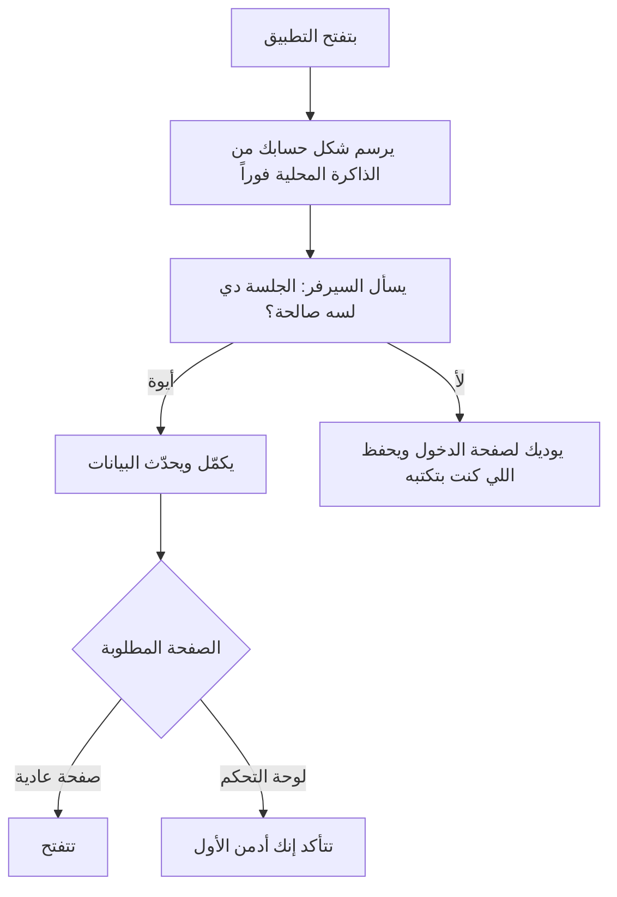

# هيكل التطبيق (الويب والموبايل)

> الصفحة دي بتشرح من غير كود «الهيكل» اللي شايل كل الشاشات: إزاي التطبيق بيفتح، ومين يقدر يدخل كل صفحة،
> وإزاي بيشتغل من غير نت، وإزاي بيتصرف على الموبايل. الشرح الهندسي بالتفصيل في
> [الصفحة الإنجليزي](../../systems/web-app.md)، والرسومات المتولّدة من الكود في
> [صفحة الحقائق](../../atlas/systems/web-app.md).

## النظام ده بيعمل إيه
- **بيفتح التطبيق بسرعة**: بيفتكر آخر حساب كان داخل على الجهاز، فيرسم الشاشة على طول من غير ما تستنى السيرفر.
- **بيحدد مين يدخل فين**: صفحات لازم تسجيل دخول، وصفحة الأدمن للأدمن بس، وصفحة الدخول للي مش مسجل.
- **بيكلّم السيرفر** بطريقة واحدة موحّدة لكل الشاشات.
- **بياخد الفئات وألوانها وأيقوناتها من السيرفر نفسه**: نفس القايمة اللي السيرفر بيصنّف بيها، فلون الفئة ثابت في كل
  الشاشات ومابقاش فيه نسخة تتحدّث بإيد.
- **بيشتغل كتطبيق موبايل**: تثبيت على الشاشة الرئيسية، إشعارات، زرار الرجوع، الاهتزاز، لوحة المفاتيح، والسحب
  للتحديث.
- **بيحفظ شغلك لو النت قطع**، ويعرض عليك ترفعه لما النت يرجع.
- **بيشيل المكالمة الصوتية**: المكالمة شغالة في أي صفحة، ولو صغّرتها بتبقى شريط صغير فوق وانت بتتنقل في التطبيق.

## في صورة واحدة

## الصفحات
| الصفحة | مين يدخلها |
| --- | --- |
| الرئيسية والتسجيل والإحصائيات والتقويم | أي مستخدم مسجل |
| مركز الذكاء الاصطناعي | أي مستخدم مسجل |
| الربط البنكي | أي مستخدم مسجل |
| الخطط والاشتراك | أي مستخدم مسجل |
| الدعم | أي مستخدم مسجل |
| المزيد والإعدادات | أي مستخدم مسجل |
| لوحة التحكم | الأدمن بس |
| صفحة الدخول | اللي مش مسجل |
| الخصوصية والشروط وصفحة البداية | أي حد |

## ليه كده؟
- **الشكل بيتفتح قبل ما السيرفر يرد**: عشان اللي فاتح التطبيق على الموبايل مايستناش شاشة فاضية، والبيانات
  الحساسة بتتأكد من السيرفر بعدين.
- **الصلاحية بتتشال بعد التأكد بس**: يعني التطبيق مش بيطردك من صفحة اعتماداً على معلومة قديمة على جهازك.
- **الرجوع للتطبيق مابيعملش تحديث لكل حاجة**: بس لو غبت فترة حقيقية، وبس للشاشة اللي قدامك.
- **لو نزل تحديث والتطبيق مفتوح**: بيعيد التحميل مرة واحدة لوحده بدل ما يقع.
- **اختبار «أنا مش روبوت» في صفحة التسجيل** بيظهر بس لو نسخة التطبيق اتبنت ومعاها مفتاح Cloudflare، ومن غيره الصفحة
  بتفضل زي ما هي.

## حاجات مهم تعرفها
دي مشاكل موجودة فعلاً في الكود النهارده (الشرح الدقيق لكل واحدة في الصفحة الإنجليزي):
1. **ناقص.** **صفحة «ألترا» مفتوحة لأي مستخدم مسجل**، مع إن الصفحة نفسها مكتوب فيها إنها محمية لمشتركي ألترا.
2. **أمن.** **توكن الدخول متخزن في ذاكرة المتصفح** جنب الكوكي الآمن.
3. **دين تقني.** **في مكونات مكتوبة ومش متوصلة**، زي الجولة التعريفية داخل التطبيق.
4. **دين تقني.** **قايمة الصفحات اللي فيها شريط التنقل مكتوبة مرتين**، فلو حد ضاف صفحة جديدة ونسي القايمة التانية، الشريط
   هيختفي منها.
5. **عطل.** **لو عملت تسجيل خروج** والحاجات اللي سجلتها وإنت أوفلاين لسه مارفعتش، بتضيع.
6. **ناقص.** **التطبيق بيبعت حاجة واحدة بس عن الاستخدام** (مدة الجلسة)، فالأرقام في لوحة التحكم مابتوصفش استخدام الناس
   فعلاً.

## لو عايز تطلب تعديل
قول للـagent يقرا `docs/systems/web-app.md` الأول. أمثلة لطلبات واضحة:
- «اقفل صفحة ألترا على مشتركي ألترا بس»: ده إصلاح المشكلة الأولى.
- «عايز صفحة جديدة تظهر في شريط التنقل تحت»: محتاج تتضاف في المسارات وفي قايمة الشريط.
- «خلّي اللي اتسجل أوفلاين مايضيعش لو عملت خروج»: ده تغيير في مكان تخزين الطابور.

## كلمات بتتكرر
| الكلمة | معناها |
| --- | --- |
| الهيكل (shell) | الإطار اللي بيشيل الشاشات: القوايم والتنقل والتحميل |
| المسار (route) | عنوان الصفحة جوه التطبيق، زي /dashboard |
| الحارس (guard) | الشرط اللي بيحدد مين يدخل الصفحة |
| PWA | نسخة الموقع اللي تتثبت على الموبايل وتشتغل زي التطبيق |
| Capacitor | الغلاف اللي بيحوّل نفس التطبيق لتطبيق أندرويد وiOS |
| الكاش المحلي | نسخة من البيانات محفوظة على جهازك عشان الفتح السريع والعمل بدون نت |
| الجلسة | دخولك الحالي على الجهاز ده |
