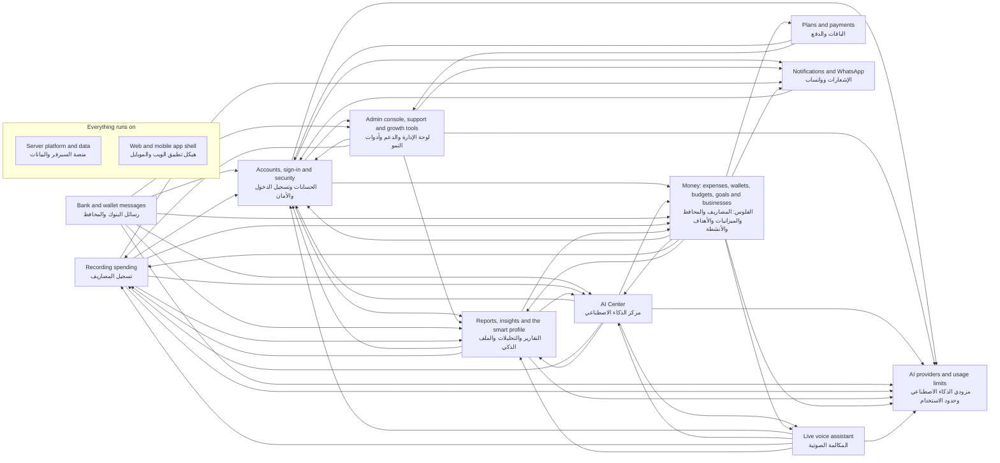

<!-- GENERATED by `npm run atlas` from the source code and docs/architecture/systems.json. Do not edit: the next run overwrites this file. -->

# Systems

SmartSpend split into the systems people talk about. Every code module, API procedure, screen, HTTP route, WebSocket and scheduled job belongs to exactly one of them, as set in `docs/architecture/systems.json`.

Each system has three pages: how it works (`docs/systems/<id>.md`), the same story without code (`docs/ar/systems/<id>.md`), and the facts generated from the code (this folder).

Before you change a file, look up its systems in [files.md](files.md) and read their explanations.

## How the systems depend on each other

An arrow means the system on the left uses code, or calls the API, of the system on the right. The server platform and the app shell support every system, so their arrows are left out.

## The systems

| System | What it does | How it works | بالعربي | Facts | Explanation last checked |
| --- | --- | --- | --- | --- | --- |
| Recording spending تسجيل المصاريف | Turns a typed or dictated sentence, or a receipt photo, into categorized transactions: the entry form, the classification pipeline, Arabic text handling, clarifying questions and saving the items. | [docs/systems/expense-capture.md](../../systems/expense-capture.md) | [docs/ar/systems/expense-capture.md](../../ar/systems/expense-capture.md) | [expense-capture.md](expense-capture.md) | 2026-09-24 05f7e09 |
| Bank and wallet messages رسائل البنوك والمحافظ | Receives bank and wallet notifications forwarded by the Android companion app or a personal iOS Shortcut, and parses them with rules first and a model second. | [docs/systems/bank-messages.md](../../systems/bank-messages.md) | [docs/ar/systems/bank-messages.md](../../ar/systems/bank-messages.md) | [bank-messages.md](bank-messages.md) | 2026-09-18 b0c2f3b |
| Live voice assistant المكالمة الصوتية | A live voice call with the assistant over a WebSocket bridged to the Gemini Live API: who may call and for how long, the tools that answer from the ledger and draft changes behind a confirmation gate, checks on the numbers it speaks, and what each call used and cost. | [docs/systems/voice-calls.md](../../systems/voice-calls.md) | [docs/ar/systems/voice-calls.md](../../ar/systems/voice-calls.md) | [voice-calls.md](voice-calls.md) | 2026-09-24 4f6c0d4 |
| AI Center مركز الذكاء الاصطناعي | The chat assistant: plans each turn without a model, answers finance questions from the ledger, keeps a long-term memory about the user, and proposes actions that run only after the user confirms. | [docs/systems/ai-center.md](../../systems/ai-center.md) | [docs/ar/systems/ai-center.md](../../ar/systems/ai-center.md) | [ai-center.md](ai-center.md) | 2026-09-24 4f6c0d4 |
| Reports, insights and the smart profile التقارير والتحليلات والملف الذكي | Monthly and yearly insights, month comparisons and the Pro report, built on a smart profile that onboarding questions and spending behaviour fill in. | [docs/systems/insights.md](../../systems/insights.md) | [docs/ar/systems/insights.md](../../ar/systems/insights.md) | [insights.md](insights.md) | 2026-09-24 05f7e09 |
| Money: expenses, wallets, budgets, goals and businesses الفلوس: المصاريف والمحافظ والميزانيات والأهداف والأنشطة | The ledger once an item is saved: the dashboard, expense lists and statistics, wallets, budgets, savings goals, business mode, the people the user deals with, daily rollups and exports. | [docs/systems/money.md](../../systems/money.md) | [docs/ar/systems/money.md](../../ar/systems/money.md) | [money.md](money.md) | 2026-09-24 05f7e09 |
| Accounts, sign-in and security الحسابات وتسجيل الدخول والأمان | Google sign-in, phone and password accounts with verification codes, passkeys, sessions, request security (rate limits, origins, headers) and account deletion. | [docs/systems/accounts.md](../../systems/accounts.md) | [docs/ar/systems/accounts.md](../../ar/systems/accounts.md) | [accounts.md](accounts.md) | 2026-09-23 fe4b4b3 |
| Plans and payments الباقات والدفع | The Free, Pro and Ultra plans and the Ultra members page, checkout through Paymob and its webhook, referral codes, and the daily job that ends expired subscriptions. | [docs/systems/billing.md](../../systems/billing.md) | [docs/ar/systems/billing.md](../../ar/systems/billing.md) | [billing.md](billing.md) | 2026-09-18 b0c2f3b |
| Notifications and WhatsApp الإشعارات وواتساب | Web push and phone notifications, in-app notifications, scheduled and activity-triggered messages, and the WhatsApp service with its verification code state. | [docs/systems/notifications.md](../../systems/notifications.md) | [docs/ar/systems/notifications.md](../../ar/systems/notifications.md) | [notifications.md](notifications.md) | 2026-09-18 981a949 |
| Admin console, support and growth tools لوحة الإدارة والدعم وأدوات النمو | The admin console (users and plans, settings, AI providers, notification templates, learned rules, discount codes), support tickets, ads, SEO pages and usage analytics. | [docs/systems/admin.md](../../systems/admin.md) | [docs/ar/systems/admin.md](../../ar/systems/admin.md) | [admin.md](admin.md) | 2026-09-18 49da160 |
| AI providers and usage limits مزودي الذكاء الاصطناعي وحدود الاستخدام | Clients for the model providers, routing and fallback between them, model name mapping, provider health, per-plan token limits and AI cost accounting. | [docs/systems/ai-platform.md](../../systems/ai-platform.md) | [docs/ar/systems/ai-platform.md](../../ar/systems/ai-platform.md) | [ai-platform.md](ai-platform.md) | 2026-09-24 4f6c0d4 |
| Server platform and data منصة السيرفر والبيانات | The Hono server and tRPC wiring, environment validation, the Redis and settings caches, the MySQL schema and its storage classes, file storage, shared contracts, scheduled job bodies and data retention. | [docs/systems/platform.md](../../systems/platform.md) | [docs/ar/systems/platform.md](../../ar/systems/platform.md) | [platform.md](platform.md) | 2026-09-24 4f6c0d4 |
| Web and mobile app shell هيكل تطبيق الويب والموبايل | The React app around every page: routes and guards, providers, layout and navigation, PWA install and offline behaviour, shared UI components, hooks and client utilities. | [docs/systems/web-app.md](../../systems/web-app.md) | [docs/ar/systems/web-app.md](../../ar/systems/web-app.md) | [web-app.md](web-app.md) | 2026-09-23 797ea88 |
