<!-- GENERATED by `npm run atlas` from the source code and docs/architecture/systems.json. Do not edit: the next run overwrites this file. -->

# Accounts, sign-in and security

Google sign-in, phone and password accounts with verification codes, passkeys, sessions, request security (rate limits, origins, headers) and account deletion.

How it works: [docs/systems/accounts.md](../../systems/accounts.md) · بالعربي: [docs/ar/systems/accounts.md](../../ar/systems/accounts.md) · [All systems](README.md)

## What it is made of

Solid arrows: calls and uses. Thick arrows: writes a table. Dotted arrows: reads a table. A double-bordered box is another system this one depends on.

```mermaid
flowchart LR
  subgraph g_screens["Screens"]
    page_AuthCallback["AuthCallback screen"]
    page_Login["Login screen"]
    page_Settings["Settings screen"]
    screens_admin["Screens of Admin console, support and growth tools"]
    screens_ai_center["Screens of AI Center"]
    screens_money["Screens of Money: expenses, wallets, budgets, goals and businesses"]
    screens_web_app["Screens of Web and mobile app shell"]
  end
  subgraph g_api["API, routes and jobs"]
    http__api_auth["HTTP /api/auth/… · 2 routes"]
    http__api_sse["GET /api/sse/otp"]
    job_daily_auth_cleanup["Job · daily-auth-cleanup"]
    router_auth["auth API · 4 procedures"]
    router_localAuth["localAuth API · 12 procedures"]
    router_profile["profile API · 5 procedures"]
    router_session["session API · 5 procedures"]
    router_webauthn["webauthn API · 5 procedures"]
  end
  subgraph g_modules["Code modules"]
    mod_accounts["Account lifecycle"]
    mod_auth["Authentication and sessions"]
    mod_security["Request security"]
    mod_web_account["Account UI"]
  end
  subgraph g_tables["MySQL tables"]
    tbl_ad_clicks[("ad_clicks")]
    tbl_ai_action_audit_logs[("ai_action_audit_logs")]
    tbl_ai_action_memory[("ai_action_memory")]
    tbl_ai_conversation_summaries[("ai_conversation_summaries")]
    tbl_ai_cost_monthly[("ai_cost_monthly")]
    tbl_ai_memory_embeddings[("ai_memory_embeddings")]
    tbl_ai_memory_items[("ai_memory_items")]
    tbl_ai_pending_actions[("ai_pending_actions")]
    tbl_ai_summaries[("ai_summaries")]
    tbl_ai_token_ledgers[("ai_token_ledgers")]
    tbl_auth_challenges[("auth_challenges")]
    tbl_business_categories[("business_categories")]
    tbl_chat_conversations[("chat_conversations")]
    tbl_chat_messages[("chat_messages")]
    tbl_classification_logs[("classification_logs")]
    tbl_expense_categories[("expense_categories")]
    tbl_expense_daily_rollups[("expense_daily_rollups")]
    tbl_expenses[("expenses")]
    tbl_financial_goals[("financial_goals")]
    tbl_in_app_notifications[("in_app_notifications")]
    tbl_local_users[("local_users")]
    tbl_monthly_behavior_snapshots[("monthly_behavior_snapshots")]
    tbl_monthly_reports[("monthly_reports")]
    tbl_notification_logs[("notification_logs")]
    tbl_pending_clarifications[("pending_clarifications")]
    tbl_pro_subscriptions[("pro_subscriptions")]
    tbl_profile_learning_events[("profile_learning_events")]
    tbl_push_subscriptions[("push_subscriptions")]
    tbl_raw_sms_events[("raw_sms_events")]
    tbl_referrals[("referrals")]
    tbl_sessions[("sessions")]
    tbl_support_tickets[("support_tickets")]
    tbl_user_analytics[("user_analytics")]
    tbl_user_budgets[("user_budgets")]
    tbl_user_businesses[("user_businesses")]
    tbl_user_contacts[("user_contacts")]
    tbl_user_correction_rules[("user_correction_rules")]
    tbl_user_credentials[("user_credentials")]
    tbl_user_dictionaries[("user_dictionaries")]
    tbl_user_profiles[("user_profiles")]
    tbl_user_wallets[("user_wallets")]
    tbl_users[("users")]
    tbl_voice_call_incidents[("voice_call_incidents")]
    tbl_voice_calls[("voice_calls")]
    tbl_voice_usage[("voice_usage")]
    tbl_webhook_tokens[("webhook_tokens")]
    tbl_whatsapp_otp_codes[("whatsapp_otp_codes")]
  end
  ext_turnstile{{"Cloudflare Turnstile"}}
  sys_money[["Money: expenses, wallets, budgets, goals and businesses (system)"]]
  sys_notifications[["Notifications and WhatsApp (system)"]]
  sys_platform[["Server platform and data (system)"]]
  sys_web_app[["Web and mobile app shell (system)"]]
  http__api_auth --> sys_platform
  http__api_sse --> mod_auth
  http__api_sse --> mod_security
  http__api_sse --> sys_notifications
  job_daily_auth_cleanup --> mod_auth
  job_daily_auth_cleanup ==> tbl_auth_challenges
  mod_accounts ==> tbl_ad_clicks
  mod_accounts ==> tbl_ai_action_audit_logs
  mod_accounts ==> tbl_ai_action_memory
  mod_accounts ==> tbl_ai_conversation_summaries
  mod_accounts ==> tbl_ai_cost_monthly
  mod_accounts ==> tbl_ai_memory_embeddings
  mod_accounts ==> tbl_ai_memory_items
  mod_accounts ==> tbl_ai_pending_actions
  mod_accounts ==> tbl_ai_summaries
  mod_accounts ==> tbl_ai_token_ledgers
  mod_accounts ==> tbl_auth_challenges
  mod_accounts ==> tbl_business_categories
  mod_accounts ==> tbl_chat_conversations
  mod_accounts ==> tbl_chat_messages
  mod_accounts ==> tbl_classification_logs
  mod_accounts ==> tbl_expense_categories
  mod_accounts ==> tbl_expense_daily_rollups
  mod_accounts ==> tbl_expenses
  mod_accounts ==> tbl_financial_goals
  mod_accounts ==> tbl_in_app_notifications
  mod_accounts ==> tbl_local_users
  mod_accounts ==> tbl_monthly_behavior_snapshots
  mod_accounts ==> tbl_monthly_reports
  mod_accounts ==> tbl_notification_logs
  mod_accounts ==> tbl_pending_clarifications
  mod_accounts ==> tbl_pro_subscriptions
  mod_accounts ==> tbl_profile_learning_events
  mod_accounts ==> tbl_push_subscriptions
  mod_accounts ==> tbl_raw_sms_events
  mod_accounts ==> tbl_referrals
  mod_accounts ==> tbl_sessions
  mod_accounts ==> tbl_support_tickets
  mod_accounts ==> tbl_user_analytics
  mod_accounts ==> tbl_user_budgets
  mod_accounts ==> tbl_user_businesses
  mod_accounts ==> tbl_user_contacts
  mod_accounts ==> tbl_user_correction_rules
  mod_accounts ==> tbl_user_credentials
  mod_accounts ==> tbl_user_dictionaries
  mod_accounts ==> tbl_user_profiles
  mod_accounts ==> tbl_user_wallets
  mod_accounts ==> tbl_users
  mod_accounts ==> tbl_voice_call_incidents
  mod_accounts ==> tbl_voice_calls
  mod_accounts ==> tbl_voice_usage
  mod_accounts ==> tbl_webhook_tokens
  mod_auth --> mod_security
  mod_auth --> sys_platform
  mod_auth ==> tbl_local_users
  mod_auth ==> tbl_sessions
  mod_auth ==> tbl_users
  mod_auth ==> tbl_whatsapp_otp_codes
  mod_security --> ext_turnstile
  mod_security --> sys_platform
  mod_security -.-> tbl_financial_goals
  mod_security -.-> tbl_user_businesses
  mod_security -.-> tbl_user_contacts
  mod_security -.-> tbl_user_wallets
  mod_web_account --> ext_turnstile
  mod_web_account --> sys_money
  mod_web_account --> sys_web_app
  page_Login --> router_auth
  page_Login --> router_localAuth
  page_Login --> router_webauthn
  page_Settings --> router_auth
  page_Settings --> router_localAuth
  page_Settings --> router_profile
  page_Settings --> router_webauthn
  router_auth --> mod_auth
  router_auth --> sys_platform
  router_auth ==> tbl_users
  router_localAuth --> mod_accounts
  router_localAuth --> mod_auth
  router_localAuth --> mod_security
  router_localAuth --> sys_notifications
  router_localAuth --> sys_platform
  router_localAuth -.-> tbl_expenses
  router_localAuth ==> tbl_local_users
  router_profile --> mod_auth
  router_profile --> sys_notifications
  router_profile --> sys_platform
  router_profile ==> tbl_local_users
  router_profile ==> tbl_user_profiles
  router_profile ==> tbl_users
  router_session --> mod_auth
  router_session --> mod_security
  router_session -.-> tbl_sessions
  router_session ==> tbl_user_analytics
  router_webauthn --> mod_auth
  router_webauthn --> mod_security
  router_webauthn --> sys_platform
  router_webauthn -.-> tbl_local_users
  router_webauthn -.-> tbl_users
  router_webauthn ==> tbl_auth_challenges
  router_webauthn ==> tbl_user_credentials
  screens_admin --> router_auth
  screens_admin --> router_localAuth
  screens_ai_center --> router_auth
  screens_ai_center --> router_localAuth
  screens_money --> router_auth
  screens_money --> router_localAuth
  screens_web_app --> router_auth
  screens_web_app --> router_localAuth
  screens_web_app --> router_profile
  screens_web_app --> router_webauthn
```

## Code modules

| Module | What it does | Files |
| --- | --- | --- |
| `accounts` — Account lifecycle | Account deletion: purgeUserData removes every row a user owns, inside the caller's transaction. | 1 |
| `auth` — Authentication and sessions | Password hashing, JWT session creation, session validation, login brute-force protection, the one module that changes a role, a plan or a session and invalidates the cached principal with it, and the phone challenges that prove a number over WhatsApp before a sign-up or a WhatsApp sign-in. | 5 |
| `security` — Request security | HTTPS redirection and security headers, rate limiting, allowed origins, client IP resolution, ownership checks, upload signature checks, bot protection and security logging. | 11 |
| `web-account` — Account UI | Biometric lock and passkeys, the smart profile, business and people settings, and the push prompt. | 9 |

## API procedures

| Procedure | Kind | Builder | Reads | Writes | Screens that call it |
| --- | --- | --- | --- | --- | --- |
| `auth.googleCallback` | mutation | `strictPublicProcedure` | `users` | `users` | — |
| `auth.googleUrl` | query | `publicProcedure` | — | — | `Login` |
| `auth.logout` | mutation | `authedProcedure` | — | — | `AICenter`, `Admin`, `App shell`, `Home`, `More`, `Settings`, `Support` |
| `auth.me` | query | `publicProcedure` | `users` | — | `AICenter`, `Admin`, `App shell`, `Home`, `More`, `Settings`, `Support` |
| `localAuth.deleteUser` | mutation | `adminProcedure` | — | — | — |
| `localAuth.generateVerificationCode` | mutation | `strictPublicProcedure` | — | — | `Login` |
| `localAuth.getBotPhoneNumber` | query | `publicProcedure` | — | — | `Login` |
| `localAuth.getStats` | query | `adminProcedure` | `expenses`, `local_users` | — | — |
| `localAuth.getVerificationSettings` | query | `publicProcedure` | — | — | `Login` |
| `localAuth.listUsers` | query | `adminProcedure` | `expenses`, `local_users` | — | — |
| `localAuth.login` | mutation | `publicProcedure` | `local_users` | `local_users` | `Login` |
| `localAuth.logout` | mutation | `publicProcedure` | — | — | `AICenter`, `Admin`, `App shell`, `Home`, `More`, `Settings`, `Support` |
| `localAuth.me` | query | `publicProcedure` | `local_users` | — | `AICenter`, `Admin`, `App shell`, `Home`, `More`, `Settings`, `Support` |
| `localAuth.register` | mutation | `strictPublicProcedure` | `local_users` | `local_users` | `Login` |
| `localAuth.updateRole` | mutation | `adminProcedure` | — | — | — |
| `localAuth.verifyOtp` | mutation | `strictPublicProcedure` | `local_users` | — | — |
| `profile.confirmPhoneChange` | mutation | `authedProcedure` | `local_users` | `local_users` | — |
| `profile.getMyProfile` | query | `authedProcedure` | `user_profiles` | — | — |
| `profile.requestPhoneChange` | mutation | `authedProcedure` | `local_users` | — | — |
| `profile.updateProfile` | mutation | `authedProcedure` | — | `user_profiles` | — |
| `profile.updateUserInfo` | mutation | `authedProcedure` | `local_users` | `local_users`, `users` | `More`, `Settings` |
| `session.listAll` | query | `adminProcedure` | `sessions` | — | — |
| `session.listMine` | query | `authedProcedure` | `sessions` | — | — |
| `session.revokeMine` | mutation | `authedProcedure` | — | — | — |
| `session.stats` | query | `adminProcedure` | `sessions` | — | — |
| `session.trackEvent` | mutation | `authedProcedure` | — | `user_analytics` | — |
| `webauthn.checkHasPasskey` | query | `authedProcedure` | `user_credentials` | — | `App shell`, `More`, `Settings` |
| `webauthn.generateAuthenticationOptions` | mutation | `strictPublicProcedure` | — | `auth_challenges` | `Login` |
| `webauthn.generateRegistrationOptions` | mutation | `authedProcedure` | `local_users`, `user_credentials`, `users` | `auth_challenges` | `More`, `Settings` |
| `webauthn.verifyAuthentication` | mutation | `strictPublicProcedure` | `auth_challenges`, `user_credentials` | `auth_challenges`, `user_credentials` | `Login` |
| `webauthn.verifyRegistration` | mutation | `authedProcedure` | `auth_challenges` | `auth_challenges`, `user_credentials` | `More`, `Settings` |

## HTTP routes, WebSockets and scheduled jobs

| Entry point | Kind | Declared in |
| --- | --- | --- |
| `GET /api/auth/google/callback` | http | `api/boot.ts` |
| `GET /api/auth/google/start` | http | `api/boot.ts` |
| `GET /api/sse/otp` | sse | `api/boot.ts` |
| `daily-auth-cleanup` | job, `0 0 * * *` | `api/boot.ts` |

## Data

Who in this system writes or reads each table: procedures, routes, jobs and code modules.

| Table | Storage class | Written by | Read by |
| --- | --- | --- | --- |
| `ad_clicks` | E | `accounts` | — |
| `ai_action_audit_logs` | E | `accounts` | — |
| `ai_action_memory` | F | `accounts` | — |
| `ai_conversation_summaries` | F | `accounts` | — |
| `ai_cost_monthly` | C | `accounts` | — |
| `ai_memory_embeddings` | F | `accounts` | — |
| `ai_memory_items` | F | `accounts` | — |
| `ai_pending_actions` | D | `accounts` | — |
| `ai_summaries` | C | `accounts` | — |
| `ai_token_ledgers` | E | `accounts` | — |
| `auth_challenges` | D | `accounts`, `daily-auth-cleanup`, `webauthn.generateAuthenticationOptions`, `webauthn.generateRegistrationOptions`, `webauthn.verifyAuthentication`, `webauthn.verifyRegistration` | `webauthn.verifyAuthentication`, `webauthn.verifyRegistration` |
| `business_categories` | A | `accounts` | — |
| `chat_conversations` | G | `accounts` | `accounts` |
| `chat_messages` | G | `accounts` | — |
| `classification_logs` | E | `accounts` | — |
| `expense_categories` | A | `accounts` | — |
| `expense_daily_rollups` | C | `accounts` | — |
| `expenses` | B | `accounts` | `localAuth.getStats`, `localAuth.listUsers` |
| `financial_goals` | C | `accounts` | `security` |
| `in_app_notifications` | D | `accounts` | — |
| `local_users` | A | `accounts`, `auth`, `localAuth.login`, `localAuth.register`, `profile.confirmPhoneChange`, `profile.updateUserInfo` | `localAuth.getStats`, `localAuth.listUsers`, `localAuth.login`, `localAuth.me`, `localAuth.register`, `localAuth.verifyOtp`, `profile.confirmPhoneChange`, `profile.requestPhoneChange`, `profile.updateUserInfo`, `webauthn.generateRegistrationOptions` |
| `monthly_behavior_snapshots` | C | `accounts` | — |
| `monthly_reports` | C | `accounts` | — |
| `notification_logs` | E | `accounts` | — |
| `pending_clarifications` | D | `accounts` | — |
| `pro_subscriptions` | A | `accounts` | — |
| `profile_learning_events` | E | `accounts` | — |
| `push_subscriptions` | A | `accounts` | — |
| `raw_sms_events` | E | `accounts` | — |
| `referrals` | A | `accounts` | — |
| `sessions` | D | `accounts`, `auth` | `auth`, `session.listAll`, `session.listMine`, `session.stats` |
| `support_tickets` | A | `accounts` | — |
| `user_analytics` | E | `accounts`, `session.trackEvent` | — |
| `user_budgets` | C | `accounts` | — |
| `user_businesses` | A | `accounts` | `accounts`, `security` |
| `user_contacts` | A | `accounts` | `security` |
| `user_correction_rules` | F | `accounts` | — |
| `user_credentials` | A | `accounts`, `webauthn.verifyAuthentication`, `webauthn.verifyRegistration` | `webauthn.checkHasPasskey`, `webauthn.generateRegistrationOptions`, `webauthn.verifyAuthentication` |
| `user_dictionaries` | F | `accounts` | — |
| `user_profiles` | A | `accounts`, `profile.updateProfile` | `profile.getMyProfile` |
| `user_wallets` | A | `accounts` | `security` |
| `users` | A | `accounts`, `auth`, `auth.googleCallback`, `profile.updateUserInfo` | `auth.googleCallback`, `auth.me`, `webauthn.generateRegistrationOptions` |
| `voice_call_incidents` | E | `accounts` | — |
| `voice_calls` | E | `accounts` | — |
| `voice_usage` | E | `accounts` | — |
| `webhook_tokens` | D | `accounts` | — |
| `whatsapp_otp_codes` | D | `auth` | `auth` |

## Outside systems

| System | Kind | Modules |
| --- | --- | --- |
| Cloudflare Turnstile | bot-protection | `security`, `web-account` |

## Other systems

Depends on: [Admin console, support and growth tools](admin.md), [AI providers and usage limits](ai-platform.md), [Reports, insights and the smart profile](insights.md), [Money: expenses, wallets, budgets, goals and businesses](money.md), [Notifications and WhatsApp](notifications.md), [Server platform and data](platform.md), [Web and mobile app shell](web-app.md).

Used by: [Admin console, support and growth tools](admin.md), [AI Center](ai-center.md), [Bank and wallet messages](bank-messages.md), [Plans and payments](billing.md), [Recording spending](expense-capture.md), [Reports, insights and the smart profile](insights.md), [Money: expenses, wallets, budgets, goals and businesses](money.md), [Notifications and WhatsApp](notifications.md), [Server platform and data](platform.md), [Web and mobile app shell](web-app.md).

## Environment variables

| Variable | Validated in api/lib/env.ts | Read by |
| --- | --- | --- |
| `ALLOWED_ORIGINS` | yes | `api/lib/origin-policy.ts` |
| `APP_URL` | yes | `api/lib/origin-policy.ts` |
| `FRONTEND_URL` | yes | `api/lib/origin-policy.ts` |
| `JWT_SECRET` | yes | `api/lib/login-protection.ts`, `api/lib/session-validation.ts`, `api/local-auth-utils.ts`, `api/services/phone-challenge.ts` |
| `LOGIN_ACCOUNT_MAX_FAILURES` | yes | `api/lib/login-protection.ts` |
| `LOGIN_IP_BURST_MAX_FAILURES` | yes | `api/lib/login-protection.ts` |
| `LOGIN_IP_MAX_FAILURES` | yes | `api/lib/login-protection.ts` |
| `LOGIN_PAIR_MAX_FAILURES` | yes | `api/lib/login-protection.ts` |
| `NODE_ENV` | yes | `api/lib/login-protection.ts`, `api/lib/origin-policy.ts`, `api/lib/security-logger.ts`, `api/services/turnstile-service.ts` |
| `PORT` | yes | `api/lib/origin-policy.ts` |
| `RATE_LIMIT_KEY_SECRET` | yes | `api/lib/login-protection.ts` |
| `TRUSTED_PROXY_HEADER` | yes | `api/lib/get-client-ip.ts` |
| `TRUSTED_PROXY_IPS` | yes | `api/lib/get-client-ip.ts` |
| `TRUST_PROXY` | yes | `api/lib/get-client-ip.ts` |
| `TURNSTILE_SECRET_KEY` | yes | `api/services/turnstile-service.ts` |

## Source its explanation describes

When any of it changes, `npm run agent:finish` asks for a new check of `docs/systems/accounts.md`. A name after `#` is one procedure, route or job of a file that several systems share; `rest-of-file` is the rest of such a file.

43 files and declarations

- `api/auth-router.ts`
- `api/boot.ts#GET /api/auth/google/callback`
- `api/boot.ts#GET /api/auth/google/start`
- `api/boot.ts#GET /api/sse/otp`
- `api/boot.ts#job:daily-auth-cleanup`
- `api/lib/access-control.ts`
- `api/lib/admin-safe-fields.ts`
- `api/lib/anonymizer.ts`
- `api/lib/get-client-ip.ts`
- `api/lib/http-origin-security.ts`
- `api/lib/image-magic-bytes.ts`
- `api/lib/login-protection.ts`
- `api/lib/origin-policy.ts`
- `api/lib/ownership-guard.ts`
- `api/lib/rate-limit.ts`
- `api/lib/security-headers.ts`
- `api/lib/security-logger.ts`
- `api/lib/session-validation.ts`
- `api/local-auth-router.ts`
- `api/local-auth-utils.ts`
- `api/profile-router.ts#profile.confirmPhoneChange`
- `api/profile-router.ts#profile.getMyProfile`
- `api/profile-router.ts#profile.requestPhoneChange`
- `api/profile-router.ts#profile.updateProfile`
- `api/profile-router.ts#profile.updateUserInfo`
- `api/profile-router.ts#rest-of-file`
- `api/services/phone-challenge.ts`
- `api/services/turnstile-service.ts`
- `api/services/user-purge-service.ts`
- `api/session-router.ts`
- `api/webauthn-router.ts`
- `src/components/auth/BiometricLockOverlay.tsx`
- `src/components/auth/BiometricOnboardingModal.tsx`
- `src/components/auth/PasskeySettings.tsx`
- `src/components/auth/TurnstileWidget.tsx`
- `src/components/notifications/PushNotificationPrompt.tsx`
- `src/components/profile/SmartProfileSettings.tsx`
- `src/components/profile/SmartProfileView.tsx`
- `src/components/settings/BusinessSettingsView.tsx`
- `src/components/settings/PeopleSettingsView.tsx`
- `src/pages/AuthCallback.tsx`
- `src/pages/Login.tsx`
- `src/pages/Settings.tsx`

