<!-- GENERATED by `npm run atlas` from the source code and docs/architecture/systems.json. Do not edit: the next run overwrites this file. -->

# Admin console, support and growth tools

The admin console (users and plans, settings, AI providers, notification templates, learned rules, discount codes), support tickets, ads, SEO pages and usage analytics.

How it works: [docs/systems/admin.md](../../systems/admin.md) · بالعربي: [docs/ar/systems/admin.md](../../ar/systems/admin.md) · [All systems](README.md)

## What it is made of

Solid arrows: calls and uses. Thick arrows: writes a table. Dotted arrows: reads a table. A double-bordered box is another system this one depends on.

```mermaid
flowchart LR
  subgraph g_screens["Screens"]
    page_Admin["Admin screen"]
    page_Support["Support screen"]
    screens_accounts["Screens of Accounts, sign-in and security"]
    screens_bank_messages["Screens of Bank and wallet messages"]
    screens_billing["Screens of Plans and payments"]
    screens_web_app["Screens of Web and mobile app shell"]
  end
  subgraph g_api["API, routes and jobs"]
    router_admin["admin API · 56 procedures"]
    router_ads["ads API · 7 procedures"]
    router_analytics["analytics API · 4 procedures"]
    router_export["export API · 1 procedure"]
    router_seo["seo API · 5 procedures"]
    router_support["support API · 7 procedures"]
  end
  subgraph g_modules["Code modules"]
    mod_web_admin["Admin UI"]
  end
  subgraph g_tables["MySQL tables"]
    tbl_ad_clicks[("ad_clicks")]
    tbl_ads[("ads")]
    tbl_ai_models[("ai_models")]
    tbl_ai_providers[("ai_providers")]
    tbl_discount_codes[("discount_codes")]
    tbl_local_users[("local_users")]
    tbl_more[("11 tables it only reads, listed under Data")]
    tbl_notification_templates[("notification_templates")]
    tbl_pending_clarifications[("pending_clarifications")]
    tbl_seo_pages[("seo_pages")]
    tbl_support_tickets[("support_tickets")]
    tbl_system_settings[("system_settings")]
    tbl_user_analytics[("user_analytics")]
    tbl_user_dictionaries[("user_dictionaries")]
    tbl_users[("users")]
  end
  ext_fireworks{{"Fireworks AI"}}
  ext_openrouter{{"OpenRouter"}}
  sys_accounts[["Accounts, sign-in and security (system)"]]
  sys_ai_platform[["AI providers and usage limits (system)"]]
  sys_expense_capture[["Recording spending (system)"]]
  sys_insights[["Reports, insights and the smart profile (system)"]]
  sys_notifications[["Notifications and WhatsApp (system)"]]
  sys_platform[["Server platform and data (system)"]]
  sys_web_app[["Web and mobile app shell (system)"]]
  mod_web_admin --> ext_fireworks
  mod_web_admin --> ext_openrouter
  mod_web_admin --> sys_platform
  mod_web_admin --> sys_web_app
  page_Admin --> router_admin
  page_Admin --> router_ads
  page_Admin --> router_export
  page_Admin --> router_seo
  page_Admin --> router_support
  page_Support --> router_seo
  page_Support --> router_support
  router_admin --> sys_accounts
  router_admin --> sys_ai_platform
  router_admin --> sys_expense_capture
  router_admin --> sys_insights
  router_admin --> sys_notifications
  router_admin --> sys_platform
  router_admin -.-> tbl_ads
  router_admin -.-> tbl_more
  router_admin -.-> tbl_support_tickets
  router_admin -.-> tbl_user_analytics
  router_admin ==> tbl_ai_models
  router_admin ==> tbl_ai_providers
  router_admin ==> tbl_discount_codes
  router_admin ==> tbl_local_users
  router_admin ==> tbl_notification_templates
  router_admin ==> tbl_pending_clarifications
  router_admin ==> tbl_system_settings
  router_admin ==> tbl_user_dictionaries
  router_admin ==> tbl_users
  router_ads ==> tbl_ad_clicks
  router_ads ==> tbl_ads
  router_analytics --> sys_platform
  router_analytics -.-> tbl_local_users
  router_analytics -.-> tbl_more
  router_analytics -.-> tbl_users
  router_analytics ==> tbl_user_analytics
  router_export -.-> tbl_local_users
  router_export -.-> tbl_users
  router_seo ==> tbl_seo_pages
  router_support -.-> tbl_local_users
  router_support -.-> tbl_users
  router_support ==> tbl_support_tickets
  screens_accounts --> router_seo
  screens_bank_messages --> router_seo
  screens_billing --> router_seo
  screens_web_app --> router_admin
  screens_web_app --> router_ads
  screens_web_app --> router_analytics
  screens_web_app --> router_export
  screens_web_app --> router_seo
  screens_web_app --> router_support
```

## Code modules

| Module | What it does | Files |
| --- | --- | --- |
| `web-admin` — Admin UI | Admin console tabs: ads, audit log, raw SMS, learned rules, settings, WhatsApp, clarifications, notifications and the AI Center administration. | 20 |

## API procedures

| Procedure | Kind | Builder | Reads | Writes | Screens that call it |
| --- | --- | --- | --- | --- | --- |
| `admin.addAiProvider` | mutation | `adminProcedure` | — | `ai_providers` | `Admin`, `More` |
| `admin.checkProviderHealth` | mutation | `adminProcedure` | `ai_providers` | `ai_providers` | — |
| `admin.clearAllApiKeyErrors` | mutation | `adminProcedure` | — | — | `Admin`, `More` |
| `admin.createDiscountCode` | mutation | `adminProcedure` | `discount_codes` | `discount_codes` | `Admin`, `More` |
| `admin.createNotificationTemplate` | mutation | `adminProcedure` | — | `notification_templates` | `Admin`, `More` |
| `admin.deleteAiProvider` | mutation | `adminProcedure` | — | `ai_models`, `ai_providers` | `Admin`, `More` |
| `admin.deleteDiscountCode` | mutation | `adminProcedure` | — | `discount_codes` | `Admin`, `More` |
| `admin.deleteLearnedRule` | mutation | `adminProcedure` | — | `user_dictionaries` | `Admin`, `More` |
| `admin.deleteNotificationTemplate` | mutation | `adminProcedure` | — | `notification_templates` | `Admin`, `More` |
| `admin.deleteUser` | mutation | `adminProcedure` | — | — | `Admin`, `More` |
| `admin.discoverProviderModels` | mutation | `adminProcedure` | — | — | `Admin`, `More` |
| `admin.getAIClassificationStats` | query | `adminProcedure` | `classification_logs` | — | `Admin`, `More` |
| `admin.getAICostOverview` | query | `adminProcedure` | — | — | `Admin`, `More` |
| `admin.getActivityLog` | query | `adminProcedure` | `local_users`, `sessions`, `users` | — | `Admin`, `More` |
| `admin.getAiModels` | query | `adminProcedure` | `ai_models` | — | `Admin`, `More` |
| `admin.getAiProviders` | query | `adminProcedure` | `ai_providers` | — | `Admin`, `More` |
| `admin.getAiTelemetryOverview` | query | `adminProcedure` | `ai_token_ledgers` | — | `Admin`, `More` |
| `admin.getAiTokenLedger` | query | `adminProcedure` | `ai_token_ledgers` | — | — |
| `admin.getApiKeyErrors` | query | `adminProcedure` | — | — | `Admin`, `More` |
| `admin.getAvailableModels` | query | `adminProcedure` | — | — | `Admin`, `More` |
| `admin.getClassificationLogs` | query | `adminProcedure` | `classification_logs`, `local_users`, `users` | — | `Admin`, `More` |
| `admin.getDashboardStats` | query | `adminProcedure` | `expense_daily_rollups`, `local_users`, `sessions`, `support_tickets`, `users` | — | `Admin`, `More` |
| `admin.getDiscountCodes` | query | `adminProcedure` | `discount_codes` | — | `Admin`, `More` |
| `admin.getFounderMetrics` | query | `adminProcedure` | `local_users`, `pro_subscriptions`, `sessions`, `support_tickets`, `user_analytics`, `users` | — | `Admin`, `More` |
| `admin.getLearnedRules` | query | `adminProcedure` | `local_users`, `user_dictionaries`, `users` | — | `Admin`, `More` |
| `admin.getNotificationLogs` | query | `adminProcedure` | `notification_logs` | — | `Admin`, `More` |
| `admin.getNotificationStats` | query | `adminProcedure` | `push_subscriptions` | — | `Admin`, `More` |
| `admin.getNotificationTemplates` | query | `adminProcedure` | `notification_templates` | — | `Admin`, `More` |
| `admin.getPendingClarifications` | query | `adminProcedure` | `pending_clarifications` | — | `Admin`, `More` |
| `admin.getPipelineVersionStats` | query | `adminProcedure` | `classification_logs` | — | — |
| `admin.getRawSmsLogs` | query | `adminProcedure` | `local_users`, `raw_sms_events`, `users` | — | `Admin`, `More` |
| `admin.getSettings` | query | `adminProcedure` | — | — | `Admin`, `More` |
| `admin.getStorageRuntimeMetrics` | query | `adminProcedure` | — | — | — |
| `admin.getUserAiQuota` | query | `adminProcedure` | `ai_token_ledgers`, `local_users`, `users` | — | `Admin`, `More` |
| `admin.getUserSessions` | query | `adminProcedure` | `sessions` | — | `Admin`, `More` |
| `admin.getUserSmartProfile` | query | `adminProcedure` | — | — | `Admin`, `More` |
| `admin.getVoiceUsageStats` | query | `adminProcedure` | `voice_usage` | — | `Admin`, `More` |
| `admin.listAllUsers` | query | `adminProcedure` | `expenses`, `local_users`, `users` | — | `Admin`, `More` |
| `admin.listSubscriptionsAdmin` | query | `adminProcedure` | `pro_subscriptions` | — | `Admin`, `More` |
| `admin.resetUserTokens` | mutation | `adminProcedure` | — | `local_users`, `users` | — |
| `admin.resolveApiKeyError` | mutation | `adminProcedure` | — | — | `Admin`, `More` |
| `admin.resolveClarification` | mutation | `adminProcedure` | — | `pending_clarifications` | `Admin`, `More` |
| `admin.revokeSession` | mutation | `adminProcedure` | — | — | `Admin`, `More` |
| `admin.saveAiModels` | mutation | `adminProcedure` | `ai_models` | `ai_models` | `Admin`, `More` |
| `admin.sendPushNotification` | mutation | `adminProcedure` | `local_users`, `push_subscriptions`, `users` | — | — |
| `admin.setUserTokenLimit` | mutation | `adminProcedure` | `system_settings` | `system_settings` | — |
| `admin.toggleNotificationTemplate` | mutation | `adminProcedure` | — | `notification_templates` | `Admin`, `More` |
| `admin.triggerActivityCheck` | mutation | `adminProcedure` | — | — | `Admin`, `More` |
| `admin.triggerBackupDemo` | mutation | `adminProcedure` | `ads`, `discount_codes`, `onboarding_questions` | — | `Admin`, `More` |
| `admin.updateAiProvider` | mutation | `adminProcedure` | — | `ai_providers` | `Admin`, `More` |
| `admin.updateNotificationTemplate` | mutation | `adminProcedure` | — | `notification_templates` | `Admin`, `More` |
| `admin.updateSettings` | mutation | `adminProcedure` | — | `system_settings` | `Admin`, `More` |
| `admin.updateUserPlan` | mutation | `adminProcedure` | — | — | — |
| `admin.updateUserPlanV2` | mutation | `adminProcedure` | — | — | `Admin`, `More` |
| `admin.updateUserRole` | mutation | `adminProcedure` | — | — | `Admin`, `More` |
| `admin.validateApiKey` | mutation | `adminProcedure` | — | — | `Admin`, `More` |
| `ads.click` | mutation | `authedProcedure` | — | `ad_clicks`, `ads` | `App shell` |
| `ads.create` | mutation | `adminProcedure` | — | `ads` | `Admin`, `More` |
| `ads.delete` | mutation | `adminProcedure` | — | `ad_clicks`, `ads` | `Admin`, `More` |
| `ads.impression` | mutation | `publicProcedure` | — | `ads` | — |
| `ads.list` | query | `publicProcedure` | `ads` | — | `App shell` |
| `ads.stats` | query | `adminProcedure` | `ads` | — | `Admin`, `More` |
| `ads.update` | mutation | `adminProcedure` | — | `ads` | `Admin`, `More` |
| `analytics.getAllUserStats` | query | `adminProcedure` | `expenses`, `local_users`, `users` | — | — |
| `analytics.getDashboardStats` | query | `adminProcedure` | `expenses`, `local_users`, `users` | — | — |
| `analytics.getMyAnalytics` | query | `authedProcedure` | `user_analytics` | — | — |
| `analytics.trackEvent` | mutation | `authedProcedure` | — | `user_analytics` | `App shell` |
| `export.allUsers` | mutation | `adminProcedure` | `local_users`, `users` | — | `Admin`, `More` |
| `seo.delete` | mutation | `adminProcedure` | — | `seo_pages` | — |
| `seo.getPage` | query | `publicProcedure` | `seo_pages` | — | `Admin`, `BankSyncPage`, `Landing`, `More`, `Privacy`, `Pro`, `Settings`, `Support`, `Terms`, `UltraLounge` |
| `seo.list` | query | `adminProcedure` | `seo_pages` | — | — |
| `seo.sitemap` | query | `publicProcedure` | `seo_pages` | — | — |
| `seo.upsert` | mutation | `adminProcedure` | `seo_pages` | `seo_pages` | — |
| `support.assign` | mutation | `adminProcedure` | `support_tickets` | `support_tickets` | — |
| `support.close` | mutation | `authedProcedure` | `support_tickets` | `support_tickets` | `Admin`, `More` |
| `support.create` | mutation | `authedProcedure` | — | `support_tickets` | `More`, `Support` |
| `support.getById` | query | `authedProcedure` | `support_tickets` | — | — |
| `support.listAll` | query | `adminProcedure` | `local_users`, `support_tickets`, `users` | — | `Admin`, `More` |
| `support.listMine` | query | `authedProcedure` | `support_tickets` | — | `More`, `Support` |
| `support.respond` | mutation | `adminProcedure` | `support_tickets` | `support_tickets` | `Admin`, `More` |

## HTTP routes, WebSockets and scheduled jobs

_None._

## Data

Who in this system writes or reads each table: procedures, routes, jobs and code modules.

| Table | Storage class | Written by | Read by |
| --- | --- | --- | --- |
| `ad_clicks` | E | `ads.click`, `ads.delete` | — |
| `ads` | A | `ads.click`, `ads.create`, `ads.delete`, `ads.impression`, `ads.update` | `admin.triggerBackupDemo`, `ads.list`, `ads.stats` |
| `ai_models` | A | `admin.deleteAiProvider`, `admin.saveAiModels` | `admin.getAiModels`, `admin.saveAiModels` |
| `ai_providers` | A | `admin.addAiProvider`, `admin.checkProviderHealth`, `admin.deleteAiProvider`, `admin.updateAiProvider` | `admin.checkProviderHealth`, `admin.getAiProviders` |
| `ai_token_ledgers` | E | — | `admin.getAiTelemetryOverview`, `admin.getAiTokenLedger`, `admin.getUserAiQuota` |
| `classification_logs` | E | — | `admin.getAIClassificationStats`, `admin.getClassificationLogs`, `admin.getPipelineVersionStats` |
| `discount_codes` | A | `admin.createDiscountCode`, `admin.deleteDiscountCode` | `admin.createDiscountCode`, `admin.getDiscountCodes`, `admin.triggerBackupDemo` |
| `expense_daily_rollups` | C | — | `admin.getDashboardStats` |
| `expenses` | B | — | `admin.listAllUsers`, `analytics.getAllUserStats`, `analytics.getDashboardStats` |
| `local_users` | A | `admin.resetUserTokens` | `admin.getActivityLog`, `admin.getClassificationLogs`, `admin.getDashboardStats`, `admin.getFounderMetrics`, `admin.getLearnedRules`, `admin.getRawSmsLogs`, `admin.getUserAiQuota`, `admin.listAllUsers`, `admin.sendPushNotification`, `analytics.getAllUserStats`, `analytics.getDashboardStats`, `export.allUsers`, `support.listAll` |
| `notification_logs` | E | — | `admin.getNotificationLogs` |
| `notification_templates` | A | `admin.createNotificationTemplate`, `admin.deleteNotificationTemplate`, `admin.toggleNotificationTemplate`, `admin.updateNotificationTemplate` | `admin.getNotificationTemplates` |
| `onboarding_questions` | A | — | `admin.triggerBackupDemo` |
| `pending_clarifications` | D | `admin.resolveClarification` | `admin.getPendingClarifications` |
| `pro_subscriptions` | A | — | `admin.getFounderMetrics`, `admin.listSubscriptionsAdmin` |
| `push_subscriptions` | A | — | `admin.getNotificationStats`, `admin.sendPushNotification` |
| `raw_sms_events` | E | — | `admin.getRawSmsLogs` |
| `seo_pages` | A | `seo.delete`, `seo.upsert` | `seo.getPage`, `seo.list`, `seo.sitemap`, `seo.upsert` |
| `sessions` | D | — | `admin.getActivityLog`, `admin.getDashboardStats`, `admin.getFounderMetrics`, `admin.getUserSessions` |
| `support_tickets` | A | `support.assign`, `support.close`, `support.create`, `support.respond` | `admin.getDashboardStats`, `admin.getFounderMetrics`, `support.assign`, `support.close`, `support.getById`, `support.listAll`, `support.listMine`, `support.respond` |
| `system_settings` | A | `admin.setUserTokenLimit`, `admin.updateSettings` | `admin.setUserTokenLimit` |
| `user_analytics` | E | `analytics.trackEvent` | `admin.getFounderMetrics`, `analytics.getMyAnalytics` |
| `user_dictionaries` | F | `admin.deleteLearnedRule` | `admin.getLearnedRules` |
| `users` | A | `admin.resetUserTokens` | `admin.getActivityLog`, `admin.getClassificationLogs`, `admin.getDashboardStats`, `admin.getFounderMetrics`, `admin.getLearnedRules`, `admin.getRawSmsLogs`, `admin.getUserAiQuota`, `admin.listAllUsers`, `admin.sendPushNotification`, `analytics.getAllUserStats`, `analytics.getDashboardStats`, `export.allUsers`, `support.listAll` |
| `voice_usage` | E | — | `admin.getVoiceUsageStats` |

## Outside systems

| System | Kind | Modules |
| --- | --- | --- |
| Fireworks AI | ai-provider | `web-admin` |
| OpenRouter | ai-provider | `web-admin` |

## Other systems

Depends on: [Accounts, sign-in and security](accounts.md), [AI providers and usage limits](ai-platform.md), [Recording spending](expense-capture.md), [Reports, insights and the smart profile](insights.md), [Notifications and WhatsApp](notifications.md), [Server platform and data](platform.md), [Web and mobile app shell](web-app.md).

Used by: [Accounts, sign-in and security](accounts.md), [Bank and wallet messages](bank-messages.md), [Plans and payments](billing.md), [Web and mobile app shell](web-app.md).

## Environment variables

_None._

## Source its explanation describes

When any of it changes, `npm run agent:finish` asks for a new check of `docs/systems/admin.md`. A name after `#` is one procedure, route or job of a file that several systems share; `rest-of-file` is the rest of such a file.

29 files and declarations

- `api/admin-router.ts`
- `api/ads-router.ts`
- `api/analytics-router.ts`
- `api/export-router.ts#export.allUsers`
- `api/export-router.ts#rest-of-file`
- `api/seo-router.ts`
- `api/support-router.ts`
- `src/components/admin/AdminAdsTab.tsx`
- `src/components/admin/AdminAuditTab.tsx`
- `src/components/admin/AdminRawSmsTab.tsx`
- `src/components/admin/AdminRulesTab.tsx`
- `src/components/admin/AdminSettingsTab.tsx`
- `src/components/admin/AdminUserMobileCard.tsx`
- `src/components/admin/AdminWhatsAppTab.tsx`
- `src/components/admin/ClarificationsTab.tsx`
- `src/components/admin/NotificationsTab.tsx`
- `src/components/admin/ai-center/AiCommandCenter.tsx`
- `src/components/admin/ai-center/modals/TokenAnatomyModal.tsx`
- `src/components/admin/ai-center/tabs/AiProviderManagerTab.tsx`
- `src/components/admin/ai-center/tabs/AiRuleSandboxTab.tsx`
- `src/components/admin/ai-center/tabs/AiTelemetryTab.tsx`
- `src/components/admin/ai-center/tabs/AiUserQuotaInspectorTab.tsx`
- `src/components/admin/settings/AdminCodesTab.tsx`
- `src/components/admin/settings/AdminKeysTab.tsx`
- `src/components/admin/settings/AdminPlansTab.tsx`
- `src/components/admin/settings/AdminSettingsShared.tsx`
- `src/components/admin/settings/RoutingRangesEditor.tsx`
- `src/pages/Admin.tsx`
- `src/pages/Support.tsx`

