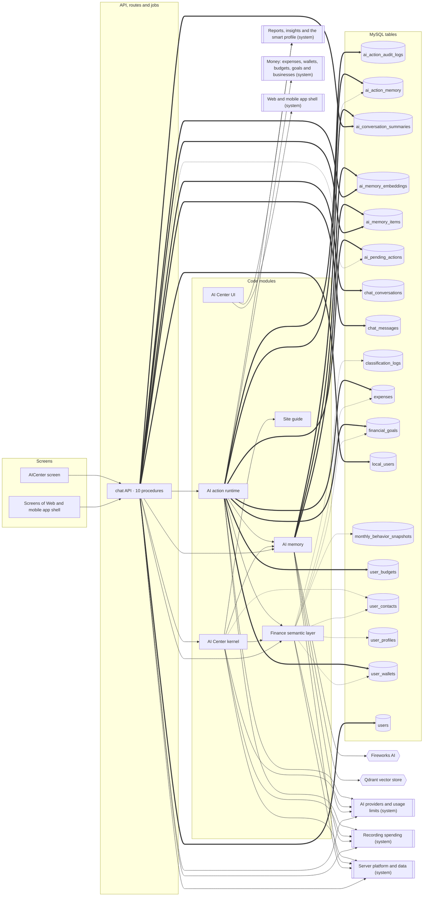
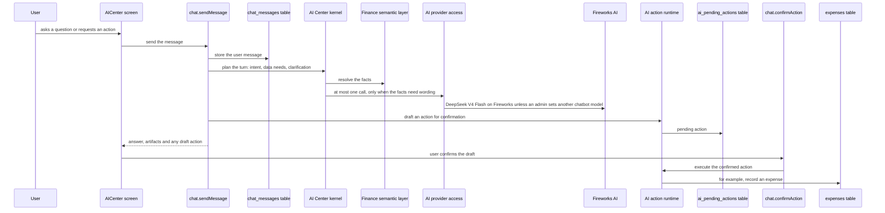

<!-- GENERATED by `npm run atlas` from the source code and docs/architecture/systems.json. Do not edit: the next run overwrites this file. -->

# AI Center

The chat assistant: plans each turn without a model, answers finance questions from the ledger, keeps a long-term memory about the user, and proposes actions that run only after the user confirms.

How it works: [docs/systems/ai-center.md](../../systems/ai-center.md) · بالعربي: [docs/ar/systems/ai-center.md](../../ar/systems/ai-center.md) · [All systems](README.md)

## What it is made of

Solid arrows: calls and uses. Thick arrows: writes a table. Dotted arrows: reads a table. A double-bordered box is another system this one depends on.

## Journeys

### a question in the AI Center

chat.sendMessage stores the message and, while the AI kernel is enabled in settings, runs it. The kernel plans the turn without a model (intent, data needs, a clarifying question when something is missing), resolves the facts through the finance semantic layer, and makes at most one model call to word the answer, whose numbers are then checked against the facts. Actions are drafted as pending and run only after the user confirms them.

Drawn in `docs/architecture/flows/ai-chat.c4`; in the interactive map it is the view `flow_ai_chat`.

## Code modules

| Module | What it does | Files |
| --- | --- | --- |
| `ai-actions` — AI action runtime | Actions the assistant proposes, such as recording an expense, updating a wallet or creating a goal: stored as pending drafts and executed only after the user confirms, with the artifacts shown in chat. | 6 |
| `ai-kernel` — AI Center kernel | Plans each AI Center turn without a model (intent, data needs, clarifying questions), packs the context, applies the capability registry and retrieval policy, words the answer with at most one model call, and logs traces. | 11 |
| `ai-memory` — AI memory | Long-term memory about each user: conversation capsules and running summaries, memories extracted by rules, optional Fireworks embeddings stored in MySQL with a backfill, and retrieval that scores memories by words and, when embeddings are on, by vector similarity. The Qdrant and quantized on-disk stores are used only by tests. | 12 |
| `finance-semantic-layer` — Finance semantic layer | Answers factual finance questions from the ledger: period resolution, category matching, row aggregation, monthly report facts, proactive insights, chart artifacts and a per-user cache. | 10 |
| `site-guide` — Site guide | How-to answers about using SmartSpend (linking SMS, cards and wallets, goals, reports) from a built-in knowledge base with embedding retrieval. | 5 |
| `web-ai` — AI Center UI | AI Center screens: the chatbot, the AI memory manager and the monthly AI report. | 3 |

## API procedures

| Procedure | Kind | Builder | Reads | Writes | Screens that call it |
| --- | --- | --- | --- | --- | --- |
| `chat.cancelAction` | mutation | `aiProcedure` | — | — | `AICenter` |
| `chat.clearAllMemories` | mutation | `authedProcedure` | `ai_memory_items` | `ai_memory_embeddings`, `ai_memory_items` | `AICenter`, `App shell` |
| `chat.clearConversation` | mutation | `authedProcedure` | `chat_conversations` | `ai_conversation_summaries`, `chat_conversations`, `chat_messages` | `AICenter` |
| `chat.confirmAction` | mutation | `aiProcedure` | — | — | `AICenter` |
| `chat.forgetMemory` | mutation | `authedProcedure` | `ai_memory_items` | `ai_memory_embeddings`, `ai_memory_items` | `AICenter`, `App shell` |
| `chat.getConversation` | query | `authedProcedure` | `chat_conversations`, `chat_messages` | — | `AICenter` |
| `chat.getConversations` | query | `authedProcedure` | `chat_conversations` | — | `AICenter` |
| `chat.getQuickActions` | query | `authedProcedure` | — | — | `AICenter` |
| `chat.listMemories` | query | `authedProcedure` | `ai_memory_items` | — | `AICenter`, `App shell` |
| `chat.sendMessage` | mutation | `aiProcedure` | `ai_pending_actions`, `chat_conversations`, `chat_messages` | `chat_conversations`, `chat_messages`, `local_users`, `users` | `AICenter` |

## HTTP routes, WebSockets and scheduled jobs

_None._

## Data

Who in this system writes or reads each table: procedures, routes, jobs and code modules.

| Table | Storage class | Written by | Read by |
| --- | --- | --- | --- |
| `ai_action_audit_logs` | E | `ai-actions` | — |
| `ai_action_memory` | F | `ai-actions` | `ai-actions`, `ai-memory` |
| `ai_conversation_summaries` | F | `ai-memory`, `chat.clearConversation` | `ai-memory` |
| `ai_memory_embeddings` | F | `ai-memory`, `chat.clearAllMemories`, `chat.forgetMemory` | `ai-memory` |
| `ai_memory_items` | F | `ai-memory`, `chat.clearAllMemories`, `chat.forgetMemory` | `ai-memory`, `chat.clearAllMemories`, `chat.forgetMemory`, `chat.listMemories` |
| `ai_pending_actions` | D | `ai-actions` | `ai-actions`, `chat.sendMessage` |
| `chat_conversations` | G | `chat.clearConversation`, `chat.sendMessage` | `chat.clearConversation`, `chat.getConversation`, `chat.getConversations`, `chat.sendMessage` |
| `chat_messages` | G | `chat.clearConversation`, `chat.sendMessage` | `chat.getConversation`, `chat.sendMessage` |
| `classification_logs` | E | — | `finance-semantic-layer` |
| `expenses` | B | `ai-actions` | `ai-actions`, `finance-semantic-layer` |
| `financial_goals` | C | `ai-actions` | `ai-actions`, `finance-semantic-layer` |
| `local_users` | A | `chat.sendMessage` | — |
| `monthly_behavior_snapshots` | C | — | `finance-semantic-layer` |
| `user_budgets` | C | `ai-actions` | — |
| `user_contacts` | A | — | `ai-kernel`, `finance-semantic-layer` |
| `user_profiles` | A | — | `finance-semantic-layer` |
| `user_wallets` | A | `ai-actions` | `ai-actions`, `finance-semantic-layer` |
| `users` | A | `chat.sendMessage` | — |

## Outside systems

| System | Kind | Modules |
| --- | --- | --- |
| Fireworks AI | ai-provider | `ai-memory` |
| Qdrant vector store | datastore | `ai-memory` |

## Other systems

Depends on: [Accounts, sign-in and security](accounts.md), [AI providers and usage limits](ai-platform.md), [Recording spending](expense-capture.md), [Reports, insights and the smart profile](insights.md), [Money: expenses, wallets, budgets, goals and businesses](money.md), [Server platform and data](platform.md), [Live voice assistant](voice-calls.md), [Web and mobile app shell](web-app.md).

Used by: [Bank and wallet messages](bank-messages.md), [Recording spending](expense-capture.md), [Reports, insights and the smart profile](insights.md), [Money: expenses, wallets, budgets, goals and businesses](money.md), [Server platform and data](platform.md), [Live voice assistant](voice-calls.md), [Web and mobile app shell](web-app.md).

## Environment variables

| Variable | Validated in api/lib/env.ts | Read by |
| --- | --- | --- |
| `FIREWORKS_API_KEY` | yes | `api/services/ai-memory/embedding-settings.ts` |
| `DEV` | frontend | `src/components/ai/AIChatbot.tsx` |

## Source its explanation describes

When any of it changes, `npm run agent:finish` asks for a new check of `docs/systems/ai-center.md`. A name after `#` is one procedure, route or job of a file that several systems share; `rest-of-file` is the rest of such a file.

49 files and declarations

- `api/chat-router.ts`
- `api/services/action-runtime/artifacts.ts`
- `api/services/action-runtime/confirmation-phrases.ts`
- `api/services/action-runtime/extended-actions.ts`
- `api/services/action-runtime/goal-create.ts`
- `api/services/action-runtime/index.ts`
- `api/services/action-runtime/types.ts`
- `api/services/ai-kernel/agent-planner.ts`
- `api/services/ai-kernel/ai-trace-logger.ts`
- `api/services/ai-kernel/capability-registry.ts`
- `api/services/ai-kernel/clarification-machine.ts`
- `api/services/ai-kernel/context-packer.ts`
- `api/services/ai-kernel/data-need-compiler.ts`
- `api/services/ai-kernel/index.ts`
- `api/services/ai-kernel/intent-router.ts`
- `api/services/ai-kernel/response-normalizer.ts`
- `api/services/ai-kernel/retrieval-policy.ts`
- `api/services/ai-kernel/types.ts`
- `api/services/ai-memory/embedding-backfill.ts`
- `api/services/ai-memory/embedding-client.ts`
- `api/services/ai-memory/embedding-settings.ts`
- `api/services/ai-memory/index.ts`
- `api/services/ai-memory/memory-retriever.ts`
- `api/services/ai-memory/memory-writer.ts`
- `api/services/ai-memory/qdrant-vector-store.ts`
- `api/services/ai-memory/quantized-vector-store.ts`
- `api/services/ai-memory/retrieval-enhancements.ts`
- `api/services/ai-memory/text-utils.ts`
- `api/services/ai-memory/types.ts`
- `api/services/ai-memory/vector-store.ts`
- `api/services/finance-semantic-layer/cache.ts`
- `api/services/finance-semantic-layer/category-matcher.ts`
- `api/services/finance-semantic-layer/chart-artifacts.ts`
- `api/services/finance-semantic-layer/index.ts`
- `api/services/finance-semantic-layer/monthly-report-facts.ts`
- `api/services/finance-semantic-layer/period-resolver.ts`
- `api/services/finance-semantic-layer/proactive-insights.ts`
- `api/services/finance-semantic-layer/resolvers.ts`
- `api/services/finance-semantic-layer/row-aggregators.ts`
- `api/services/finance-semantic-layer/types.ts`
- `api/services/site-guide/embedding.ts`
- `api/services/site-guide/index.ts`
- `api/services/site-guide/knowledge-base.ts`
- `api/services/site-guide/retriever.ts`
- `api/services/site-guide/types.ts`
- `src/components/ai/AIChatbot.tsx`
- `src/components/ai/AIMemoryManager.tsx`
- `src/components/ai/AIMonthlyReport.tsx`
- `src/pages/AICenter.tsx`

