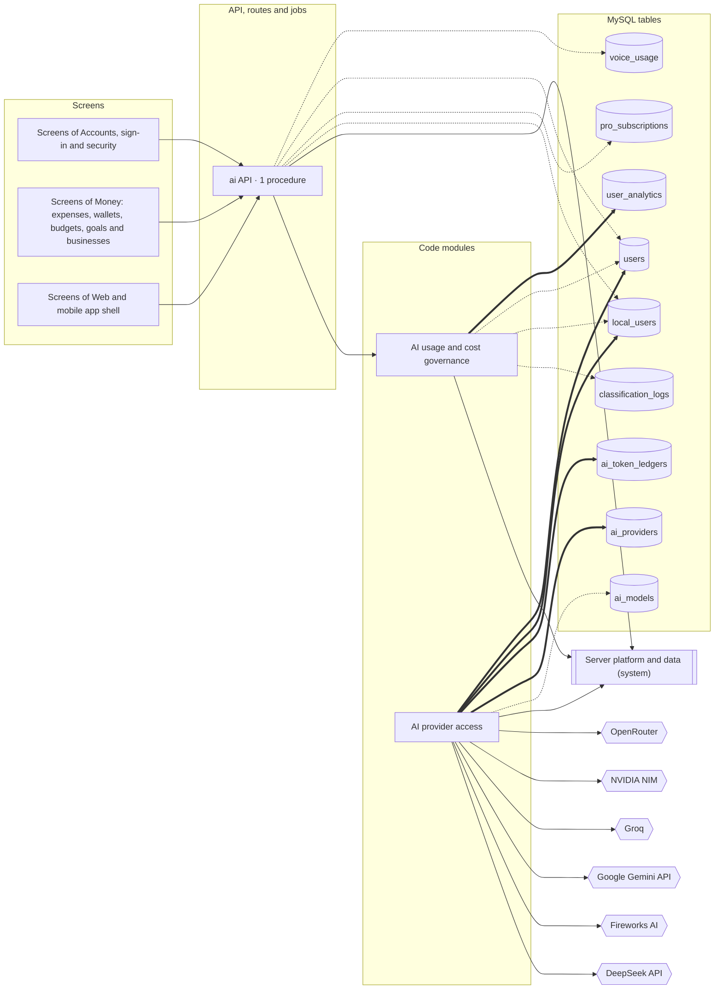

<!-- GENERATED by `npm run atlas` from the source code and docs/architecture/systems.json. Do not edit: the next run overwrites this file. -->

# AI providers and usage limits

Clients for the model providers, routing and fallback between them, model name mapping, provider health, per-plan token limits and AI cost accounting.

How it works: [docs/systems/ai-platform.md](../../systems/ai-platform.md) · بالعربي: [docs/ar/systems/ai-platform.md](../../ar/systems/ai-platform.md) · [All systems](README.md)

## What it is made of

Solid arrows: calls and uses. Thick arrows: writes a table. Dotted arrows: reads a table. A double-bordered box is another system this one depends on.

## Code modules

| Module | What it does | Files |
| --- | --- | --- |
| `ai-governance` — AI usage and cost governance | Per-plan token limits and per-request caps, burst counting, AI cost metrics and the admin cost overview, and the check of model-written numbers against facts. | 3 |
| `ai-providers` — AI provider access | Provider clients, the provider registry, model name mapping, routing and fallback chains, what each call cost and its row in the AI cost ledger, and the sealing of the provider keys saved in the admin console, which move to a new secret on their own. | 14 |

## API procedures

| Procedure | Kind | Builder | Reads | Writes | Screens that call it |
| --- | --- | --- | --- | --- | --- |
| `ai.getUserLimits` | query | `authedProcedure` | `local_users`, `pro_subscriptions`, `users`, `voice_usage` | — | `Home`, `More`, `Settings` |

## HTTP routes, WebSockets and scheduled jobs

_None._

## Data

Who in this system writes or reads each table: procedures, routes, jobs and code modules.

| Table | Storage class | Written by | Read by |
| --- | --- | --- | --- |
| `ai_models` | A | — | `ai-providers` |
| `ai_providers` | A | `ai-providers` | `ai-providers` |
| `ai_token_ledgers` | E | `ai-providers` | — |
| `classification_logs` | E | — | `ai-governance` |
| `local_users` | A | `ai-providers` | `ai-governance`, `ai.getUserLimits` |
| `pro_subscriptions` | A | — | `ai.getUserLimits` |
| `user_analytics` | E | `ai-governance` | `ai-governance` |
| `users` | A | `ai-providers` | `ai-governance`, `ai.getUserLimits` |
| `voice_usage` | E | — | `ai.getUserLimits` |

## Outside systems

| System | Kind | Modules |
| --- | --- | --- |
| DeepSeek API | ai-provider | `ai-providers` |
| Fireworks AI | ai-provider | `ai-providers` |
| Google Gemini API | ai-provider | `ai-providers` |
| Groq | ai-provider | `ai-providers` |
| NVIDIA NIM | ai-provider | `ai-providers` |
| OpenRouter | ai-provider | `ai-providers` |

## Other systems

Depends on: [Server platform and data](platform.md).

Used by: [Accounts, sign-in and security](accounts.md), [Admin console, support and growth tools](admin.md), [AI Center](ai-center.md), [Bank and wallet messages](bank-messages.md), [Recording spending](expense-capture.md), [Reports, insights and the smart profile](insights.md), [Money: expenses, wallets, budgets, goals and businesses](money.md), [Server platform and data](platform.md), [Live voice assistant](voice-calls.md), [Web and mobile app shell](web-app.md).

## Environment variables

| Variable | Validated in api/lib/env.ts | Read by |
| --- | --- | --- |
| `AI_GATEWAY_SECRET` | yes | `api/lib/provider-key-crypto.ts` |
| `AI_GATEWAY_SECRET_PREVIOUS` | yes | `api/lib/provider-key-crypto.ts` |
| `GEMINI_API_KEY` | yes | `api/lib/ai-gateway.ts`, `api/lib/embedding-provider.ts` |
| `JWT_SECRET` | yes | `api/lib/provider-key-crypto.ts` |
| `NODE_ENV` | yes | `api/lib/ai-gateway.ts` |

## Source its explanation describes

When any of it changes, `npm run agent:finish` asks for a new check of `docs/systems/ai-platform.md`. A name after `#` is one procedure, route or job of a file that several systems share; `rest-of-file` is the rest of such a file.

19 files and declarations

- `api/ai-router.ts#ai.getUserLimits`
- `api/ai-router.ts#rest-of-file`
- `api/lib/ai-gateway.ts`
- `api/lib/ai-ledger.ts`
- `api/lib/ai-pricing.ts`
- `api/lib/ai-provider-registry.ts`
- `api/lib/ai-usage-policy.ts`
- `api/lib/deepseek-client.ts`
- `api/lib/embedding-provider.ts`
- `api/lib/fireworks-client.ts`
- `api/lib/groq-client.ts`
- `api/lib/llm-provider-chain.ts`
- `api/lib/llm-router.ts`
- `api/lib/model-mapper.ts`
- `api/lib/nvidia-client.ts`
- `api/lib/provider-health.ts`
- `api/lib/provider-key-crypto.ts`
- `api/services/ai-cost-analytics.ts`
- `api/services/ai-cost-policy.ts`

