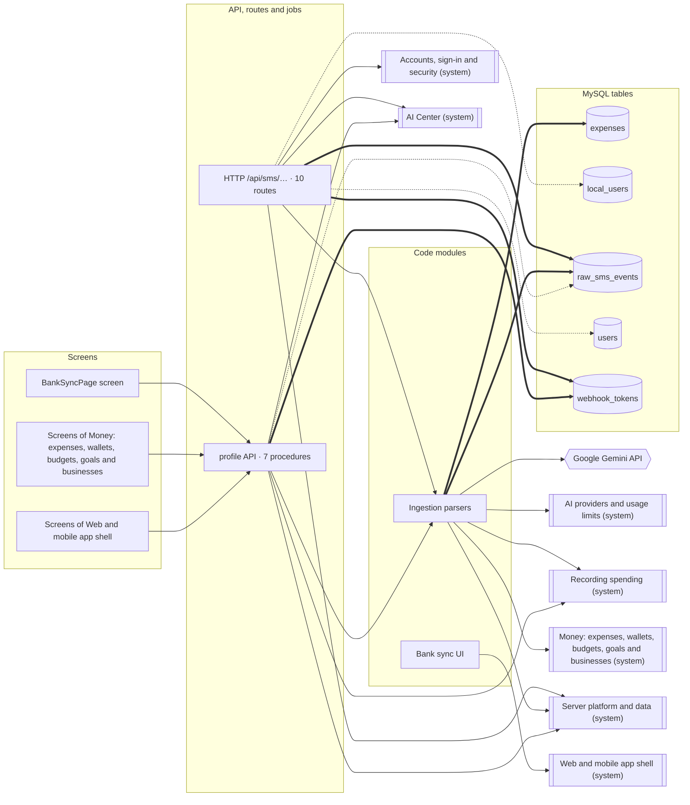
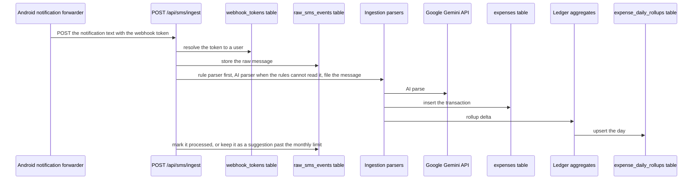

<!-- GENERATED by `npm run atlas` from the source code and docs/architecture/systems.json. Do not edit: the next run overwrites this file. -->

# Bank and wallet messages

Receives bank and wallet notifications forwarded by the Android companion app or a personal iOS Shortcut, and parses them with rules first and a model second.

How it works: [docs/systems/bank-messages.md](../../systems/bank-messages.md) · بالعربي: [docs/ar/systems/bank-messages.md](../../ar/systems/bank-messages.md) · [All systems](README.md)

## What it is made of

Solid arrows: calls and uses. Thick arrows: writes a table. Dotted arrows: reads a table. A double-bordered box is another system this one depends on.

## Journeys

### a bank message forwarded from a phone

The Android companion or an iOS Shortcut posts message text with the user’s webhook token. The route resolves the token, refuses a duplicate, stores the raw message and parses it with the rule parser, falling back to the AI parser. Within the plan’s monthly limit it files the message (a known merchant takes its category) and writes the transaction, its rollup delta and the raw message status in one database transaction. Past the limit the rules alone read it and the raw message is kept as a suggestion the user confirms from the home screen.

Drawn in `docs/architecture/flows/sms-ingest.c4`; in the interactive map it is the view `flow_sms_ingest`.

## Code modules

| Module | What it does | Files |
| --- | --- | --- |
| `ingestion-parsers` — Ingestion parsers | Bank SMS parsing (rules first, then an AI parser with a per-user cache), the step that files a parsed message in the ledger (its category, the automatic save, and the suggestions kept over the monthly limit), and the generator of the personal iOS Shortcut. | 4 |
| `web-bank-sync` — Bank sync UI | The bank sync screens: iPhone Shortcut and Android companion setup, the digital wallet view shown once a phone is connected, and the SMS webhook settings panel. | 5 |

## API procedures

| Procedure | Kind | Builder | Reads | Writes | Screens that call it |
| --- | --- | --- | --- | --- | --- |
| `profile.confirmSmsSuggestion` | mutation | `authedProcedure` | — | — | `Home` |
| `profile.dismissSmsSuggestion` | mutation | `authedProcedure` | — | — | `Home` |
| `profile.generateMagicCode` | mutation | `authedProcedure` | `webhook_tokens` | — | — |
| `profile.generateWebhookToken` | mutation | `authedProcedure` | — | `webhook_tokens` | `BankSyncPage`, `More` |
| `profile.getSmsLogs` | query | `authedProcedure` | `raw_sms_events` | — | `BankSyncPage`, `More` |
| `profile.getSmsSuggestions` | query | `authedProcedure` | `raw_sms_events` | — | `Home` |
| `profile.getWebhookToken` | query | `authedProcedure` | `webhook_tokens` | — | `BankSyncPage`, `More` |

## HTTP routes, WebSockets and scheduled jobs

| Entry point | Kind | Declared in |
| --- | --- | --- |
| `GET /api/sms/android-connect` | http | `api/sms-router.ts` |
| `POST /api/sms/android-status` | http | `api/sms-router.ts` |
| `POST /api/sms/exchange` | http | `api/sms-router.ts` |
| `POST /api/sms/ingest` | http | `api/sms-router.ts` |
| `GET /api/sms/logs` | http | `api/sms-router.ts` |
| `GET /api/sms/metrics` | http | `api/sms-router.ts` |
| `GET /api/sms/shortcut-download` | http | `api/sms-router.ts` |
| `GET /api/sms/token` | http | `api/sms-router.ts` |
| `POST /api/sms/token/generate` | http | `api/sms-router.ts` |
| `GET /api/sms/unparsed` | http | `api/sms-router.ts` |

## Data

Who in this system writes or reads each table: procedures, routes, jobs and code modules.

| Table | Storage class | Written by | Read by |
| --- | --- | --- | --- |
| `expenses` | B | `ingestion-parsers` | — |
| `local_users` | A | — | `POST /api/sms/ingest` |
| `raw_sms_events` | E | `POST /api/sms/ingest`, `ingestion-parsers` | `GET /api/sms/logs`, `GET /api/sms/metrics`, `GET /api/sms/unparsed`, `POST /api/sms/ingest`, `ingestion-parsers`, `profile.getSmsLogs`, `profile.getSmsSuggestions` |
| `users` | A | — | `POST /api/sms/ingest` |
| `webhook_tokens` | D | `GET /api/sms/android-connect`, `POST /api/sms/token/generate`, `profile.generateWebhookToken` | `GET /api/sms/android-connect`, `GET /api/sms/token`, `POST /api/sms/android-status`, `POST /api/sms/ingest`, `profile.generateMagicCode`, `profile.getWebhookToken` |

## Outside systems

| System | Kind | Modules |
| --- | --- | --- |
| Google Gemini API | ai-provider | `ingestion-parsers` |

## Other systems

Depends on: [Accounts, sign-in and security](accounts.md), [Admin console, support and growth tools](admin.md), [AI Center](ai-center.md), [AI providers and usage limits](ai-platform.md), [Recording spending](expense-capture.md), [Reports, insights and the smart profile](insights.md), [Money: expenses, wallets, budgets, goals and businesses](money.md), [Server platform and data](platform.md), [Web and mobile app shell](web-app.md).

Used by: [Money: expenses, wallets, budgets, goals and businesses](money.md), [Server platform and data](platform.md), [Web and mobile app shell](web-app.md).

## Environment variables

| Variable | Validated in api/lib/env.ts | Read by |
| --- | --- | --- |
| `GEMINI_API_KEY` | yes | `api/lib/sms-ai-parser.ts` |

## Source its explanation describes

When any of it changes, `npm run agent:finish` asks for a new check of `docs/systems/bank-messages.md`. A name after `#` is one procedure, route or job of a file that several systems share; `rest-of-file` is the rest of such a file.

24 files and declarations

- `.github/workflows/build-apk.yml`
- `android-app/app/build.gradle`
- `android-app/app/src/main/AndroidManifest.xml`
- `android-app/app/src/main/java/com/smartspend/sync/DeepLinkActivity.kt`
- `android-app/app/src/main/java/com/smartspend/sync/SyncService.kt`
- `api/lib/shortcut-generator.ts`
- `api/lib/sms-ai-parser.ts`
- `api/lib/sms-rule-parser.ts`
- `api/profile-router.ts#profile.confirmSmsSuggestion`
- `api/profile-router.ts#profile.dismissSmsSuggestion`
- `api/profile-router.ts#profile.generateMagicCode`
- `api/profile-router.ts#profile.generateWebhookToken`
- `api/profile-router.ts#profile.getSmsLogs`
- `api/profile-router.ts#profile.getSmsSuggestions`
- `api/profile-router.ts#profile.getWebhookToken`
- `api/profile-router.ts#rest-of-file`
- `api/services/sms-ledger.ts`
- `api/sms-router.ts`
- `src/components/bank-sync/AndroidSetupFlow.tsx`
- `src/components/bank-sync/DigitalBankingSuite.tsx`
- `src/components/bank-sync/IosSetupFlow.tsx`
- `src/components/bank-sync/SmsSuggestionsCard.tsx`
- `src/components/settings/SmsWebhookSettings.tsx`
- `src/pages/BankSyncPage.tsx`

