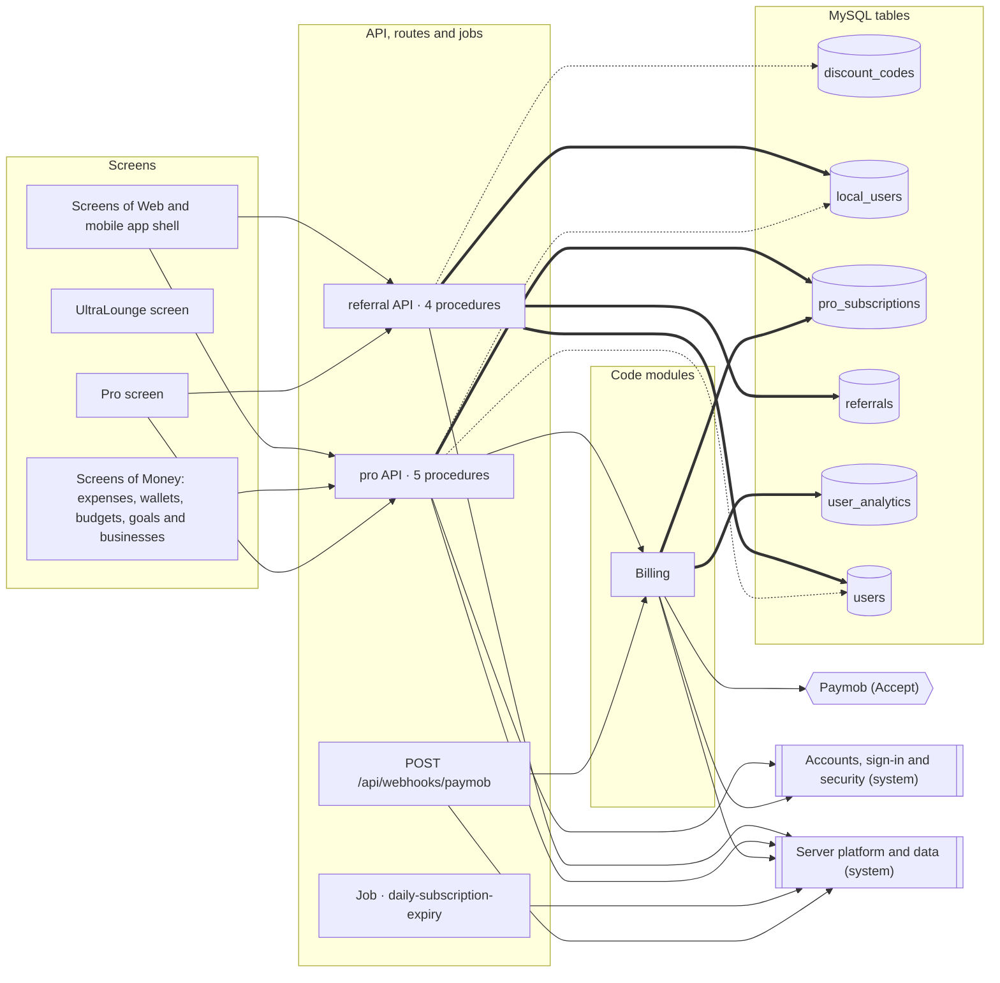
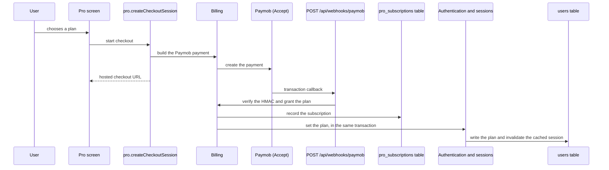

<!-- GENERATED by `npm run atlas` from the source code and docs/architecture/systems.json. Do not edit: the next run overwrites this file. -->

# Plans and payments

The Free, Pro and Ultra plans and the Ultra members page, checkout through Paymob and its webhook, referral codes, and the daily job that ends expired subscriptions.

How it works: [docs/systems/billing.md](../../systems/billing.md) · بالعربي: [docs/ar/systems/billing.md](../../ar/systems/billing.md) · [All systems](README.md)

## What it is made of

Solid arrows: calls and uses. Thick arrows: writes a table. Dotted arrows: reads a table. A double-bordered box is another system this one depends on.

## Journeys

### upgrade a plan through Paymob

The Pro page asks the API for a Paymob checkout. Paymob later calls the webhook, which verifies the HMAC and grants the plan: the subscription row and the user’s plan are written in one transaction, and the cached session is invalidated so the paid plan is visible on the next request.

Drawn in `docs/architecture/flows/paymob-upgrade.c4`; in the interactive map it is the view `flow_paymob_upgrade`.

## Code modules

| Module | What it does | Files |
| --- | --- | --- |
| `billing` — Billing | Paymob checkout requests, webhook verification settings and the subscription grant that sets a user's plan. | 2 |

## API procedures

| Procedure | Kind | Builder | Reads | Writes | Screens that call it |
| --- | --- | --- | --- | --- | --- |
| `pro.cancel` | mutation | `authedProcedure` | — | `pro_subscriptions` | `More`, `Pro` |
| `pro.createCheckoutSession` | mutation | `authedProcedure` | — | — | `More`, `Pro` |
| `pro.listSubscriptions` | query | `adminProcedure` | `pro_subscriptions` | — | — |
| `pro.myPlan` | query | `authedProcedure` | `local_users`, `pro_subscriptions`, `users` | `pro_subscriptions` | `Home`, `More`, `Pro` |
| `pro.upgrade` | mutation | `authedProcedure` | — | — | `More`, `Pro` |
| `referral.applyCode` | mutation | `authedProcedure` | `local_users`, `referrals`, `users` | `local_users`, `referrals`, `users` | `More`, `Pro` |
| `referral.listAll` | query | `adminProcedure` | `referrals` | — | — |
| `referral.myCode` | query | `authedProcedure` | `discount_codes`, `local_users`, `referrals`, `users` | `local_users`, `users` | `More`, `Pro` |
| `referral.myReferrals` | query | `authedProcedure` | `referrals` | — | — |

## HTTP routes, WebSockets and scheduled jobs

| Entry point | Kind | Declared in |
| --- | --- | --- |
| `POST /api/webhooks/paymob` | webhook | `api/boot.ts` |
| `daily-subscription-expiry` | job, `0 6 * * *` | `api/boot.ts` |

## Data

Who in this system writes or reads each table: procedures, routes, jobs and code modules.

| Table | Storage class | Written by | Read by |
| --- | --- | --- | --- |
| `discount_codes` | A | — | `referral.myCode` |
| `local_users` | A | `referral.applyCode`, `referral.myCode` | `pro.myPlan`, `referral.applyCode`, `referral.myCode` |
| `pro_subscriptions` | A | `billing`, `pro.cancel`, `pro.myPlan` | `billing`, `pro.listSubscriptions`, `pro.myPlan` |
| `referrals` | A | `referral.applyCode` | `referral.applyCode`, `referral.listAll`, `referral.myCode`, `referral.myReferrals` |
| `user_analytics` | E | `billing` | — |
| `users` | A | `referral.applyCode`, `referral.myCode` | `pro.myPlan`, `referral.applyCode`, `referral.myCode` |

## Outside systems

| System | Kind | Modules |
| --- | --- | --- |
| Paymob (Accept) | payments | `billing` |

## Other systems

Depends on: [Accounts, sign-in and security](accounts.md), [Admin console, support and growth tools](admin.md), [Server platform and data](platform.md).

Used by: [Money: expenses, wallets, budgets, goals and businesses](money.md), [Server platform and data](platform.md), [Web and mobile app shell](web-app.md).

## Environment variables

| Variable | Validated in api/lib/env.ts | Read by |
| --- | --- | --- |
| `PAYMOB_API_KEY` | yes | `api/lib/paymob.ts` |
| `PAYMOB_HMAC_SECRET` | yes | `api/lib/paymob.ts` |
| `PAYMOB_IFRAME_ID` | yes | `api/lib/paymob.ts` |
| `PAYMOB_INTEGRATION_ID` | yes | `api/lib/paymob.ts` |

## Source its explanation describes

When any of it changes, `npm run agent:finish` asks for a new check of `docs/systems/billing.md`. A name after `#` is one procedure, route or job of a file that several systems share; `rest-of-file` is the rest of such a file.

9 files and declarations

- `api/boot.ts#POST /api/webhooks/paymob`
- `api/boot.ts#job:daily-subscription-expiry`
- `api/jobs/subscription-expiry-job.ts`
- `api/lib/paymob.ts`
- `api/lib/subscription-service.ts`
- `api/pro-router.ts`
- `api/referral-router.ts`
- `src/pages/Pro.tsx`
- `src/pages/UltraLounge.tsx`

