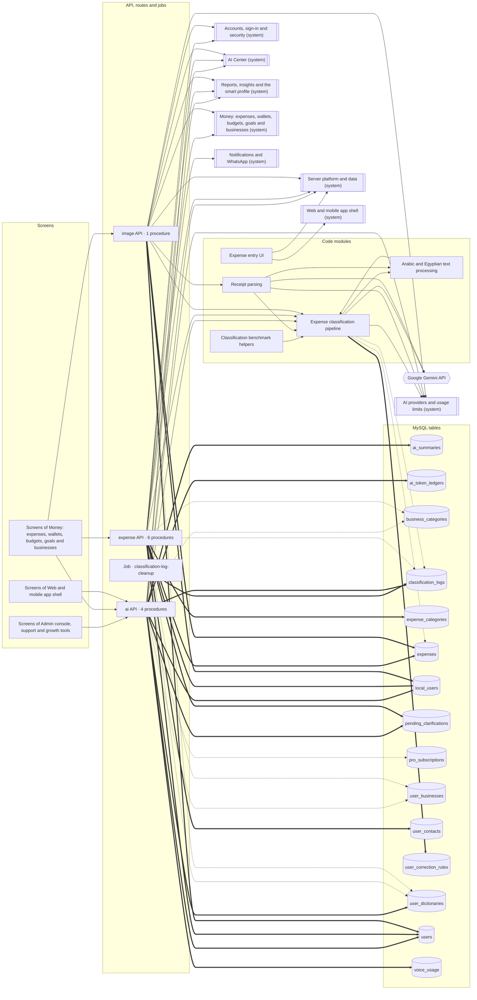
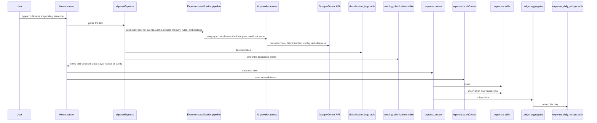

<!-- GENERATED by `npm run atlas` from the source code and docs/architecture/systems.json. Do not edit: the next run overwrites this file. -->

# Recording spending

Turns a typed or dictated sentence, or a receipt photo, into categorized transactions: the entry form, the classification pipeline, Arabic text handling, clarifying questions and saving the items.

How it works: [docs/systems/expense-capture.md](../../systems/expense-capture.md) · بالعربي: [docs/ar/systems/expense-capture.md](../../ar/systems/expense-capture.md) · [All systems](README.md)

## What it is made of

Solid arrows: calls and uses. Thick arrows: writes a table. Dotted arrows: reads a table. A double-bordered box is another system this one depends on.

## Journeys

### record an expense from text

The expense form on the home screen sends the sentence to ai.parseExpense. runSmartPipeline splits it into financial events, then tries the result cache, muscle memory and the rule engine, and asks a model only to name the category of clauses it could not settle. auto_save items are saved at once, review items after the user confirms, and clarify returns a question. One item is saved with expense.create, several with expense.batchCreate; both write the daily rollup delta.

Drawn in `docs/architecture/flows/record-expense.c4`; in the interactive map it is the view `flow_record_expense`.

## Code modules

| Module | What it does | Files |
| --- | --- | --- |
| `arabic-nlp` — Arabic and Egyptian text processing | Normalizers, dictionaries, Arabic number parsing, negation detection, fuzzy matching and speech-to-text corrections. | 10 |
| `classification` — Expense classification pipeline | smart-pipeline.ts and the modules it composes: financial events, admissibility, rules, muscle memory, embeddings, taxonomy, confidence calibration, decomposition, verification and the final per-item acceptance. | 33 |
| `classification-qa` — Classification benchmark helpers | Helpers used only by the classification benchmark and QA scripts: taxonomy assertions and simulated users. | 2 |
| `receipt-parsing` — Receipt parsing | Receipt parsing with a vision model. | 1 |
| `web-capture` — Expense entry UI | The expense form on the home screen: typed, spoken and photographed entries, the review and clarification steps, the offline text queue, local suggestions and offline input checks, and image compression before a receipt is uploaded. | 4 |

## API procedures

| Procedure | Kind | Builder | Reads | Writes | Screens that call it |
| --- | --- | --- | --- | --- | --- |
| `ai.learnWord` | mutation | `authedProcedure` | — | `user_dictionaries` | — |
| `ai.parseExpense` | mutation | `aiProcedure` | `business_categories`, `pending_clarifications`, `user_businesses`, `user_dictionaries` | `ai_summaries`, `ai_token_ledgers`, `classification_logs`, `local_users`, `pending_clarifications`, `users` | `Admin`, `Home`, `More` |
| `ai.parseVoiceExpense` | mutation | `aiProcedure` | `business_categories`, `pending_clarifications`, `user_businesses`, `user_dictionaries`, `voice_usage` | `ai_token_ledgers`, `classification_logs`, `local_users`, `pending_clarifications`, `users`, `voice_usage` | `Home` |
| `ai.speechToText` | mutation | `aiProcedure` | `local_users`, `pro_subscriptions`, `users`, `voice_usage` | `ai_token_ledgers`, `local_users`, `users`, `voice_usage` | — |
| `expense.answerClarification` | mutation | `authedProcedure` | `business_categories`, `classification_logs`, `pending_clarifications`, `user_businesses`, `user_contacts`, `user_dictionaries` | `expenses`, `pending_clarifications`, `user_contacts` | `Home` |
| `expense.batchCreate` | mutation | `authedProcedure` | `classification_logs`, `expenses`, `user_contacts` | `expenses`, `local_users`, `user_contacts`, `users` | `Home` |
| `expense.create` | mutation | `authedProcedure` | `classification_logs`, `expenses`, `user_contacts` | `expenses`, `local_users`, `user_contacts`, `users` | `Home` |
| `expense.createCategory` | mutation | `authedProcedure` | — | `expense_categories` | — |
| `expense.getCategoryList` | query | `authedProcedure` | `expense_categories` | — | — |
| `expense.getPendingClarifications` | query | `authedProcedure` | `pending_clarifications` | — | `Home` |
| `image.parseReceipt` | mutation | `proProcedure` | `expenses`, `user_dictionaries` | `expenses`, `local_users`, `users` | `Home` |

## HTTP routes, WebSockets and scheduled jobs

| Entry point | Kind | Declared in |
| --- | --- | --- |
| `classification-log-cleanup` | job, `0 3 * * 0` | `api/boot.ts` |

## Data

Who in this system writes or reads each table: procedures, routes, jobs and code modules.

| Table | Storage class | Written by | Read by |
| --- | --- | --- | --- |
| `ai_summaries` | C | `ai.parseExpense` | — |
| `ai_token_ledgers` | E | `ai.parseExpense`, `ai.parseVoiceExpense`, `ai.speechToText` | — |
| `business_categories` | A | — | `ai.parseExpense`, `ai.parseVoiceExpense`, `expense.answerClarification` |
| `classification_logs` | E | `ai.parseExpense`, `ai.parseVoiceExpense`, `classification-log-cleanup` | `classification`, `expense.answerClarification`, `expense.batchCreate`, `expense.create` |
| `expense_categories` | A | `expense.createCategory` | `expense.getCategoryList` |
| `expenses` | B | `expense.answerClarification`, `expense.batchCreate`, `expense.create`, `image.parseReceipt` | `classification`, `expense.batchCreate`, `expense.create`, `image.parseReceipt` |
| `local_users` | A | `ai.parseExpense`, `ai.parseVoiceExpense`, `ai.speechToText`, `expense.batchCreate`, `expense.create`, `image.parseReceipt` | `ai.speechToText` |
| `pending_clarifications` | D | `ai.parseExpense`, `ai.parseVoiceExpense`, `expense.answerClarification` | `ai.parseExpense`, `ai.parseVoiceExpense`, `expense.answerClarification`, `expense.getPendingClarifications` |
| `pro_subscriptions` | A | — | `ai.speechToText` |
| `user_businesses` | A | — | `ai.parseExpense`, `ai.parseVoiceExpense`, `expense.answerClarification` |
| `user_contacts` | A | `expense.answerClarification`, `expense.batchCreate`, `expense.create` | `expense.answerClarification`, `expense.batchCreate`, `expense.create` |
| `user_correction_rules` | F | `classification` | `classification` |
| `user_dictionaries` | F | `ai.learnWord` | `ai.parseExpense`, `ai.parseVoiceExpense`, `expense.answerClarification`, `image.parseReceipt` |
| `users` | A | `ai.parseExpense`, `ai.parseVoiceExpense`, `ai.speechToText`, `expense.batchCreate`, `expense.create`, `image.parseReceipt` | `ai.speechToText` |
| `voice_usage` | E | `ai.parseVoiceExpense`, `ai.speechToText` | `ai.parseVoiceExpense`, `ai.speechToText` |

## Outside systems

| System | Kind | Modules |
| --- | --- | --- |
| Google Gemini API | ai-provider | `classification`, `receipt-parsing` |

## Other systems

Depends on: [Accounts, sign-in and security](accounts.md), [AI Center](ai-center.md), [AI providers and usage limits](ai-platform.md), [Reports, insights and the smart profile](insights.md), [Money: expenses, wallets, budgets, goals and businesses](money.md), [Notifications and WhatsApp](notifications.md), [Server platform and data](platform.md), [Web and mobile app shell](web-app.md).

Used by: [Admin console, support and growth tools](admin.md), [AI Center](ai-center.md), [Reports, insights and the smart profile](insights.md), [Money: expenses, wallets, budgets, goals and businesses](money.md), [Server platform and data](platform.md), [Web and mobile app shell](web-app.md).

## Environment variables

| Variable | Validated in api/lib/env.ts | Read by |
| --- | --- | --- |
| `GEMINI_API_KEY` | yes | `api/lib/generate-embeddings-cache.ts` |
| `DEV` | frontend | `src/components/expenses/ExpenseForm.tsx` |

## Source its explanation describes

When any of it changes, `npm run agent:finish` asks for a new check of `docs/systems/expense-capture.md`. A name after `#` is one procedure, route or job of a file that several systems share; `rest-of-file` is the rest of such a file.

64 files and declarations

- `api/ai-router.ts#ai.learnWord`
- `api/ai-router.ts#ai.parseExpense`
- `api/ai-router.ts#ai.parseVoiceExpense`
- `api/ai-router.ts#ai.speechToText`
- `api/ai-router.ts#rest-of-file`
- `api/boot.ts#job:classification-log-cleanup`
- `api/expense-router.ts#expense.answerClarification`
- `api/expense-router.ts#expense.batchCreate`
- `api/expense-router.ts#expense.create`
- `api/expense-router.ts#expense.createCategory`
- `api/expense-router.ts#expense.getCategoryList`
- `api/expense-router.ts#expense.getPendingClarifications`
- `api/expense-router.ts#rest-of-file`
- `api/image-router.ts`
- `api/lib/admissibility-gate.ts`
- `api/lib/amount-ledger.ts`
- `api/lib/amount-linker.ts`
- `api/lib/anomaly-detector.ts`
- `api/lib/arabic-number-parser.ts`
- `api/lib/arabic-token-match.ts`
- `api/lib/benchmark-taxonomy-assert.ts`
- `api/lib/category-registry.ts`
- `api/lib/classification-decision.ts`
- `api/lib/classification-evidence.ts`
- `api/lib/classification-merge.ts`
- `api/lib/classification-prompt.ts`
- `api/lib/classifier-contract.ts`
- `api/lib/confidence-calibration.generated.ts`
- `api/lib/confidence-calibrator.ts`
- `api/lib/confidence-scorer.ts`
- `api/lib/correction-rules.ts`
- `api/lib/direction-governed-taxonomy.ts`
- `api/lib/egyptian-dictionary.ts`
- `api/lib/egyptian-names-dictionary.ts`
- `api/lib/embedding-engine.ts`
- `api/lib/entity-extractor.ts`
- `api/lib/final-acceptance.ts`
- `api/lib/financial-event-plan.ts`
- `api/lib/fuzzy-match.ts`
- `api/lib/generate-embeddings-cache.ts`
- `api/lib/intent-detector.ts`
- `api/lib/keyword-category-priors.ts`
- `api/lib/muscle-memory.ts`
- `api/lib/narrative-decomposer.ts`
- `api/lib/negation-detector.ts`
- `api/lib/normalizer-v2.ts`
- `api/lib/person-resolver.ts`
- `api/lib/post-classifier-verifier.ts`
- `api/lib/real-user-sim.ts`
- `api/lib/receipt-image-parser.ts`
- `api/lib/relationship-normalizer.ts`
- `api/lib/rule-engine.ts`
- `api/lib/smart-pipeline.ts`
- `api/lib/stt-corrections.ts`
- `api/lib/taxonomy-adapter.ts`
- `api/lib/taxonomy-ssot.ts`
- `api/lib/text-normalizer.ts`
- `api/lib/unified-normalizer.ts`
- `api/lib/voice-intake-gate.ts`
- `api/services/parser-trace.ts`
- `src/components/expenses/ExpenseForm.tsx`
- `src/components/expenses/ReceiptCapture.tsx`
- `src/lib/clientRulesEngine.ts`
- `src/lib/compress-image.ts`

