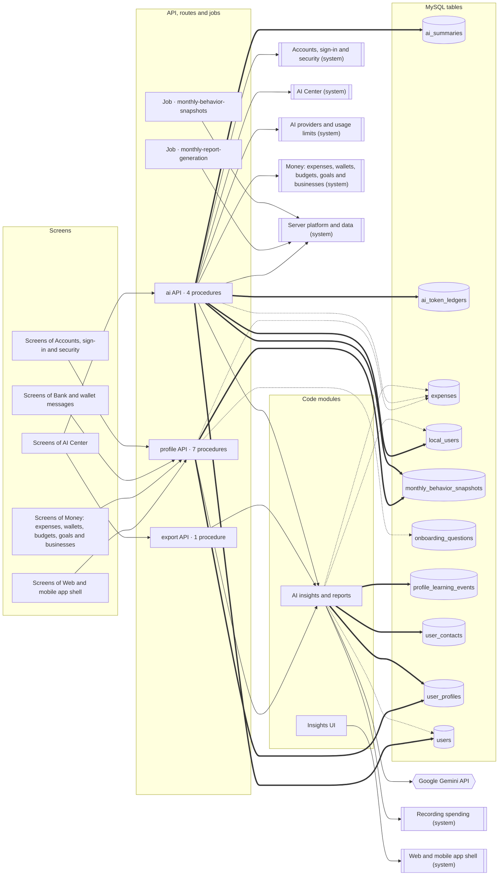

<!-- GENERATED by `npm run atlas` from the source code and docs/architecture/systems.json. Do not edit: the next run overwrites this file. -->

# Reports, insights and the smart profile

Monthly and yearly insights, month comparisons and the Pro report, built on a smart profile that onboarding questions and spending behaviour fill in.

How it works: [docs/systems/insights.md](../../systems/insights.md) · بالعربي: [docs/ar/systems/insights.md](../../ar/systems/insights.md) · [All systems](README.md)

## What it is made of

Solid arrows: calls and uses. Thick arrows: writes a table. Dotted arrows: reads a table. A double-bordered box is another system this one depends on.

## Code modules

| Module | What it does | Files |
| --- | --- | --- |
| `ai-insights` — AI insights and reports | The smart profile and the contacts it reads from user_contacts, adaptive onboarding questions, monthly behaviour snapshots, the personal context added to classification and report prompts, and the printable Pro report. The Gemini batch service only simulates its calls. | 7 |
| `web-insights` — Insights UI | The monthly AI insights view shown in the AI Center's analysis tab. | 1 |

## API procedures

| Procedure | Kind | Builder | Reads | Writes | Screens that call it |
| --- | --- | --- | --- | --- | --- |
| `ai.compareMonths` | mutation | `aiProcedure` | — | — | `AICenter` |
| `ai.generateMonthlyInsights` | mutation | `aiProcedure` | `ai_summaries`, `expenses`, `local_users`, `users` | `ai_summaries`, `ai_token_ledgers`, `local_users`, `monthly_behavior_snapshots`, `users` | `AICenter` |
| `ai.generateYearlyInsights` | mutation | `aiProcedure` | — | — | — |
| `ai.getCachedMonthlyInsights` | query | `authedProcedure` | `ai_summaries` | — | `AICenter` |
| `export.monthlyReportHtml` | mutation | `proProcedure` | — | — | `AICenter` |
| `profile.dismissOnboarding` | mutation | `authedProcedure` | — | `user_profiles` | `Home` |
| `profile.getNextOnboardingQuestion` | query | `authedProcedure` | `user_profiles` | — | `Home`, `More`, `Settings` |
| `profile.getQuestions` | query | `authedProcedure` | `onboarding_questions` | — | — |
| `profile.getSmartProfile` | query | `authedProcedure` | — | — | `App shell`, `BankSyncPage`, `Home`, `More`, `Settings` |
| `profile.refreshInferences` | mutation | `authedProcedure` | `expenses` | `monthly_behavior_snapshots` | — |
| `profile.submitOnboardingAnswer` | mutation | `authedProcedure` | — | — | `Home` |
| `profile.updateSmartProfile` | mutation | `authedProcedure` | — | — | `BankSyncPage`, `More`, `Settings` |

## HTTP routes, WebSockets and scheduled jobs

| Entry point | Kind | Declared in |
| --- | --- | --- |
| `monthly-behavior-snapshots` | job, `0 1 1 * *` | `api/boot.ts` |
| `monthly-report-generation` | job, `0 2 1 * *` | `api/boot.ts` |

## Data

Who in this system writes or reads each table: procedures, routes, jobs and code modules.

| Table | Storage class | Written by | Read by |
| --- | --- | --- | --- |
| `ai_summaries` | C | `ai.generateMonthlyInsights` | `ai.generateMonthlyInsights`, `ai.getCachedMonthlyInsights` |
| `ai_token_ledgers` | E | `ai.generateMonthlyInsights` | — |
| `expenses` | B | — | `ai-insights`, `ai.generateMonthlyInsights`, `profile.refreshInferences` |
| `local_users` | A | `ai.generateMonthlyInsights` | `ai-insights`, `ai.generateMonthlyInsights` |
| `monthly_behavior_snapshots` | C | `ai.generateMonthlyInsights`, `profile.refreshInferences` | — |
| `onboarding_questions` | A | — | `profile.getQuestions` |
| `profile_learning_events` | E | `ai-insights` | `ai-insights` |
| `user_contacts` | A | `ai-insights` | `ai-insights` |
| `user_profiles` | A | `ai-insights`, `profile.dismissOnboarding` | `ai-insights`, `profile.getNextOnboardingQuestion` |
| `users` | A | `ai.generateMonthlyInsights` | `ai-insights`, `ai.generateMonthlyInsights` |

## Outside systems

| System | Kind | Modules |
| --- | --- | --- |
| Google Gemini API | ai-provider | `ai-insights` |

## Other systems

Depends on: [Accounts, sign-in and security](accounts.md), [AI Center](ai-center.md), [AI providers and usage limits](ai-platform.md), [Recording spending](expense-capture.md), [Money: expenses, wallets, budgets, goals and businesses](money.md), [Server platform and data](platform.md), [Web and mobile app shell](web-app.md).

Used by: [Accounts, sign-in and security](accounts.md), [Admin console, support and growth tools](admin.md), [AI Center](ai-center.md), [Bank and wallet messages](bank-messages.md), [Recording spending](expense-capture.md), [Money: expenses, wallets, budgets, goals and businesses](money.md), [Server platform and data](platform.md), [Web and mobile app shell](web-app.md).

## Environment variables

| Variable | Validated in api/lib/env.ts | Read by |
| --- | --- | --- |
| `GEMINI_API_KEY` | yes | `api/services/batch-ai-service.ts` |
| `DEV` | frontend | `src/components/insights/AIInsights.tsx` |

## Source its explanation describes

When any of it changes, `npm run agent:finish` asks for a new check of `docs/systems/insights.md`. A name after `#` is one procedure, route or job of a file that several systems share; `rest-of-file` is the rest of such a file.

27 files and declarations

- `api/ai-router.ts#ai.compareMonths`
- `api/ai-router.ts#ai.generateMonthlyInsights`
- `api/ai-router.ts#ai.generateYearlyInsights`
- `api/ai-router.ts#ai.getCachedMonthlyInsights`
- `api/ai-router.ts#rest-of-file`
- `api/boot.ts#job:monthly-behavior-snapshots`
- `api/boot.ts#job:monthly-report-generation`
- `api/export-router.ts#export.monthlyReportHtml`
- `api/export-router.ts#rest-of-file`
- `api/jobs/monthly-behavior-job.ts`
- `api/jobs/monthly-report-job.ts`
- `api/profile-router.ts#profile.dismissOnboarding`
- `api/profile-router.ts#profile.getNextOnboardingQuestion`
- `api/profile-router.ts#profile.getQuestions`
- `api/profile-router.ts#profile.getSmartProfile`
- `api/profile-router.ts#profile.refreshInferences`
- `api/profile-router.ts#profile.submitOnboardingAnswer`
- `api/profile-router.ts#profile.updateSmartProfile`
- `api/profile-router.ts#rest-of-file`
- `api/services/adaptive-question-engine.ts`
- `api/services/batch-ai-service.ts`
- `api/services/lifestyle-inference-engine.ts`
- `api/services/personal-context-builder.ts`
- `api/services/pro-report-engine.ts`
- `api/services/report-personalization-engine.ts`
- `api/services/user-profile-service.ts`
- `src/components/insights/AIInsights.tsx`

