<!-- GENERATED by `npm run atlas` from the source code and docs/architecture/systems.json. Do not edit: the next run overwrites this file. -->

# Money: expenses, wallets, budgets, goals and businesses

The ledger once an item is saved: the dashboard, expense lists and statistics, wallets, budgets, savings goals, business mode, the people the user deals with, daily rollups and exports.

How it works: [docs/systems/money.md](../../systems/money.md) · بالعربي: [docs/ar/systems/money.md](../../ar/systems/money.md) · [All systems](README.md)

## What it is made of

Solid arrows: calls and uses. Thick arrows: writes a table. Dotted arrows: reads a table. A double-bordered box is another system this one depends on.

```mermaid
flowchart LR
  subgraph g_screens["Screens"]
    page_Home["Home screen"]
    screens_accounts["Screens of Accounts, sign-in and security"]
    screens_bank_messages["Screens of Bank and wallet messages"]
    screens_web_app["Screens of Web and mobile app shell"]
  end
  subgraph g_api["API, routes and jobs"]
    job_nightly_rollup_reconciliation["Job · nightly-rollup-reconciliation"]
    job_taxonomy_migration["Job · taxonomy-migration"]
    router_budget["budget API · 4 procedures"]
    router_business["business API · 10 procedures"]
    router_expense["expense API · 9 procedures"]
    router_export["export API · 1 procedure"]
    router_goals["goals API · 5 procedures"]
    router_profile["profile API · 5 procedures"]
    router_wallet["wallet API · 5 procedures"]
  end
  subgraph g_modules["Code modules"]
    mod_ledger["Ledger aggregates"]
    mod_web_finance["Finance UI"]
  end
  subgraph g_tables["MySQL tables"]
    tbl_business_categories[("business_categories")]
    tbl_classification_logs[("classification_logs")]
    tbl_expense_daily_rollups[("expense_daily_rollups")]
    tbl_expense_details[("expense_details")]
    tbl_expenses[("expenses")]
    tbl_financial_goals[("financial_goals")]
    tbl_local_users[("local_users")]
    tbl_user_budgets[("user_budgets")]
    tbl_user_businesses[("user_businesses")]
    tbl_user_contacts[("user_contacts")]
    tbl_user_profiles[("user_profiles")]
    tbl_user_wallets[("user_wallets")]
    tbl_users[("users")]
  end
  sys_accounts[["Accounts, sign-in and security (system)"]]
  sys_ai_center[["AI Center (system)"]]
  sys_ai_platform[["AI providers and usage limits (system)"]]
  sys_expense_capture[["Recording spending (system)"]]
  sys_insights[["Reports, insights and the smart profile (system)"]]
  sys_platform[["Server platform and data (system)"]]
  sys_web_app[["Web and mobile app shell (system)"]]
  job_nightly_rollup_reconciliation --> sys_platform
  job_taxonomy_migration --> sys_platform
  mod_ledger --> sys_ai_center
  mod_ledger --> sys_platform
  mod_ledger -.-> tbl_expenses
  mod_ledger -.-> tbl_user_contacts
  mod_ledger ==> tbl_expense_daily_rollups
  mod_ledger ==> tbl_expense_details
  mod_ledger ==> tbl_user_budgets
  mod_web_finance --> sys_platform
  mod_web_finance --> sys_web_app
  page_Home --> router_budget
  page_Home --> router_business
  page_Home --> router_expense
  page_Home --> router_goals
  router_budget --> mod_ledger
  router_budget --> sys_accounts
  router_budget --> sys_ai_center
  router_budget --> sys_expense_capture
  router_budget --> sys_platform
  router_budget ==> tbl_user_budgets
  router_business --> mod_ledger
  router_business --> sys_ai_center
  router_business --> sys_expense_capture
  router_business --> sys_platform
  router_business ==> tbl_business_categories
  router_business ==> tbl_expenses
  router_business ==> tbl_user_businesses
  router_business ==> tbl_user_contacts
  router_expense --> mod_ledger
  router_expense --> sys_accounts
  router_expense --> sys_ai_center
  router_expense --> sys_expense_capture
  router_expense --> sys_insights
  router_expense --> sys_platform
  router_expense -.-> tbl_expense_daily_rollups
  router_expense ==> tbl_classification_logs
  router_expense ==> tbl_expenses
  router_expense ==> tbl_user_contacts
  router_export -.-> tbl_expenses
  router_goals --> sys_ai_center
  router_goals --> sys_ai_platform
  router_goals --> sys_insights
  router_goals --> sys_platform
  router_goals -.-> tbl_expenses
  router_goals ==> tbl_financial_goals
  router_goals ==> tbl_local_users
  router_goals ==> tbl_user_budgets
  router_goals ==> tbl_users
  router_profile --> sys_accounts
  router_profile --> sys_expense_capture
  router_profile ==> tbl_expenses
  router_profile ==> tbl_user_contacts
  router_profile ==> tbl_user_profiles
  router_wallet ==> tbl_expenses
  router_wallet ==> tbl_user_wallets
  screens_accounts --> router_business
  screens_accounts --> router_expense
  screens_accounts --> router_goals
  screens_accounts --> router_profile
  screens_bank_messages --> router_wallet
  screens_web_app --> router_business
  screens_web_app --> router_expense
  screens_web_app --> router_goals
  screens_web_app --> router_profile
  screens_web_app --> router_wallet
```

## Code modules

| Module | What it does | Files |
| --- | --- | --- |
| `ledger` — Ledger aggregates | Daily expense rollups (the delta applied inside every expense write, and reconciliation against the ledger), the expense_details side table, and salary-cycle month ranges. | 4 |
| `web-finance` — Finance UI | Home dashboard (summaries, calendar, charts, search, streaks), recent expenses and goals. | 17 |

## API procedures

| Procedure | Kind | Builder | Reads | Writes | Screens that call it |
| --- | --- | --- | --- | --- | --- |
| `budget.create` | mutation | `authedProcedure` | — | `user_budgets` | `Home` |
| `budget.delete` | mutation | `authedProcedure` | `user_budgets` | `user_budgets` | `Home` |
| `budget.list` | query | `authedProcedure` | — | — | `Home` |
| `budget.update` | mutation | `authedProcedure` | `user_budgets` | `user_budgets` | — |
| `business.addCategory` | mutation | `businessProcedure` | `user_businesses` | `business_categories` | `More`, `Settings` |
| `business.create` | mutation | `businessProcedure` | `user_businesses` | `business_categories`, `user_businesses` | `More`, `Settings` |
| `business.delete` | mutation | `businessProcedure` | `user_businesses` | `business_categories`, `expenses`, `user_businesses`, `user_contacts` | `More`, `Settings` |
| `business.get` | query | `businessProcedure` | `business_categories`, `user_businesses`, `user_contacts` | — | `Home`, `More`, `Settings` |
| `business.linkContact` | mutation | `businessProcedure` | `user_businesses`, `user_contacts` | `user_contacts` | — |
| `business.removeCategory` | mutation | `businessProcedure` | `business_categories`, `user_businesses` | `business_categories` | `More`, `Settings` |
| `business.suggestCategories` | mutation | `businessAiProcedure` | — | — | `More`, `Settings` |
| `business.types` | query | `businessProcedure` | — | — | — |
| `business.update` | mutation | `businessProcedure` | `user_businesses` | `user_businesses` | `More`, `Settings` |
| `business.updateCategory` | mutation | `businessProcedure` | `business_categories`, `user_businesses` | `business_categories` | — |
| `expense.delete` | mutation | `authedProcedure` | `expenses` | `expenses`, `user_contacts` | `Home` |
| `expense.getById` | query | `authedProcedure` | `expenses` | — | — |
| `expense.getDebtBalances` | query | `authedProcedure` | — | — | `Home` |
| `expense.getMonthSummary` | query | `authedProcedure` | `expense_daily_rollups` | — | `Home` |
| `expense.getMonthlyStats` | query | `authedProcedure` | `expense_daily_rollups`, `expenses` | — | `Home`, `More`, `Settings` |
| `expense.getYearlyStats` | query | `authedProcedure` | `expense_daily_rollups` | — | — |
| `expense.list` | query | `authedProcedure` | `expenses` | — | `Home` |
| `expense.searchTransactions` | query | `authedProcedure` | `expenses` | — | `Home` |
| `expense.update` | mutation | `authedProcedure` | `classification_logs`, `expenses` | `classification_logs`, `expenses` | `Home` |
| `export.myExpenses` | mutation | `authedProcedure` | `expenses` | — | — |
| `goals.analyze` | mutation | `goalAnalysisProcedure` | `expenses`, `financial_goals` | `financial_goals`, `local_users`, `users` | `Home`, `More`, `Settings` |
| `goals.create` | mutation | `authedProcedure` | `financial_goals` | `financial_goals` | `Home`, `More`, `Settings` |
| `goals.delete` | mutation | `authedProcedure` | — | `financial_goals`, `user_budgets` | — |
| `goals.list` | query | `authedProcedure` | `financial_goals` | — | `Home`, `More`, `Settings` |
| `goals.setStatus` | mutation | `authedProcedure` | — | `financial_goals` | `More`, `Settings` |
| `profile.addContact` | mutation | `authedProcedure` | `user_contacts` | `user_contacts` | `More`, `Settings` |
| `profile.deleteContact` | mutation | `authedProcedure` | `user_contacts`, `user_profiles` | `expenses`, `user_contacts`, `user_profiles` | `More`, `Settings` |
| `profile.listContacts` | query | `authedProcedure` | `expenses`, `user_contacts` | — | `More`, `Settings` |
| `profile.mergeContacts` | mutation | `authedProcedure` | `expenses`, `user_contacts`, `user_profiles` | `expenses`, `user_contacts`, `user_profiles` | `More`, `Settings` |
| `profile.updateContact` | mutation | `authedProcedure` | `user_contacts` | `user_contacts` | `More`, `Settings` |
| `wallet.createWallet` | mutation | `authedProcedure` | — | `user_wallets` | `BankSyncPage`, `More` |
| `wallet.deleteWallet` | mutation | `authedProcedure` | — | `expenses`, `user_wallets` | `BankSyncPage`, `More` |
| `wallet.getWalletTransactions` | query | `authedProcedure` | `expenses` | — | `BankSyncPage`, `More` |
| `wallet.getWallets` | query | `authedProcedure` | `user_wallets` | — | `BankSyncPage`, `More` |
| `wallet.updateWallet` | mutation | `authedProcedure` | — | `user_wallets` | — |

## HTTP routes, WebSockets and scheduled jobs

| Entry point | Kind | Declared in |
| --- | --- | --- |
| `nightly-rollup-reconciliation` | job, `0 4 * * *` | `api/boot.ts` |
| `taxonomy-migration` | job, `*/30 * * * *` | `api/boot.ts` |

## Data

Who in this system writes or reads each table: procedures, routes, jobs and code modules.

| Table | Storage class | Written by | Read by |
| --- | --- | --- | --- |
| `business_categories` | A | `business.addCategory`, `business.create`, `business.delete`, `business.removeCategory`, `business.updateCategory` | `business.get`, `business.removeCategory`, `business.updateCategory` |
| `classification_logs` | E | `expense.update` | `expense.update` |
| `expense_daily_rollups` | C | `ledger` | `expense.getMonthSummary`, `expense.getMonthlyStats`, `expense.getYearlyStats`, `ledger` |
| `expense_details` | B | `ledger` | — |
| `expenses` | B | `business.delete`, `expense.delete`, `expense.update`, `profile.deleteContact`, `profile.mergeContacts`, `wallet.deleteWallet` | `expense.delete`, `expense.getById`, `expense.getMonthlyStats`, `expense.list`, `expense.searchTransactions`, `expense.update`, `export.myExpenses`, `goals.analyze`, `ledger`, `profile.listContacts`, `profile.mergeContacts`, `wallet.getWalletTransactions` |
| `financial_goals` | C | `goals.analyze`, `goals.create`, `goals.delete`, `goals.setStatus` | `goals.analyze`, `goals.create`, `goals.list` |
| `local_users` | A | `goals.analyze` | — |
| `user_budgets` | C | `budget.create`, `budget.delete`, `budget.update`, `goals.delete`, `ledger` | `budget.delete`, `budget.update`, `ledger` |
| `user_businesses` | A | `business.create`, `business.delete`, `business.update` | `business.addCategory`, `business.create`, `business.delete`, `business.get`, `business.linkContact`, `business.removeCategory`, `business.update`, `business.updateCategory` |
| `user_contacts` | A | `business.delete`, `business.linkContact`, `expense.delete`, `profile.addContact`, `profile.deleteContact`, `profile.mergeContacts`, `profile.updateContact` | `business.get`, `business.linkContact`, `ledger`, `profile.addContact`, `profile.deleteContact`, `profile.listContacts`, `profile.mergeContacts`, `profile.updateContact` |
| `user_profiles` | A | `profile.deleteContact`, `profile.mergeContacts` | `profile.deleteContact`, `profile.mergeContacts` |
| `user_wallets` | A | `wallet.createWallet`, `wallet.deleteWallet`, `wallet.updateWallet` | `wallet.getWallets` |
| `users` | A | `goals.analyze` | — |

## Outside systems

_None._

## Other systems

Depends on: [Accounts, sign-in and security](accounts.md), [AI Center](ai-center.md), [AI providers and usage limits](ai-platform.md), [Bank and wallet messages](bank-messages.md), [Plans and payments](billing.md), [Recording spending](expense-capture.md), [Reports, insights and the smart profile](insights.md), [Notifications and WhatsApp](notifications.md), [Server platform and data](platform.md), [Live voice assistant](voice-calls.md), [Web and mobile app shell](web-app.md).

Used by: [Accounts, sign-in and security](accounts.md), [AI Center](ai-center.md), [Bank and wallet messages](bank-messages.md), [Recording spending](expense-capture.md), [Reports, insights and the smart profile](insights.md), [Notifications and WhatsApp](notifications.md), [Server platform and data](platform.md), [Web and mobile app shell](web-app.md).

## Environment variables

_None._

## Source its explanation describes

When any of it changes, `npm run agent:finish` asks for a new check of `docs/systems/money.md`. A name after `#` is one procedure, route or job of a file that several systems share; `rest-of-file` is the rest of such a file.

48 files and declarations

- `api/boot.ts#job:nightly-rollup-reconciliation`
- `api/boot.ts#job:taxonomy-migration`
- `api/budget-router.ts`
- `api/business-router.ts`
- `api/expense-router.ts#expense.delete`
- `api/expense-router.ts#expense.getById`
- `api/expense-router.ts#expense.getDebtBalances`
- `api/expense-router.ts#expense.getMonthSummary`
- `api/expense-router.ts#expense.getMonthlyStats`
- `api/expense-router.ts#expense.getYearlyStats`
- `api/expense-router.ts#expense.list`
- `api/expense-router.ts#expense.searchTransactions`
- `api/expense-router.ts#expense.update`
- `api/expense-router.ts#rest-of-file`
- `api/export-router.ts#export.myExpenses`
- `api/export-router.ts#rest-of-file`
- `api/goals-router.ts`
- `api/jobs/rollup-reconciliation-job.ts`
- `api/jobs/taxonomy-migration-job.ts`
- `api/profile-router.ts#profile.addContact`
- `api/profile-router.ts#profile.deleteContact`
- `api/profile-router.ts#profile.listContacts`
- `api/profile-router.ts#profile.mergeContacts`
- `api/profile-router.ts#profile.updateContact`
- `api/profile-router.ts#rest-of-file`
- `api/services/budget-status.ts`
- `api/services/debt-ledger.ts`
- `api/services/expense-rollups.ts`
- `api/services/financial-month.ts`
- `api/wallet-router.ts`
- `src/components/budgets/BudgetsPanel.tsx`
- `src/components/dashboard/BehaviorInsights.tsx`
- `src/components/dashboard/ExpenseChart.tsx`
- `src/components/dashboard/GlobalSearch.tsx`
- `src/components/dashboard/HomeHeader.tsx`
- `src/components/dashboard/HomeSummaryCards.tsx`
- `src/components/dashboard/MonthlyCalendar.tsx`
- `src/components/dashboard/MonthlyStats.tsx`
- `src/components/dashboard/NativeTabPanels.tsx`
- `src/components/dashboard/StatsView.tsx`
- `src/components/dashboard/StreakCounter.tsx`
- `src/components/dashboard/UserIntelligencePanel.tsx`
- `src/components/debts/DebtsPanel.tsx`
- `src/components/expenses/EditExpenseDialog.tsx`
- `src/components/expenses/PendingQuestionsCard.tsx`
- `src/components/expenses/RecentExpenses.tsx`
- `src/components/goals/FinancialGoalsPanel.tsx`
- `src/pages/Home.tsx`

