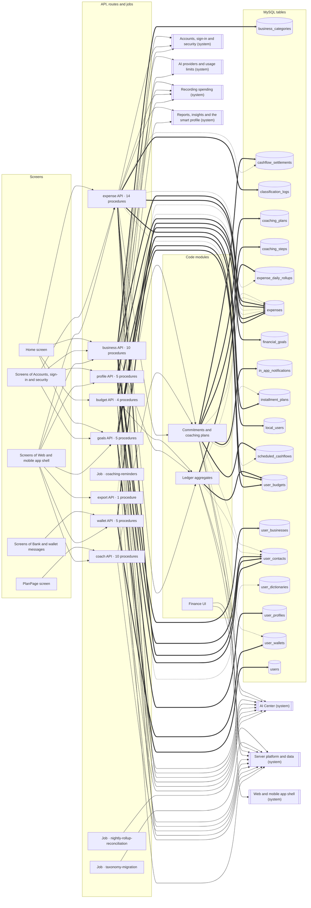

<!-- GENERATED by `npm run atlas` from the source code and docs/architecture/systems.json. Do not edit: the next run overwrites this file. -->

# Money: expenses, wallets, budgets, goals and businesses

The ledger once an item is saved: the dashboard, expense lists and statistics, wallets, budgets, savings goals, commitments and coaching plans, business mode, the people the user deals with, daily rollups and exports.

How it works: [docs/systems/money.md](../../systems/money.md) · بالعربي: [docs/ar/systems/money.md](../../ar/systems/money.md) · [All systems](README.md)

## What it is made of

Solid arrows: calls and uses. Thick arrows: writes a table. Dotted arrows: reads a table. A double-bordered box is another system this one depends on.

```mermaid
flowchart LR
  subgraph g_screens["Screens"]
    page_Home["Home screen"]
    page_PlanPage["PlanPage screen"]
    screens_accounts["Screens of Accounts, sign-in and security"]
    screens_bank_messages["Screens of Bank and wallet messages"]
    screens_web_app["Screens of Web and mobile app shell"]
  end
  subgraph g_api["API, routes and jobs"]
    job_coaching_reminders["Job · coaching-reminders"]
    job_nightly_rollup_reconciliation["Job · nightly-rollup-reconciliation"]
    job_taxonomy_migration["Job · taxonomy-migration"]
    router_budget["budget API · 4 procedures"]
    router_business["business API · 10 procedures"]
    router_coach["coach API · 10 procedures"]
    router_expense["expense API · 14 procedures"]
    router_export["export API · 1 procedure"]
    router_goals["goals API · 5 procedures"]
    router_profile["profile API · 5 procedures"]
    router_wallet["wallet API · 5 procedures"]
  end
  subgraph g_modules["Code modules"]
    mod_coaching["Commitments and coaching plans"]
    mod_ledger["Ledger aggregates"]
    mod_web_finance["Finance UI"]
  end
  subgraph g_tables["MySQL tables"]
    tbl_business_categories[("business_categories")]
    tbl_cashflow_settlements[("cashflow_settlements")]
    tbl_classification_logs[("classification_logs")]
    tbl_coaching_plans[("coaching_plans")]
    tbl_coaching_steps[("coaching_steps")]
    tbl_expense_daily_rollups[("expense_daily_rollups")]
    tbl_expenses[("expenses")]
    tbl_financial_goals[("financial_goals")]
    tbl_in_app_notifications[("in_app_notifications")]
    tbl_installment_plans[("installment_plans")]
    tbl_local_users[("local_users")]
    tbl_scheduled_cashflows[("scheduled_cashflows")]
    tbl_user_budgets[("user_budgets")]
    tbl_user_businesses[("user_businesses")]
    tbl_user_contacts[("user_contacts")]
    tbl_user_dictionaries[("user_dictionaries")]
    tbl_user_profiles[("user_profiles")]
    tbl_user_wallets[("user_wallets")]
    tbl_users[("users")]
  end
  sys_accounts[["Accounts, sign-in and security (system)"]]
  sys_ai_center[["AI Center (system)"]]
  sys_ai_platform[["AI providers and usage limits (system)"]]
  sys_expense_capture[["Recording spending (system)"]]
  sys_insights[["Reports, insights and the smart profile (system)"]]
  sys_platform[["Server platform and data (system)"]]
  sys_web_app[["Web and mobile app shell (system)"]]
  job_coaching_reminders --> mod_coaching
  job_nightly_rollup_reconciliation --> sys_platform
  job_taxonomy_migration --> sys_platform
  mod_coaching --> sys_ai_center
  mod_coaching --> sys_platform
  mod_coaching -.-> tbl_expenses
  mod_coaching -.-> tbl_installment_plans
  mod_coaching -.-> tbl_user_contacts
  mod_coaching -.-> tbl_user_wallets
  mod_coaching ==> tbl_cashflow_settlements
  mod_coaching ==> tbl_coaching_plans
  mod_coaching ==> tbl_coaching_steps
  mod_coaching ==> tbl_in_app_notifications
  mod_coaching ==> tbl_scheduled_cashflows
  mod_ledger --> sys_ai_center
  mod_ledger --> sys_platform
  mod_ledger -.-> tbl_expenses
  mod_ledger -.-> tbl_user_contacts
  mod_ledger ==> tbl_expense_daily_rollups
  mod_ledger ==> tbl_user_budgets
  mod_web_finance --> sys_platform
  mod_web_finance --> sys_web_app
  page_Home --> router_budget
  page_Home --> router_business
  page_Home --> router_expense
  page_Home --> router_goals
  page_PlanPage --> router_coach
  router_budget --> mod_ledger
  router_budget --> sys_accounts
  router_budget --> sys_ai_center
  router_budget --> sys_expense_capture
  router_budget --> sys_platform
  router_budget ==> tbl_user_budgets
  router_business --> mod_ledger
  router_business --> sys_ai_center
  router_business --> sys_ai_platform
  router_business --> sys_expense_capture
  router_business --> sys_platform
  router_business ==> tbl_business_categories
  router_business ==> tbl_expenses
  router_business ==> tbl_user_businesses
  router_business ==> tbl_user_contacts
  router_coach --> mod_coaching
  router_coach --> sys_platform
  router_expense --> mod_coaching
  router_expense --> mod_ledger
  router_expense --> sys_accounts
  router_expense --> sys_ai_center
  router_expense --> sys_expense_capture
  router_expense --> sys_insights
  router_expense --> sys_platform
  router_expense -.-> tbl_cashflow_settlements
  router_expense -.-> tbl_expense_daily_rollups
  router_expense -.-> tbl_scheduled_cashflows
  router_expense -.-> tbl_user_dictionaries
  router_expense ==> tbl_classification_logs
  router_expense ==> tbl_expenses
  router_expense ==> tbl_installment_plans
  router_expense ==> tbl_user_contacts
  router_export --> sys_platform
  router_export -.-> tbl_expenses
  router_goals --> sys_ai_center
  router_goals --> sys_ai_platform
  router_goals --> sys_insights
  router_goals --> sys_platform
  router_goals -.-> tbl_expenses
  router_goals ==> tbl_financial_goals
  router_goals ==> tbl_local_users
  router_goals ==> tbl_user_budgets
  router_goals ==> tbl_users
  router_profile --> sys_accounts
  router_profile --> sys_ai_center
  router_profile --> sys_expense_capture
  router_profile ==> tbl_expenses
  router_profile ==> tbl_user_contacts
  router_profile ==> tbl_user_profiles
  router_wallet --> sys_ai_center
  router_wallet ==> tbl_expenses
  router_wallet ==> tbl_user_wallets
  screens_accounts --> router_business
  screens_accounts --> router_expense
  screens_accounts --> router_goals
  screens_accounts --> router_profile
  screens_bank_messages --> router_wallet
  screens_web_app --> router_business
  screens_web_app --> router_coach
  screens_web_app --> router_expense
  screens_web_app --> router_export
  screens_web_app --> router_goals
  screens_web_app --> router_profile
  screens_web_app --> router_wallet
```

## Code modules

| Module | What it does | Files |
| --- | --- | --- |
| `coaching` — Commitments and coaching plans | Scheduled commitments and expected income with their due dates (the 31st on a short month's last day), the payments linked to each due date without counting one twice, what is free until the next payday from the recorded wallets, the coaching plan the user accepted with its steps, and in-app reminders delivered once per step revision. | 3 |
| `ledger` — Ledger aggregates | Daily expense rollups (the delta applied inside every expense write, and reconciliation against the ledger), salary-cycle month ranges, installment-plan progress, and Egyptian season date ranges (Ramadan and the Eids from the Hijri calendar, school and summer). | 6 |
| `web-finance` — Finance UI | Home dashboard (summaries, calendar, charts, search, streaks), recent expenses and goals. | 20 |

## API procedures

| Procedure | Kind | Builder | Reads | Writes | Screens that call it |
| --- | --- | --- | --- | --- | --- |
| `budget.create` | mutation | `authedProcedure` | — | `user_budgets` | `Home` |
| `budget.delete` | mutation | `authedProcedure` | `user_budgets` | `user_budgets` | `Home` |
| `budget.list` | query | `authedProcedure` | — | — | `Home` |
| `budget.update` | mutation | `authedProcedure` | `user_budgets` | `user_budgets` | — |
| `business.addCategory` | mutation | `businessProcedure` | `user_businesses` | `business_categories` | `More`, `Settings` |
| `business.create` | mutation | `businessProcedure` | `user_businesses` | `business_categories`, `user_businesses` | `More`, `Settings` |
| `business.delete` | mutation | `businessProcedure` | `user_businesses` | `business_categories`, `expenses`, `user_businesses`, `user_contacts` | `More`, `Settings` |
| `business.get` | query | `businessProcedure` | `business_categories`, `user_businesses`, `user_contacts` | — | `Home`, `More`, `Settings` |
| `business.linkContact` | mutation | `businessProcedure` | `user_businesses`, `user_contacts` | `user_contacts` | — |
| `business.removeCategory` | mutation | `businessProcedure` | `business_categories`, `user_businesses` | `business_categories` | `More`, `Settings` |
| `business.suggestCategories` | mutation | `businessAiProcedure` | — | — | `More`, `Settings` |
| `business.types` | query | `businessProcedure` | — | — | — |
| `business.update` | mutation | `businessProcedure` | `user_businesses` | `user_businesses` | `More`, `Settings` |
| `business.updateCategory` | mutation | `businessProcedure` | `business_categories`, `user_businesses` | `business_categories` | — |
| `coach.addCashflow` | mutation | `authedProcedure` | — | — | `More`, `PlanPage` |
| `coach.cancelReminder` | mutation | `authedProcedure` | — | — | `More`, `PlanPage` |
| `coach.endPlan` | mutation | `authedProcedure` | — | — | `More`, `PlanPage` |
| `coach.overview` | query | `authedProcedure` | — | — | `More`, `PlanPage` |
| `coach.paymentSuggestions` | query | `authedProcedure` | — | — | `More`, `PlanPage` |
| `coach.setReminder` | mutation | `authedProcedure` | — | — | `More`, `PlanPage` |
| `coach.setStepStatus` | mutation | `authedProcedure` | — | — | `More`, `PlanPage` |
| `coach.settle` | mutation | `authedProcedure` | — | — | `More`, `PlanPage` |
| `coach.unsettle` | mutation | `authedProcedure` | — | — | — |
| `coach.updateCashflow` | mutation | `authedProcedure` | — | — | — |
| `expense.createInstallmentPlan` | mutation | `authedProcedure` | — | `installment_plans` | `Home` |
| `expense.delete` | mutation | `authedProcedure` | `expenses` | `expenses`, `user_contacts` | `Home` |
| `expense.deleteInstallmentPlan` | mutation | `authedProcedure` | — | `installment_plans` | `Home` |
| `expense.getById` | query | `authedProcedure` | `expenses` | — | — |
| `expense.getDebtBalances` | query | `authedProcedure` | — | — | `Home` |
| `expense.getMonthSummary` | query | `authedProcedure` | `expense_daily_rollups` | — | `Home` |
| `expense.getMonthlyStats` | query | `authedProcedure` | `expense_daily_rollups`, `expenses` | — | `Home`, `More`, `Settings` |
| `expense.getSeasonSpending` | query | `authedProcedure` | `expenses` | — | `Home` |
| `expense.getYearlyStats` | query | `authedProcedure` | `expense_daily_rollups` | — | — |
| `expense.list` | query | `authedProcedure` | `expenses` | — | `Home` |
| `expense.listInstallmentPlans` | query | `authedProcedure` | `cashflow_settlements`, `expenses`, `installment_plans`, `scheduled_cashflows` | — | `Home` |
| `expense.previewCategory` | query | `authedProcedure` | `user_dictionaries` | — | `Home` |
| `expense.searchTransactions` | query | `authedProcedure` | `expenses` | — | `Home` |
| `expense.update` | mutation | `authedProcedure` | `classification_logs`, `expenses` | `classification_logs`, `expenses` | `Home` |
| `export.myExpenses` | mutation | `authedProcedure` | `expenses` | — | `More` |
| `goals.analyze` | mutation | `goalAnalysisProcedure` | `expenses`, `financial_goals` | `financial_goals`, `local_users`, `users` | `Home`, `More`, `Settings` |
| `goals.create` | mutation | `authedProcedure` | `financial_goals` | `financial_goals` | `Home`, `More`, `Settings` |
| `goals.delete` | mutation | `authedProcedure` | — | `financial_goals`, `user_budgets` | — |
| `goals.list` | query | `authedProcedure` | `financial_goals` | — | `Home`, `More`, `Settings` |
| `goals.setStatus` | mutation | `authedProcedure` | — | `financial_goals` | `More`, `Settings` |
| `profile.addContact` | mutation | `authedProcedure` | `user_contacts` | `user_contacts` | `More`, `Settings` |
| `profile.deleteContact` | mutation | `authedProcedure` | `user_contacts`, `user_profiles` | `expenses`, `user_contacts`, `user_profiles` | `More`, `Settings` |
| `profile.listContacts` | query | `authedProcedure` | `expenses`, `user_contacts` | — | `More`, `Settings` |
| `profile.mergeContacts` | mutation | `authedProcedure` | `expenses`, `user_contacts`, `user_profiles` | `expenses`, `user_contacts`, `user_profiles` | `More`, `Settings` |
| `profile.updateContact` | mutation | `authedProcedure` | `user_contacts` | `user_contacts` | `More`, `Settings` |
| `wallet.createWallet` | mutation | `authedProcedure` | — | `user_wallets` | `BankSyncPage`, `More` |
| `wallet.deleteWallet` | mutation | `authedProcedure` | — | `expenses`, `user_wallets` | `BankSyncPage`, `More` |
| `wallet.getWalletTransactions` | query | `authedProcedure` | `expenses` | — | `BankSyncPage`, `More` |
| `wallet.getWallets` | query | `authedProcedure` | `user_wallets` | — | `BankSyncPage`, `More` |
| `wallet.updateWallet` | mutation | `authedProcedure` | — | `user_wallets` | — |

## HTTP routes, WebSockets and scheduled jobs

| Entry point | Kind | Declared in |
| --- | --- | --- |
| `coaching-reminders` | job, `*/5 * * * *` | `api/boot.ts` |
| `nightly-rollup-reconciliation` | job, `0 4 * * *` | `api/boot.ts` |
| `taxonomy-migration` | job, `*/30 * * * *` | `api/boot.ts` |

## Data

Who in this system writes or reads each table: procedures, routes, jobs and code modules.

| Table | Storage class | Written by | Read by |
| --- | --- | --- | --- |
| `business_categories` | A | `business.addCategory`, `business.create`, `business.delete`, `business.removeCategory`, `business.updateCategory` | `business.get`, `business.removeCategory`, `business.updateCategory` |
| `cashflow_settlements` | C | `coaching` | `coaching`, `expense.listInstallmentPlans` |
| `classification_logs` | E | `expense.update` | `expense.update` |
| `coaching_plans` | C | `coaching` | `coaching` |
| `coaching_steps` | C | `coaching` | `coaching` |
| `expense_daily_rollups` | C | `ledger` | `expense.getMonthSummary`, `expense.getMonthlyStats`, `expense.getYearlyStats`, `ledger` |
| `expenses` | B | `business.delete`, `expense.delete`, `expense.update`, `profile.deleteContact`, `profile.mergeContacts`, `wallet.deleteWallet` | `coaching`, `expense.delete`, `expense.getById`, `expense.getMonthlyStats`, `expense.getSeasonSpending`, `expense.list`, `expense.listInstallmentPlans`, `expense.searchTransactions`, `expense.update`, `export.myExpenses`, `goals.analyze`, `ledger`, `profile.listContacts`, `profile.mergeContacts`, `wallet.getWalletTransactions` |
| `financial_goals` | C | `goals.analyze`, `goals.create`, `goals.delete`, `goals.setStatus` | `goals.analyze`, `goals.create`, `goals.list` |
| `in_app_notifications` | D | `coaching` | — |
| `installment_plans` | C | `expense.createInstallmentPlan`, `expense.deleteInstallmentPlan` | `coaching`, `expense.listInstallmentPlans` |
| `local_users` | A | `goals.analyze` | — |
| `scheduled_cashflows` | C | `coaching` | `coaching`, `expense.listInstallmentPlans` |
| `user_budgets` | C | `budget.create`, `budget.delete`, `budget.update`, `goals.delete`, `ledger` | `budget.delete`, `budget.update`, `ledger` |
| `user_businesses` | A | `business.create`, `business.delete`, `business.update` | `business.addCategory`, `business.create`, `business.delete`, `business.get`, `business.linkContact`, `business.removeCategory`, `business.update`, `business.updateCategory` |
| `user_contacts` | A | `business.delete`, `business.linkContact`, `expense.delete`, `profile.addContact`, `profile.deleteContact`, `profile.mergeContacts`, `profile.updateContact` | `business.get`, `business.linkContact`, `coaching`, `ledger`, `profile.addContact`, `profile.deleteContact`, `profile.listContacts`, `profile.mergeContacts`, `profile.updateContact` |
| `user_dictionaries` | F | — | `expense.previewCategory` |
| `user_profiles` | A | `profile.deleteContact`, `profile.mergeContacts` | `profile.deleteContact`, `profile.mergeContacts` |
| `user_wallets` | A | `wallet.createWallet`, `wallet.deleteWallet`, `wallet.updateWallet` | `coaching`, `wallet.getWallets` |
| `users` | A | `goals.analyze` | — |

## Outside systems

_None._

## Other systems

Depends on: [Accounts, sign-in and security](accounts.md), [Admin console, support and growth tools](admin.md), [AI Center](ai-center.md), [AI providers and usage limits](ai-platform.md), [Bank and wallet messages](bank-messages.md), [Plans and payments](billing.md), [Recording spending](expense-capture.md), [Reports, insights and the smart profile](insights.md), [Notifications and WhatsApp](notifications.md), [Server platform and data](platform.md), [Live voice assistant](voice-calls.md), [Web and mobile app shell](web-app.md).

Used by: [Accounts, sign-in and security](accounts.md), [AI Center](ai-center.md), [Bank and wallet messages](bank-messages.md), [Recording spending](expense-capture.md), [Reports, insights and the smart profile](insights.md), [Notifications and WhatsApp](notifications.md), [Server platform and data](platform.md), [Live voice assistant](voice-calls.md), [Web and mobile app shell](web-app.md).

## Environment variables

| Variable | Validated in api/lib/env.ts | Read by |
| --- | --- | --- |
| `APP_TIMEZONE` | yes | `api/lib/seasons.ts` |

## Source its explanation describes

When any of it changes, `npm run agent:finish` asks for a new check of `docs/systems/money.md`. A name after `#` is one procedure, route or job of a file that several systems share; `rest-of-file` is the rest of such a file.

64 files and declarations

- `api/boot.ts#job:coaching-reminders`
- `api/boot.ts#job:nightly-rollup-reconciliation`
- `api/boot.ts#job:taxonomy-migration`
- `api/budget-router.ts`
- `api/business-router.ts`
- `api/coach-router.ts`
- `api/expense-router.ts#expense.createInstallmentPlan`
- `api/expense-router.ts#expense.delete`
- `api/expense-router.ts#expense.deleteInstallmentPlan`
- `api/expense-router.ts#expense.getById`
- `api/expense-router.ts#expense.getDebtBalances`
- `api/expense-router.ts#expense.getMonthSummary`
- `api/expense-router.ts#expense.getMonthlyStats`
- `api/expense-router.ts#expense.getSeasonSpending`
- `api/expense-router.ts#expense.getYearlyStats`
- `api/expense-router.ts#expense.list`
- `api/expense-router.ts#expense.listInstallmentPlans`
- `api/expense-router.ts#expense.previewCategory`
- `api/expense-router.ts#expense.searchTransactions`
- `api/expense-router.ts#expense.update`
- `api/expense-router.ts#rest-of-file`
- `api/export-router.ts#export.myExpenses`
- `api/export-router.ts#rest-of-file`
- `api/goals-router.ts`
- `api/jobs/rollup-reconciliation-job.ts`
- `api/jobs/taxonomy-migration-job.ts`
- `api/lib/seasons.ts`
- `api/profile-router.ts#profile.addContact`
- `api/profile-router.ts#profile.deleteContact`
- `api/profile-router.ts#profile.listContacts`
- `api/profile-router.ts#profile.mergeContacts`
- `api/profile-router.ts#profile.updateContact`
- `api/profile-router.ts#rest-of-file`
- `api/services/budget-status.ts`
- `api/services/coach/cashflows.ts`
- `api/services/coach/plans.ts`
- `api/services/coach/schedule.ts`
- `api/services/debt-ledger.ts`
- `api/services/expense-rollups.ts`
- `api/services/financial-month.ts`
- `api/services/installments.ts`
- `api/wallet-router.ts`
- `src/components/budgets/BudgetsPanel.tsx`
- `src/components/dashboard/BehaviorInsights.tsx`
- `src/components/dashboard/ExpenseChart.tsx`
- `src/components/dashboard/GlobalSearch.tsx`
- `src/components/dashboard/HomeHeader.tsx`
- `src/components/dashboard/HomeSummaryCards.tsx`
- `src/components/dashboard/MonthlyCalendar.tsx`
- `src/components/dashboard/MonthlyStats.tsx`
- `src/components/dashboard/NativeTabPanels.tsx`
- `src/components/dashboard/StatsView.tsx`
- `src/components/dashboard/StreakCounter.tsx`
- `src/components/dashboard/UserIntelligencePanel.tsx`
- `src/components/debts/DebtsPanel.tsx`
- `src/components/expenses/EditExpenseDialog.tsx`
- `src/components/expenses/ExportExpensesCard.tsx`
- `src/components/expenses/PendingQuestionsCard.tsx`
- `src/components/expenses/RecentExpenses.tsx`
- `src/components/goals/FinancialGoalsPanel.tsx`
- `src/components/installments/InstallmentsPanel.tsx`
- `src/components/seasons/SeasonsPanel.tsx`
- `src/pages/Home.tsx`
- `src/pages/PlanPage.tsx`

