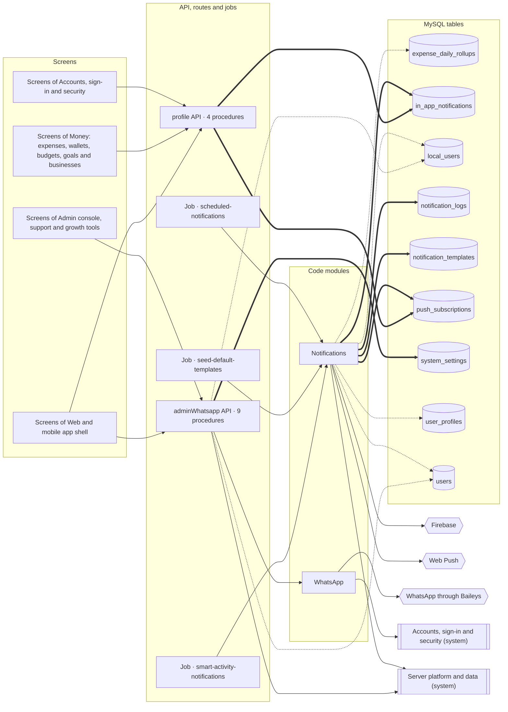

<!-- GENERATED by `npm run atlas` from the source code and docs/architecture/systems.json. Do not edit: the next run overwrites this file. -->

# Notifications and WhatsApp

Web push and phone notifications, in-app notifications, scheduled and activity-triggered messages, and the WhatsApp service with its verification code state.

How it works: [docs/systems/notifications.md](../../systems/notifications.md) · بالعربي: [docs/ar/systems/notifications.md](../../ar/systems/notifications.md) · [All systems](README.md)

## What it is made of

Solid arrows: calls and uses. Thick arrows: writes a table. Dotted arrows: reads a table. A double-bordered box is another system this one depends on.

## Code modules

| Module | What it does | Files |
| --- | --- | --- |
| `notifications` — Notifications | Web push (VAPID) and Firebase Cloud Messaging delivery, scheduled and event-triggered notifications, budget alerts, activity nudges and the default templates. | 2 |
| `whatsapp` — WhatsApp | Baileys WhatsApp client and the in-process OTP state it verifies against. | 2 |

## API procedures

| Procedure | Kind | Builder | Reads | Writes | Screens that call it |
| --- | --- | --- | --- | --- | --- |
| `adminWhatsapp.broadcastMessage` | mutation | `adminProcedure` | `local_users` | — | `Admin`, `More` |
| `adminWhatsapp.clearQueue` | mutation | `adminProcedure` | — | — | `Admin`, `More` |
| `adminWhatsapp.getSettings` | query | `adminProcedure` | — | — | `Admin`, `More` |
| `adminWhatsapp.getStatus` | query | `adminProcedure` | — | — | `Admin`, `More` |
| `adminWhatsapp.getUsers` | query | `adminProcedure` | `local_users`, `users` | — | `Admin`, `More` |
| `adminWhatsapp.sendDirectMessage` | mutation | `adminProcedure` | — | — | `Admin`, `More` |
| `adminWhatsapp.startService` | mutation | `adminProcedure` | — | — | `Admin`, `More` |
| `adminWhatsapp.stopService` | mutation | `adminProcedure` | — | — | `Admin`, `More` |
| `adminWhatsapp.toggleOtpVerification` | mutation | `adminProcedure` | — | `system_settings` | `Admin`, `More` |
| `profile.getInAppNotifications` | query | `authedProcedure` | `in_app_notifications` | — | `App shell` |
| `profile.markInAppNotificationRead` | mutation | `authedProcedure` | — | `in_app_notifications` | `App shell` |
| `profile.savePushSubscription` | mutation | `authedProcedure` | `push_subscriptions` | `push_subscriptions` | `Home`, `More`, `Settings` |
| `profile.sendBiometricPromptNotification` | mutation | `authedProcedure` | `in_app_notifications` | `in_app_notifications` | `App shell` |

## HTTP routes, WebSockets and scheduled jobs

| Entry point | Kind | Declared in |
| --- | --- | --- |
| `scheduled-notifications` | job, `* * * * *` | `api/boot.ts` |
| `seed-default-templates` | job, once at boot | `api/boot.ts` |
| `smart-activity-notifications` | job, `0 20 * * *` | `api/boot.ts` |

## Data

Who in this system writes or reads each table: procedures, routes, jobs and code modules.

| Table | Storage class | Written by | Read by |
| --- | --- | --- | --- |
| `expense_daily_rollups` | C | — | `notifications` |
| `in_app_notifications` | D | `notifications`, `profile.markInAppNotificationRead`, `profile.sendBiometricPromptNotification` | `profile.getInAppNotifications`, `profile.sendBiometricPromptNotification` |
| `local_users` | A | — | `adminWhatsapp.broadcastMessage`, `adminWhatsapp.getUsers`, `notifications` |
| `notification_logs` | E | `notifications` | `notifications` |
| `notification_templates` | A | `notifications` | `notifications` |
| `push_subscriptions` | A | `notifications`, `profile.savePushSubscription` | `notifications`, `profile.savePushSubscription` |
| `system_settings` | A | `adminWhatsapp.toggleOtpVerification` | — |
| `user_profiles` | A | — | `notifications` |
| `users` | A | — | `adminWhatsapp.getUsers`, `notifications` |

## Outside systems

| System | Kind | Modules |
| --- | --- | --- |
| Firebase | push | `notifications` |
| Web Push | push | `notifications` |
| WhatsApp through Baileys | messaging | `whatsapp` |

## Other systems

Depends on: [Accounts, sign-in and security](accounts.md), [Server platform and data](platform.md).

Used by: [Accounts, sign-in and security](accounts.md), [Admin console, support and growth tools](admin.md), [Recording spending](expense-capture.md), [Money: expenses, wallets, budgets, goals and businesses](money.md), [Server platform and data](platform.md), [Web and mobile app shell](web-app.md).

## Environment variables

| Variable | Validated in api/lib/env.ts | Read by |
| --- | --- | --- |
| `APP_URL` | yes | `api/notification-engine.ts` |
| `FIREBASE_CLIENT_EMAIL` | yes | `api/services/firebase.ts` |
| `FIREBASE_PRIVATE_KEY` | yes | `api/services/firebase.ts` |
| `FIREBASE_PROJECT_ID` | yes | `api/services/firebase.ts` |
| `VAPID_PRIVATE_KEY` | no | `api/notification-engine.ts` |
| `VAPID_PUBLIC_KEY` | no | `api/notification-engine.ts` |

## Source its explanation describes

When any of it changes, `npm run agent:finish` asks for a new check of `docs/systems/notifications.md`. A name after `#` is one procedure, route or job of a file that several systems share; `rest-of-file` is the rest of such a file.

13 files and declarations

- `api/admin-whatsapp-router.ts`
- `api/boot.ts#job:scheduled-notifications`
- `api/boot.ts#job:seed-default-templates`
- `api/boot.ts#job:smart-activity-notifications`
- `api/notification-engine.ts`
- `api/profile-router.ts#profile.getInAppNotifications`
- `api/profile-router.ts#profile.markInAppNotificationRead`
- `api/profile-router.ts#profile.savePushSubscription`
- `api/profile-router.ts#profile.sendBiometricPromptNotification`
- `api/profile-router.ts#rest-of-file`
- `api/services/firebase.ts`
- `api/services/otp-cache.ts`
- `api/services/whatsapp-service.ts`

