<!-- GENERATED by `npm run atlas` from the source code and docs/architecture/systems.json. Do not edit: the next run overwrites this file. -->

# Server platform and data

The Hono server and tRPC wiring, environment validation, the Redis and settings caches, the MySQL schema and its storage classes, file storage, shared contracts, scheduled job bodies and data retention.

How it works: [docs/systems/platform.md](../../systems/platform.md) · بالعربي: [docs/ar/systems/platform.md](../../ar/systems/platform.md) · [All systems](README.md)

## What it is made of

Solid arrows: calls and uses. Thick arrows: writes a table. Dotted arrows: reads a table. A double-bordered box is another system this one depends on.

```mermaid
flowchart LR
  subgraph g_api["API, routes and jobs"]
    http__api_trpc["ALL /api/trpc/*"]
    http__health["GET /health"]
    job_data_retention_lifecycle["Job · data-retention-lifecycle"]
  end
  subgraph g_modules["Code modules"]
    mod_api_core["API server core"]
    mod_api_routers["tRPC routers and HTTP sub-apps"]
    mod_contracts["Shared contracts"]
    mod_database["Database schema and access"]
    mod_jobs["Scheduled job bodies"]
    mod_platform["Platform services"]
    mod_storage["File storage"]
  end
  subgraph g_tables["MySQL tables"]
    tbl_ad_clicks[("ad_clicks")]
    tbl_ad_stats_daily[("ad_stats_daily")]
    tbl_ads[("ads")]
    tbl_ai_action_audit_logs[("ai_action_audit_logs")]
    tbl_ai_conversation_summaries[("ai_conversation_summaries")]
    tbl_ai_cost_monthly[("ai_cost_monthly")]
    tbl_ai_memory_embeddings[("ai_memory_embeddings")]
    tbl_ai_memory_items[("ai_memory_items")]
    tbl_ai_models[("ai_models")]
    tbl_ai_pending_actions[("ai_pending_actions")]
    tbl_ai_providers[("ai_providers")]
    tbl_ai_summaries[("ai_summaries")]
    tbl_ai_token_ledgers[("ai_token_ledgers")]
    tbl_api_key_errors[("api_key_errors")]
    tbl_auth_challenges[("auth_challenges")]
    tbl_business_categories[("business_categories")]
    tbl_chat_conversations[("chat_conversations")]
    tbl_chat_messages[("chat_messages")]
    tbl_classification_logs[("classification_logs")]
    tbl_discount_codes[("discount_codes")]
    tbl_expense_categories[("expense_categories")]
    tbl_expense_daily_rollups[("expense_daily_rollups")]
    tbl_expenses[("expenses")]
    tbl_financial_goals[("financial_goals")]
    tbl_in_app_notifications[("in_app_notifications")]
    tbl_local_users[("local_users")]
    tbl_monthly_behavior_snapshots[("monthly_behavior_snapshots")]
    tbl_monthly_reports[("monthly_reports")]
    tbl_notification_logs[("notification_logs")]
    tbl_notification_templates[("notification_templates")]
    tbl_onboarding_questions[("onboarding_questions")]
    tbl_pending_clarifications[("pending_clarifications")]
    tbl_pro_subscriptions[("pro_subscriptions")]
    tbl_profile_learning_events[("profile_learning_events")]
    tbl_push_subscriptions[("push_subscriptions")]
    tbl_raw_sms_events[("raw_sms_events")]
    tbl_referrals[("referrals")]
    tbl_seo_pages[("seo_pages")]
    tbl_sessions[("sessions")]
    tbl_support_tickets[("support_tickets")]
    tbl_system_settings[("system_settings")]
    tbl_user_analytics[("user_analytics")]
    tbl_user_budgets[("user_budgets")]
    tbl_user_businesses[("user_businesses")]
    tbl_user_contacts[("user_contacts")]
    tbl_user_credentials[("user_credentials")]
    tbl_user_dictionaries[("user_dictionaries")]
    tbl_user_profiles[("user_profiles")]
    tbl_user_wallets[("user_wallets")]
    tbl_users[("users")]
    tbl_voice_usage[("voice_usage")]
    tbl_webhook_tokens[("webhook_tokens")]
  end
  ext_fireworks{{"Fireworks AI"}}
  ext_gemini{{"Google Gemini API"}}
  ext_google_oauth{{"Google OAuth 2.0"}}
  ext_groq{{"Groq"}}
  ext_mysql{{"MySQL"}}
  ext_object_storage{{"S3-compatible object storage (R2/S3)"}}
  ext_redis{{"Redis"}}
  ext_sentry{{"Sentry"}}
  ext_web_push{{"Web Push"}}
  sys_accounts[["Accounts, sign-in and security (system)"]]
  sys_ai_center[["AI Center (system)"]]
  sys_ai_platform[["AI providers and usage limits (system)"]]
  sys_bank_messages[["Bank and wallet messages (system)"]]
  sys_billing[["Plans and payments (system)"]]
  sys_expense_capture[["Recording spending (system)"]]
  sys_insights[["Reports, insights and the smart profile (system)"]]
  sys_money[["Money: expenses, wallets, budgets, goals and businesses (system)"]]
  sys_notifications[["Notifications and WhatsApp (system)"]]
  sys_voice_calls[["Live voice assistant (system)"]]
  http__api_trpc --> mod_api_core
  job_data_retention_lifecycle --> mod_jobs
  mod_api_core --> ext_sentry
  mod_api_core --> mod_api_routers
  mod_api_core --> mod_contracts
  mod_api_core --> mod_jobs
  mod_api_core --> mod_platform
  mod_api_core --> sys_accounts
  mod_api_core --> sys_ai_platform
  mod_api_core --> sys_billing
  mod_api_core --> sys_expense_capture
  mod_api_core --> sys_notifications
  mod_api_core --> sys_voice_calls
  mod_api_core -.-> tbl_local_users
  mod_api_core -.-> tbl_users
  mod_api_core ==> tbl_auth_challenges
  mod_api_core ==> tbl_classification_logs
  mod_api_core ==> tbl_sessions
  mod_api_routers --> ext_fireworks
  mod_api_routers --> ext_gemini
  mod_api_routers --> ext_google_oauth
  mod_api_routers --> ext_groq
  mod_api_routers --> ext_web_push
  mod_api_routers --> mod_contracts
  mod_api_routers --> mod_platform
  mod_api_routers --> sys_accounts
  mod_api_routers --> sys_ai_center
  mod_api_routers --> sys_ai_platform
  mod_api_routers --> sys_bank_messages
  mod_api_routers --> sys_billing
  mod_api_routers --> sys_expense_capture
  mod_api_routers --> sys_insights
  mod_api_routers --> sys_money
  mod_api_routers --> sys_notifications
  mod_api_routers --> sys_voice_calls
  mod_api_routers -.-> tbl_ai_pending_actions
  mod_api_routers -.-> tbl_expense_daily_rollups
  mod_api_routers -.-> tbl_notification_logs
  mod_api_routers -.-> tbl_onboarding_questions
  mod_api_routers ==> tbl_ad_clicks
  mod_api_routers ==> tbl_ads
  mod_api_routers ==> tbl_ai_conversation_summaries
  mod_api_routers ==> tbl_ai_memory_embeddings
  mod_api_routers ==> tbl_ai_memory_items
  mod_api_routers ==> tbl_ai_models
  mod_api_routers ==> tbl_ai_providers
  mod_api_routers ==> tbl_ai_summaries
  mod_api_routers ==> tbl_ai_token_ledgers
  mod_api_routers ==> tbl_auth_challenges
  mod_api_routers ==> tbl_business_categories
  mod_api_routers ==> tbl_chat_conversations
  mod_api_routers ==> tbl_chat_messages
  mod_api_routers ==> tbl_classification_logs
  mod_api_routers ==> tbl_discount_codes
  mod_api_routers ==> tbl_expense_categories
  mod_api_routers ==> tbl_expenses
  mod_api_routers ==> tbl_financial_goals
  mod_api_routers ==> tbl_in_app_notifications
  mod_api_routers ==> tbl_local_users
  mod_api_routers ==> tbl_monthly_behavior_snapshots
  mod_api_routers ==> tbl_notification_templates
  mod_api_routers ==> tbl_pending_clarifications
  mod_api_routers ==> tbl_pro_subscriptions
  mod_api_routers ==> tbl_push_subscriptions
  mod_api_routers ==> tbl_raw_sms_events
  mod_api_routers ==> tbl_referrals
  mod_api_routers ==> tbl_seo_pages
  mod_api_routers ==> tbl_sessions
  mod_api_routers ==> tbl_support_tickets
  mod_api_routers ==> tbl_system_settings
  mod_api_routers ==> tbl_user_analytics
  mod_api_routers ==> tbl_user_budgets
  mod_api_routers ==> tbl_user_businesses
  mod_api_routers ==> tbl_user_contacts
  mod_api_routers ==> tbl_user_credentials
  mod_api_routers ==> tbl_user_dictionaries
  mod_api_routers ==> tbl_user_profiles
  mod_api_routers ==> tbl_user_wallets
  mod_api_routers ==> tbl_users
  mod_api_routers ==> tbl_voice_usage
  mod_api_routers ==> tbl_webhook_tokens
  mod_database --> ext_mysql
  mod_database --> mod_platform
  mod_jobs --> ext_fireworks
  mod_jobs --> mod_api_routers
  mod_jobs --> mod_platform
  mod_jobs --> sys_accounts
  mod_jobs --> sys_ai_center
  mod_jobs --> sys_ai_platform
  mod_jobs --> sys_insights
  mod_jobs --> sys_money
  mod_jobs --> sys_notifications
  mod_jobs -.-> tbl_expense_daily_rollups
  mod_jobs -.-> tbl_expenses
  mod_jobs -.-> tbl_user_profiles
  mod_jobs ==> tbl_ad_clicks
  mod_jobs ==> tbl_ad_stats_daily
  mod_jobs ==> tbl_ai_action_audit_logs
  mod_jobs ==> tbl_ai_cost_monthly
  mod_jobs ==> tbl_ai_pending_actions
  mod_jobs ==> tbl_ai_token_ledgers
  mod_jobs ==> tbl_api_key_errors
  mod_jobs ==> tbl_auth_challenges
  mod_jobs ==> tbl_chat_messages
  mod_jobs ==> tbl_classification_logs
  mod_jobs ==> tbl_local_users
  mod_jobs ==> tbl_monthly_reports
  mod_jobs ==> tbl_notification_logs
  mod_jobs ==> tbl_pending_clarifications
  mod_jobs ==> tbl_pro_subscriptions
  mod_jobs ==> tbl_profile_learning_events
  mod_jobs ==> tbl_user_analytics
  mod_jobs ==> tbl_users
  mod_jobs ==> tbl_voice_usage
  mod_platform --> ext_redis
  mod_platform -.-> tbl_system_settings
  mod_platform ==> tbl_api_key_errors
  mod_storage --> ext_object_storage
```

## Code modules

| Module | What it does | Files |
| --- | --- | --- |
| `api-core` — API server core | Hono app and server entry points, request context, tRPC procedure builders and the root router. | 5 |
| `api-routers` — tRPC routers and HTTP sub-apps | One file per router mounted in api/router.ts, plus the SMS Hono sub-app mounted in api/boot.ts. | 23 |
| `contracts` — Shared contracts | Types, limits and billing plans shared by the web app and the API. | 4 |
| `database` — Database schema and access | Drizzle schema, relations, storage classes and the MySQL connection pool. | 5 |
| `jobs` — Scheduled job bodies | Job implementations scheduled from api/boot.ts. | 5 |
| `platform` — Platform services | Environment validation, Redis client and cache keys, system settings, business time zone helpers, scheduled-job locks and error logging. | 8 |
| `storage` — File storage | File storage behind one driver interface (local disk or S3-compatible storage such as R2), plus the avatar service. | 5 |

## API procedures

_None._

## HTTP routes, WebSockets and scheduled jobs

| Entry point | Kind | Declared in |
| --- | --- | --- |
| `ALL /api/trpc/*` | trpc | `api/boot.ts` |
| `GET /health` | http | `api/boot.ts` |
| `data-retention-lifecycle` | job, `0 5 * * *` | `api/boot.ts` |

## Data

Who in this system writes or reads each table: procedures, routes, jobs and code modules.

| Table | Storage class | Written by | Read by |
| --- | --- | --- | --- |
| `ad_clicks` | E | `api-routers`, `jobs` | `jobs` |
| `ad_stats_daily` | C | `jobs` | — |
| `ads` | A | `api-routers` | `api-routers` |
| `ai_action_audit_logs` | E | `jobs` | — |
| `ai_conversation_summaries` | F | `api-routers` | — |
| `ai_cost_monthly` | C | `jobs` | — |
| `ai_memory_embeddings` | F | `api-routers` | — |
| `ai_memory_items` | F | `api-routers` | `api-routers` |
| `ai_models` | A | `api-routers` | `api-routers` |
| `ai_pending_actions` | D | `jobs` | `api-routers` |
| `ai_providers` | A | `api-routers` | `api-routers` |
| `ai_summaries` | C | `api-routers` | `api-routers` |
| `ai_token_ledgers` | E | `api-routers`, `jobs` | `api-routers`, `jobs` |
| `api_key_errors` | E | `jobs`, `platform` | `platform` |
| `auth_challenges` | D | `api-core`, `api-routers`, `jobs` | `api-routers` |
| `business_categories` | A | `api-routers` | `api-routers` |
| `chat_conversations` | G | `api-routers` | `api-routers` |
| `chat_messages` | G | `api-routers`, `jobs` | `api-routers` |
| `classification_logs` | E | `api-core`, `api-routers`, `jobs` | `api-routers` |
| `discount_codes` | A | `api-routers` | `api-routers` |
| `expense_categories` | A | `api-routers` | `api-routers` |
| `expense_daily_rollups` | C | — | `api-routers`, `jobs` |
| `expenses` | B | `api-routers` | `api-routers`, `jobs` |
| `financial_goals` | C | `api-routers` | `api-routers` |
| `in_app_notifications` | D | `api-routers` | `api-routers` |
| `local_users` | A | `api-routers`, `jobs` | `api-core`, `api-routers`, `jobs` |
| `monthly_behavior_snapshots` | C | `api-routers` | — |
| `monthly_reports` | C | `jobs` | `jobs` |
| `notification_logs` | E | `jobs` | `api-routers` |
| `notification_templates` | A | `api-routers` | `api-routers` |
| `onboarding_questions` | A | — | `api-routers` |
| `pending_clarifications` | D | `api-routers`, `jobs` | `api-routers` |
| `pro_subscriptions` | A | `api-routers`, `jobs` | `api-routers`, `jobs` |
| `profile_learning_events` | E | `jobs` | — |
| `push_subscriptions` | A | `api-routers` | `api-routers` |
| `raw_sms_events` | E | `api-routers` | `api-routers` |
| `referrals` | A | `api-routers` | `api-routers` |
| `seo_pages` | A | `api-routers` | `api-routers` |
| `sessions` | D | `api-core`, `api-routers` | `api-routers` |
| `support_tickets` | A | `api-routers` | `api-routers` |
| `system_settings` | A | `api-routers` | `api-routers`, `platform` |
| `user_analytics` | E | `api-routers`, `jobs` | `api-routers` |
| `user_budgets` | C | `api-routers` | `api-routers` |
| `user_businesses` | A | `api-routers` | `api-routers` |
| `user_contacts` | A | `api-routers` | `api-routers` |
| `user_credentials` | A | `api-routers` | `api-routers` |
| `user_dictionaries` | F | `api-routers` | `api-routers` |
| `user_profiles` | A | `api-routers` | `api-routers`, `jobs` |
| `user_wallets` | A | `api-routers` | `api-routers` |
| `users` | A | `api-routers`, `jobs` | `api-core`, `api-routers`, `jobs` |
| `voice_usage` | E | `api-routers`, `jobs` | `api-routers` |
| `webhook_tokens` | D | `api-routers` | `api-routers` |

## Outside systems

| System | Kind | Modules |
| --- | --- | --- |
| Fireworks AI | ai-provider | `api-routers`, `jobs` |
| Google Gemini API | ai-provider | `api-routers` |
| Google OAuth 2.0 | identity | `api-routers` |
| Groq | ai-provider | `api-routers` |
| MySQL | datastore | `database` |
| S3-compatible object storage (R2/S3) | datastore | `storage` |
| Redis | datastore | `platform` |
| Sentry | observability | `api-core` |
| Web Push | push | `api-routers` |

## Other systems

Depends on: [Accounts, sign-in and security](accounts.md), [AI Center](ai-center.md), [AI providers and usage limits](ai-platform.md), [Bank and wallet messages](bank-messages.md), [Plans and payments](billing.md), [Recording spending](expense-capture.md), [Reports, insights and the smart profile](insights.md), [Money: expenses, wallets, budgets, goals and businesses](money.md), [Notifications and WhatsApp](notifications.md), [Live voice assistant](voice-calls.md).

Used by: [Accounts, sign-in and security](accounts.md), [Admin console, support and growth tools](admin.md), [AI Center](ai-center.md), [AI providers and usage limits](ai-platform.md), [Bank and wallet messages](bank-messages.md), [Plans and payments](billing.md), [Recording spending](expense-capture.md), [Reports, insights and the smart profile](insights.md), [Money: expenses, wallets, budgets, goals and businesses](money.md), [Notifications and WhatsApp](notifications.md), [Live voice assistant](voice-calls.md).

## Environment variables

| Variable | Validated in api/lib/env.ts | Read by |
| --- | --- | --- |
| `AI_ALLOW_MEMORY_CACHE_IN_PRODUCTION` | yes | `api/lib/redis-client.ts` |
| `APP_TIMEZONE` | yes | `api/lib/app-time.ts` |
| `APP_URL` | yes | `api/webauthn-router.ts` |
| `AWS_ACCESS_KEY_ID` | no | `api/services/storage/s3-driver.ts` |
| `AWS_REGION` | no | `api/services/storage/s3-driver.ts` |
| `AWS_SECRET_ACCESS_KEY` | no | `api/services/storage/s3-driver.ts` |
| `BILLING_SIMULATE` | yes | `api/pro-router.ts` |
| `DATABASE_URL` | yes | `api/queries/connection.ts` |
| `ENABLE_CRONS` | yes | `api/boot.ts` |
| `ENABLE_WHATSAPP` | yes | `api/boot.ts` |
| `FIREWORKS_API_KEY` | yes | `api/ai-router.ts`, `api/boot.ts`, `api/lib/system-settings-registry.ts` |
| `GEMINI_API_KEY` | yes | `api/admin-router.ts`, `api/ai-router.ts`, `api/business-router.ts`, `api/expense-router.ts`, `api/goals-router.ts`, `api/image-router.ts`, `api/lib/system-settings-registry.ts` |
| `GEMINI_MODEL_FREE` | yes | `api/ai-router.ts`, `api/lib/system-settings-registry.ts` |
| `GEMINI_MODEL_PRO` | yes | `api/ai-router.ts`, `api/goals-router.ts`, `api/image-router.ts`, `api/lib/system-settings-registry.ts` |
| `GEMINI_MODEL_REPORTS` | yes | `api/ai-router.ts`, `api/lib/system-settings-registry.ts` |
| `GOOGLE_CLIENT_ID` | yes | `api/auth-router.ts` |
| `GOOGLE_CLIENT_SECRET` | yes | `api/auth-router.ts` |
| `GOOGLE_REDIRECT_URI` | yes | `api/auth-router.ts` |
| `GROQ_API_KEY` | yes | `api/ai-router.ts` |
| `LOG_SLOW_QUERIES` | yes | `api/queries/connection.ts` |
| `NODE_ENV` | yes | `api/ai-router.ts`, `api/boot.ts`, `api/chat-router.ts`, `api/lib/redis-client.ts`, `api/local-auth-router.ts`, `api/middleware.ts`, `api/pro-router.ts`, `api/queries/connection.ts` |
| `NVIDIA_API_KEY` | yes | `api/ai-router.ts` |
| `PAYMOB_HMAC_SECRET` | yes | `api/boot.ts` |
| `PORT` | yes | `api/boot.ts`, `api/server.ts` |
| `R2_ACCESS_KEY_ID` | no | `api/services/storage/s3-driver.ts` |
| `R2_BUCKET_NAME` | no | `api/services/storage/index.ts`, `api/services/storage/s3-driver.ts` |
| `R2_ENDPOINT` | no | `api/services/storage/index.ts`, `api/services/storage/s3-driver.ts` |
| `R2_PUBLIC_URL` | no | `api/services/storage/s3-driver.ts` |
| `R2_REGION` | no | `api/services/storage/s3-driver.ts` |
| `R2_SECRET_ACCESS_KEY` | no | `api/services/storage/s3-driver.ts` |
| `REDIS_URL` | yes | `api/lib/redis-client.ts` |
| `S3_BUCKET` | no | `api/services/storage/s3-driver.ts` |
| `S3_ENDPOINT` | no | `api/services/storage/s3-driver.ts` |
| `SENTRY_DSN` | yes | `api/boot.ts` |
| `SLOW_QUERY_THRESHOLD_MS` | yes | `api/queries/connection.ts` |
| `STORAGE_DRIVER` | no | `api/services/storage/index.ts` |
| `STORAGE_PUBLIC_URL` | no | `api/services/storage/s3-driver.ts` |
| `TRUST_PROXY` | yes | `api/boot.ts` |
| `VAPID_PRIVATE_KEY` | no | `api/admin-router.ts` |
| `VAPID_PUBLIC_KEY` | no | `api/admin-router.ts` |

## Source its explanation describes

When any of it changes, `npm run agent:finish` asks for a new check of `docs/systems/platform.md`. A name after `#` is one procedure, route or job of a file that several systems share; `rest-of-file` is the rest of such a file.

31 files and declarations

- `api/boot.ts#ALL /api/trpc/*`
- `api/boot.ts#GET /health`
- `api/boot.ts#job:data-retention-lifecycle`
- `api/boot.ts#rest-of-file`
- `api/context.ts`
- `api/jobs/data-retention-job.ts`
- `api/lib/app-time.ts`
- `api/lib/cache-keys.ts`
- `api/lib/env.ts`
- `api/lib/error-logger.ts`
- `api/lib/redis-client.ts`
- `api/lib/settings-cache.ts`
- `api/lib/system-settings-registry.ts`
- `api/middleware.ts`
- `api/queries/connection.ts`
- `api/router.ts`
- `api/server.ts#rest-of-file`
- `api/services/scheduler-lock.ts`
- `api/services/storage/avatar-service.ts`
- `api/services/storage/index.ts`
- `api/services/storage/local-driver.ts`
- `api/services/storage/s3-driver.ts`
- `api/services/storage/types.ts`
- `contracts/constants.ts`
- `contracts/errors.ts`
- `contracts/plans.ts`
- `contracts/types.ts`
- `db/relations.ts`
- `db/schema.ts`
- `db/seed.ts`
- `db/table-classes.ts`

