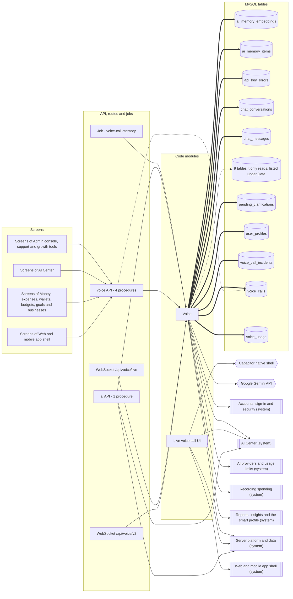

<!-- GENERATED by `npm run atlas` from the source code and docs/architecture/systems.json. Do not edit: the next run overwrites this file. -->

# Live voice assistant

A live voice call with the assistant over a WebSocket bridged to the Gemini Live API: who may call and for how long, the tools that answer from the ledger and draft changes behind a confirmation gate, checks on the numbers it speaks, and what each call used and cost.

How it works: [docs/systems/voice-calls.md](../../systems/voice-calls.md) · بالعربي: [docs/ar/systems/voice-calls.md](../../ar/systems/voice-calls.md) · [All systems](README.md)

## What it is made of

Solid arrows: calls and uses. Thick arrows: writes a table. Dotted arrows: reads a table. A double-bordered box is another system this one depends on.

## Code modules

| Module | What it does | Files |
| --- | --- | --- |
| `voice` — Voice | Live voice calls. The rebuilt call in api/services/voice (Egyptian number speech and, as it lands, the gateway, the Gemini Live engine, the tools and the checks on what is said) is replacing the old WebSocket bridge (voice-call-service, voice-kernel). api/services/entitlements/voice.ts decides who may call, for how long and on which model, counting the Cairo month. | 44 |
| `web-voice-call` — Live voice call UI | The live voice call in the app. The rebuilt call: a store any screen can start the call from (src/lib/voice/call-store.ts), which keeps it running across pages; microphone capture filtered down to 16 kHz with speech detection that sends audio only while the user speaks; the /api/voice/v2 socket client that resumes a dropped call; playback of the assistant's voice; and the call screen with its cards, the Home button and the AI Center tab (src/components/voice). The old call screen and its hook (AIVoiceCall.tsx, useVoiceCall.ts on /api/voice/live) stay for users outside the rollout. | 15 |

## API procedures

| Procedure | Kind | Builder | Reads | Writes | Screens that call it |
| --- | --- | --- | --- | --- | --- |
| `ai.runVoiceToolQa` | mutation | `aiProcedure` | — | — | — |
| `voice.adminStats` | query | `adminProcedure` | — | — | `Admin`, `More` |
| `voice.eligibility` | query | `authedProcedure` | — | — | `AICenter`, `App shell`, `Home` |
| `voice.listCalls` | query | `authedProcedure` | `voice_calls` | — | `App shell` |
| `voice.startCall` | mutation | `authedProcedure` | — | — | — |

## HTTP routes, WebSockets and scheduled jobs

| Entry point | Kind | Declared in |
| --- | --- | --- |
| `/api/voice/live` | websocket | `api/boot.ts`, `api/server.ts` |
| `/api/voice/v2` | websocket | `api/boot.ts`, `api/server.ts` |
| `voice-call-memory` | job, `*/10 * * * *` | `api/boot.ts` |

## Data

Who in this system writes or reads each table: procedures, routes, jobs and code modules.

| Table | Storage class | Written by | Read by |
| --- | --- | --- | --- |
| `ai_action_memory` | F | — | `voice` |
| `ai_conversation_summaries` | F | — | `voice` |
| `ai_memory_embeddings` | F | `voice` | — |
| `ai_memory_items` | F | `voice` | `voice` |
| `ai_summaries` | C | — | `voice` |
| `api_key_errors` | E | `voice` | — |
| `chat_conversations` | G | `voice` | — |
| `chat_messages` | G | `voice` | — |
| `expenses` | B | — | `voice` |
| `financial_goals` | C | — | `voice` |
| `local_users` | A | — | `voice` |
| `monthly_reports` | C | — | `voice` |
| `pending_clarifications` | D | `voice` | `voice` |
| `user_profiles` | A | `voice` | `voice` |
| `user_wallets` | A | — | `voice` |
| `users` | A | — | `voice` |
| `voice_call_incidents` | E | `voice` | `voice` |
| `voice_calls` | E | `voice` | `voice`, `voice.listCalls` |
| `voice_usage` | E | `voice` | `voice` |

## Outside systems

| System | Kind | Modules |
| --- | --- | --- |
| Capacitor native shell | native-runtime | `web-voice-call` |
| Google Gemini API | ai-provider | `voice` |

## Other systems

Depends on: [Accounts, sign-in and security](accounts.md), [AI Center](ai-center.md), [AI providers and usage limits](ai-platform.md), [Recording spending](expense-capture.md), [Reports, insights and the smart profile](insights.md), [Server platform and data](platform.md), [Web and mobile app shell](web-app.md).

Used by: [Admin console, support and growth tools](admin.md), [AI Center](ai-center.md), [Money: expenses, wallets, budgets, goals and businesses](money.md), [Server platform and data](platform.md), [Web and mobile app shell](web-app.md).

## Environment variables

| Variable | Validated in api/lib/env.ts | Read by |
| --- | --- | --- |
| `GEMINI_API_KEY` | yes | `api/services/voice-call-service.ts`, `api/services/voice/gateway/index.ts`, `api/services/voice/text-model.ts` |
| `BASE_URL` | frontend | `src/lib/voice/audio-io.ts` |
| `DEV` | frontend | `src/components/ai/AIVoiceCall.tsx` |
| `VITE_API_URL` | frontend | `src/lib/voice/call-controller.ts` |

## Source its explanation describes

When any of it changes, `npm run agent:finish` asks for a new check of `docs/systems/voice-calls.md`. A name after `#` is one procedure, route or job of a file that several systems share; `rest-of-file` is the rest of such a file.

67 files and declarations

- `api/ai-router.ts#ai.runVoiceToolQa`
- `api/ai-router.ts#rest-of-file`
- `api/boot.ts#job:voice-call-memory`
- `api/boot.ts#ws:/api/voice/live`
- `api/boot.ts#ws:/api/voice/v2`
- `api/server.ts#ws:/api/voice/live`
- `api/server.ts#ws:/api/voice/v2`
- `api/services/entitlements/voice.ts`
- `api/services/voice-call-service.ts`
- `api/services/voice-context-service.ts`
- `api/services/voice-kernel/hot-context.ts`
- `api/services/voice-kernel/index.ts`
- `api/services/voice-kernel/types.ts`
- `api/services/voice-kernel/voice-call-archive.ts`
- `api/services/voice-kernel/voice-prefetch.ts`
- `api/services/voice-kernel/voice-prompt.ts`
- `api/services/voice-kernel/voice-session-state.ts`
- `api/services/voice-kernel/voice-tool-adapter.ts`
- `api/services/voice/admin-stats.ts`
- `api/services/voice/app-calls.ts`
- `api/services/voice/brain/claims.ts`
- `api/services/voice/brain/drafts.ts`
- `api/services/voice/brain/facts.ts`
- `api/services/voice/brain/honorific.ts`
- `api/services/voice/brain/index.ts`
- `api/services/voice/brain/instructions.ts`
- `api/services/voice/brain/never-kept.ts`
- `api/services/voice/brain/profile-questions.ts`
- `api/services/voice/brain/snapshot.ts`
- `api/services/voice/brain/spoken.ts`
- `api/services/voice/brain/tools/app-help.ts`
- `api/services/voice/brain/tools/market-price.ts`
- `api/services/voice/brain/tools/memory.ts`
- `api/services/voice/brain/tools/money-query.ts`
- `api/services/voice/brain/tools/record.ts`
- `api/services/voice/brain/tools/reports.ts`
- `api/services/voice/brain/tools/think.ts`
- `api/services/voice/brain/tools/types.ts`
- `api/services/voice/brain/validator.ts`
- `api/services/voice/brain/voices.ts`
- `api/services/voice/engine/gemini-live.ts`
- `api/services/voice/engine/types.ts`
- `api/services/voice/gateway/call-session.ts`
- `api/services/voice/gateway/index.ts`
- `api/services/voice/gateway/persistence.ts`
- `api/services/voice/gateway/pricing.ts`
- `api/services/voice/gateway/socket.ts`
- `api/services/voice/gateway/start-call.ts`
- `api/services/voice/gateway/store.ts`
- `api/services/voice/post-call.ts`
- `api/services/voice/text-model.ts`
- `api/voice-router.ts`
- `src/components/ai/AIVoiceCall.tsx`
- `src/components/voice/CallSmartButton.tsx`
- `src/components/voice/VoiceCallCards.tsx`
- `src/components/voice/VoiceCallHost.tsx`
- `src/components/voice/VoiceCallScreen.tsx`
- `src/components/voice/VoiceCallTab.tsx`
- `src/hooks/useVoiceCall.ts`
- `src/hooks/useVoiceCallEntry.ts`
- `src/lib/voice/audio-io.ts`
- `src/lib/voice/call-connection.ts`
- `src/lib/voice/call-controller.ts`
- `src/lib/voice/call-store.ts`
- `src/lib/voice/downsampler.ts`
- `src/lib/voice/pcm-player.ts`
- `src/lib/voice/speech-detector.ts`

