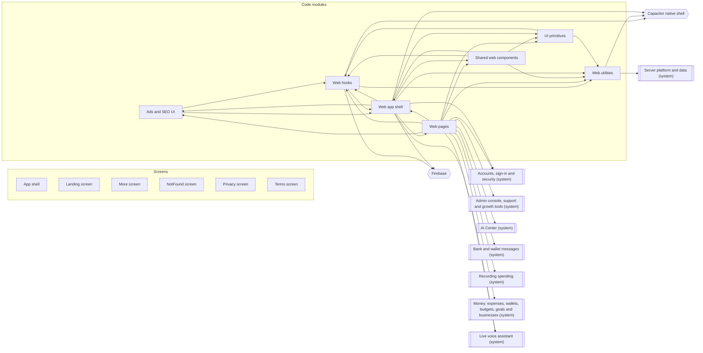

<!-- GENERATED by `npm run atlas` from the source code and docs/architecture/systems.json. Do not edit: the next run overwrites this file. -->

# Web and mobile app shell

The React app around every page: routes and guards, providers, layout and navigation, PWA install and offline behaviour, shared UI components, hooks and client utilities.

How it works: [docs/systems/web-app.md](../../systems/web-app.md) · بالعربي: [docs/ar/systems/web-app.md](../../ar/systems/web-app.md) · [All systems](README.md)

## What it is made of

Solid arrows: calls and uses. Thick arrows: writes a table. Dotted arrows: reads a table. A double-bordered box is another system this one depends on.

## Code modules

| Module | What it does | Files |
| --- | --- | --- |
| `web-growth` — Ads and SEO UI | The ad banner and SEO meta tags. | 2 |
| `web-hooks` — Web hooks | React hooks for auth, admin, plan and ads data, push notifications, PWA lifecycle, biometrics, navigation, keyboard and haptics. | 20 |
| `web-lib` — Web utilities | Client utilities (back-button handling, biometric auth, client rules engine, image compression, financial taxonomy, query persistence, transaction display), src/types and loose files at the root of src/. | 8 |
| `web-pages` — Web pages | Route-level page components lazy-loaded by src/App.tsx. | 15 |
| `web-shared` — Shared web components | Shell components at the root of src/components: sidebar, notification bell, onboarding card, product tour and loading skeleton. | 5 |
| `web-shell` — Web app shell | Entry point, providers, layout, route guards and PWA or native integration. | 18 |
| `web-ui-kit` — UI primitives | shadcn and Radix UI primitives in src/components/ui/. | 55 |

## API procedures

_None._

## HTTP routes, WebSockets and scheduled jobs

_None._

## Data

Who in this system writes or reads each table: procedures, routes, jobs and code modules.

_None._

## Outside systems

| System | Kind | Modules |
| --- | --- | --- |
| Capacitor native shell | native-runtime | `web-hooks`, `web-lib`, `web-shell` |
| Firebase | push | `web-hooks`, `web-shell` |

## Other systems

Depends on: [Accounts, sign-in and security](accounts.md), [Admin console, support and growth tools](admin.md), [AI Center](ai-center.md), [AI providers and usage limits](ai-platform.md), [Bank and wallet messages](bank-messages.md), [Plans and payments](billing.md), [Recording spending](expense-capture.md), [Reports, insights and the smart profile](insights.md), [Money: expenses, wallets, budgets, goals and businesses](money.md), [Notifications and WhatsApp](notifications.md), [Server platform and data](platform.md), [Live voice assistant](voice-calls.md).

Used by: [Accounts, sign-in and security](accounts.md), [Admin console, support and growth tools](admin.md), [AI Center](ai-center.md), [Bank and wallet messages](bank-messages.md), [Recording spending](expense-capture.md), [Reports, insights and the smart profile](insights.md), [Money: expenses, wallets, budgets, goals and businesses](money.md), [Live voice assistant](voice-calls.md).

## Environment variables

| Variable | Validated in api/lib/env.ts | Read by |
| --- | --- | --- |
| `DEV` | frontend | `src/main.tsx` |
| `PROD` | frontend | `src/pwa/register-sw.ts` |
| `VITE_API_URL` | frontend | `src/providers/trpc.ts` |
| `VITE_FIREBASE_API_KEY` | frontend | `src/pwa/firebase.ts` |
| `VITE_FIREBASE_APP_ID` | frontend | `src/pwa/firebase.ts` |
| `VITE_FIREBASE_AUTH_DOMAIN` | frontend | `src/pwa/firebase.ts` |
| `VITE_FIREBASE_MESSAGING_SENDER_ID` | frontend | `src/pwa/firebase.ts` |
| `VITE_FIREBASE_PROJECT_ID` | frontend | `src/pwa/firebase.ts` |
| `VITE_FIREBASE_STORAGE_BUCKET` | frontend | `src/pwa/firebase.ts` |
| `VITE_FIREBASE_VAPID_KEY` | frontend | `src/hooks/usePushNotifications.ts` |
| `VITE_TURNSTILE_SITE_KEY` | frontend | `src/lib/turnstile-config.ts` |
| `VITE_VAPID_PUBLIC_KEY` | frontend | `src/hooks/usePushNotifications.ts` |

## Source its explanation describes

When any of it changes, `npm run agent:finish` asks for a new check of `docs/systems/web-app.md`. A name after `#` is one procedure, route or job of a file that several systems share; `rest-of-file` is the rest of such a file.

113 files and declarations

- `src/App.tsx`
- `src/components/NotificationBell.tsx`
- `src/components/OnboardingCard.tsx`
- `src/components/PageLoadingSkeleton.tsx`
- `src/components/ProductTour.tsx`
- `src/components/Sidebar.tsx`
- `src/components/ads/AdBanner.tsx`
- `src/components/layout/MobileBottomNav.tsx`
- `src/components/layout/PageTransition.tsx`
- `src/components/layout/PlanUsageStrip.tsx`
- `src/components/layout/mobile-nav-platform.ts`
- `src/components/pwa/NetworkStatusToast.tsx`
- `src/components/pwa/PullToRefreshWrapper.tsx`
- `src/components/pwa/PwaEnhancements.tsx`
- `src/components/pwa/PwaInstallPrompt.tsx`
- `src/components/pwa/PwaOfflineSyncDialog.tsx`
- `src/components/routing/PlanGates.tsx`
- `src/components/seo/SEOMeta.tsx`
- `src/components/ui/accordion.tsx`
- `src/components/ui/adaptive-dialog.tsx`
- `src/components/ui/alert-dialog.tsx`
- `src/components/ui/alert.tsx`
- `src/components/ui/aspect-ratio.tsx`
- `src/components/ui/avatar.tsx`
- `src/components/ui/badge.tsx`
- `src/components/ui/breadcrumb.tsx`
- `src/components/ui/button-group.tsx`
- `src/components/ui/button.tsx`
- `src/components/ui/calendar.tsx`
- `src/components/ui/card.tsx`
- `src/components/ui/carousel.tsx`
- `src/components/ui/chart.tsx`
- `src/components/ui/checkbox.tsx`
- `src/components/ui/collapsible.tsx`
- `src/components/ui/command.tsx`
- `src/components/ui/context-menu.tsx`
- `src/components/ui/dialog.tsx`
- `src/components/ui/drawer.tsx`
- `src/components/ui/dropdown-menu.tsx`
- `src/components/ui/empty.tsx`
- `src/components/ui/field.tsx`
- `src/components/ui/form.tsx`
- `src/components/ui/haptic-button.tsx`
- `src/components/ui/hover-card.tsx`
- `src/components/ui/input-group.tsx`
- `src/components/ui/input-otp.tsx`
- `src/components/ui/input.tsx`
- `src/components/ui/item.tsx`
- `src/components/ui/kbd.tsx`
- `src/components/ui/label.tsx`
- `src/components/ui/menubar.tsx`
- `src/components/ui/navigation-menu.tsx`
- `src/components/ui/pagination.tsx`
- `src/components/ui/popover.tsx`
- `src/components/ui/progress.tsx`
- `src/components/ui/radio-group.tsx`
- `src/components/ui/resizable.tsx`
- `src/components/ui/scroll-area.tsx`
- `src/components/ui/select.tsx`
- `src/components/ui/separator.tsx`
- `src/components/ui/sheet.tsx`
- `src/components/ui/sidebar.tsx`
- `src/components/ui/skeleton.tsx`
- `src/components/ui/slider.tsx`
- `src/components/ui/sonner.tsx`
- `src/components/ui/spinner.tsx`
- `src/components/ui/switch.tsx`
- `src/components/ui/table.tsx`
- `src/components/ui/tabs.tsx`
- `src/components/ui/textarea.tsx`
- `src/components/ui/toggle-group.tsx`
- `src/components/ui/toggle.tsx`
- `src/components/ui/tooltip.tsx`
- `src/hooks/use-mobile.ts`
- `src/hooks/useAdmin.ts`
- `src/hooks/useAds.ts`
- `src/hooks/useAppResume.ts`
- `src/hooks/useAuth.ts`
- `src/hooks/useBiometricOnboarding.ts`
- `src/hooks/useHaptics.ts`
- `src/hooks/useHistoryBound.ts`
- `src/hooks/useKeyboardNav.ts`
- `src/hooks/useLaunchNavigation.ts`
- `src/hooks/useMediaQuery.ts`
- `src/hooks/useNativeThemeSync.ts`
- `src/hooks/usePro.ts`
- `src/hooks/usePushNotifications.ts`
- `src/hooks/usePwaLifecycle.ts`
- `src/hooks/useScrollRestoration.ts`
- `src/hooks/useSessionTracker.ts`
- `src/hooks/useSheetManager.ts`
- `src/hooks/useSwipeNavigation.ts`
- `src/hooks/useVirtualKeyboard.ts`
- `src/lib/back-button-manager.ts`
- `src/lib/backButtonManager.ts`
- `src/lib/biometricAuth.ts`
- `src/lib/financial-taxonomy.ts`
- `src/lib/queryPersister.ts`
- `src/lib/transactionDisplay.ts`
- `src/lib/turnstile-config.ts`
- `src/lib/utils.ts`
- `src/main.tsx`
- `src/pages/Landing.tsx`
- `src/pages/More.tsx`
- `src/pages/NotFound.tsx`
- `src/pages/Privacy.tsx`
- `src/pages/Terms.tsx`
- `src/providers/BiometricLockProvider.tsx`
- `src/providers/trpc.ts`
- `src/pwa/firebase.ts`
- `src/pwa/install-platform.ts`
- `src/pwa/launch-handler.ts`
- `src/pwa/register-sw.ts`

