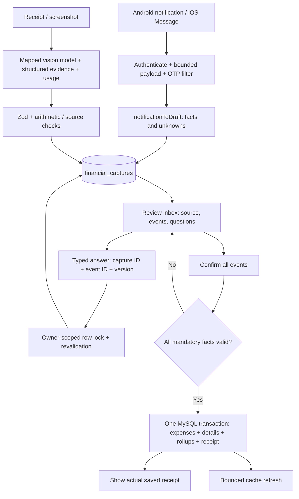

# رحلة التصنيف: تصميم قابل للاختبار وحالة التنفيذ — 6 سبتمبر 2026

## 1. القرار والوضع الحقيقي

الهدف الواحد هو تحويل **واقعة مالية مثبتة** إلى سجل صحيح يمكن للمستخدم فهمه وتصحيحه، مع ترتيب الأولويات: الدقة، ثم زمن الاستجابة، ثم التكلفة. استخراج رقم واسم فئة لا يحقق هذا الهدف؛ يجب إثبات وقوع الدفع، وعدد العمليات، ودور كل مبلغ، والعملة، والزمن، والمالك، ثم المحافظة على هذه الحقائق حتى الحفظ.

هذه الجولة تنفذ أول جزء متصل من الخطة: **الإشعار/الصورة → مسودة دائمة → أسئلة مرتبطة بالعملية → إعادة تحقق → حفظ ذري → إيصال يؤكد ما حُفظ**. وتحسن بعض أخطاء النفي والأرقام في مسار النص الحالي. لا تعلن اكتمال R0–R7، ولا إطلاقًا جاهزًا، ولا دقة 100%. جميع إشعارات وصور المسار الجديد تحتاج مراجعة المستخدم حاليًا؛ هذا إجراء مرحلي له تكلفة استخدام بشرية واضحة، وليس دليلًا على ذكاء الاستخراج أو حلًا نهائيًا للأتمتة.

العمل على `codex/classification-journey-20260906`، مبني على `efd812b` مع إدماج G1-R من `5633beb`. مسار العمل `E:/smartspend-classification-journey-20260906`. النسخة الأصلية المتغيرة `E:/smartspend_V1_fixed` لم تُستخدم للتحرير. حالة التسليم والاختبارات التفصيلية في [HANDOFF](implementation/JOURNEY/HANDOFF.md).

## 2. البحث: ما الذي تثبته المصادر المصرية؟

البنوك لا تنشر كتالوجًا عامًا شاملًا ومحدّثًا لكل SMS الفعلية. البحث يثبت **عائلات الأحداث وحالاتها** وبعض محتويات إشعارات التأكيد. لا يثبت أن تعبيرًا منتظمًا يدعم كل بنك أو أن صيغة مصطنعة مطابقة لرسالة إنتاج. لم نستخدم صفحات عامة تعرض رسائل أشخاص أو OTP لبناء البيانات.

| المصدر الرسمي | الدليل الذي نستخدمه | أثره في التصميم |
| --- | --- | --- |
| [المركزي: شبكة المدفوعات اللحظية](https://www.cbe.org.eg/en/payment-systems-and-services/instant-payment-network) | شبكة تحويلات تربط البنوك؛ قنوات وتطبيقات وروابط/QR | InstaPay/IPN وسيلة نقل؛ الغرض المالي يحتاج دليلًا مستقلًا |
| [المركزي: محافظ المحمول](https://www.cbe.org.eg/en/payment-systems-and-services/payment-services/mobile-wallet) | إيداع وسحب وتحويل ودفع QR | شحن المحفظة والسحب ليسا بالضرورة مصروف استهلاك |
| [InstaPay: الأسئلة الشائعة](https://www.instapay.eg/?lang=en&page_id=348) | نجاح/رفض/انتظار؛ إمكانية رد المبلغ؛ مرجع العملية | الحالة تتغير؛ الإشعار ليس دائمًا الحدث النهائي |
| [CIB: حالة InstaPay](https://www.cibeg.com/en/personal/faqs?ct=234&pageno=1&search=instapay+restricted+transaction) | نتيجة التحويل قد تتأثر بالبنك والشبكة وتتحدث لاحقًا | ربط إشعار الانتظار والتأكيد مطلوب، وليس عمليتين |
| [HSBC: تنبيهات الرسائل](https://www.hsbc.com.eg/ar-eg/ways-to-bank/mobile/text-alerts/faq/) | شروط اللغة والتوصيل وحدود التنبيه | غياب SMS لا يثبت غياب المصروف؛ لا نفترض العربية فقط |
| [Vodafone: دفع الخدمات](https://web.vodafone.com.eg/en/utility-service) | تأكيد بعد الدفع وتفاصيله | اكتشاف دفع خدمة عند وجود اسمها، مع فصل الرسوم |
| [Vodafone: من البطاقة للمحفظة](https://web.vodafone.com.eg/en/card-to-wallet) | تحويل/شحن محفظة وتأكيده | لا يعد شراءً جديدًا إذا كانت الأموال مملوكة للمستخدم |
| [Orange: الخدمات المالية](https://www.orange.eg/en/services/Orange-financial-services) | مراحل سحب وإيداع ورسائل تأكيد ورصيد؛ تحويل قد يرتد | طلب السحب ليس إتمام السحب، والرصيد ليس قيمة العملية |
| [e& money](https://www.etisalat.eg/portal/pages/services/eand_money.html) | تحويلات ودفع QR ورسائل إتمام | فصل التحويل الشخصي عن دفع التاجر |
| [WE Pay](https://te.eg/en/personal/we-pay) | محافظ وتحويلات ودفع | تغطية عائلة عمليات مستقلة؛ لا يكفي تشابه اسم المرسل |
| [Fawry: المدفوعات الرقمية](https://www.fawry.com/fawry-for-consumer/digital-payments/) | مرجع يُستخدم لإتمام الدفع | إرسال كود دفع لا يثبت حدوث خصم |
| [Fawry: مثال طلب مرجع للدفع](https://www.fawry.com/2022/01/11/fawry-cooperates-with-armed-forces-drm-to-facilitate-fee-payment/) | SMS قد يسبق سداد الخدمة | لا نسجل طلب الدفع مصروفًا محققًا |
| [Apple: Message trigger](https://support.apple.com/en-gb/guide/shortcuts/apdd711f9dff/ios) | شروط المرسل ومحتوى الرسالة | فلتر EGP يفوّت صيغ LE/جنيه وعملات أخرى |
| [Apple: Transaction trigger](https://support.apple.com/en-za/guide/shortcuts/apd65c67538a/9.0/ios/26) | حدث استخدام بطاقة محددة | مختلف عن الوصول العام لإشعارات التطبيقات |
| [Android: NotificationListenerService](https://developer.android.com/reference/android/service/notification/NotificationListenerService) | إشعارات متاحة بصلاحية؛ قيود جهاز/work profile | ليست قراءة صندوق SMS؛ فقد المصدر قد يحدث قبل السيرفر |

راجعت المصادر في 6 سبتمبر 2026. بعض الروابط المصرية تعطي حظرًا عند الفتح المباشر بينما يتاح مقتطف رسمي في البحث؛ لم أستنتج منها قوالب SMS حرفية أو أرقام رسوم حالية. لا توجد حاجة لتثبيت رسوم البنوك داخل المصنف: تُستخرج الرسوم من الدليل الفعلي.

## 3. محاكاة المستخدم: العملية أكبر من الرسالة

| موقف المستخدم | الحقيقة المالية المطلوبة | سلوك المنتج الصحيح | التنفيذ الحالي / الفجوة |
| --- | --- | --- | --- |
| خصم بطاقة عند Netflix | مصروف اشتراك؛ لا نفترض تجديدًا بلا عبارة تدعمه | عرض الخدمة والمبلغ والعملة والحالة | اقتراح الفئة محليًا + مراجعة؛ علامة التجديد تتطلب نصًا صريحًا |
| خصم عند Anthropic/Claude | خدمة محددة عند واصف واضح | حفظ اسم التاجر؛ لا نخترع خطة الاشتراك | دعم واصفات محددة؛ واصفات إنتاج إضافية تحتاج عينات موثقة |
| خصم Amazon/Fawry | دفع معروف، غرضه غير معروف | سؤال عن المشتريات أو الخدمة | الفئة تبقى ناقصة، لا تخمين SKU من اسم الوسيط |
| IPN أرسل 49 مع هاتف وتاريخ ورصيد | مبلغ التحويل 49؛ الهوية والغرض منفصلان | تمييز رقم الدعم والبطاقة والمرجع عن المال | أدوار مبالغ محلية، لكن الغرض والاتجاه بين المحافظ بحاجة توسيع |
| شحن Vodafone Cash من بطاقة | حركة بين مصدرين للأموال | لا احتساب المصروف مرتين | نوع التحويل يحتاج ربط محافظ؛ لا يدّعي المسار الحالي تلك المطابقة |
| QR للتاجر ثم SMS من المحفظة | شراء واحد ظهر في مصدرين | حدث واحد له ملاحظتان | المطابقة عبر المصادر ما زالت مطلوبة |
| خصم مع رسوم ورصيد | أصل العملية، رسوم، رصيد لاحق | تحديد شمول الرسوم ثم تسوية تحفظ المجموع | المسودة تُوقف الحفظ؛ محرر تقسيم الرسوم لم يُنفذ بعد |
| عملية pending ثم ناجحة ثم reversed | حالات متتابعة لنفس الدفع | انتقال حالة ثم قيد عكسي مربوط | تمنع الحالة غير المحققة من الحفظ؛ الربط والتسوية ما زالا مطلوبين |
| استرداد سلعة أو سداد سلفة | استرداد/دين، لا راتب جديد | ربط بالأصل وتحديث التقارير | يحتفظ به للمراجعة؛ دفتر الاسترداد/الدين لم يكتمل |
| «جبت 3 لتر، اللتر 35 والحساب 105» | كمية وسعر وحدة وإجمالي دفع واحد | 105، لا 3+35+105 | فشل تشخيصي مفتوح في مستخرج النص؛ تمنع المراجعة القبول الآلي |
| «جهاز 12000، مقدم 3000 والباقي أقساط» | المدفوع 3000 والتزام منفصل | لا تسجيل ثمن الجهاز كاملًا نقدًا الآن | تحليل الالتزامات والأقساط يحتاج بنية حقائق أقوى |
| دفع مصروفين بنفس القيمة | حدثان مختلفان | لا dedup على المبلغ وحده | الحفظ يحتفظ بمعرفي حدث مستقلين واختباره ناجح |
| إيصال فيه إجمالي ونقدية وباقٍ | صافي الشراء، لا النقدية المقدمة | تسوية مكونات الفاتورة، لا اختيار أول/أكبر رقم | عقد vision واضح + فحص حسابي محلي؛ دقة قراءة الصور لم تُقَس |
| صورة فيها إيصالان | حدثان ومصدر واحد | مراجعة الاثنين وحفظهما ذريًا | مدعوم في المسودة والحفظ؛ الواجهة تعرض كل الأحداث |
| فاتورة غير مدفوعة | التزام/طلب لا إثبات مصروف | سؤال وقوع الدفع | invoice يفرض unknown حتى لو قال النموذج realized |
| شبكة انقطعت بعد commit | الدفع محفوظ فعليًا | إعادة المحاولة تعرض نفس إيصال الحفظ | مثبت باختبارات MySQL متزامنة |
| حساب OAuth وآخر محلي لهما ID نفسه | مالكان مختلفان | الفصل على النوع والرقم | مثبت عند القراءة والحفظ والتكرار |
| المستخدم صحح سؤالًا وفتح تبويبين | نسختان من نفس المسودة | رفض إجابة/حفظ نسخة قديمة، عرض أحدث نسخة | row lock + version + إعادة جلب في الواجهة |
| الهاتف لم يعرض نص الرسالة | دليل مفقود | إظهار حدود الالتقاط؛ إدخال يدوي/مصدر آخر | لا يمكن إصلاحه بتغيير prompt؛ يتطلب قياس جهاز وإرشاد المنتج |
| إشعار بمبلغ أجنبي دون سعر تحويل | عملة أصلية غير EGP | لا تحريف المال إلى جنيه | الحفظ معطل لهذا النوع حتى وجود دفتر وتحويل موثق |

## 4. التدفق المنفذ وحدود الاندماج

**الصوت والنص لم ينتقلا بعد إلى مخزن المسودات الجديد.** ما زالا يمران عبر endpoint الصوت/STT ثم `runSmartPipeline` وبوابة الأحداث وطبقات التصنيف وقرار القبول الحالي. إضافة `text/voice` إلى العقد تعني قابلية استقبالها، لا أن الاستدعاء فعّال. كذلك مسار المحادثة الحية والوكيل المالي ليسا تلقائيًا مغطَّيين بهذا التغيير. جرد الاعتماد السابق يضم 196 ملفًا متصلًا؛ الجرد لا يعني اختبار كل سطر منها.

مفاتيح الرجوع إلى الكود:

| المساحة | الملف / الدالة المسؤولة |
| --- | --- |
| التقاط Android وطابور الإرسال | `android-app/app/src/main/java/com/smartspend/sync/SyncService.kt`: `onNotificationPosted`, `sendHead` |
| ربط الحساب وتأكيد الوجهة | `DeepLinkActivity.kt`: `handleIntent` |
| عقد النقل والمصدر المالي | `contracts/financial-capture.ts`: `captureDraftSchema`, `captureAnswerSchema` |
| استخراج أدوار المال وحالة الدفع | `api/lib/notification-evidence.ts`: `financialMoneyMentions`, `notificationToDraft` |
| غرض الخدمة دون اختراع المنتج | `api/lib/payment-purpose.ts`: `paymentPurpose` |
| حقائق الإيصال وفحص المجموع | `api/lib/receipt-evidence.ts`: `receiptEvidenceToDraft` |
| SDK/schema/mapping/metering | `api/lib/receipt-image-parser.ts`: `parseReceiptWithVision` |
| الحد الفاصل للصورة والإشعار | `api/image-router.ts`, `api/sms-router.ts` |
| السؤال وإعادة التحقق | `api/lib/financial-capture-state.ts`: `captureQuestions`, `applyCaptureAnswer` |
| الحفظ والتزامن والمالك | `api/services/financial-capture-store.ts`: `createCapture`, `answerCapture`, `confirmCapture` |
| الواجهة المشتركة | `src/components/expenses/FinancialCaptureInbox.tsx` |
| محاسبة الصور | `api/services/image-usage-ledger.ts`; الكاتب المشترك `persistUsageRows` |

## 5. الهيكل المستهدف: ما الذي يحتاج إعادة تصميم فعلية؟

يجب فصل **الملاحظة** عن **الحدث المالي** عن **القيد المحاسبي**. إيصال شراء وتنبيه البطاقة ليسا مشتريات مستقلة؛ طلب دفع وإشعار نجاح قد يمثلان مراحل حدث واحد. مستخرج مبلغ/فئة لا يستطيع حل ذلك بإضافة كلمات مفتاحية.

البنية المستهدفة تدريجيًا:

1. **مغلف المصدر:** معرف مصدر ثابت، وقت الالتقاط ووقت الحدث منفصلان، القناة، قدرات جهاز الالتقاط، اكتمال النص/الصوت/الصورة، هوية المالك من الخادم. حماية بيانات الحساب وأكواد التحقق قبل المزود.
2. **حقائق ذات دليل:** مبالغ بأدوار transaction/fee/balance/unit-price/tender/change، عملة كل مبلغ، أفعال وحالات واتجاهات وفاعلون، مقاطع حرفية وإحداثيات الصورة/زمن الصوت عند توافرها. لا تتحول المعلومات الناقصة إلى افتراضات صامتة.
3. **رسم أحداث:** العلاقات دفع/طلب/عكس/جزء/التزام/تكرار وتصحيح. تمثيل أكثر من تفسير عند التعارض قبل اختيار فئة.
4. **تفسير الغرض:** تاجر معروف، قواعد المستخدم المحددة، قاموس، نموذج عند اللزوم. قناة الدفع ليست فئة استهلاك. فصل دخل/مصروف/نقل/استرداد/دين/استثمار عند العقد والدفتر والتقارير معًا.
5. **سياسة القرار:** صلاحية المصدر والحدث والحقائق أولًا، ثم درجة ثقة قابلة للمعايرة. سؤال محدود إذا كانت المعلومة غير موجودة أصلًا؛ تحليل دلالي إذا كانت موجودة ولكن تعذر فهمها.
6. **حلقة المستخدم:** اختيار تفسير/تقسيم/إضافة/حذف حدث ومراجعة مبلغ الرسوم، بإصدارات واضحة وسجل إجابات؛ إعادة تحقق لكل الحقائق. لا تلغي إجابة فئة مشكلة كمية أو حالة دفع.
7. **كاتب مالي موحد:** تحقق صلاحيات وidempotency دائم، تطابق عقود العملات والأنواع، حفظ ذري، أثر undo/reversal، تفاصيل وتقارير من الحقيقة نفسها. المداخل الأربعة والوكيل يجب أن تستخدمه في النهاية.
8. **قياس وتشغيل:** trace واحد للمراحل، قياس الدقة والتدخل البشري والتكلفة وزمن p50/p95/p99، وrollback وfeature rollout مع شروط توقف.

العقد الحالي يمثل الأحداث والأسئلة والحفظ، لكنه لا يحتوي بعد كل رسم العلاقات ولا مصدر كل حقل ولا سجل إجابات كامل. لذلك **إعادة بناء مستخرج الحقائق والعلاقات** مطلوبة، وليست استبدال prompt أو استبدال التطبيق كله. تُبنى خلف adapters ثم تُنقل المداخل بالتتابع مع اختبارات مطابقة الدفتر.

## 6. متى محلي؟ متى LLM؟ متى سؤال؟

| الحالة | القرار المستهدف | لماذا؟ |
| --- | --- | --- |
| حركة محققة واحدة، مبلغ ودور وعملة واضحون، غرض محدد وقواعد لا تتعارض | محلي، ثم قبول وفق معايرة مستقلة | طلب نموذج لا يضيف دليلًا |
| النص يحتوي المعلومة لكن ترتيبها/نفيها/علاقتها بالرسوم والأقساط غامض للمستخرج | LLM لاستخراج **الأحداث والحقائق** مرة واحدة | نموذج فئة فقط لا يصلح عدد العمليات أو المبلغ |
| الأحداث ثابتة والغموض في الغرض فقط | نموذج الفئة الحالي بعقد IDs ثابت | يحافظ على المال والزمن ويحد المخرجات والتوكنز |
| المصدر لا يذكر المبلغ أو الغرض أو صاحب التحويل | سؤال المستخدم | لا يوجد دليل يستطيع LLM استعادته بثقة |
| blurry/cropped/STT حذف كلمة مالية مهمة | إعادة تصوير/تسجيل أو سؤال | تخمين الدليل المفقود خطر حتى بنموذج أقوى |
| رمز تحقق/طلب دفع/مرفوض | تجاهل حساس أو حالة انتظار/رفض | لا داعي لنموذج لتبرير حفظ مصروف غير واقع |
| تحويل بين حسابين/استرداد/تقسيط | تفسير وربط محاسبي ثم قرار | لا يكفي تصنيف نص منفرد |
| فشل المزود بعد المهلة | الاحتفاظ بالمصدر/المسودة مع مراجعة أو إعادة محاولة مضبوطة | لا خفض الثقة شكليًا ثم auto-save |

الوضع الحالي: النص يحتفظ بالـfallback الموجود؛ الصور تستخدم vision؛ الإشعارات الجديدة محلية ثم مراجعة **ولم يُدمج فيها fallback دلالي بعد**. يجب قياس أثر هذا القيد على زمن إتمام المستخدم، لا الاحتفال بصفر تكلفة API فقط.

النماذج تأتي من model mapping وDB routing؛ إضافة مزود تحتاج capabilities حقيقية للصورة وstructured output والمهلة والتفكير والتسعير. وجود اسم DeepSeek في mapping ليس إثبات إتاحة نموذج بعينه. لا يوجد في هذه الجولة طلب حي يثبت توفر DeepSeek V4 Flash أو جودة أي مزود على الصور المصرية.

## 7. الثقة: بوابة صحة قبل النسبة

لا يجوز دمج كل الغموض في متوسط واحد. درجة فئة مرتفعة لا تعالج مبلغًا غير موثوق أو دفعًا منفيًا. يلزم: صلاحية المصدر، ثقة عدد الأحداث، ثقة الأدوار والمبالغ، ثقة الزمن والعملة، ثقة النوع، وثقة الفئة. أي مانع محاسبي يوقف القبول الآلي مهما كان score النموذج.

المرحلة الحالية تستخدم أسئلة/موانع صريحة للصورة والإشعار ولا تدّعي أن `confidence=0` في حقول توافق الصورة هو تقدير احتمالي. تقدير القبول النهائي يجب أن يُعاير على بيانات مستقلة ومقسمة حسب القناة والفئة والظاهرة اللغوية. المرجع العلمي للمعايرة: [Guo et al.](https://proceedings.mlr.press/v70/guo17a.html).

المقياس الأساسي المقترح هو خطأ الحفظ داخل **العمليات التي قبلناها آليًا** مع معدل التغطية. تحويل كل شيء إلى review يخفض خطأ auto-save ظاهريًا لكنه لا يحقق المنتج. تُقاس أيضًا صحة الاقتراح المعروض ومعدل تصحيحه؛ اقتراح خاطئ قد يقبله المستخدم دون تدقيق.

100 حالة لا تثبت خطأ أقل من 0.1%: حتى صفر أخطاء في 100 قبول مستقل يعطي حدًا علويًا تقريبيًا 3% عند ثقة 95%؛ نحتاج قرابة 3,000 قبول مستقل بلا خطأ لإسناد حد يقارب 0.1% تحت افتراضات العينة نفسها، لا ضمان المستقبل. [مرجع فواصل الاحتمالات الثنائية](https://itl.nist.gov/div898/software/dataplot/refman2/auxillar/exacbino.htm).

## 8. اختبار الـ100 حالة: قوة وحدود البيانات

- 50 إشعارًا مصطنعًا، 30 نصًا مصريًا/مختلطًا، 20 حالة **تبدأ بعد OCR**. لا توجد في هذه المئة تسجيلات صوتية أو صور حقيقية.
- صيغت قبل التشغيل الأول؛ بعد الاطلاع على النتائج تصبح development challenge، وليست holdout سريًا. JSON ثابت ومعرفات ووسوم وSHA محفوظة.
- ظهر خطأ في بعض الملصقات نفسها: invoice غير مدفوع وrefund لحركة كانت مرفوضة، وحدود اسم التاجر. التغييرات الأربعة محفوظة في `label-revisions.json`؛ لا تجوز مقارنة نسبة v1 بنسبة v2 ونسب الزيادة للمصنف.
- النجاح هنا يخص الحقول المحددة في كل مثال؛ لا يقيس اكتمال السجل، ولا كل أسئلة الشاشة، ولا دقة التصنيف لكل فئة. بعض النصوص المختلطة لا تحرس نوع كل صف بعد. يلزم scorer موحد بعلاقات ومقامات واضحة.
- المثال SMS-046 ما زال أحمر بسبب اختلاف حدود اسم تاجر مقطوع؛ هذا خلاف label/segmentation يتطلب تحكيمًا، وليس إثبات مبلغ خاطئ. المصدر المقطوع يظل مانع حفظ مستقلًا.
- بقية الحالات المفتوحة تظهر مشكلات الكسور، الكمية وسعر الوحدة، مقدم التقسيط، الدين والاسترداد، الاستثناء بعد النفي، ووراثة النوع بين مصروفين متساويين. لا يصلح علاجها بإضافة الـ10 جمل إلى قاموس حفظ.

الخطوة القياسية التالية: فريق/مراجع مستقل يكتب holdout جديدًا قبل رؤية نتائج المحرك؛ عينات بموافقة أصحابها بعد الإخفاء، قسمة حسب الأسرة/التاجر/الصيغة لا توزيع جمل شبه مكررة، اختلافات إملاء وأرقام وArabizi وضوضاء، واختبارات metamorphic: تغيير الرصيد لا يغير مبلغ العملية؛ تبديل التاجر لا يغير نوع القرض؛ إضافة OTP تلغي الإرسال؛ ترجمة الصياغة تحفظ القيد؛ تكرار الإرسال لا يضاعف الحفظ؛ تغيير التصنيف لا يمحو pending.

## 9. الاعتمادية والخصوصية والتكلفة

| الفشل / التهديد | ما تحقق | ما لا يزال مطلوبًا |
| --- | --- | --- |
| تأكيد مكرر أو response ضائعة | قفل وreceipt دائم يعيد IDs نفسها | مطابقة الحدث عبر صورة وإشعار وتعديل إشعار |
| فشل الإدخال الثاني في دفعة | rollback للعمليات والتفاصيل والrollups وحالة المسودة | اختبار عبء وقفل طويل وdeadlock retry مضبوط |
| تعطل Redis بعد الحفظ | انتظار تحديث cache محدود؛ الحفظ لا يتراجع بسبب cache | منع عرض aggregates قديمة أثناء أعطال ممتدة، وoutbox إبطال دائم |
| تعطل DB أثناء الالتقاط | لا acknowledgment ناجح قبل الاحتفاظ؛ Android يحتفظ بالطابور | اختبار هاتف حقيقي وانقطاع العملية وdisk-full |
| طابور Android ممتلئ/صلاحية مفقودة | علامة خطأ؛ حد 500؛ نطاق على token+endpoint | عرض عدد المتأخرات واسترداد الربط القديم وسياسة TTL محلية واضحة |
| deeplink خبيث يغير وجهة الرسائل | تأكيد صاحب الجهاز للوجهة، تحقق HTTPS/path، تعطيل redirects | تحقق app links/مصدر الربط وAPK موقّع، دون ادعاء ضمان ثقة نطاق عشوائي |
| رد نموذج ناقص/مخالف | schema + finish reason + فحص مجموع + رفض بدون حفظ | schema حي لكل مزود، صور واقعية، trace يميز سبب رفض الحقول |
| توكنز رد مرفوض | تسجيل input/output/cache/total قبل التحقق من JSON | durable billing outbox وتسوية مع فاتورة المزود |
| بيانات cache غير مقاسة | null في accounting metadata، لا ادعاء cache hit | ربط سعر vision بموديل/مزود فعلي؛ بعض تجميعات التكلفة القديمة تفقد دلالة unknown |
| OCR/profile سياق غير مفيد | حذف جلب معاملات الشهر والقاموس والملف من مسار الصورة | تقدير tokens الصور بالحجم الفعلي وميزانية محجوزة ذريًا |
| حدود SMS/AI | احترام الحد وإعادة الإرسال دون draft مكرر | quota reservation ذري عبر instances؛ العداد الحالي غير ذري ومحدد الذاكرة |
| الاحتفاظ بالنص المالي | حماية المالك؛ حذف الحساب يشمل المسودات؛ لا تخزين pixels/OTP | تقليل النص في السجلات المحفوظة وتوثيق الحذف/التصدير والتشفير وسياسة الطابور |

الصورة لها طلب vision واحد حاليًا، بلا إعادة طلب تصنيف نصي بعده. إعادة إرسال capture موجودة لا تستدعي vision. **طلبان متزامنان قبل إنشاء المسودة قد يستدعيان النموذج مرتين**؛ unique DB يمنع تكرار المسودة والحفظ، لا الفاتورة الخارجية. هذه فجوة single-flight/durable attempt لازمة، وليست نتيجة cache محلولة بالكامل.

prompt ثابت منفصل عن بيانات الصورة؛ هذا يحسن قابلية إعادة استخدام prefix لكنه لا يضمن دعم cache أو بلوغ الحد الأدنى له. عدد cached tokens يأتي من المزود. لا نقدّر وفورات بمقارنة طول النص وحده. التكلفة لكل N عملية = مجموع تكلفة المحاولات الفعلية (input غير cached + cache read/write + output/reasoning حسب بروتوكول المزود)، ويضاف STT/vision والتخزين عند قياس تكلفة المنتج. لا توجد بيانات حية تبرر رقمًا بالدولار لكل 1,000 أو 100,000 هنا.

## 10. خطة تنفيذ متصلة ومعايير خروج

| المرحلة | ناتج يراه المستخدم | اختبارات قبل/بعد | معيار الخروج |
| --- | --- | --- | --- |
| J0 — هذه الجولة | مسودة الصور والإشعارات، تصحيح حقل، حفظ ذري قابل لإعادة المحاولة | وحدات + UI + MySQL + corpus جديد أحمر عند الفشل | نجاح الاختبارات المسماة، توثيق القيود، لا نشر بوصفها أتمتة مكتملة |
| J1 — حقائق وعلاقات | الكمية/السعر/الإجمالي، المقدم/الأقساط، النفي/التراجع وعدة أحداث | حل الأسر الفاشلة مع أمثلة جديدة مختلفة؛ مقارنة قبل وبعد على scorer ثابت | لا زيادة في خطأ القبول؛ صحة event/amount/currency/status؛ نتائج مستقلة لكل أسرة |
| J2 — حلقة تصحيح كاملة | تقسيم رسوم، إضافة/حذف صف، ربط استرداد/دين/تحويل، سجل إجابات واضح | اختبارات فقد/تكرار/تعارض الأسئلة وحفظ المجموع | لا مانع شائع بلا مسار مفهوم للتصحيح؛ عدم تأثير تعديل صف في آخر |
| J3 — دمج المداخل | الصوت والنص والصور والإشعارات تنتهي إلى الكاتب والعقد نفسيهما | STT مصرية وصور حقيقية + اندماج الواجهة والAPI والDB | نفس المعنى ينتج نفس القيد؛ لا مصدر يحفظ متجاوزًا البوابة |
| J4 — fallback دلالي ومعايرة | نموذج يفهم المعقد وسؤال عند نقص الدليل | holdout مستقل محلي/LLM/بعد التحقق؛ precision/recall/F1/confusion وrisk-coverage | عتبات مبنية على الدقة والتغطية، لا confidence نصي من النموذج |
| J5 — هاتف وربط الأحداث | مزامنة مرئية، تأكيد pending، منع تكرار إيصال+إشعار | APK/iOS فعليان، إعادة تشغيل/تدوير token/تأخير/صيغ بنوك | عدم فقد الإشعارات التي أقر التطبيق باستلامها؛ وضوح ما لم يستطع التقاطه |
| J6 — تشغيل وإطلاق | تأخر وتكلفة وحدود مفهومة، لوحة مراقبة بأسباب الفشل | load/Redis/DB/provider faults، ميزانية ذرية، ledger reconciliation | p95 وcoverage وتكلفة مقاسة؛ rollback وتمرير migrations على نسخة مماثلة للإنتاج |

أهداف السرعة المبدئية للتجربة: p95 محلي أقل من 300ms للخادم، وتأخير التخزين/إرجاع receipt أقل من 500ms دون انتظار مزود؛ LLM له مهلة رحلة محددة وفق القياس. هذه أهداف للتحقق، وليست نتائج القياس الحالي. لا يُخفض معدل تدخل المستخدم بشراء قبول خاطئ؛ تُقاس سهولة إتمام السؤال وزمن إتمام المهمة ومعدل التخلي بالتوازي.

## 11. الأولويات الموحدة

| المشكلة | الخطورة | الدليل | أثر الدقة | أثر السرعة | أثر التكلفة | صعوبة الإصلاح | الأولوية |
| --- | --- | --- | --- | --- | --- | --- | --- |
| فئة صحيحة فوق مبلغ/عدد أحداث خاطئ | Critical عند auto-save؛ حاليًا موانع مراجعة | TXT-012/017/021/030؛ `financial-event-plan` | جوهري | قد يحتاج تحليلًا إضافيًا | طلب دلالي واحد عند التعقيد | عالية | P0 / J1 |
| دفتر الدين/الاسترداد/التحويل والعملات غير متكامل | High | TXT-014/015؛ `assertCaptureReady` يحظر بعض الأنواع | جوهري | سؤال/ربط | تكلفة بشرية | عالية | P0 / J2 |
| عدم توحيد writer مع الصوت والنص والوكيل | High | `captureRouter` مقابل `runSmartPipeline` والمداخل الأخرى | اختلاف ضمانات الحفظ | مسارات متكررة | تكرار منطق/طلبات | عالية | P0 / J3 |
| قد يكون نفس الدفع في مصدرين | High | request key مصدر؛ لا graph مالي | تضاعف المال | مطابقة إضافية | تضاعف استخراج | عالية | P0 / J5 |
| عدم وجود تصحيح عملي للرسوم/مصدر متعارض | High | `fee_requires_reconciliation` و`document_total_conflict` | يمنع حفظًا خاطئًا لكنه يعطل الإتمام | تدخل يدوي مرتفع | تكلفة دعم | متوسطة | P0 / J2 |
| لا fallback دلالي في ingest الجديد | High، قيد هذه المرحلة | `notificationToDraft` → `createCapture` | coverage محدودة | أسئلة أكثر | API أقل، بشر أكثر | متوسطة/عالية | P0 / J4 |
| مصدر الهاتف/اختصار iCloud غير موثق فعليًا | High | Android source + رابط UI خارجي | فقد/اقتطاع قبل التصنيف | تأخير الالتقاط | إعادة محاولة ودعم | متوسطة | P0 / J5 |
| حدود quota غير ذرية وimage single-flight مفقود | High | count ثم insert؛ lookup ثم vision | غير مباشر | ضغط زائد | تجاوز/طلبات مكررة | متوسطة | P1 / J6 |
| الثقة ليست معايرة متعددة أبعاد | High | درجة legacy مقابل موانع واضحة جديدة | ثقة زائفة/رفض زائد | fallback زائد | تكلفة بشر ومزود | عالية | P1 / J4 |
| لا عينة مستقلة تمثل مصدر الإنتاج | High | 100 synthetic، 20 post-OCR | القياس قد يخدعنا | غير مباشر | تطوير خاطئ الاتجاه | متوسطة | P0 قبل إطلاق |
| تكلفة الصور مجهولة السعر وبعض telemetry قد تضيع | Medium | `recordImageProviderUsage`, `persistUsageRows` | لا يغير المال المسجل | انتظار محدود | فاتورة غير مكتملة | متوسطة | P1 / J6 |
| محفوظات SMS القديمة لا تعرض المخزن الجديد للأدمن | Medium | `rawSmsEvents` مقابل `financialCaptures` | ضعف اكتشاف الأعطال | دعم أبطأ | دعم وتشخيص | منخفضة | P1 / J6 |
| الاحتفاظ بالمصدر/الطابور بحاجة سياسة كاملة | Medium | TTL المسودة مقابل saved وإعدادات Android | غير مباشر | تخزين | تخزين وخصوصية | متوسطة | P1 / J6 |
| saved receipt قد يتبعه aggregate مخبأ قديم | Medium | cache generation بعد commit | اختلاف العرض مؤقتًا | تعافي cache | غير مباشر | متوسطة | P1 / J6 |
| وثائق قديمة تدّعي دعم كل البنوك/إشعارات iOS | Medium، صُححت هنا | `docs/06-SMS_AND_APPLE_PAY.md` | توقعات وتطوير على افتراض خاطئ | إعادة عمل | دعم | منخفضة | منجز في J0 |

## 12. ما لا يمكن إثباته من هذه الجولة

دقة STT المصرية؛ دقة قراءة صور حقيقية؛ القوالب الحرفية لكل بنك/إصدار/لغة؛ محتوى shortcut الخارجي؛ التقاط Android بعد قتل التطبيق وعلى أجهزة متعددة؛ زمن مزود فعلي ومعدل cache hit وأسعاره؛ خطأ auto-save على توزيع الإنتاج؛ رضا المستخدم عن عدد الأسئلة؛ ذرية حدود الخطة تحت حمل موزع؛ صلاحية نشر migration على قاعدة إنتاج ذات تاريخ migrations قديم. هذه قياسات وإثباتات لازمة قبل تسمية النظام «مكتملًا»، لا تفاصيل تجميلية في نهاية العمل.
