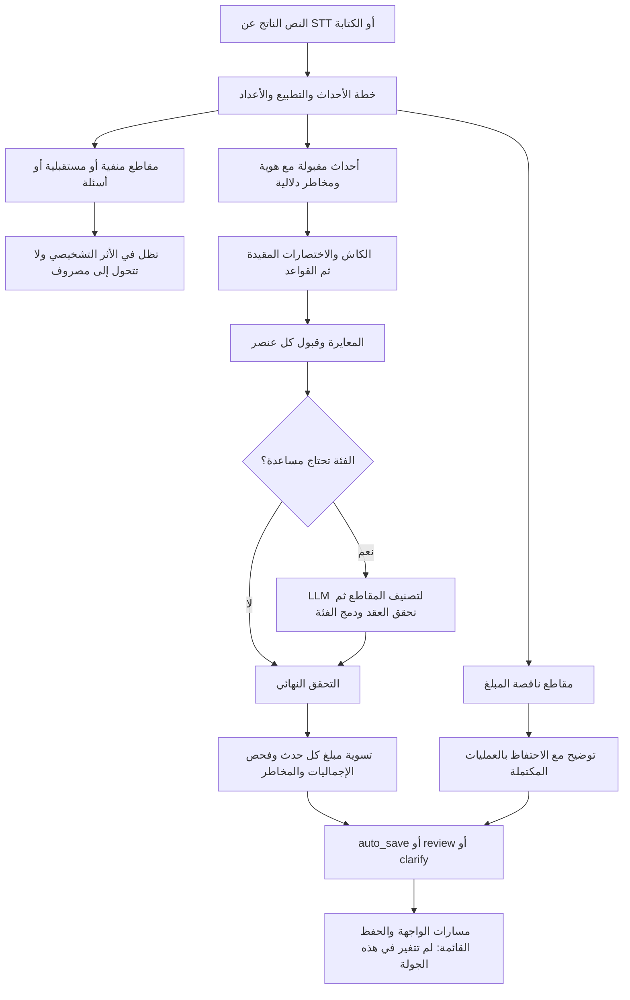

# تسليم نواة الأحداث المالية — Codex + إصلاحات Claude A1 المراجعة

التاريخ: 5 سبتمبر 2026. الحالة: تنفيذ محلي مكتمل لنطاق هذه الجولة؛ ليس اعتمادًا لإطلاق المنظومة كلها.

## النتيجة ومكانها

أصعب جزء هو معرفة **ما الذي حدث ماليًا فعلًا، ولأي حدث ينتمي كل مبلغ**، ثم منع بقية الطبقات من طمس الغموض برقم ثقة مرتفع. تصنيف «بنزين» وحده لا يحل جملة فيها شراء منفي، وعملية ناقصة، وتصحيح مبلغ، وإجمالي.

نفّذت هذه النواة أولًا داخل `E:/smartspend-financial-event-core`، فرع `codex/financial-event-core`، فوق `7c9d323`. أخذت إصلاحات Claude A1 المناسبة كأساس وراجعتها واختبرتها مع التغييرات. في إصدار `main` الموحد بتاريخ 5 سبتمبر 2026، دُمجت أجزاء A2 بعد مراجعة مستقلة: اختيار route متوافق مع model mapping، مهلات تشمل جسم الاستجابة، breaker معزول لكل route، وتحديد نطاق/نسخة للكاش، وبوابة موحدة قبل STT. لم أغير قاعدة البيانات أو الواجهة أو أستدعِ مزودًا مدفوعًا لاختبار النواة.

لم يُقبل floor مدة الصوت المشتق من حجم الملف (`8192 bytes/sec`)؛ كان يحمّل التسجيلات عالية البتريت مدة غير حقيقية. البوابة الحالية تشترط مدة موجبة مرسلة من العميل وتفصل تحقق MIME والحجم عن حساب المدة. ما زال استخراج مدة الوسيط والتحقق منها على الخادم عملاً مطلوبًا قبل اعتبار quota الصوت مقاومة للتلاعب.

أثناء العمل، انتقل المجلد الأصلي `E:/smartspend_V1_fixed` إلى `main` بقاعدة أقدم، بعد commit خارجي `7c9d323` ضم جزءًا من تعديلات هذه الجولة. حفظت العمل بإنشاء worktree مستقل من ذلك commit. لذلك `git diff HEAD` وحدها لا تعرض كل التغيير منذ بداية الجولة. لم أنفذ commit أو push أو merge أو deploy بنفسي. حالة المجلد الأصلي عند التحقق النهائي: main ونظيفة.

## المسار الفعلي بعد التعديل



بوابة الأحداث أصبحت إلزامية حتى لو كانت القيمة القديمة `parser_fast_decomposition_enabled=false`. يحتفظ السجل بالقيمة القديمة ويعرض `decompositionEnabled=true` للسلوك الفعلي. هذا تغيير مقصود في سلامة المسار، ويحتاج تحديث وصف الإعداد في التوثيق/الأدمن لاحقًا؛ ليس feature flag يمكنه إعادة تجاوز التحقق.

## التغيير ودليله

| التغيير | الدليل في النسخة الحالية | الأثر والحدود |
| :--- | :--- | :--- |
| خطة الحدث قبل التصنيف | [planFinancialEvents](E:/smartspend-financial-event-core/api/lib/financial-event-plan.ts:86) | admitted/rejected/incomplete مع هوية ترتيب محلية؛ ليست فهمًا عامًا لكل اللهجة |
| تسوية المبلغ لكل حدث | [runSmartPipeline](E:/smartspend-financial-event-core/api/lib/smart-pipeline.ts:641) | يمنع إخفاء فقد حدث بتطابق مبلغ حدث آخر؛ الناقص أو الإجمالي المختلف ينتج clarify |
| الأرقام والسياق | [parseNumericLiteral](E:/smartspend-financial-event-core/api/lib/arabic-number-parser.ts:202)، [extractAmounts](E:/smartspend-financial-event-core/api/lib/entity-extractor.ts:168) | أرقام عربية وفواصل وكسور وطرح لفظي، واستبعاد تاريخ/وقت/نسبة/كمية صريحة |
| العقد والدمج | [validateClassifierReply](E:/smartspend-financial-event-core/api/lib/classifier-contract.ts:106)، [mergeCategoryDecisions](E:/smartspend-financial-event-core/api/lib/classification-merge.ts:38) | Zod وفهارس غير مكررة وفئات دقيقة؛ لا يعيد LLM حدثًا فارغًا أو مبلغًا أو شخصًا من اختراع فئة |
| دورة حياة الثقة | [applyCalibration](E:/smartspend-financial-event-core/api/lib/confidence-calibrator.ts:36) | توقيع للجواب والدليل ونسخة الجدول؛ يعيد المعايرة عند التغيير ويحفظ المخاطر الدلالية والدعم الصفري |
| بوابة الاختصارات | [gateShortcutResult](E:/smartspend-financial-event-core/api/lib/final-acceptance.ts:205) | تشترط توازن المبالغ، لا مجرد استهلاك جميع الأرقام مع عناصر إضافية |
| التحقق يحافظ على الحقائق | [verifyClassifiedItems](E:/smartspend-financial-event-core/api/lib/post-classifier-verifier.ts:87) | المبلغ السالب/غير المحدود يظل غير صالح؛ التشابه يُراجع ولا يُحذف؛ اتجاه التدفق لا ينقلب لإرضاء الفئة |
| التكرار بين المحللات | [حماية هوية الحدث](E:/smartspend-financial-event-core/api/lib/smart-pipeline.ts:2102) | لا يدمج عمليتين مستقلتين لمجرد اختلاف parser مع تشابه القيمة والوصف |
| Arabizi | [normalizer-v2.ts](E:/smartspend-financial-event-core/api/lib/normalizer-v2.ts) و[text-normalizer.ts](E:/smartspend-financial-event-core/api/lib/text-normalizer.ts) | إعادة استخدام القاموس الموجود بدل تحويل كلمات معروفة حرفًا حرفًا؛ لا يدعي تغطية Arabizi العامة |

مصدر A1 الأصلي: `E:/smartspend_V1_fixed/.claude/worktrees/antigravity-classification-a1-233167/docs/reviews/implementation/A1/scope-diff.patch`. تضمنت إعادة الاستخدام بوابات قبول الاختصارات، تمرير المقاطع للفئة، ترتيب النتائج، sticky review، والتطابق الدقيق للفئات. النتائج أدناه تخص **التركيب النهائي A1 + Codex core**؛ لم ننفذ ablation يعزل مكسب كل مساهمة.

## أمثلة القبول المختبرة

| الإدخال/السيناريو | النتيجة المثبتة |
| :--- | :--- |
| «دفعت 200 بنزين و100 أوبر و50 أكل» | ثلاث عمليات بالترتيب وبالمبالغ والفئات الصحيحة |
| «دفعت 200 أكل واشتريت دوا» | يحتفظ بالأكل، ويسأل عن مبلغ الدواء بدل نسخه أو إسقاط السؤال |
| «ماشتريتش جزمة 500 ودفعت 200 بنزين» | 200 فقط؛ إجابة نموذج أو ذاكرة لا تعيد 500 |
| «بكرة هدفع 200 بنزين» / سؤال عن الدفع | لا عمليات ولا استدعاء تصنيف LLM |
| «اشتريت 3 سندوتشات ب60» | 60، وليس 3 و60 |
| «دفعت 200 بنزين يوم 5/9/2026» | 200 فقط، مع مراجعة التاريخ؛ لا ادعاء بحفظ التاريخ الصحيح |
| «دفعت ١٬٢٥٠٫٥٠ بنزين» | 1250.50 |
| «دفعت ألف إلا خمسين بنزين» | 950 |
| «دفعت 100 بنزين لا قصدي 150» | 150، وليس مصروفين |
| «دفعت 200 أكل و100 أوبر الإجمالي 500» | يحتفظ بـ200 و100 ويسأل عن التعارض؛ لا يسجل 500 |
| «دفعت 50 قهوة وبعدين دفعت 50 قهوة» | يحتفظ بعمليتين مستقلتين |
| «اشتريت شقة رقم 12 ب5000000» | يستخرج 5 ملايين ويستبعد رقم الوحدة |
| مبلغ سالب/NaN/Infinity/فوق الحد داخل verifier | يظل غير صالح ومعلَّمًا للمراجعة؛ لا تحويله صامتًا لمبلغ مقبول |
| الجملة المفردة الغامضة مع رد تصنيف صالح | يرسل مقطعًا حقيقيًا ويحتفظ بالمبلغ، ولا يحول prior غير مقاس إلى حفظ تلقائي |

## القياس: تحسن فعلي محدود، ومقايضة واضحة

المقارنة مع أدلة التدقيق الأصلية على **نفس كائنات fixtures الـ172 حرفيًا**؛ الـhash موجود في regression-results.json. لا تغيير في بيانات benchmark أو جدول المعايرة. الاختبارات محلية مع حدود I/O اصطناعية، وليست تقييمًا صوتيًا.

| المقياس | قبل | بعد |
| :--- | ---: | ---: |
| Record triple F1: المبلغ + الاتجاه + الفئة | 87.31% | 88.85% |
| dev، 81 حالة | 96.35% | 97.08% |
| frozen، 84 حالة | 78.26% | 80.87% |
| Amount F1 | 98.08% | 98.08% |
| التقسيم المطابق بعدد العناصر | 97.67% | 97.67% |
| حالات خاطئة مقبولة تلقائيًا | 6 | 4 |
| عناصر خاطئة بثقة ≥90 | 14 | 11 |
| auto_save / review / clarify | 96 / 53 / 23 | 85 / 64 / 23 |
| أخطاء داخل auto_save | 6/96 = 6.25% | 4/85 = 4.71% |
| ECE، الأقل أفضل | 3.88% | 4.47% |
| دخول مسار LLM المشتق من parsedBy | 40 | 36 |

**ECE ساء قليلًا** رغم انخفاض الخطأ المقبول تلقائيًا. الثقة ما زالت تقديرًا من buckets صغيرة، وليست ضمانًا أو احتمال صحة جميع حقول السجل. التحسن لم يشمل كل المقاييس؛ الانتقال من 96 إلى 85 auto_save يزيد عبء المراجعة في المقابل.

قيمة llmCalls القديمة 13 ثم 8 في تسليم Claude تخص dev؛ المجموعة الكاملة هنا 40 ثم 36. كلاهما عدّ مشتق، لا عداد طلبات مزود أو retries ولا تقدير تكلفة. zero tokens تعكس offline، ولا تعني تشغيلًا مجانيًا.

زمن المسار المحلي المسجل تاريخيًا كان p50=2ms وp95=12ms، وفي التشغيل النهائي هنا p50=8ms وp95=35ms. إعداد التوازي والجهاز أثناء الاختبار غير مضبوطة للمقارنة السببية، لكن خطة الأحداث تضيف تحليلًا ومسحًا للنص، ومنها مسوح suffix متكررة. **لا نزعم تحسن السرعة**؛ يلزم benchmark أداء معزول على أطوال متعددة قبل تحسين المسار أو تحديد SLO. لم نقس STT أو أي شبكة AI.

`tripleF1` لا يقيس العملة أو التاريخ أو صحة الحفظ في DB. `frozen` استُخدمت أثناء تشخيص regression، لذا لم تعد holdout مستقلة عن هذه الجولة. يلزم corpus جديد وصوت مصري واقعي لقياس تعميم الدقة.

## حالات خاطئة باقية ومثبتة

هذه أهم الأسباب لعدم اعتبار الجولة اعتماد إطلاق كامل:

- `SIN-004`: «دفعت 900 استضافة السيرفر» يُقبل تحت «عمل» خلاف توقع الفئة في corpus.
- `FSIN-004`: «خدت تاكسي من بيتي للشغل بـ65» ما زال يُفسر دخلًا/مرتبًا؛ قاعدة receiving from تلتبس مع مسار الحركة.
- `FNUM-004`: «دفعت الف وميتين قسط التأمين» يُقبل تحت «العائلة» خلاف التوقع.
- `FMIX-004`: «استرجعت 350 من طلب اتلغى ودفعت 90 دليفري تاني» يفقد الاسترداد ويقبل الدليفري؛ قاموس الإلغاء الحالي يخلط الاسترداد بالحدث الذي لم يقع.

التفاصيل كاملة في benchmark-results.json مع score.matches. تركها موثقة مقصود لحدود الجولة، ولم نغيّر توقعات الاختبار لإخفائها. G1 لا يصلحها ضمنيًا.

## التحقق المنفذ

- baseline مختار قبل التعديل: **228/228** ناجح.
- أول مجموعة اختبارات للنواة قبل الإصلاح: **4 ناجحة و20 فاشلة** من 24؛ ثم توسعت المجموعة وأُصلحت الحالات.
- التحقق النهائي: **551/551** في **18 ملفًا**، دون فشل. منها **61 اختبارًا** في الملفات الثلاثة الجديدة للنواة، و**64** اختبار قبول من A1. لا يعني ذلك أن جميع اختبارات المشروع شُغلت.
- `npm run check`: exit 0؛ المخرجات في typecheck.log.
- ESLint للـ19 ملفًا البرمجيًا في النطاق، مقارنة بالنصوص السابقة: **37 ملاحظة قبل و37 بعد، صفر جديدة**. ليست نتيجة lint نظيفة للمشروع كله؛ التفاصيل في lint-results.json.
- الـpatch الكاملة وpatch الاستكمال: نجح `git apply --check`، ثم طُبّقتا على نسختين مؤقتتين من قواعدهما؛ تطابق النص الناتج مع المرشح في الـ21 ملفًا بعد توحيد نهايات الأسطر.

لإعادة تشغيل اختبارات النواة الأساسية:

```powershell
Set-Location E:/smartspend-financial-event-core
npx vitest run api/lib/financial-event-pipeline.test.ts api/lib/financial-event-verification.test.ts api/lib/financial-event-quality.test.ts api/lib/classification-acceptance.test.ts api/lib/classifier-contract.test.ts
npm run check
```

قائمة الملفات الـ18 كاملة موجودة في regression-results.json تحت tests.files، ويمكن تمريرها كلها إلى `npx vitest run`. لتوليد تفاصيل benchmark الاصطناعية من اختبار الجودة، عيّن `CLASSIFY_CORE_EVIDENCE_PATH` إلى ملف محلي ثم شغّل financial-event-quality.test.ts.

## ملفات التسليم والاستكمال

- [manifest.json](E:/smartspend-financial-event-core/docs/reviews/implementation/CODEX-CORE/manifest.json): hashes ومصدر كل مقارنة.
- [scope-diff.patch](E:/smartspend-financial-event-core/docs/reviews/implementation/CODEX-CORE/scope-diff.patch): A1 المدمجة + النواة + البرومبت، مقابل لقطة ملفات ما قبل الجولة. تعتمد على بنية التصنيف الموجودة في تلك اللقطة، وليست feature مستقلة لـmain القديمة.
- [continuation-from-7c9d323.patch](E:/smartspend-financial-event-core/docs/reviews/implementation/CODEX-CORE/continuation-from-7c9d323.patch): الاستكمال بعد commit المستخدم الذي ضم النصف الأول. لا تطبق الاثنتين فوق بعضهما.
- [regression-results.json](E:/smartspend-financial-event-core/docs/reviews/implementation/CODEX-CORE/regression-results.json) و[benchmark-results.json](E:/smartspend-financial-event-core/docs/reviews/implementation/CODEX-CORE/benchmark-results.json): المقارنة والتفاصيل الاصطناعية.
- [progress.md](E:/smartspend-financial-event-core/docs/reviews/implementation/CODEX-CORE/progress.md): وضع الملاحظات الـ42 بعد دمج A2 المراجع وحدوده المتبقية.
- [البرومبت المعدل](E:/smartspend-financial-event-core/docs/reviews/antigravity-classification-implementation-prompt.md): G1 فقط، مع بيان المنفذ والحدود وما لا يُعاد تنفيذه.

الـpatches تغطي ملفات الكود والبرومبت والدليل؛ حزمة التقارير هذه تُنقل معها كمرفقات. تسليم A2 التاريخي محفوظ منفصلًا تحت `docs/reviews/implementation/A2`، أما الملفات البرمجية المراجعة منه فموجودة بالفعل في `main`. لم نفوض Gemini بإعادة بناء النواة أو تنفيذ بقية الإصلاحات المالية الحساسة؛ مهامه التالية CI والتقرير والتوثيق.
