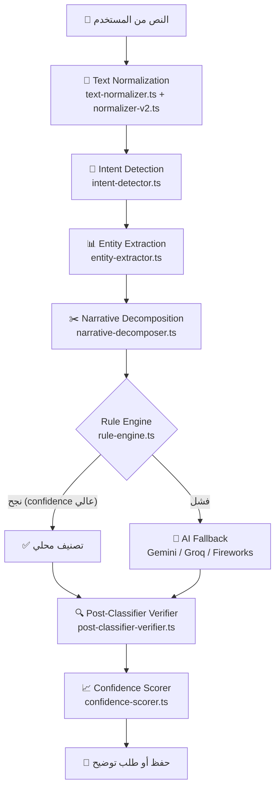
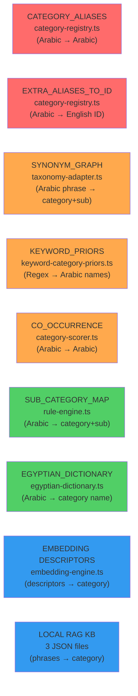
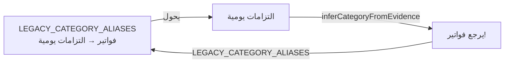
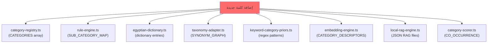

# 🔍 تقرير التدقيق الشامل - نظام التصنيف في SmartSpend

> [!IMPORTANT]
> هذا التقرير يغطي **كل سطر كود** في نظام التصنيف (أكثر من 500KB كود عبر 20+ ملف).
> تم تحليل: Category Registry, Rule Engine, Smart Pipeline, Embedding Engine, RAG Engine, Egyptian Dictionary, Text Normalizers, Narrative Decomposer, Intent Detector, Entity Extractor, Post-Classifier Verifier, Confidence Scorer, Taxonomy Adapter, Keyword Priors, Muscle Memory, Fuzzy Match, Anonymizer, STT Corrections, Dynamic Prompt Builder, و Database Schema.

---

## 📋 جدول المحتويات

1. [نظرة عامة على الهيكل](#-نظرة-عامة-على-الهيكل)
2. [مشاكل خطيرة 🔴](#-مشاكل-خطيرة-تحتاج-إصلاح-فوري)
3. [مشاكل متوسطة 🟡](#-مشاكل-متوسطة)
4. [مشاكل منطقية وتعارضات 🟠](#-مشاكل-منطقية-وتعارضات)
5. [فجوات في التصنيف المصري 🇪🇬](#-فجوات-في-التصنيف-المصري)
6. [مشاكل معمارية وتقنية 🏗️](#️-مشاكل-معمارية-وتقنية)
7. [مشاكل قاعدة البيانات 🗄️](#️-مشاكل-قاعدة-البيانات)
8. [التصنيف المثالي المقترح 💡](#-التصنيف-المثالي-المقترح)
9. [خطة الإصلاح المقترحة](#-خطة-الإصلاح-المقترحة)

---

## 🏛️ نظرة عامة على الهيكل

النظام عبارة عن **pipeline متعدد المراحل** بيشتغل كالتالي:



### الملفات الأساسية والأحجام:

| الملف | الحجم | الوظيفة |
|-------|-------|---------|
| [rule-engine.ts](file:///e:/smartspend_V1_fixed/api/lib/rule-engine.ts) | 68KB (1344 سطر) | محرك القواعد - التصنيف المحلي |
| [smart-pipeline.ts](file:///e:/smartspend_V1_fixed/api/lib/smart-pipeline.ts) | 50KB (1285 سطر) | الـ Pipeline الرئيسي |
| [category-registry.ts](file:///e:/smartspend_V1_fixed/api/lib/category-registry.ts) | 46KB (1288 سطر) | سجل الفئات والتصنيفات |
| [embedding-engine.ts](file:///e:/smartspend_V1_fixed/api/lib/embedding-engine.ts) | 40KB (1364 سطر) | محرك الـ Embeddings |
| [narrative-decomposer.ts](file:///e:/smartspend_V1_fixed/api/lib/narrative-decomposer.ts) | 30KB (930 سطر) | تفكيك الجمل المركبة |
| [egyptian-dictionary.ts](file:///e:/smartspend_V1_fixed/api/lib/egyptian-dictionary.ts) | 26KB (1130 سطر) | القاموس المصري |
| [local-rag-engine.ts](file:///e:/smartspend_V1_fixed/api/lib/local-rag-engine.ts) | 19KB (563 سطر) | محرك RAG المحلي |
| [post-classifier-verifier.ts](file:///e:/smartspend_V1_fixed/api/lib/post-classifier-verifier.ts) | 18KB (509 سطر) | التحقق بعد التصنيف |
| [taxonomy-adapter.ts](file:///e:/smartspend_V1_fixed/api/lib/taxonomy-adapter.ts) | 16KB (448 سطر) | محول التصنيفات |
| [entity-extractor.ts](file:///e:/smartspend_V1_fixed/api/lib/entity-extractor.ts) | 14KB (421 سطر) | استخراج الكيانات |
| [category-scorer.ts](file:///e:/smartspend_V1_fixed/api/lib/category-scorer.ts) | 13KB (299 سطر) | نظام التسجيل |
| [text-normalizer.ts](file:///e:/smartspend_V1_fixed/api/lib/text-normalizer.ts) | 11KB (317 سطر) | معالج النصوص v1 |
| [stt-corrections.ts](file:///e:/smartspend_V1_fixed/api/lib/stt-corrections.ts) | 11KB (375 سطر) | تصحيح الصوت |
| [intent-detector.ts](file:///e:/smartspend_V1_fixed/api/lib/intent-detector.ts) | 10KB (422 سطر) | كاشف النية |
| [muscle-memory.ts](file:///e:/smartspend_V1_fixed/api/lib/muscle-memory.ts) | 10KB (314 سطر) | ذاكرة التعلم |
| [normalizer-v2.ts](file:///e:/smartspend_V1_fixed/api/lib/normalizer-v2.ts) | 9KB (276 سطر) | معالج النصوص v2 |
| [confidence-scorer.ts](file:///e:/smartspend_V1_fixed/api/lib/confidence-scorer.ts) | 7KB (239 سطر) | نظام الثقة |
| [dynamic-prompt-builder.ts](file:///e:/smartspend_V1_fixed/api/lib/dynamic-prompt-builder.ts) | 7KB (129 سطر) | باني البرومبت |
| [keyword-category-priors.ts](file:///e:/smartspend_V1_fixed/api/lib/keyword-category-priors.ts) | 5KB (122 سطر) | أولويات الكلمات |
| [fuzzy-match.ts](file:///e:/smartspend_V1_fixed/api/lib/fuzzy-match.ts) | 4KB (140 سطر) | المطابقة الضبابية |
| [db/schema.ts](file:///e:/smartspend_V1_fixed/db/schema.ts) | 41KB (977 سطر) | مخطط قاعدة البيانات |

---

## 🔴 مشاكل خطيرة تحتاج إصلاح فوري

### 1. أي مصروف غير معروف بيتصنف "متنوعات" بثقة 85%+ ❗
**الملف:** [rule-engine.ts](file:///e:/smartspend_V1_fixed/api/lib/rule-engine.ts) (السطر 1185-1190)

```
if (intentResult.intent === "expense" && !found) {
  category = "متنوعات";
  subCategory = "عام";
  confidence = Math.max(intentResult.confidence, 85); // ← يفرض ثقة عالية!
}
```

**المشكلة:** أي كلمة مش معروفة هتتصنف "متنوعات" بثقة 85% أو أكتر. ده بيمنع الـ AI fallback من الشغل لأن الـ confidence عالي! يعني لو المستخدم قال "دفعت تطعيم القطة" - النظام مش هيفهمها وهيحطها "متنوعات" بثقة 85% بدل ما يسأل الـ AI.

**النتيجة:** تصنيفات غلط كتير بتتحفظ تلقائي بدون ما يتسأل AI أو المستخدم.

---

### 2. الـ Ambiguity Scorer بيقتل الثقة لـ 10% لكلمات شائعة جداً
**الملف:** [rule-engine.ts](file:///e:/smartspend_V1_fixed/api/lib/rule-engine.ts) (السطر 1223-1229)

```
if (ambiguityRegex.test(allContextNorm) && finalConfidence < 90) {
  finalConfidence = 10;
}
```

**المشكلة:** كلمات زي "حساب", "باقة", "كارت", "شحن", "رصيد" — لو ظهرت في النص والثقة أقل من 90 — الثقة بتنزل لـ 10%! يعني واحد قال **"دفعت باقة النت 200 جنيه"** — ده واضح إنه فواتير/إنترنت — بس النظام بيقتل الثقة لـ 10% لأن كلمة "باقة" موجودة.

**النتيجة:** معاملات واضحة بتطلب توضيح من المستخدم بدون داعي.

---

### 3. كلمة "عربية" دايماً بتروح مواصلات/صيانة — وده غلط
**الملف:** [rule-engine.ts](file:///e:/smartspend_V1_fixed/api/lib/rule-engine.ts) (السطر 120-121)

```
عربيه: { category: "مواصلات", subCategory: "صيانة عربية" },
عربية: { category: "مواصلات", subCategory: "صيانة عربية" },
```

**المشكلة:** "عربية" كلمة شائعة جداً في اللهجة المصرية:
- **"عربية الفول"** = بائع فول → أكل وشرب ✅ (هذه معمولة كحالة خاصة)
- **"عربية الخضار"** = بائع خضار → أكل وشرب ❌ (مش متغطية)
- **"عربية البطاطس"** = بائع بطاطس ❌ (مش متغطية)
- **"اشتريت عربية"** = اشتريت سيارة → استثمار/عقارات ❌
- **"غسلت العربية"** = غسلت السيارة → خدمات سيارات ❌
- **"عربية طفل"** (عربة أطفال) → تسوق ❌

---

### 4. "مشروع" مُصنّف كـ "أتوبيس" — كلمة خطيرة جداً
**الملف:** [rule-engine.ts](file:///e:/smartspend_V1_fixed/api/lib/rule-engine.ts) (السطر 130)

```
مشروع: { category: "مواصلات", subCategory: "أتوبيس" },
```

**المشكلة:** "مشروع" في اللهجة المصرية = مشروع (project/business). لو واحد قال **"دفعت في المشروع 5000"** (استثمار في مشروعه الخاص) — هيتصنف مواصلات/أتوبيس!

---

### 5. الـ LEGACY_CATEGORY_ALIASES بتحول فئات حقيقية لفئات مش موجودة!
**الملف:** [taxonomy-adapter.ts](file:///e:/smartspend_V1_fixed/api/lib/taxonomy-adapter.ts) (السطر 405-411)

```
"فواتير": "التزامات يومية",     // ← فواتير فئة حقيقية موجودة! بيحولها لفئة تانية!
"ترفيه": "خروجات",             // ← ترفيه فئة حقيقية موجودة!
"هدايا وصدقات": "مجاملات",     // ← "مجاملات" مش موجودة أصلاً!
"عمل": "أدوات شغل",           // ← "أدوات شغل" مش موجودة أصلاً!
```

**المشكلة الخطيرة:**
- **"فواتير"** فئة حقيقية في `CATEGORIES` — بس الـ adapter بيحولها لـ "التزامات يومية"!
- **"هدايا وصدقات"** بيتحول لـ **"مجاملات"** — وده مش موجود في الـ CATEGORIES أصلاً → يعني هيروح "uncategorized"!
- **"عمل"** بيتحول لـ **"أدوات شغل"** — برضو مش موجود!

**النتيجة:** أي تصنيف صح ممكن يتحول لتصنيف غلط أو غير موجود.

---

### 6. تكرار ضخم بين الفئات — "فواتير" vs "التزامات يومية"
**الملف:** [category-registry.ts](file:///e:/smartspend_V1_fixed/api/lib/category-registry.ts)

| فواتير (bills) | التزامات يومية (daily_commitments) |
|---|---|
| electricity (كهرباء) | electricity_daily (كهرباء) |
| water (مياه) | water_daily (مياه) |
| internet (إنترنت) | internet_bundle (باقة نت) |
| mobile_recharge (شحن رصيد) | mobile_recharge_new (شحن رصيد) |

**المشكلة:** نفس الحاجة بالظبط موجودة في فئتين مختلفتين بـ IDs مختلفة! المستخدم يقول "دفعت الكهربا" — يروح فين؟ مفيش قاعدة واضحة.

**نفس المشكلة موجودة بين:**
- **"ترفيه"** vs **"خروجات"** (سينما، بلايستيشن، كورنيش)
- **"مواصلات"** vs **"خدمات سيارات"** (باركينج، صيانة)
- **"عمل"** vs **"خدمات رقمية"** (hosting)

---

### 7. الأسماء العربية مش بتتشفر في الـ Anonymizer — مشكلة خصوصية خطيرة
**الملف:** [anonymizer.ts](file:///e:/smartspend_V1_fixed/api/lib/anonymizer.ts)

**المشكلة:** الـ redaction بيشيل أسماء إنجليزي بس (`[A-Za-z\s]{3,25}`). اسم "محمد أحمد" أو "فاطمة" مش بيتشفر — وده تطبيق عربي مصري!

---

### 8. الفئات مخزنة كـ نص حر (free-text) في قاعدة البيانات
**الملف:** [db/schema.ts](file:///e:/smartspend_V1_fixed/db/schema.ts) (السطر 77-108)

```
category: varchar("category", { length: 100 }),
subCategory: varchar("sub_category", { length: 100 }),
```

**المشكلة:** الفئة والفئة الفرعية مخزنين كنص عادي — مفيش FK لجدول الفئات. لو المستخدم عدّل اسم فئة → كل المعاملات القديمة هتبقى orphaned. لو فيه typo → بيانات ضايعة.

---

## 🟡 مشاكل متوسطة

### 9. "نور" بتروح كهرباء — بس "نور" اسم بنت شائع جداً
**الملف:** [rule-engine.ts](file:///e:/smartspend_V1_fixed/api/lib/rule-engine.ts) (السطر 137)

"اديت نور 500 جنيه" → المفروض: تحويل/شخص ← الحقيقة: فواتير/كهرباء ❌

---

### 10. "سيف" بتروح صيدلية — بس "سيف" اسم ولد شائع
**الملف:** [rule-engine.ts](file:///e:/smartspend_V1_fixed/api/lib/rule-engine.ts) (السطر 396)

"حولت لسيف 1000" → المفروض: تحويل/شخص ← الحقيقة: صحة/صيدلية ❌

---

### 11. "تذكرة" دايماً بتروح مترو — وممكن تكون سينما أو طيران
**الملف:** [rule-engine.ts](file:///e:/smartspend_V1_fixed/api/lib/rule-engine.ts) (السطر 127-129)

- "اشتريت تذكرة سينما" → المفروض: ترفيه ← الحقيقة: مواصلات/مترو ❌
- "حجزت تذكرة طيران" → المفروض: مواصلات/طيران ← الحقيقة: مواصلات/مترو ❌

---

### 12. "شراب" بتروح ملابس — بس "شراب" ممكن يكون مشروب
**الملف:** [rule-engine.ts](file:///e:/smartspend_V1_fixed/api/lib/rule-engine.ts) (السطر 178)

"اشتريت شراب" (= socks) ← صح ✅
"شربت شراب" (= drank a drink) → المفروض: أكل وشرب ← الحقيقة: تسوق/ملابس ❌

---

### 13. "سوبرماركت" vs "سوبر ماركت" — فئتين مختلفين!
**الملف:** [rule-engine.ts](file:///e:/smartspend_V1_fixed/api/lib/rule-engine.ts) (السطر 210-211)

| الكتابة | الفئة |
|---------|------|
| `سوبرماركت` (كلمة واحدة) | أكل وشرب/بقالة |
| `سوبر ماركت` (كلمتين) | تسوق/سوبر ماركت |

**المشكلة:** نفس المحل بيتصنف في فئتين مختلفتين حسب المستخدم كتبها إزاي!

---

### 14. "ذهب/دهب" بتفعّل تصنيف "استثمار" — بس "ذهب" معناها "راح"!
**الملف:** [intent-detector.ts](file:///e:/smartspend_V1_fixed/api/lib/intent-detector.ts)

"ذهبت للدكتور" → بيشغل intent استثمار (+40 نقطة) ← المفروض: صحة/دكتور ❌

---

### 15. "المنصورة" دايماً بتروح تعليم/جامعة — بس المنصورة مدينة كاملة!
**الملف:** [rule-engine.ts](file:///e:/smartspend_V1_fixed/api/lib/rule-engine.ts) (السطر 477)

"سافرت المنصورة" → المفروض: مواصلات/سفر ← الحقيقة: تعليم/جامعة ❌

---

### 16. الـ Muscle Memory بيتعلم من الـ AI بس — ومش بيتعلم من الـ Rule Engine
**الملف:** [muscle-memory.ts](file:///e:/smartspend_V1_fixed/api/lib/muscle-memory.ts)

**المشكلة:** النظام بيتعلم بس من المعاملات اللي اتصنفت بالـ AI (`parsedBy === "ai"`). معاملات الـ Rule Engine مش بيتعلم منها نهائي — رغم إنها الأكثر تكراراً.

---

### 17. عتبة التشابه 98% في الـ Muscle Memory — صارمة جداً
**الملف:** [muscle-memory.ts](file:///e:/smartspend_V1_fixed/api/lib/muscle-memory.ts)

**المشكلة:** عشان الـ Muscle Memory يشتغل، لازم النص يكون متشابه بنسبة 98%! يعني "دفعت كهربا 200" و "دفعت الكهربا 300" — مش هيتطابقوا رغم إنهم نفس الحاجة.

---

### 18. Salary < 100 جنيه بيتحول لـ "عيدية" تلقائياً!
**الملف:** [smart-pipeline.ts](file:///e:/smartspend_V1_fixed/api/lib/smart-pipeline.ts) (السطر 1113-1115)

```
if (item.category === "مرتب" && item.amount < 100) {
  item.category = "هدايا وصدقات";
  item.subCategory = "عيدية";
}
```

**المشكلة:** فريلانسر أخد 50 جنيه على شغلانة صغيرة → النظام بيحولها "عيدية"! Cashback 10 جنيه → عيدية!

---

### 19. الـ Pre-filter بيرفض معاملات صحيحة
**الملف:** [smart-pipeline.ts](file:///e:/smartspend_V1_fixed/api/lib/smart-pipeline.ts) (السطر 492-516)

**المشكلة:** الـ `strongFinancialKeywords` فيها 12 كلمة بس. كلمات زي "شحنت", "شلت", "رجعلي", "وفرت", "حوشت", "نزلت" مش فيها — فالنظام بيرفض جمل صحيحة.

---

### 20. "كفر" بتروح تسوق/إكسسوارات — بس ممكن يكون كاوتش عربية
**الملف:** [rule-engine.ts](file:///e:/smartspend_V1_fixed/api/lib/rule-engine.ts) (السطر 198)

"غيرت كفر العربية" → المفروض: خدمات سيارات ← الحقيقة: تسوق/إكسسوارات ❌

---

### 21. الـ Amount Extraction بيشيل أرقام أقل من 100 بدون سياق عملة
**الملف:** [entity-extractor.ts](file:///e:/smartspend_V1_fixed/api/lib/entity-extractor.ts) (السطر 201)

"اشتريت عصير 5" ← الـ 5 بتتشال لأنها < 100 ومفيش "جنيه" بعدها! في مصر حاجات كتير سعرها أقل من 100.

---

### 22. Person Detection بتضيف نقاط لكل فئات الأشخاص عشوائياً
**الملف:** [category-scorer.ts](file:///e:/smartspend_V1_fixed/api/lib/category-scorer.ts) (السطر 191-194)

**المشكلة:** لما يكتشف شخص — بيضيف نقاط لـ "العائلة" (20) و "أصدقاء" (20) و "موظفين" (15) كلهم! مفيش تمييز. "اديت بابا 1000" → المفروض يضيف "العائلة" بس.

---

### 23. Debug console.log موجود في الـ Production code
**الملف:** [rule-engine.ts](file:///e:/smartspend_V1_fixed/api/lib/rule-engine.ts) (السطر 795-797)

```
if (normalizedText.includes("مناديل ومسحوق")) {
  console.log(`[DEBUG] Segment distinctCats:`, ...);
}
```

---

## 🟠 مشاكل منطقية وتعارضات

### 24. ثلاث أنظمة تسمية مختلفة — ومفيش مصدر واحد للحقيقة (Source of Truth)



**المشكلة الجوهرية:** كل نظام بيستخدم **نوع مفتاح مختلف** (اسم عربي، ID إنجليزي، عبارة كاملة) — و**طرق مطابقة مختلفة** (exact, includes, regex) — وفيه **تضاربات بينهم**:

| الكلمة | المكان | النتيجة |
|--------|--------|---------|
| "أقساط" | CATEGORY_ALIASES (سطر 550) | "التزامات وجمعيات" |
| "أقساط" | CATEGORY_ALIASES (سطر 555) | "فواتير" ← **DEAD CODE!** |
| "شقة" | EXTRA_ALIASES_TO_ID | "investment" |
| "شقة" | سياق السكن | المفروض "home" ← **تضارب!** |
| "بلايستيشن" | local-rag-engine | "خروجات" |
| "بلايستيشن" | embedding-engine | "ترفيه" ← **تضارب!** |
| "زيت" | egyptian-dictionary | "أكل وشرب" |
| "زيت" | embedding-engine | "خدمات سيارات" ← **تضارب!** |

---

### 25. تعارض "فواتير" ↔ "التزامات يومية" — حلقة دائرية!



**المشكلة:** الـ LEGACY_CATEGORY_ALIASES بيحول "فواتير" → "التزامات يومية"، بس `inferCategoryFromEvidence` بيرجعها "فواتير" تاني! ده بيعمل حلقة دائرية تعتمد على أي كود بيتنفذ الأول.

---

### 26. الـ Normalizer-v2 بيطلع outputين مختلفين — وباقي الأنظمة بتستخدم normalizations مختلفة

| النظام | Normalization | ة→ه | ث→س | ذ→ز |
|--------|-------------|------|------|------|
| text-normalizer v1 | كامل | ✅ | ❌ | ❌ |
| normalizer-v2 (forRules) | عدواني | ✅ | ❌ | ❌ |
| normalizer-v2 (forAI) | خفيف | ❌ | ❌ | ❌ |
| local-rag-engine | مصري | ✅ | ✅ | ✅ |
| intent-detector | أساسي | ✅ | ❌ | ❌ |

**المشكلة:** كلمة "ثلاجة" → "سلاجه" في الـ RAG بس "ثلاجه" في الـ Intent Detector ← مش هيتطابقوا!

---

### 27. الـ Fuzzy Match مش بياخد طول الكلمة في الاعتبار
**الملف:** [fuzzy-match.ts](file:///e:/smartspend_V1_fixed/api/lib/fuzzy-match.ts)

**المشكلة:** Levenshtein distance = 2 مقبول لأي كلمة. بس:
- كلمة 3 حروف + مسافة 2 = 67% مختلفة (خطير!)
- كلمة 10 حروف + مسافة 2 = 20% مختلفة (مقبول)

"دين" (3 حروف) ممكن تتطابق مع أي كلمة عربية من 3 حروف تقريباً.

---

### 28. الـ Local RAG Engine بيستخدم TF بدون IDF
**الملف:** [local-rag-engine.ts](file:///e:/smartspend_V1_fixed/api/lib/local-rag-engine.ts)

**المشكلة:** رغم إن الاسم "TF-IDF" — الكود فعلياً بيحسب TF بس (Term Frequency). مفيش Inverse Document Frequency حقيقي. ده معناه إن n-grams شائعة زي "ال" بتطغى على الباقي.

---

### 29. الـ Levenshtein مكرر في ملفين — والـ Fuzzy Fallback في الـ RAG ميت!
**الملفات:** [fuzzy-match.ts](file:///e:/smartspend_V1_fixed/api/lib/fuzzy-match.ts) و [stt-corrections.ts](file:///e:/smartspend_V1_fixed/api/lib/stt-corrections.ts)

- `levenshtein()` في fuzzy-match.ts
- `levenshteinDistance()` في stt-corrections.ts
- نفس الخوارزمية بالظبط مكررة!
- الـ `levenshteinSimilarity()` في local-rag-engine.ts **معرّف بس مش بيتنادى** — dead code!

---

### 30. الـ Embedding Engine بياخد ~20 ثانية Cold Start!
**الملف:** [embedding-engine.ts](file:///e:/smartspend_V1_fixed/api/lib/embedding-engine.ts) (السطر 754-770)

**المشكلة:** بيحسب embeddings لـ ~200 descriptor واحد واحد مع delay 100ms بينهم = **~20 ثانية cold start**! مفيش batching.

---

### 31. الـ Multi-category logic متعطل بالكامل!
**الملف:** [rule-engine.ts](file:///e:/smartspend_V1_fixed/api/lib/rule-engine.ts) (السطر 803-828)

**المشكلة:** كود الـ multi-category disambiguation **محطوط كومنت بالكامل**! يعني لو النص فيه أكتر من فئة — النظام بياخد الأول وخلاص بدون أي disambiguation.

---

## 🇪🇬 فجوات في التصنيف المصري

### فئات رئيسية ناقصة تماماً:

| الفئة الناقصة | أمثلة من كلام المستخدم المصري | ليه مهمة |
|--------------|------------------------------|----------|
| **🏛️ خدمات حكومية** | "جددت الرخصة", "استخرجت جواز سفر", "دفعت مخالفة مرور", "رسوم بطاقة الرقم القومي" | مصروف شهري ثابت لملايين المصريين |
| **👶 أطفال ورضع** | "حفاضات", "لبن أطفال", "حضانة", "دكتور أطفال" | فئة ضخمة — ومشاوير الأطفال تحتاج تصنيف خاص |
| **💒 مناسبات وأفراح** | "جهاز العروسة", "فرح", "شبكة", "قاعة أفراح" | من أكبر مصاريف المصريين |
| **🕌 دين وعبادات** | "حج", "عمرة", "تبرع للمسجد", "دروس قرآن", "ختمة" | الزكاة والصدقة موجودين بس تحت "هدايا" — وده مش مكانهم |
| **💇 تجميل وعناية** | "كوافير", "صالون", "سبا", "مانيكير" | محطوطة تحت "تسوق/شخصي" — مش مكانها |
| **🚗 مصاريف بواب/خدمات عمارة** | "البواب", "صيانة العمارة", "حارس" | مصروف شهري ثابت لكل مصري في شقة |
| **📱 محافظ إلكترونية** | "أورانج كاش", "اتصالات كاش", "CIB Smart Wallet" | بس "فودافون كاش" موجود |

### كلمات مصرية شائعة ناقصة من القاموس:

#### أكل وشرب 🍕
| الكلمة | المعنى | الموجود |
|--------|--------|---------|
| كنافة/كنافه | حلويات مصرية | ❌ ناقصة |
| بسبوسة/بسبوسه | حلويات | ❌ (موجودة في regex بس مش في القاموس الرئيسي) |
| فتة | أكلة مصرية | ❌ |
| ملوخية | أكلة مصرية | ❌ |
| شعرية | أكلة | ❌ |
| فول مدمس | فطار مصري | ❌ |
| بوفيه | بوفيه أكل | ❌ |
| كشري | أكل مصري | ✅ موجود |

#### مواصلات 🚌
| الكلمة | المعنى | الموجود |
|--------|--------|---------|
| ميكانيكي | صيانة عربية | ❌ (موجود في regex بس مش في القاموس) |
| كاوتش | إطار عربية | ❌ (نفس المشكلة) |
| عبيت/موّلت بنزين | ملأت بنزين | ❌ |
| غسلت العربية | مغسلة سيارات | ❌ |
| ونش | سحب عربية | ❌ |
| عداد العربية | تاكسي | ❌ |

#### صحة 🏥
| الكلمة | المعنى | الموجود |
|--------|--------|---------|
| تطعيم | تطعيمات | ❌ |
| طوارئ/إسعاف | حالة طوارئ | ❌ |
| علاج طبيعي | فيزيوثيرابي | ❌ |

#### عام 🔤
| الكلمة/التعبير | المعنى | الموجود |
|----------------|--------|---------|
| مول | مول تجاري | ❌ |
| سنتر | سنتر/مركز | ❌ |
| جزمجي | إصلاح أحذية | ❌ |
| ترزي/خياط | خياط | ❌ |
| بيطري | طبيب بيطري | ❌ |
| مكنة الصراف | ATM | ❌ |
| اتنفخت | اتغشيت (دفعت كتير) | ❌ |
| حصل خير | معاملة فاشلة/تبرع | ❌ |

### تعبيرات مصرية شائعة مش متغطية:

> [!WARNING]
> النظام مش بيفهم **Franco-Arab (Arabizi)** نهائي! والشباب المصري بيستخدمها كتير:
> - `"7awalte le a7mad 500"` → حولت لأحمد 500
> - `"dafa3t el kahraba"` → دفعت الكهرباء
> - `"3agbni"` → عجبني
> - `"5od"` → خد

**تعبيرات ناقصة:**
| التعبير | المعنى | السياق |
|---------|--------|--------|
| "الحساب ع الراجل" | حد تاني دفع | إلغاء المصروف |
| "مش هينفع" | إلغاء | سياق الإلغاء |
| "الدنيا سعرت" | الأسعار غليت | سياق عام |
| "كل حاجه غليت" | تضخم | سياق عام |
| "اتسرقت" | دفعت كتير (slang) | مصروف عالي |
| "فاضيهالي" | فلوس متاحة | دخل |
| "واحد صاحبي" | صاحب | شخص |
| "من شويه" | من فترة قصيرة | وقت |
| "يوم الجمعه" | يوم محدد | وقت |

---

## 🏗️ مشاكل معمارية وتقنية

### 32. كل حاجة Hardcoded — مفيش Admin UI أو Database-driven config

**المشكلة الأساسية:** إضافة فئة جديدة أو كلمة جديدة بتحتاج تعديل في **5+ ملفات**:



### 33. `inferSubCategory` — switch statement عملاق 200 سطر
**الملف:** [category-registry.ts](file:///e:/smartspend_V1_fixed/api/lib/category-registry.ts) (السطر 686-883)

**المشكلة:** switch statement بـ 200 سطر — كل فئة فيها keyword lists hardcoded. أي تغيير بيحتاج تعديل في الكود مباشرة. المفروض يكون data-driven.

### 34. الـ `canonicalCategoryId` بيستخدم `.includes()` — خطير
**الملف:** [category-registry.ts](file:///e:/smartspend_V1_fixed/api/lib/category-registry.ts) (السطر 1229-1233)

```
for (const [alias, id] of ALIAS_TO_ID) {
  if (normalized.includes(alias) && alias.length >= 3) {
    return id;
  }
}
```

**المشكلة:** "زيت" (3 حروف) ممكن تتطابق داخل كلمة أطول. أول match بيكسب بغض النظر عن الأولوية.

### 35. Duplicate Data عبر الملفات

| البيانات | أماكن التكرار |
|---------|---------------|
| Category mappings (En→Ar) | embedding-engine.ts + local-rag-engine.ts |
| Financial verbs | narrative-decomposer.ts + intent-detector.ts + entity-extractor.ts |
| Merchant lists | entity-extractor.ts + egyptian-dictionary.ts + embedding-engine.ts + RAG JSON files |
| Levenshtein algorithm | fuzzy-match.ts + stt-corrections.ts |
| Arabic normalization | text-normalizer.ts + local-rag-engine.ts + intent-detector.ts + normalizer-v2.ts |

### 36. الـ RAG Engine بيشيل الأفعال المالية من البحث!
**الملف:** [local-rag-engine.ts](file:///e:/smartspend_V1_fixed/api/lib/local-rag-engine.ts)

**المشكلة:** الـ `searchTopCategories()` بيشيل كل الأفعال المالية (دفعت, حولت, صرفت, شحنت, اشتريت, جبت, ركبت, اكلت...). لو المستخدم قال "أكلت بيتزا" ← بعد التنظيف يبقى "بيتزا" بس. ده مقبول في الحالة دي — بس بيضيع الـ intent signal.

### 37. Split logic في الـ Embedding Engine بيفشل مع الواو الملتصقة
**الملف:** [embedding-engine.ts](file:///e:/smartspend_V1_fixed/api/lib/embedding-engine.ts) (السطر 887-901)

**المشكلة:** `splitSegments()` بيقسم بس على واو منفصلة (بمسافة). "وركبت" (واو ملتصقة بالفعل) مش بتتقسم — وده الطريقة الأشيع في الكتابة المصرية!

### 38. "و" كفاصل كلمات — بيكسر كلمات بتبدأ بواو
**الملف:** [narrative-decomposer.ts](file:///e:/smartspend_V1_fixed/api/lib/narrative-decomposer.ts)

**المشكلة:** الكود بيشيل "و" من أول الكلمة — بس فيه كلمات بتبدأ بواو أصلاً:
- "ورد" (زهور) → بيتقسم غلط
- "وفاء" (اسم) → بيتقسم غلط
- "ونش" (سحب عربية) → بيتقسم غلط

---

## 🗄️ مشاكل قاعدة البيانات

### 39. جدول `expenseCategories` بدون أي Indexes!
**الملف:** [db/schema.ts](file:///e:/smartspend_V1_fixed/db/schema.ts) (السطر 148-158)

ده الجدول الوحيد في الـ DB اللي مفيش عليه ولا index واحد!

### 40. مفيش Foreign Key Constraints أبداً
**المشكلة:** `expenses.userId` مش بتشاور على `users.id` — مفيش referential integrity في كل الـ DB. نظام الـ dual-user (oauth vs local) بيصعّب الـ FKs بس ده مش عذر.

### 41. مفيش index على `subCategory` في جدول الـ expenses
**المشكلة:** أي query بيعمل filter أو group by subCategory هيعمل full table scan.

### 42. الـ Subcategories مش موجودة في الـ DB أصلاً!
**المشكلة:** الفئات الفرعية محفوظة **بس في الكود** (CATEGORIES array في category-registry.ts). الـ DB مفيهاش أي جدول subcategories. المستخدم مش يقدر يضيف subcategory خاصة بيه.

### 43. جدول `monthlyReports` بدون indexes
**المشكلة:** مفيش index على userId أو month — أي query للتقارير الشهرية هيبقى بطيء.

### 44. مفيش حقل `currency` في الـ expenses
**المشكلة:** كل حاجة بتفترض EGP. لو المستخدم سافر ودفع بالدولار — مفيش طريقة لتسجيل ده.

---

## 💡 التصنيف المثالي المقترح

### الفئات الرئيسية (28 فئة مُحسّنة):

> [!TIP]
> الاقتراح هو **دمج الفئات المتكررة** وإضافة الناقص — مش إضافة بس.

#### مصاريف (Expenses) - 22 فئة:

| # | الفئة | الفئات الفرعية المقترحة |
|---|-------|----------------------|
| 1 | 🍕 أكل وشرب | فطار, غدا, عشا, وجبات سريعة, مطعم, كافيه/قهوة, سناكس, بقالة/سوبرماركت, مخبز, لحوم/فراخ/سمك, دليفري, مشروبات, حلويات |
| 2 | 🚌 مواصلات | أوبر/كريم/إندرايف, مترو, أتوبيس/ميكروباص, تاكسي/توكتوك, قطار, طيران, عام |
| 3 | 🚗 سيارات | بنزين, صيانة, كاوتش, غسيل, ركنة/جراج, مخالفات, تأمين, رخصة, ونش |
| 4 | 📱 فواتير واشتراكات | كهرباء, مياه, غاز, إنترنت/راوتر, موبايل/شحن, نتفلكس/سبوتيفاي, اشتراكات رقمية |
| 5 | 🏠 سكن | إيجار, أثاث, صيانة, سباك/كهربائي/نقاش, أجهزة منزلية, بواب, نظافة/منظفات, زبال |
| 6 | 🛍️ تسوق | ملابس, أحذية, إلكترونيات, إكسسوارات, أدوات منزلية |
| 7 | 💇 عناية شخصية وتجميل | حلاق, كوافير/صالون, منتجات عناية, سبا, مغسلة/مكواة/دراي كلين |
| 8 | 🏥 صحة | دكتور/كشف, صيدلية/دوا, تحاليل/معمل, مستشفى, أسنان, نظارات, علاج طبيعي, تطعيمات |
| 9 | 📚 تعليم | مدرسة, جامعة, كورسات, كتب, دروس خصوصية, حضانة |
| 10 | 🎬 ترفيه وخروجات | سينما, كافيه, سفر/مصيف, رياضة/جيم/نادي, ألعاب/بلايستيشن, ملاهي, خروجة عامة, كورنيش |
| 11 | 🚬 تدخين | سجاير, فيب/ليكويد, شيشة |
| 12 | 🎁 هدايا ومجاملات | هدية عيد ميلاد, هدية فرح, نقطة, عيدية, مناسبات |
| 13 | 🕌 صدقات ودين | صدقة, زكاة, تبرع, حج/عمرة, دروس قرآن, كفارات |
| 14 | 🐾 حيوانات أليفة | أكل حيوانات, بيطري, مستلزمات |
| 15 | 💼 عمل ومشاريع | أدوات مكتب, استضافة/دومين, أدوات ذكاء اصطناعي, coworking, مصاريف مشروع |
| 16 | 👨‍👩‍👧‍👦 العائلة | أهل (أب/أم), إخوات, أولاد, جوز/مرات, قرايب |
| 17 | 👫 أصدقاء | تحويل لصاحب, عزومة, مشاركة حساب |
| 18 | 👷 موظفين وخدمات | راتب موظف, شغالة, سايس, عامل |
| 19 | 📋 أقساط والتزامات | قسط بنك, قسط سيارة, قسط شقة, جمعية (دفع), تأمين |
| 20 | 🏛️ خدمات حكومية | رخصة, جواز سفر, بطاقة رقم قومي, مخالفات, ضرائب, توثيق |
| 21 | 👶 أطفال ورضع | حفاضات, لبن أطفال, حضانة, مستلزمات أطفال |
| 22 | 💒 مناسبات وأفراح | جهاز, شبكة, قاعة فرح, فستان فرح, دعوات |
| 23 | 📦 متنوعات | عام, أخرى |

#### دخل (Income) - 4 فئات:
| # | الفئة | الفئات الفرعية |
|---|-------|---------------|
| 24 | 💰 مرتب | مرتب أساسي, أوفرتايم, بونص, بدلات, معاش |
| 25 | 🧑‍💻 عمل حر | مشروع, عمولة, سبوبة |
| 26 | 📈 عوائد | أرباح, فوائد, كاش باك, استرجاع |

#### تحويلات (Transfers) - 1 فئة:
| # | الفئة | الفئات الفرعية |
|---|-------|---------------|
| 27 | 🔄 تحويل | ATM/سحب, تحويل بنكي, إنستاباي, فودافون كاش/أورانج كاش, ادخار, سداد دين, كاش |

#### استثمار (Investment) - 1 فئة:
| # | الفئة | الفئات الفرعية |
|---|-------|---------------|
| 28 | 💎 استثمار | ذهب, أسهم, شهادات, عقارات, كريبتو |

### التغييرات الرئيسية عن النظام الحالي:

1. **دمج "فواتير" + "التزامات يومية" + "اشتراكات"** → فئة واحدة "فواتير واشتراكات"
2. **دمج "ترفيه" + "خروجات"** → فئة واحدة "ترفيه وخروجات"
3. **دمج "مواصلات" + "خدمات سيارات"** → فئتين واضحتين: "مواصلات" (ركوب) + "سيارات" (ملكية)
4. **فصل "عناية شخصية"** من "تسوق" → فئة مستقلة
5. **فصل "صدقات ودين"** من "هدايا" → فئتين مختلفتين
6. **إضافة "خدمات حكومية"**, **"أطفال"**, **"مناسبات وأفراح"**
7. **حذف "خدمات رقمية"** (مدمجة في "عمل ومشاريع" و "فواتير")

---

## 📋 خطة الإصلاح المقترحة

### المرحلة 1: إصلاحات حرجة (يجب تنفيذها أولاً)

| # | الإصلاح | الملفات | التأثير |
|---|---------|--------|--------|
| 1 | إصلاح الـ confidence 85% fallback للمتنوعات — يجب يكون 50% أو أقل | [rule-engine.ts](file:///e:/smartspend_V1_fixed/api/lib/rule-engine.ts) | يسمح للـ AI يشتغل |
| 2 | إصلاح الـ ambiguity scorer — مش ينزل لـ 10% لكلمات عادية | [rule-engine.ts](file:///e:/smartspend_V1_fixed/api/lib/rule-engine.ts) | يمنع false clarifications |
| 3 | إصلاح LEGACY_CATEGORY_ALIASES — يشيل التحويلات الغلط | [taxonomy-adapter.ts](file:///e:/smartspend_V1_fixed/api/lib/taxonomy-adapter.ts) | يمنع فقد فئات |
| 4 | إصلاح كلمات متعددة المعاني (عربية, مشروع, نور, سيف, تذكرة) — يضيف context checking | [rule-engine.ts](file:///e:/smartspend_V1_fixed/api/lib/rule-engine.ts) | يحسن الدقة بشكل كبير |
| 5 | دمج الفئات المتكررة (فواتير/التزامات, ترفيه/خروجات) | [category-registry.ts](file:///e:/smartspend_V1_fixed/api/lib/category-registry.ts) | يزيل الارتباك |

### المرحلة 2: تحسينات متوسطة

| # | الإصلاح | الملفات | التأثير |
|---|---------|--------|--------|
| 6 | إضافة الفئات الناقصة (حكومية, أطفال, مناسبات, تجميل, دين) | category-registry + rule-engine + dictionary | تغطية أوسع |
| 7 | إضافة الكلمات المصرية الناقصة (~50+ كلمة) | rule-engine + dictionary + embedding-engine | دقة أعلى |
| 8 | توحيد الـ normalization عبر كل الأنظمة | text-normalizer + local-rag + intent-detector | اتساق |
| 9 | إصلاح الـ Anonymizer ليشمل الأسماء العربية | [anonymizer.ts](file:///e:/smartspend_V1_fixed/api/lib/anonymizer.ts) | خصوصية |
| 10 | إضافة indexes للـ DB (expenseCategories, subCategory, monthlyReports) | [db/schema.ts](file:///e:/smartspend_V1_fixed/db/schema.ts) | أداء |

### المرحلة 3: تحسينات معمارية (طويلة المدى)

| # | الإصلاح | التأثير |
|---|---------|--------|
| 11 | نقل كل الـ mappings لمصدر واحد (JSON أو DB) — بدل 9+ أماكن مختلفة | صيانة أسهل |
| 12 | تحويل `inferSubCategory` من switch لـ data-driven lookup | قابلية توسع |
| 13 | إضافة دعم Franco-Arab (Arabizi) | تغطية الشباب المصري |
| 14 | تحويل الـ Local RAG لـ TF-IDF حقيقي (مع IDF) | دقة بحث أعلى |
| 15 | تفعيل الـ Levenshtein fuzzy fallback في الـ RAG | يعالج الأخطاء الإملائية |
| 16 | تخزين الفئات والفئات الفرعية في الـ DB مع FK constraints | سلامة البيانات |
| 17 | إضافة Admin UI لإدارة الفئات والكلمات بدون تعديل كود | كفاءة التشغيل |
| 18 | Batch embedding computation بدل واحد واحد | سرعة Cold Start |

---

## 📊 ملخص إحصائي

| المقياس | القيمة |
|---------|-------|
| **عدد المشاكل الحرجة 🔴** | 8 |
| **عدد المشاكل المتوسطة 🟡** | 14 |
| **عدد التعارضات المنطقية 🟠** | 10 |
| **عدد الفئات الناقصة** | 7+ |
| **عدد الكلمات المصرية الناقصة** | 50+ |
| **عدد الملفات المتأثرة** | 20+ |
| **أنظمة تسمية متضاربة** | 9 |
| **كود مكرر (dead code)** | 5+ أماكن |
| **إجمالي حجم الكود المحلل** | ~500KB |

> [!CAUTION]
> المشكلة الأكبر هي إن النظام "بيشتغل" — بس بدقة أقل بكتير مما يمكن. الـ confidence 85% fallback للمتنوعات لوحده بيخلي نسبة كبيرة من المعاملات تتصنف غلط بدون ما حد يلاحظ. المستخدم بيفتكر النظام فهمه — بس في الحقيقة النظام حط الكلام في "متنوعات" بثقة وهمية.
