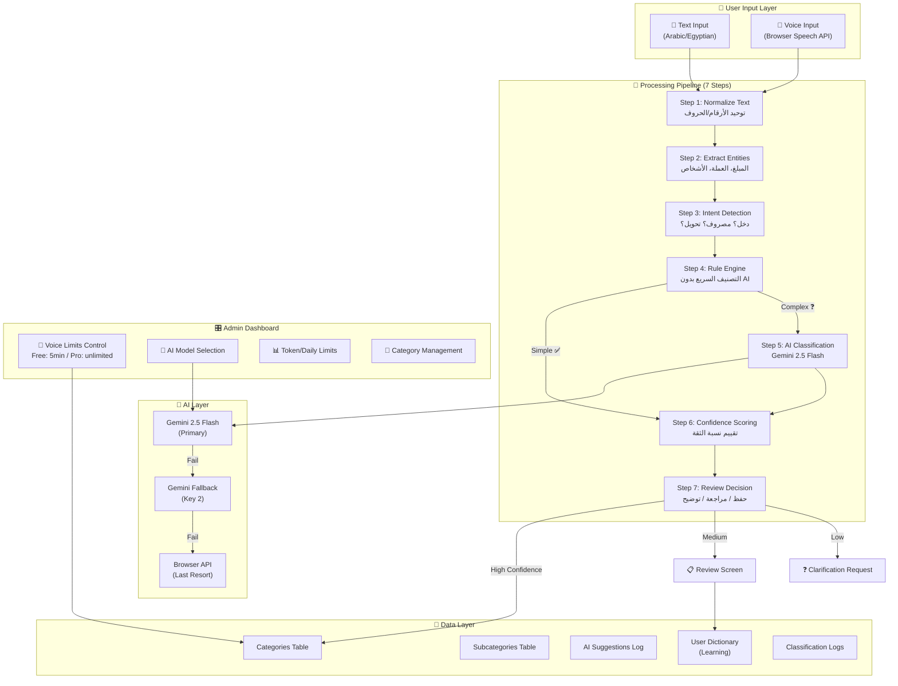
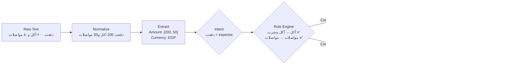
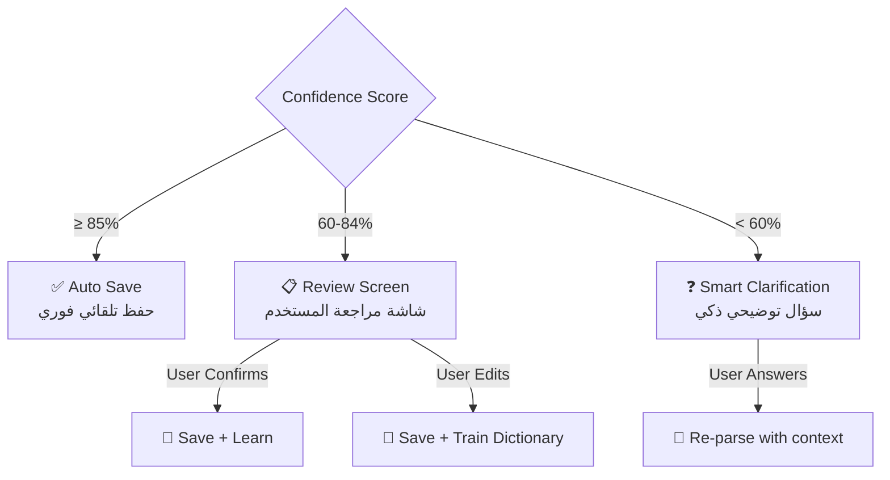
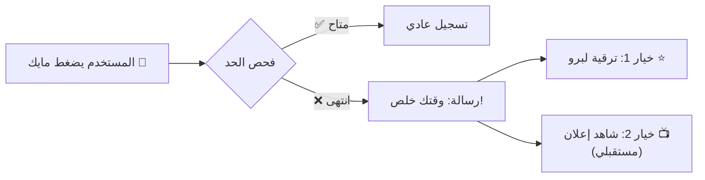

# 🏗️ SmartSpend AI — خطة التطوير الجذرية الكاملة

## Architecture Overview



---

## 📊 Processing Pipeline التفصيلي



---

## 1️⃣ إعادة تصميم الفئات — New Category Architecture

### الفئات الرئيسية والفرعية

| الفئة الرئيسية | النوع | الفئات الفرعية |
|---|---|---|
| 🍔 أكل وشرب | expense | Fast Food, Restaurant, Coffee, Snacks, Groceries, Bakery, Drinks |
| 🚗 مواصلات | expense | Uber, Metro, Bus, Taxi, Fuel, Parking, Maintenance |
| 📄 فواتير | expense | Electricity, Water, Gas, Internet, Phone, Installments |
| 🏠 سكن | expense | Rent, Furniture, Maintenance, Cleaning, Appliances |
| 🛍️ تسوق | expense | Clothes, Electronics, Personal Care, Accessories |
| 🏥 صحة | expense | Doctor, Pharmacy, Lab, Hospital, Dental, Optical |
| 📚 تعليم | expense | School, University, Courses, Books, Tutoring |
| 🎮 ترفيه | expense | Cinema, Cafe, Travel, Sports, Gaming, Streaming |
| 📱 اشتراكات | expense | Netflix, Spotify, ChatGPT, Google AI, SaaS |
| 🎁 هدايا | expense | Birthday, Wedding, Charity, Zakat |
| 🐾 حيوانات أليفة | expense | Food, Vet, Accessories |
| 💼 عمل | expense | Office Supplies, Hosting, APIs, SaaS, Coworking |
| 💵 دخل | income | Salary, Freelance, Investments, Cashback, Refund, Bonus, Side Hustle |
| 🏧 مالية | transfer | ATM Withdrawal, Transfer, Savings, Debt, Loan |
| 📈 استثمار | investment | Gold, Stocks, Certificates, Real Estate |

---

## 2️⃣ Hybrid Classification System — النظام الهجين

### المستوى الأول: Rule-Based Fast Layer

```
الشروط:
├── الجملة قصيرة (< 35 حرف)
├── تحتوي كلمة مطابقة في القاموس
├── مبلغ واحد فقط
├── نوع واضح (دخل/مصروف)
└── نسبة الثقة ≥ 85%

→ تصنيف فوري بدون AI ⚡
```

**أمثلة تُعالج بدون AI:**
- `"أكلت بـ 500"` → أكل وشرب / Restaurant / 500 EGP
- `"المواصلات 20"` → مواصلات / عام / 20 EGP  
- `"مرتب 10000"` → دخل / Salary / 10,000 EGP
- `"بنزين 300"` → مواصلات / Fuel / 300 EGP

### المستوى الثاني: AI Classification Layer

```
الشروط لتفعيل AI:
├── الجملة طويلة (> 35 حرف)
├── أكثر من معاملة واحدة
├── كلمات غير مباشرة ("روحت قعدت في كافيه")
├── عامية مصرية غير واضحة ("شحنت العربية")
├── غموض في النوع ("حولت لأحمد")
├── فئة غير موجودة في القاموس
├── Confidence من Rule Engine < 85%
└── فئة = "متنوعات" (فشل التصنيف)

→ يُرسل للـ AI مع System Prompt مخصص 🧠
```

---

## 3️⃣ AI System Prompt المخصص لـ Gemini 2.5 Flash

```
أنت "SmartSpend AI" - مصنف مالي مصري متخصص.

مهمتك الوحيدة: تحليل النصوص المالية المكتوبة بالعامية المصرية
واستخراج المعاملات المالية منها بدقة عالية.

القواعد الصارمة:
1. افهم العامية المصرية والاختصارات
2. فرّق بين: expense, income, transfer, investment, cash_withdrawal
3. حدد الفئة الرئيسية والفرعية بدقة
4. الأرقام الكبيرة (>10,000) غالباً: إيجار، أجهزة، سيارة
5. "شحنت" = فواتير/رصيد، "شحنت العربية" = مواصلات/بنزين
6. "حولت لـ" = تحويل، "حولولي" = دخل
7. "سلفت صاحبي" = دين/قرض
8. فكك الجمل المتعددة لمعاملات منفصلة

الفئات المتاحة: [القائمة الكاملة]

رد بـ JSON فقط:
{
  "items": [{
    "type": "expense|income|transfer|investment|cash_withdrawal",
    "amount": number,
    "currency": "EGP",
    "main_category": "string",
    "sub_category": "string", 
    "confidence": 0-100,
    "needs_review": boolean,
    "merchant": "string|null",
    "notes": "string"
  }],
  "needs_clarification": boolean,
  "clarification_question": "string|null"
}
```

---

## 4️⃣ Confidence System — نظام الثقة



### أمثلة التوضيح الذكي

| المستخدم يكتب | النظام يسأل |
|---|---|
| `"دفعت لأحمد"` | "هل دي: تحويل؟ دين/سلفة؟ مصروف شخصي؟" |
| `"حطيت فلوس"` | "هل تقصد: دخل؟ إيداع بنكي؟ تحويل؟" |
| `"خمسين ولا ستين"` | "المبلغ غير واضح. كم بالظبط؟" |
| `"حوالي ألف كده"` | "هل المبلغ 1000 جنيه؟" |

---

## 5️⃣ Voice Recording Limits — حدود التسجيل الصوتي

### التحكم من الداشبورد

| الإعداد | Free | Pro | Ultra |
|---|---|---|---|
| وقت التسجيل الصوتي/شهر | 5 دقائق (قابل للتعديل) | 30 دقيقة | غير محدود |
| عدد الطلبات اليومية | 10 | 100 | 500 |
| حد التوكنز الشهري | 50,000 | 500,000 | 2,000,000 |

### Flow عند انتهاء الحد



### إعدادات الداشبورد الجديدة

```
voice_limit_free      = 300     (ثواني = 5 دقائق)
voice_limit_pro       = 1800    (ثواني = 30 دقيقة)  
voice_limit_ultra     = 0       (0 = غير محدود)
voice_limit_enabled   = true
```

> [!IMPORTANT]
> الأدمن يقدر يعدل أي قيمة بحرية كاملة — من 30 ثانية لدقيقة لـ 5 دقائق لساعة. كل حاجة dynamic من الداشبورد.

---

## 6️⃣ Database Schema Changes

### جداول جديدة

```sql
-- Categories Table (Admin-managed)
CREATE TABLE categories (
  id INT PRIMARY KEY AUTO_INCREMENT,
  name VARCHAR(100) NOT NULL,
  name_ar VARCHAR(100) NOT NULL,
  icon VARCHAR(50),
  color VARCHAR(50),
  type ENUM('expense','income','transfer','investment') DEFAULT 'expense',
  sort_order INT DEFAULT 0,
  is_active BOOLEAN DEFAULT true
);

-- Subcategories Table
CREATE TABLE subcategories (
  id INT PRIMARY KEY AUTO_INCREMENT,
  category_id INT NOT NULL,
  name VARCHAR(100) NOT NULL,
  name_ar VARCHAR(100) NOT NULL,
  FOREIGN KEY (category_id) REFERENCES categories(id)
);

-- AI Classification Logs
CREATE TABLE ai_classification_logs (
  id INT PRIMARY KEY AUTO_INCREMENT,
  user_id INT NOT NULL,
  user_type VARCHAR(50) NOT NULL,
  original_text TEXT NOT NULL,
  parsed_by ENUM('rule_engine','ai','manual') NOT NULL,
  rule_engine_result JSON,
  ai_result JSON,
  final_result JSON,
  confidence INT,
  was_corrected BOOLEAN DEFAULT false,
  correction JSON,
  model_used VARCHAR(100),
  tokens_used INT DEFAULT 0,
  processing_time_ms INT,
  created_at DATETIME DEFAULT CURRENT_TIMESTAMP
);

-- Voice Usage Tracking
CREATE TABLE voice_usage (
  id INT PRIMARY KEY AUTO_INCREMENT,
  user_id INT NOT NULL,
  user_type VARCHAR(50) NOT NULL,
  duration_seconds INT NOT NULL,
  month VARCHAR(7) NOT NULL,
  created_at DATETIME DEFAULT CURRENT_TIMESTAMP,
  INDEX (user_id, user_type, month)
);
```

---

## 7️⃣ Admin Dashboard — الأقسام الجديدة

### تاب جديد: "⚙️ إعدادات التصنيف"

```
📂 إدارة الفئات
├── إضافة/حذف/تعديل فئة رئيسية
├── إضافة/حذف/تعديل فئة فرعية
├── تفعيل/تعطيل فئة
└── ترتيب الفئات

🎤 حدود التسجيل الصوتي
├── وقت التسجيل - مجاني: [input] ثانية
├── وقت التسجيل - برو: [input] ثانية
├── وقت التسجيل - ألترا: [input] ثانية
└── تفعيل/تعطيل حد الصوت: [toggle]

🤖 تخصيص الذكاء الاصطناعي
├── موديل التصنيف: Gemini 2.5 Flash [dropdown]
├── Temperature: 0.2 [slider]
├── حد الثقة للحفظ التلقائي: 85% [slider]
├── حد الثقة لطلب التوضيح: 60% [slider]
└── System Prompt مخصص: [textarea]

📊 إحصائيات التصنيف
├── عدد التصنيفات بالـ Rule Engine اليوم
├── عدد التصنيفات بالـ AI اليوم
├── نسبة الدقة (بناءً على تصحيحات المستخدمين)
├── أكثر الفئات استخداماً
└── أكثر الكلمات اللي المستخدمين صححوها
```

---

## 8️⃣ الملفات المطلوب إنشاؤها/تعديلها

### ملفات جديدة

| الملف | الوصف |
|---|---|
| `api/lib/text-normalizer.ts` | Step 1: تنظيف وتوحيد النص |
| `api/lib/entity-extractor.ts` | Step 2: استخراج المبلغ والعملة والأشخاص |
| `api/lib/intent-detector.ts` | Step 3: تحديد نوع المعاملة |
| `api/lib/rule-engine.ts` | Step 4: محرك القواعد السريع |
| `api/lib/ai-classifier.ts` | Step 5: طبقة الذكاء الاصطناعي المخصصة |
| `api/lib/confidence-scorer.ts` | Step 6: نظام تقييم الثقة |
| `api/lib/classification-pipeline.ts` | الـ Pipeline الكامل (يربط كل الخطوات) |
| `api/lib/category-registry.ts` | إدارة الفئات والفئات الفرعية |
| `db/migrations/xxx_classification_system.sql` | Migration للجداول الجديدة |

### ملفات تُعدّل

| الملف | التعديل |
|---|---|
| `api/ai-router.ts` | استبدال `hybridParse` و `aiParse` بالـ Pipeline الجديد |
| `api/admin-router.ts` | إضافة endpoints للفئات وحدود الصوت وإحصائيات التصنيف |
| `api/lib/egyptian-dictionary.ts` | تحويل لنظام الفئات الفرعية الجديد |
| `db/schema.ts` | إضافة الجداول الجديدة |
| `src/pages/Admin.tsx` | إضافة تاب إعدادات التصنيف وحدود الصوت |
| `src/components/expenses/ExpenseForm.tsx` | دعم ألوان الدخل/المصروف + التوضيح الذكي |

---

## 9️⃣ ترتيب التنفيذ (Implementation Order)

### المرحلة 1: البنية التحتية 🏗️
1. تحديث `db/schema.ts` بالجداول الجديدة
2. إنشاء Migration
3. إنشاء `category-registry.ts` مع كل الفئات والفئات الفرعية
4. تحديث `egyptian-dictionary.ts` ليدعم الفئات الفرعية

### المرحلة 2: الـ Pipeline 🔄
5. إنشاء `text-normalizer.ts`
6. إنشاء `entity-extractor.ts`
7. إنشاء `intent-detector.ts`
8. إنشاء `rule-engine.ts`
9. إنشاء `ai-classifier.ts` (مع Gemini 2.5 Flash + System Prompt)
10. إنشاء `confidence-scorer.ts`
11. إنشاء `classification-pipeline.ts` (يربط كل شيء)

### المرحلة 3: الـ API 🔌
12. تحديث `ai-router.ts` ليستخدم Pipeline الجديد
13. إضافة endpoints للتوضيح الذكي
14. إضافة logging لكل عملية تصنيف
15. إضافة voice usage tracking

### المرحلة 4: الداشبورد 🎛️
16. إضافة إعدادات حدود الصوت في `admin-router.ts`
17. إضافة إدارة الفئات في الداشبورد
18. إضافة إحصائيات التصنيف
19. تحديث `Admin.tsx` بالأقسام الجديدة

### المرحلة 5: الفرونت إند 🎨
20. تحديث `ExpenseForm.tsx` بألوان الدخل/المصروف/التحويل
21. إضافة شاشة التوضيح الذكي
22. إضافة مؤشر الثقة في شاشة المراجعة

---

## 🎯 Checklist النهائي

- [ ] النظام يفرق بين الدخل والمصروف والتحويل والاستثمار
- [ ] يفهم العامية المصرية والاختصارات
- [ ] يدعم المعاملات المتعددة في جملة واحدة
- [ ] يكتشف الفئات الفرعية تلقائيًا
- [ ] لا يرسل كل شيء للـ AI (Rule Engine أولاً)
- [ ] يطلب توضيح عند الغموض (مش يحفظ عشوائي)
- [ ] يتعلم من تصحيحات المستخدم
- [ ] الداشبورد فيه تحكم كامل في حدود الصوت
- [ ] Gemini 2.5 Flash مخصص للتصنيف المالي
- [ ] Fallback: Key 2 → Browser API
- [ ] Logs كاملة لكل عملية تصنيف
- [ ] ألوان مختلفة للدخل (أخضر) والمصروف (أحمر) والتحويل (أزرق)
